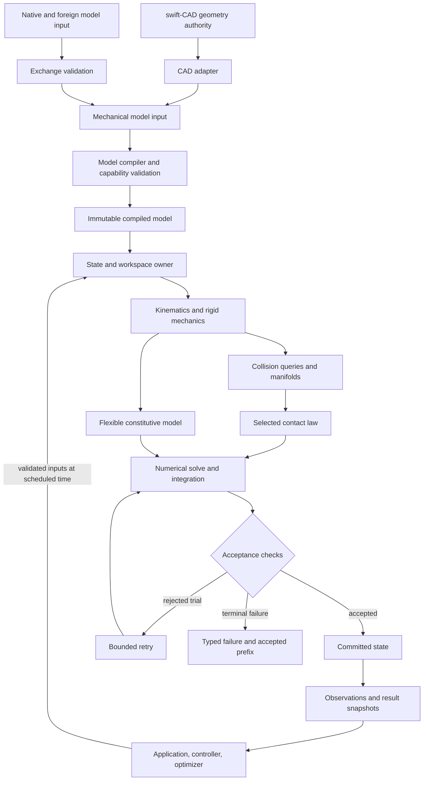
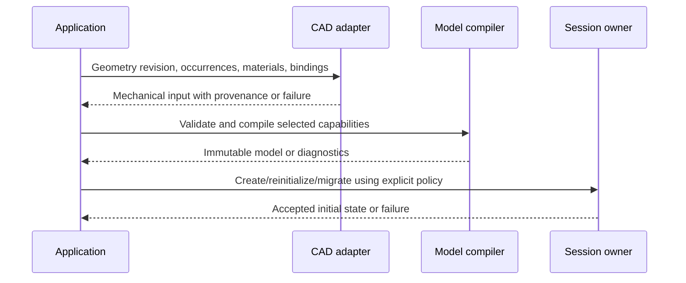
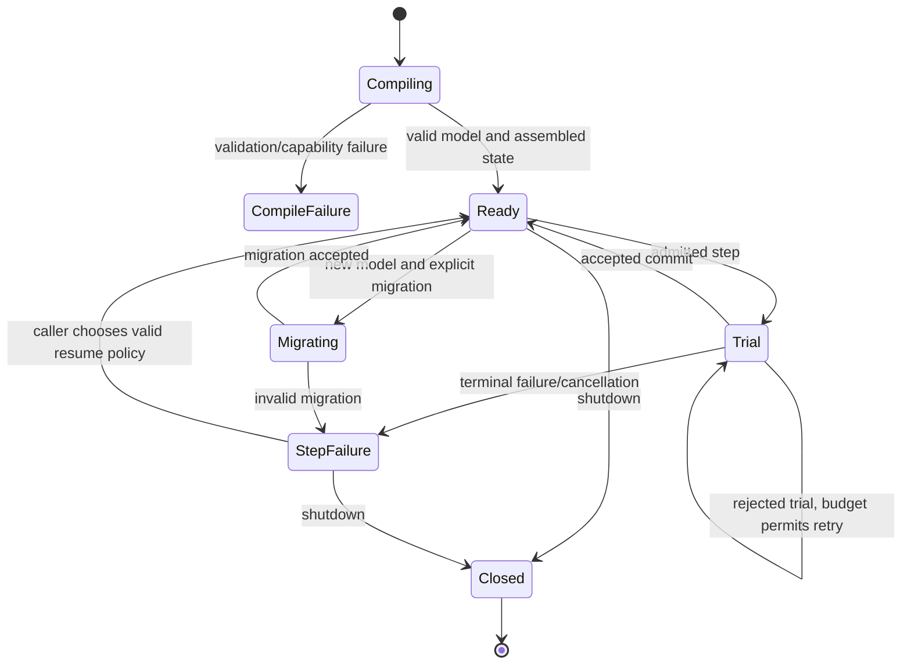

# swift-mechanics — proposed system and package design

## Purpose and Scope

This root owns system and repository/package-level design. Implementation is active under the full 210-requirement goal. The current SwiftPM graph registers MechanicsCore, MechanicsModel, MechanicsNumerics, MechanicsMaterials, MechanicsNonlinear, MechanicsComplementarity, MechanicsJoints, MechanicsLoads, MechanicsCompiler, MechanicsCollision and MechanicsDynamics with real local tests and selected public-protocol runtime verification. Profile qualification is recorded in each child handoff. No complete mechanism simulator, CAD adapter or feature gate is claimed. The target and acceptance authority is [SPEC.md](SPEC.md); factual dependency/reference observations are owned by [SOURCES.md](SOURCES.md).

Parent: none. Current children are indexed below. Additional responsibility scopes remain planned until their actual contracts and behavior are verified. Each real target/component owns its DESIGN.md beside its implementation. Implemented source and passing tests do not imply all required profiles or whole feature families are supported.

| Current child | Responsibility and dependency |
|---|---|
| [CMechanicsMath](Sources/CMechanicsMath/DESIGN.md) | System libm adapter; no physics backend or heap/shared state |
| [MechanicsCore](Sources/MechanicsCore/DESIGN.md) | IM01 immutable units, geometry and spatial algebra; depends only on CMechanicsMath |
| [CoreVerification](Sources/CoreVerification/DESIGN.md) | Headless actual-Core protocol/runtime probe; depends on MechanicsCore |
| [MechanicsCoreTests](Tests/MechanicsCoreTests/DESIGN.md) | Native behavioral tests; depends on MechanicsCore |
| [MechanicsModel](Sources/MechanicsModel/DESIGN.md) | IM02 verified initial model-record/inertia handoff; consumes MechanicsCore |
| [MechanicsNumerics](Sources/MechanicsNumerics/DESIGN.md) | IM03 verified initial numerical handoff; consumes MechanicsCore |
| [MechanicsMaterials](Sources/MechanicsMaterials/DESIGN.md) | IM18 verified initial constitutive handoff; consumes MechanicsCore |
| [FoundationVerification](Sources/FoundationVerification/DESIGN.md) | Root-owned composite public API probe; separate Native/WASM/Embedded real execution |
| [MechanicsNonlinear](Sources/MechanicsNonlinear/DESIGN.md) | IM04 verified initial handoff; consumes MechanicsNumerics |
| [MechanicsComplementarity](Sources/MechanicsComplementarity/DESIGN.md) | IM05 verified initial handoff; consumes MechanicsNumerics |
| [MechanicsJoints](Sources/MechanicsJoints/DESIGN.md) | IM06 verified initial handoff; consumes MechanicsCore, MechanicsModel |
| [MechanicsCompiler](Sources/MechanicsCompiler/DESIGN.md) | IM07 verified initial descriptor/kinematic handoff; consumes Core, Model, Numerics, Joints |
| [MechanicsLoads](Sources/MechanicsLoads/DESIGN.md) | IM11 verified initial handoff; consumes Core, Model, Joints |
| [MechanicsCollision](Sources/MechanicsCollision/DESIGN.md) | IM10 verified initial geometry/CCD handoff; consumes Core, Model |
| [MechanicsDynamics](Sources/MechanicsDynamics/DESIGN.md) | IM15 verified initial spatial dynamics handoff; consumes Core, Model, Numerics, Joints, Loads |
| [MechanicsRuntime](Sources/MechanicsRuntime/DESIGN.md) | IM08 verified initial transaction/checkpoint handoff; consumes Compiler and Joints state/layout contracts |
| [MechanicsIntegration](Sources/MechanicsIntegration/DESIGN.md) | IM09 verified initial explicit integration handoff; consumes Runtime transactions and identified ODE providers |
| [MechanicsFlexible](Sources/MechanicsFlexible/DESIGN.md) | IM19 verified initial Tet4 handoff; consumes Core, Model, Numerics, Materials |
| [MechanicsContactLaws](Sources/MechanicsContactLaws/DESIGN.md) | IM20 verified initial compliant-law handoff; consumes Core, Model; collision translation belongs to IM21 |
| [MechanicsContactResponse](Sources/MechanicsContactResponse/DESIGN.md) | IM21 verified initial coupled normal-response handoff; consumes numerical, witness, law and mass contracts |
| [MechanicsExchange](Sources/MechanicsExchange/DESIGN.md) | IM35 verified initial native exchange handoff; consumes Compiler model input/validation contracts |
| [MechanicsConstraints](Sources/MechanicsConstraints/DESIGN.md) | IM12 dispatched AF11 ownership; consumes verified nonlinear/complementarity/kinematic/runtime contracts |
| [MechanicsActuation](Sources/MechanicsActuation/DESIGN.md) | IM14 dispatched AF11 ownership; consumes verified runtime/load contracts |
| [MechanicsHybrid](Sources/MechanicsHybrid/DESIGN.md) | IM24 dispatched AF11 ownership; consumes verified runtime/integration/dynamics/contact contracts |

Initial IM00 ownership: root agent alone edits Package.swift, global scripts/toolchain configuration, module-root design indexes and progress. IM01 owns Sources/MechanicsCore components and Tests/MechanicsCoreTests. After its verified handoff, IM02 owns Sources/MechanicsModel component directories and Tests/MechanicsModelTests; IM03 owns Sources/MechanicsNumerics component directories and Tests/MechanicsNumericsTests; IM18 owns Sources/MechanicsMaterials component directories and Tests/MechanicsMaterialsTests. Their real modules are registered by IM00 after sources/designs exist; no placeholder target or simulated output is added. The three scopes consume MechanicsCore only and have disjoint source/test paths. PG02 is dispatched with one owner per module; component source and tests remain in those paths, while this root alone registers targets and composes verified handoffs.

Verified IM04/05/06 have handed off their admitted public numerical and kinematic contracts. Root remains the sole module/package composition writer.

Current package product SwiftMechanics distributes registered modules in Package.swift; each also has its own named library product. The table distinguishes verified foundation modules from current active scopes; registration alone is not capability evidence. Consumers import the respective module; no duplicate facade state or type aliases are introduced. CoreVerification is an executable entry point rather than a public placeholder implementation. Toolchain baseline is installed Apple Swift 6.4 (swift-6.4-RELEASE) on arm64-apple-macosx27.0.0; installed SDK identifiers are swift-6.4.0-RELEASE_wasm and swift-6.4.0-RELEASE_wasm-embedded. Actual per-profile evidence is recorded with the implementing sprint; unavailable platforms remain unverified.

[IMPLEMENTATION_PLAN.md](IMPLEMENTATION_PLAN.md) is the canonical owner of future work IDs, prerequisite edges, per-requirement implementation ownership and parallel dispatch checks. Its work scopes are not existing modules. This root retains architectural composition authority; the plan sequences the work needed to establish and verify its child contracts.

The result sought is an engineering computation library that applications can use to compile mechanisms, simulate admitted models, obtain physical quantities and detect failures. GUI, document interaction, rendering, CAD geometry construction and robotics-learning infrastructure remain owned by their applications or dependencies.

## Responsibilities and Boundaries

| Proposed owner | Owned meaning and reason for change | Requirement family authority |
|---|---|---|
| Model/compiler | Mechanical graph, units/frames, IDs, validation and compiled layout | SPEC MD, foundational RB |
| Rigid mechanics/kinematics | State-to-motion/force relationships for rigid bodies, joints and transmissions | SPEC RB, JT, CN, KI, DY, TR, FL, AC |
| Collision/contact | Proximity representation, pair/manifold production and selected material response | SPEC CL, CT |
| Numerics/stepping | Solve acceptance, integration, rollback and hybrid transitions | SPEC SO, TI |
| Flexible mechanics/analysis | Discretized material response, attachment and equilibrium/modal quantities | SPEC FX, ST |
| Control/optimization | Systems, control state, derivatives, costs, constraints and planning | SPEC CO, OP |
| Runtime/observations | State/workspace lifetime, isolation, observations and reproducibility | SPEC RT, SE |
| CAD adapter | Public CAD contract translation, occurrence/anchor mapping and derived representation provenance | SPEC CA |
| Exchange/platform adapters | Schema/foreign-interface fidelity and actual target/backend boundaries | SPEC IO, PF |
| Domain extensions | Calibrated vehicle, granular/fluid and coupling models | SPEC EX |

These are ownership scopes; they are not ten promised modules. Visibility, independent dependencies, platform differences and verified child contracts will determine native SwiftPM module boundaries. A directory is not a substitute for an enforced API boundary.

swift-CAD owns exact shape, topology, shape revision and geometric integration/query semantics. swift-mechanics owns density/material interpretation, inertial use, joints, mechanical constitutive laws, simulation state and accepted output. Collision and flexible meshes are mechanics-derived representations with CAD provenance. A missing exact geometric query is a CAD dependency gap, not permission to create a second CAD kernel here.

The application owns assembly/document edits, visual presentation, user interaction and the choice to accept a new model or migrate state. Rupa is a possible consumer; this library will not depend on Rupa.

## Related Designs

| Design / document | Relationship | Contract used | Summary | Cautions |
|---|---|---|---|---|
| [SPEC.md](SPEC.md) | Requirements authority | Stable feature IDs, shared numerical/failure contracts and delivery gates | Defines what implementation must prove | Planned requirements do not establish implementation readiness |
| [SOURCES.md](SOURCES.md) | Evidence inventory | Official capability observations and local CAD inspection provenance | Supports scope and dependency judgments | Moving upstream pages are not pinned runtime oracles |
| [IMPLEMENTATION_PLAN.md](IMPLEMENTATION_PLAN.md) | Implementation coordination | Prerequisite DAG, requirement owners, producer handoffs and parallel readiness | Sequences contract validation and independent implementation scopes | An acyclic planned graph does not establish a verified API or dispatch readiness |
| [swift-CAD repository](https://github.com/1amageek/swift-CAD) | Proposed dependency of CAD integration | Evaluated geometry/topology, units and future required geometric moment/query capabilities | Geometry authority and shape source | Clean revision, actual public products and full moments remain to be selected/verified |
| Current children indexed in Purpose and Scope | child | Their verified public assumptions/guarantees | Compose the implemented foundation | Evidence is limited to each child's documented profiles and behavior |

No nonexistent child-design links are included. When an implementation work item creates a child, its design must cover public/failed operations, owner/lifetime, applicable platform/backend assumptions and behavioral proof before the parent treats it as a black box.

## Architecture

The arrows below express proposed data/contract consumption. They do not assert a finalized SwiftPM graph.

Control/optimization consumers use public mechanical and derivative contracts. They must not read solver-private workspaces or infer unreported reactions. Contact owns its constitutive law; a numerical solver cannot silently replace it with a different approximation. Domain extensions compose these same mechanical ports and publish their extra constitutive/clock requirements.

Proposed dependency rule: the CAD adapter imports CAD and mechanics contracts; baseline mechanics does not import the CAD adapter, GUI or application. A top-level distribution may expose CAD integration as a separate SwiftPM product with a remote swift-CAD dependency. Final package partitioning must account for SwiftPM graph resolution as well as target linkage; importing a core target is not, by itself, proof that an umbrella package will avoid resolving other dependencies.

### Implementation dependency interpretation

The dataflow above includes feedback and retry. It is not the acyclic implementation dependency graph. Direct work prerequisites are defined once in [the implementation plan](IMPLEMENTATION_PLAN.md#3-canonical-prerequisite-and-ownership-table). Dependency edges consume specific validated contracts; composition does not reverse them merely because a simulation has feedback.

Numerical integrators consume equation-provider contracts rather than concrete gears. Contact laws consume framed witness data rather than collision-world internals. Rigid and flexible equation contributors supply operators to a composing evolution owner rather than mutating one another's state. Feedback controllers consume accepted observations and submit scheduled inputs; the plant does not import a controller implementation. CAD and exchange adapt into mechanical input; dynamics does not import those adapters.

Each actual module must document and enforce the selected direction through its public protocols. IM00 owns the real package/path mapping and shared registration changes; provider owners own their contracts. These directions are proposed composition constraints pending verified child contracts, not a finalized target graph.

## Contracts and Invariants

Normative contracts are defined once in [SPEC.md, shared contracts](SPEC.md#2-shared-contracts) and its requirement rows. This design owns the responsibility assignment and composition obligations:

| Composition boundary | Assumption consumed | Guarantee required before composition | Primary specification owner |
|---|---|---|---|
| CAD → adapter | Validated, identified geometry revision and available public queries | Mechanical IDs/proxies/moments retain source and error provenance or explicit failure | CA |
| Model input → compiler | Inputs carry units/IDs/law choices | Immutable layout and capability diagnostics with no partial compilation | MD |
| Model + state → mechanics | Matching revisions, valid inertia/manifold and admitted constitutive domains | Equation terms and derivatives in published coordinate conventions | RB, KI, DY, FX |
| Geometry → collision/contact | Valid proxies and chosen pair law | Framed contacts and model-specific response or typed unsupported/domain failure | CL, CT |
| Equation terms → solve | Compatible formulation, tolerances and budgets | Original-equation residual/feasibility evidence, not only an iteration flag | SO |
| Trial → accepted state | Verified solve plus temporal/event acceptance | Atomic commit with coherent continuation state or preserved accepted prefix | TI, RT |
| State → consumer | Accepted snapshot, valid schema/frame/time | Ownership-safe outputs with qualified quantities and capability identity | SE, PF, IO |
| Derivatives → optimization | Published smooth/active-set domain | Qualified derivatives and independently checkable constraints/objective/status | OP |

The exact numerical residuals, rollback scope, units, error categories, determinism tiers and approximation policy are owned by SPEC. Child designs must reference those IDs instead of creating weaker local definitions. Unknown backend capabilities cannot be filled by silent fallback.

## Runtime Flows

### Model creation and CAD edits

CAD edits do not mutate a running compiled model. A new revision has a separate migration/assembly operation; invalid old anchors and unavailable moments stop the affected integration. No existing implementation has been exercised for this flow.

### Simulation step

1. The state owner admits a scheduled input and checks state/model/capability compatibility.
2. It creates a trial using its owned workspace and continuation data.
3. Mechanics, collision/contact and flexible laws contribute their equation terms through their contracts.
4. Numerics and event processing evaluate trial acceptance; a rejected trial remains private and can retry only under its configured budgets.
5. Acceptance commits all contributor state, then publishes observations and events. Terminal failure publishes an explicit status tied to the last accepted state/time.

This sequence is an obligation for future implementation, not a proposed callback API. Whether synchronous stepping and asynchronous session control require separate facades is resolved by their child contracts; asynchronous suspension must not occur inside short memory locks.

## State, Ownership, and Lifecycle

| State/resource | Proposed owner | Sharing/lifetime | Invalidation/release |
|---|---|---|---|
| Input model draft | Builder/application | Mutable only within its editing scope | New compilation; no mutation through compiled model |
| Compiled model | Immutable model owner | Retained by sessions and queries; shared without mutable caches | Released after last owner; revisions never confused |
| q/v and flexible/internal states | Per-simulation state owner | One admitted mutation sequence | Explicit reset/migration or session release |
| Solver/integrator/contact warm-start | Per-simulation workspace owner | Private to that state; checkpoint semantics owned by RT | Model/law revision invalidation, rejected-trial rollback |
| Controller/sensor/random/event continuation | Registered state contributors under session owner | Included in accepted-state transaction | Reset, checkpoint restore or shutdown |
| CAD geometry and anchor mapping | CAD authority retained through adapter binding | Revision-linked input; simulation does not mutate source | Rebind/rebuild on CAD edit; fail stale queries |
| Output snapshots | Immutable retained output or scoped borrowed view | Consumer lifetime is explicit | Borrow cannot outlive lease/owner; stream completion on shutdown |
| Device buffers/foreign handles | Actual backend/ABI adapter owner | Safe handle or scoped lease, explicit synchronization | Exactly-once release; device loss invalidates handles |

Shared metadata uses the same storage/isolation contract across supported targets. A uniquely owned synchronous state is distinct from publicly shared mutable state; the final public Sendable/isolation API must prove that distinction rather than rely on current callers. Actor or Mutex selection follows suspension, sequencing and access-latency needs after the execution path is known. Embedded mode cannot erase synchronization or callback contracts.

CompileFailure contains no runnable model. StepFailure preserves the last accepted state. A future asynchronous shutdown must specify how in-flight Trial/Migrating operations reach bounded cancellation points before Closed; the diagram does not establish that implementation.

## Failure, Concurrency, and Constraints

Typed error meanings and the accepted-prefix transaction are defined in SPEC §2.2. The runtime owns sequencing/cancellation; numerical owners detect equation/domain/convergence failures; adapters detect unsupported platforms/data/geometry. Each failure crosses boundaries without conversion to a fabricated successful value.

Resource policies are owned by the corresponding work: compiler graph size, contact/manifold capacity, sparse fill-in, solve iteration/work limits, event cascade, output buffer and device-transfer memory. Defaults are selected from measured workloads and published supported envelopes. No universal guessed particle count, frame budget or solver iteration limit is fixed by this proposal.

Strict resource modes preflight known requirements and report bounded failures for dynamic growth. They cannot promise successful bounded-time solving of every contact or nonlinear problem. Best-effort real-time execution reports deadline misses and partial accepted progress without changing the physics law or precision behind the caller's back.

Target-specific conditional compilation is restricted to real API/ABI/runtime differences. Each target capability claim needs exact compile/link/runtime evidence. GPU, native, browser WASM and Embedded profiles are separate evidence scopes. The specification does not claim a universal identical feature set on all runtimes.

## Verification and Change Impact

| Change owner | Local proof before parent composition | Upper composition requiring recheck |
|---|---|---|
| Model/frames/inertia | MD/RB analytic, invalid-graph and layout contracts | Every changed mechanism or exchanged model assumption |
| Joints/transmissions/dynamics | JT/CN/KI/DY/TR residual, virtual-work and force-budget tests | INT-01/02/03 and affected contact/control paths |
| Collision/contact | CL/CT pair geometry, law residual, convergence and unsupported combinations | INT-04/05 and flexible contact/domain interfaces |
| Numerics/time/runtime | SO/TI/RT equation acceptance, rollback, lifecycle and budget tests | Every affected solver/formulation/target gate |
| Flexible/domain model | FX/ST/EX objectivity, constitutive balance, refinement and calibration | INT-02/06/10 and affected coupled solves |
| Control/derivative/planning | CO/OP/SE derivative, feasibility, sampled-state and independent replay | INT-07/08 and affected learned/control applications |
| CAD/exchange/platform | CA/IO/PF provenance, round-trip/loss, target behavior and ownership | INT-01/04/06/09 and consumers of changed schemas/targets |

Scenario definitions and their numerical evidence policy are owned by SPEC §5. Test target/component ownership is added only when actual implementation boundaries exist. A child contract change triggers revalidation of the parent assumptions it affects, not unrelated suites or speculative concerns.

Initial repository planning verified document integrity, requirement IDs, references, ownership consistency and prerequisite independence. The implemented MechanicsCore additionally has native behavioral tests and actual native/WASM/Embedded runtime evidence recorded in its child design. Model records and inertia have qualified local evidence; compiled model, dynamics, CAD adapter and whole-system delivery gates remain unverified.

For dependency planning, evidence additionally covers all requirement owners, prerequisite existence/acyclicity and independence of candidate parallel groups. The plan's handoff/path/runtime checks remain implementation readiness conditions. Neither a DAG check nor hypothetical non-overlapping paths proves real concurrency safety.

The current actual AF11 production frontier is IM12 + IM14 + IM24. Direct prerequisites are checked in PROGRESS.md and no dependency path connects these scopes. IM12 owns only Sources/MechanicsConstraints child components and Tests/MechanicsConstraintsTests; IM14 owns only Sources/MechanicsActuation child components and Tests/MechanicsActuationTests; IM24 owns only Sources/MechanicsHybrid child components and Tests/MechanicsHybridTests. These modules are not registered until actual child contracts/sources are stable. Verified IM09/IM21/IM35 initial local and exact original-profile handoffs are recorded in commit170033b; complete domains remain their owners' responsibility. Suppliers remain frozen, and root alone owns graph, indexes, public probe composition, progress and commits. Candidate groups are antichains, not mandatory waves.
