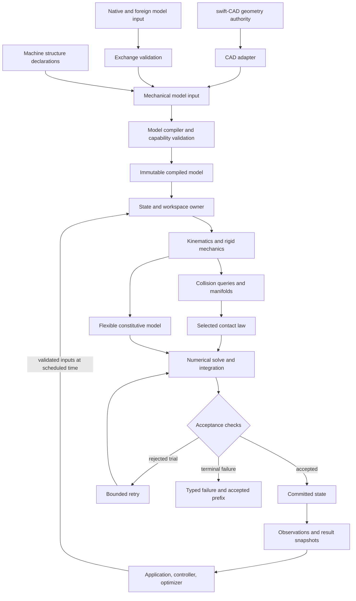
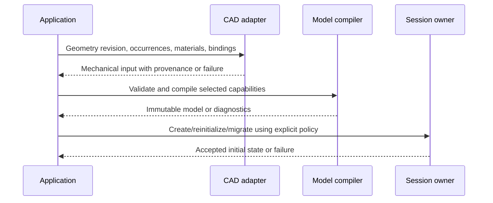
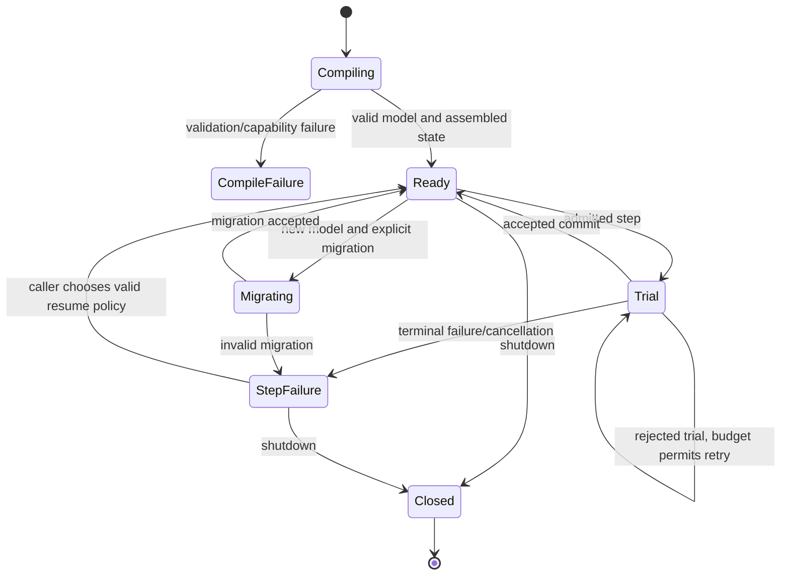

# swift-mechanics — proposed system and package design

## Purpose and Scope

This root owns the system and SwiftPM package. The authorized AR01 migration replaces separately published mechanics modules with one actual public [SwiftMechanics module](Sources/SwiftMechanics/DESIGN.md). The full 210-requirement authority remains [SPEC.md](SPEC.md); requirement ownership and work prerequisites remain [IMPLEMENTATION_PLAN.md](IMPLEMENTATION_PLAN.md). Earlier handoff evidence applies only to its documented behavior and profiles; relocation is requalified by the consolidated integration sprint.

Parent: none. Direct core production child: SwiftMechanics. The independent optional companion package is [SwiftMechanicsCAD](Adapters/SwiftMechanicsCAD/DESIGN.md); its CAD dependency graph is not part of the core SwiftPM graph. Executable verification children are [CoreVerification](Verification/CoreVerification/DESIGN.md) and [FoundationVerification](Verification/FoundationVerification/DESIGN.md). Native test targets retain responsibility-specific names and depend on SwiftMechanics. The actual graph is owned by Package.swift. AF30 selected observations, constrained impact, physical identification and optional CAD reinitialization are qualified at625f759 within their documented domains. AF31 in-progress functions remain excluded individually; each frozen qualified function is committed and registered immediately without waiting for independent functions or the complete sleep chain. Original-profile evidence belongs to FoundationVerification; the full210 requirements remain open.

The package exports `import SwiftMechanics`. CAD and foreign/environment-specific adapters belong in separate packages consuming its public contracts. The baseline package does not acquire their dependencies. The package has no owned C implementation target; a Swift platform adapter consumes system libm. Native, ordinary WASM and Embedded WASM must execute the actual migrated public path independently. Linux/iOS and unimplemented domains remain unqualified.

The approved declarative authoring direction is owned by [Machines](Sources/SwiftMechanics/Modeling/Machines/DESIGN.md#target-declarative-authoring-contract), reached through SwiftMechanics and Modeling. That child owns structure syntax, the mechanical relationship catalog and lowering obligations. The system consumes its immutable admitted output; syntax coverage does not qualify physical or numerical capabilities. The new 3D authoring surface does not remove the existing planar requirements or low-level APIs.

Root alone edits the manifest, shared verification entry points, source mapping, design indexes, progress and local commits. Parallel ownership is by component responsibility, not by SwiftPM target. Component details and admission authority are owned by their child designs. The migration preserves accepted-state identity, cancellation, rollback, exactly-once release, typed failure and identical synchronization/Sendable contracts across profiles.

## Responsibilities and Boundaries

| Proposed owner | Owned meaning and reason for change | Requirement family authority |
|---|---|---|
| Model/compiler | Mechanical graph, units/frames, IDs, validation and compiled layout | SPEC MD, foundational RB |
| Rigid mechanics/kinematics | State-to-motion/force relationships for rigid bodies, joints and transmissions | SPEC RB, JT, CN, KI, DY, TR, FL, AC |
| Collision/contact | Proximity representation, pair/manifold production and selected material response | SPEC CL, CT |
| Numerics/stepping | Solve acceptance, integration, rollback and hybrid transitions | SPEC SO, TI |
| Flexible mechanics/analysis | Discretized material response, attachment and equilibrium/modal quantities | SPEC FX, ST |
| Control/optimization | Systems, control state, derivatives, costs, constraints and planning | SPEC CO, OP |
| Runtime/observations | State/workspace lifetime, isolation, observations and reproducibility | SPEC RT, SE |
| CAD adapter | Public CAD contract translation, occurrence/anchor mapping and derived representation provenance | SPEC CA |
| Exchange/platform adapters | Schema/foreign-interface fidelity and actual target/backend boundaries | SPEC IO, PF |
| Domain extensions | Calibrated vehicle, granular/fluid and coupling models | SPEC EX |

These are responsibility scopes inside SwiftMechanics. Separate adapter packages enforce external dependency and platform boundaries. Validated-value generation within the consolidated module uses owner-issued opaque admission tokens; internal visibility does not grant authority.

swift-CAD owns exact shape, topology, shape revision and geometric integration/query semantics. swift-mechanics owns density/material interpretation, inertial use, joints, mechanical constitutive laws, simulation state and accepted output. Collision and flexible meshes are mechanics-derived representations with CAD provenance. A missing exact geometric query is a CAD dependency gap, not permission to create a second CAD kernel here.

The application owns assembly/document edits, visual presentation, user interaction and the choice to accept a new model or migrate state. Rupa is a possible consumer; this library will not depend on Rupa.

## Related Designs

| Design / document | Relationship | Contract used | Summary | Cautions |
|---|---|---|---|---|
| [SPEC.md](SPEC.md) | Requirements authority | Stable feature IDs, shared numerical/failure contracts and delivery gates | Defines what implementation must prove | Planned requirements do not establish implementation readiness |
| [SOURCES.md](SOURCES.md) | Evidence inventory | Official capability observations and local CAD inspection provenance | Supports scope and dependency judgments | Moving upstream pages are not pinned runtime oracles |
| [IMPLEMENTATION_PLAN.md](IMPLEMENTATION_PLAN.md) | Implementation coordination | Prerequisite DAG, requirement owners, producer handoffs and parallel readiness | Sequences contract validation and independent implementation scopes | An acyclic planned graph does not establish a verified API or dispatch readiness |
| [SwiftMechanicsCAD](Adapters/SwiftMechanicsCAD/DESIGN.md) | child package | Source-bound geometry queries and explicit occurrence frames | Independent optional CAD dependency graph | Development companion; selected Native proof required, exact moments unavailable |
| [swift-CAD repository](https://github.com/1amageek/swift-CAD/tree/295a724cdf0219c904007c2735f2b99ef08200ca) | dependency of optional CAD integration | Public exact geometry/topology and query products | Clean committed geometry authority | Selected public Native queries passed; complete solid moments remain unavailable |
| Current children indexed in Purpose and Scope | child | Their verified public assumptions/guarantees | Compose the implemented foundation | Evidence is limited to each child's documented profiles and behavior |

No nonexistent child-design links are included. When an implementation work item creates a child, its design must cover public/failed operations, owner/lifetime, applicable platform/backend assumptions and behavioral proof before the parent treats it as a black box.

## Architecture

The arrows below express proposed data/contract consumption. They do not assert a finalized SwiftPM graph.

Control/optimization consumers use public mechanical and derivative contracts. They must not read solver-private workspaces or infer unreported reactions. Contact owns its constitutive law; a numerical solver cannot silently replace it with a different approximation. Domain extensions compose these same mechanical ports and publish their extra constitutive/clock requirements.

Proposed dependency rule: the CAD adapter imports CAD and mechanics contracts; baseline mechanics does not import the CAD adapter, GUI or application. A top-level distribution may expose CAD integration as a separate SwiftPM product with a remote swift-CAD dependency. Final package partitioning must account for SwiftPM graph resolution as well as target linkage; importing a core target is not, by itself, proof that an umbrella package will avoid resolving other dependencies.

### Implementation dependency interpretation

The dataflow above includes feedback and retry. It is not the acyclic implementation dependency graph. Direct work prerequisites are defined once in [the implementation plan](IMPLEMENTATION_PLAN.md#3-canonical-prerequisite-and-ownership-table). Dependency edges consume specific validated contracts; composition does not reverse them merely because a simulation has feedback.

Numerical integrators consume equation-provider contracts rather than concrete gears. Contact laws consume framed witness data rather than collision-world internals. Rigid and flexible equation contributors supply operators to a composing evolution owner rather than mutating one another's state. Feedback controllers consume accepted observations and submit scheduled inputs; the plant does not import a controller implementation. CAD and exchange adapt into mechanical input; dynamics does not import those adapters.

Each actual module must document and enforce the selected direction through its public protocols. IM00 owns the real package/path mapping and shared registration changes; provider owners own their contracts. These directions are proposed composition constraints pending verified child contracts, not a finalized target graph.

## Contracts and Invariants

Normative contracts are defined once in [SPEC.md, shared contracts](SPEC.md#2-shared-contracts) and its requirement rows. This design owns the responsibility assignment and composition obligations:

| Composition boundary | Assumption consumed | Guarantee required before composition | Primary specification owner |
|---|---|---|---|
| CAD → adapter | Validated, identified geometry revision and available public queries | Mechanical IDs/proxies/moments retain source and error provenance or explicit failure | CA |
| Model input → compiler | Inputs carry units/IDs/law choices | Immutable layout and capability diagnostics with no partial compilation | MD |
| Model + state → mechanics | Matching revisions, valid inertia/manifold and admitted constitutive domains | Equation terms and derivatives in published coordinate conventions | RB, KI, DY, FX |
| Geometry → collision/contact | Valid proxies and chosen pair law | Framed contacts and model-specific response or typed unsupported/domain failure | CL, CT |
| Equation terms → solve | Compatible formulation, tolerances and budgets | Original-equation residual/feasibility evidence, not only an iteration flag | SO |
| Trial → accepted state | Verified solve plus temporal/event acceptance | Atomic commit with coherent continuation state or preserved accepted prefix | TI, RT |
| State → consumer | Accepted snapshot, valid schema/frame/time | Ownership-safe outputs with qualified quantities and capability identity | SE, PF, IO |
| Derivatives → optimization | Published smooth/active-set domain | Qualified derivatives and independently checkable constraints/objective/status | OP |

The exact numerical residuals, rollback scope, units, error categories, determinism tiers and approximation policy are owned by SPEC. Child designs must reference those IDs instead of creating weaker local definitions. Unknown backend capabilities cannot be filled by silent fallback.

## Runtime Flows

### Model creation and CAD edits

CAD edits do not mutate a running compiled model. A new revision has a separate migration/assembly operation; invalid old anchors and unavailable moments stop the affected integration. No existing implementation has been exercised for this flow.

### Simulation step

1. The state owner admits a scheduled input and checks state/model/capability compatibility.
2. It creates a trial using its owned workspace and continuation data.
3. Mechanics, collision/contact and flexible laws contribute their equation terms through their contracts.
4. Numerics and event processing evaluate trial acceptance; a rejected trial remains private and can retry only under its configured budgets.
5. Acceptance commits all contributor state, then publishes observations and events. Terminal failure publishes an explicit status tied to the last accepted state/time.

This sequence is an obligation for future implementation, not a proposed callback API. Whether synchronous stepping and asynchronous session control require separate facades is resolved by their child contracts; asynchronous suspension must not occur inside short memory locks.

## State, Ownership, and Lifecycle

| State/resource | Proposed owner | Sharing/lifetime | Invalidation/release |
|---|---|---|---|
| Input model draft | Builder/application | Mutable only within its editing scope | New compilation; no mutation through compiled model |
| Compiled model | Immutable model owner | Retained by sessions and queries; shared without mutable caches | Released after last owner; revisions never confused |
| q/v and flexible/internal states | Per-simulation state owner | One admitted mutation sequence | Explicit reset/migration or session release |
| Solver/integrator/contact warm-start | Per-simulation workspace owner | Private to that state; checkpoint semantics owned by RT | Model/law revision invalidation, rejected-trial rollback |
| Controller/sensor/random/event continuation | Registered state contributors under session owner | Included in accepted-state transaction | Reset, checkpoint restore or shutdown |
| CAD geometry and anchor mapping | CAD authority retained through adapter binding | Revision-linked input; simulation does not mutate source | Rebind/rebuild on CAD edit; fail stale queries |
| Output snapshots | Immutable retained output or scoped borrowed view | Consumer lifetime is explicit | Borrow cannot outlive lease/owner; stream completion on shutdown |
| Device buffers/foreign handles | Actual backend/ABI adapter owner | Safe handle or scoped lease, explicit synchronization | Exactly-once release; device loss invalidates handles |

Shared metadata uses the same storage/isolation contract across supported targets. A uniquely owned synchronous state is distinct from publicly shared mutable state; the final public Sendable/isolation API must prove that distinction rather than rely on current callers. Actor or Mutex selection follows suspension, sequencing and access-latency needs after the execution path is known. Embedded mode cannot erase synchronization or callback contracts.

CompileFailure contains no runnable model. StepFailure preserves the last accepted state. A future asynchronous shutdown must specify how in-flight Trial/Migrating operations reach bounded cancellation points before Closed; the diagram does not establish that implementation.

## Failure, Concurrency, and Constraints

Typed error meanings and the accepted-prefix transaction are defined in SPEC §2.2. The runtime owns sequencing/cancellation; numerical owners detect equation/domain/convergence failures; adapters detect unsupported platforms/data/geometry. Each failure crosses boundaries without conversion to a fabricated successful value.

Resource policies are owned by the corresponding work: compiler graph size, contact/manifold capacity, sparse fill-in, solve iteration/work limits, event cascade, output buffer and device-transfer memory. Defaults are selected from measured workloads and published supported envelopes. No universal guessed particle count, frame budget or solver iteration limit is fixed by this proposal.

Strict resource modes preflight known requirements and report bounded failures for dynamic growth. They cannot promise successful bounded-time solving of every contact or nonlinear problem. Best-effort real-time execution reports deadline misses and partial accepted progress without changing the physics law or precision behind the caller's back.

Target-specific conditional compilation is restricted to real API/ABI/runtime differences. Each target capability claim needs exact compile/link/runtime evidence. GPU, native, browser WASM and Embedded profiles are separate evidence scopes. The specification does not claim a universal identical feature set on all runtimes.

## Verification and Change Impact

| Change owner | Local proof before parent composition | Upper composition requiring recheck |
|---|---|---|
| Model/frames/inertia | MD/RB analytic, invalid-graph and layout contracts | Every changed mechanism or exchanged model assumption |
| Joints/transmissions/dynamics | JT/CN/KI/DY/TR residual, virtual-work and force-budget tests | INT-01/02/03 and affected contact/control paths |
| Collision/contact | CL/CT pair geometry, law residual, convergence and unsupported combinations | INT-04/05 and flexible contact/domain interfaces |
| Numerics/time/runtime | SO/TI/RT equation acceptance, rollback, lifecycle and budget tests | Every affected solver/formulation/target gate |
| Flexible/domain model | FX/ST/EX objectivity, constitutive balance, refinement and calibration | INT-02/06/10 and affected coupled solves |
| Control/derivative/planning | CO/OP/SE derivative, feasibility, sampled-state and independent replay | INT-07/08 and affected learned/control applications |
| CAD/exchange/platform | CA/IO/PF provenance, round-trip/loss, target behavior and ownership | INT-01/04/06/09 and consumers of changed schemas/targets |

Scenario definitions and their numerical evidence policy are owned by SPEC §5. Test target/component ownership is added only when actual implementation boundaries exist. A child contract change triggers revalidation of the parent assumptions it affects, not unrelated suites or speculative concerns.

Initial repository planning verified document integrity, requirement IDs, references, ownership consistency and prerequisite independence. The implemented MechanicsCore additionally has native behavioral tests and actual native/WASM/Embedded runtime evidence recorded in its child design. Model records and inertia have qualified local evidence; compiled model, dynamics, CAD adapter and whole-system delivery gates remain unverified.

For dependency planning, evidence additionally covers all requirement owners, prerequisite existence/acyclicity and independence of candidate parallel groups. The plan's handoff/path/runtime checks remain implementation readiness conditions. Neither a DAG check nor hypothetical non-overlapping paths proves real concurrency safety.

AF13 completed its initial admitted IM13 + IM17 + IM22 + IM24 handoffs with disjoint source/test owners and original-profile public execution. No dependency path connected those production scopes. IM24 exposed measured nested debug lifetime defects; root owned Runtime Checkpoints and the IM24 owner temporarily owned Integration Stepping. Both corrections are qualified by their affected Native behavior and original-profile composition. Root alone registers stable modules and owns module indexes, production probes, progress and commits. Full requirement domains remain assigned and unqualified where the child contracts state limitations.

IM22 consumes IM19 cc55090 and IM21 170033b, independent of the other AF13 owners. Its owner must establish the exact pressure/representation and supplier domain before child design and source. Frozen transmission source and root-owned graph qualification do not transfer mutable ownership to the new distributed-contact scope. This does not close the full requirement domains.

IM14 initial scalar actuation is qualified by eighteen Native behavioral tests and selected Native/ordinary-WASM/Embedded-WASM motor/servo/affine and required Runtime continuation execution. Broader AC domains and integrated driven mechanism behavior remain assigned and unqualified. Root alone records its coherent commit.

AF14 dispatch is the independent ready frontier IM16 + IM23 + IM28 + IM30 after the qualified AF13 handoff f0ba82c. After the IM23 source/test freeze, model_records transfers to IM16 child directories and MechanicsMechanismsTests; frozen IM23 source remains read-only during root qualification. material_kernels owns IM28, and linear_kernels owns IM30. Root owns producer coordination, additive Constraints rank admission, and all registrations, module indexes, public probes/scripts, progress and commits. All workers own only their assigned child directories and matching test paths; no agent builds, registers targets or commits independently. There is no dependency path between AF14 members. The dependency DAG remains canonical in IMPLEMENTATION_PLAN.md. Parent indexes describe dispatch only until the lower designs/source and actual behavioral evidence exist.

AF14 prerequisite extensions have explicit exclusive owners. Root owns ContactLaws Inputs material-site identity/accounting, the minimal Response storage admission update, corresponding ContactLaws tests, and the rigid ContactResponse representation gate/tests. These changes preserve existing distinct-body inputs while establishing genuine same-body material-site identity for IM23; source availability alone is not a verified handoff. material_kernels additionally owns only new MechanicsFlexible/Beams and MechanicsFlexibleTests/Beams directories for element contracts needed by IM28; existing Tet4 contracts are frozen. The new beam producer is verified before structural composition. No other producer source is editable by a consumer.

AF14 registered graph includes the frozen Beams, DeformingContact and StructuralAnalysis sources after lower behavioral qualification. Each build uses fixed registered source; evolving Mechanisms, Derivatives and Fluids remain unregistered. Inside IM23, material-site admission and actual surface geometry are independent AF14C child scopes; nodal constitutive/history composition waits for both behavioral handoffs.

After the Beams/IM28 source-test freeze, material_kernels owns only new MechanicsFluids child directories and MechanicsFluidsTests for ready IM44. Frozen Beams and StructuralAnalysis remain read-only during root qualification. IM44 consumes IM03/08/09; no dependency path connects it to current IM16/30. Root alone changes existing producers and shared registration. Fluid equations, boundaries and actual evolution must be admitted in lower child contracts before source; no flexible/vehicle coupling or acceleration qualification is implied.

Root owns the IM23 qualification corrections in TetrahedralBoundaryUpdater, SelectedSurfaceWitnessQueries, MaterialSurfaceForceMapper and ValueSurfaceContactTransactions with corresponding tests: current-policy admission for direct material-point calls and final cancellation gates after external initial-history callbacks. Other frozen IM23 paths remain read-only.

AF14 selected composition passed 346 Native behavioral tests across all 25 registered test modules. Lower Constraints/Flexible/DeformingContact cases passed before the 15 StructuralAnalysis cases. Actual public rank, Tet4 self-contact forces/history, Hermite modes/harmonic response/buckling and nonlinear truss paths execute in the original Native, ordinary WASM and Embedded profiles with exit 0. The child contracts own precise admitted domains; general flexible contact evolution, general structural analysis and full IM16/30/44/48 remain unqualified. An additive rank query reports independence only; it does not infer force or feasibility.

After IM30 source/test freeze, linear_kernels owns only new MechanicsGranular child directories and MechanicsGranularTests for ready IM43. Frozen derivative source remains read-only during root qualification. IM43 consumes IM08/21/24 and has no dependency path to current IM16/44. Root owns additive Runtime model replacement in Sessions, its new StateRecords request, matching tests and producer coordination; existing public RuntimeSession creation/trial/checkpoint operations remain available to workers. Within IM16, root's atomic owner replacement and the worker's original constrained dynamics/affine stepping are independent source scopes; actual break publication waits for both qualified handoffs. No worker edits Runtime internals or builds evolving registered source.

After the initial IM44 channel source freeze, material_kernels owns only a new PlanarProjection child and MechanicsFluidsProjectionTests; frozen channel source/test remains read-only during root registration. Independent multidimensional pressure/velocity evolution consumes lower read-only numerical contracts, not the evolving mechanism or granular source. Root serializes registration and shared producers.

AF16 registered graph adds frozen MechanicsDerivatives and the three channel MechanicsFluids children after actual lower review/regression qualification. New PlanarProjection source is explicitly excluded; Mechanisms and Granular remain unregistered independent source scopes. All 391 tests in twenty-seven registered Native modules pass, and original-profile Native/WASM/Embedded public replacement, derivative and channel-fluid composition exit 0. Qualified Runtime producer replacement (37b8816) closes the explicit IM16 atomic-owner prerequisite; actual mechanics break and remaining domain contracts still own separate evidence.

The AF16 mechanism, granular and planar-fluid source snapshots are frozen. The [actual handoff table](IMPLEMENTATION_PLAN.md#frozen-af16-source-handoff-and-actual-build-edges) distinguishes direct target imports from complete-work prerequisite edges and records sole-writer ownership. Root owns behavioral qualification of those fixed snapshots. Workers concurrently trace the next IM25/32/38 dependencies read-only; dependent production is not dispatched from an unverified contract or a dirty CAD checkout.

Root registers the frozen MechanicsMechanisms and MechanicsGranular targets and the PlanarProjection child in the existing Fluids target for actual qualification. Registration alone establishes no behavioral success. The dedicated three Native test owners consume the fixed dependency edges recorded in the plan.

AF17 fixed graph qualification adds MechanicsMechanisms, MechanicsGranular and the periodic PlanarProjection child, with 436 passing Native behavioral tests across 30 modules and original exact-profile public gear/break, sphere/value-replay and pressure/mean-work execution. The Embedded stack counterexample was closed by phasing the probe caller; no production algorithm/stack/isolation substitution occurred. Actual imports and hard prerequisite ownership are distinguished by the implementation-plan handoff table. Full domain gaps, CAD full-moment producer deficiency and IM48 remain open.

### AR01 integrated qualification (2026-10-04)
Swift 6.4.0 RELEASE consolidated Native execution passed 477 tests across 32 targets. Selected public Machine lowering, erased/conditional composition, actual scoped hinge compiler/motion and typed duplicate/iteration failures compiled, linked and executed on Native (macOS 27 runtime, production deployment 13), matching ordinary WASM and Embedded WASM SDKs. Both WASI command artifacts ran under Node.js 24.19.0 Preview 1, reached the Machine and full Foundation completion witnesses and exited zero at their original stack profiles. This qualifies the exercised paths only: Native owns broader branch, lazy closure count, box release and concurrent Runtime tests; WASI does not establish actual multithread execution. Linux/iOS and full 210-requirement closure remain open.

## AF20 selected mechanism integration
Root registered and qualified nonlinear evolution, checkpoint-bound sleep/command/impulse wake and identified tree reactions in the single SwiftMechanics module. [Mechanisms](Sources/SwiftMechanics/Physics/Mechanisms/DESIGN.md) owns component boundaries; [FoundationVerification](Verification/FoundationVerification/DESIGN.md#af20-selected-original-profile-qualification) owns exact final Native/WASM/Embedded execution evidence. PROGRESS retains incomplete general IM16 and the full 210-requirement/IM48 target.

## AF21 Planar Continuation Integration

[Fluids](Sources/SwiftMechanics/Physics/Fluids/DESIGN.md#af21-registration-scope) owns the newly registered child index. [FoundationVerification](Verification/FoundationVerification/DESIGN.md#af21-planar-runtime-qualification-contract) owns the public composition contract; [selected original-profile qualification](Verification/FoundationVerification/DESIGN.md#af21-selected-original-profile-qualification) records the passed evidence and its limits. This addition preserves the single production module, immutable compiled model and required Runtime publication authority. Full IM44/IM48 and 210-requirement qualification remain open.

## AF22 General Geometry Foundation

Root registered the general frame/point/axis relation and local manifold correction children under [Constraints](Sources/SwiftMechanics/Physics/Constraints/DESIGN.md). [FoundationVerification](Verification/FoundationVerification/DESIGN.md#af22-selected-general-geometry-qualification) owns actual registered Native and selected original-profile evidence. This closes the lower geometry handoff before upper closed-loop dynamics; general IM16 and full IM48 remain open.

## AF22 Closed-Loop and Topology Integration

[Mechanisms](Sources/SwiftMechanics/Physics/Mechanisms/DESIGN.md#af22-mechanism-frontier) owns the composition boundaries for general geometric evolution and checkpointed subtree release. [FoundationVerification](Verification/FoundationVerification/DESIGN.md#af22-integrated-mechanism-qualification) owns actual registered Native and original Native/WASM/Embedded evidence and its profile limits. The qualified owners were committed independently as ef48e13 (subtree/history/law continuation) and b90af29 (shared physical engine and geometric evolution), after the lower geometry handoff d357b65. No new production module or C target was introduced. PROGRESS retains the remaining IM16 domains and all unclosed 210-requirement/IM48 obligations.

## AF23 Qualified Composition Frontier

[Mechanisms](Sources/SwiftMechanics/Physics/Mechanisms/DESIGN.md#af23-imposed-motion-and-stationary-physical-loading-contracts) owns the selected imposed-base and stationary physical-loading composition contracts. Lower Core unit restoration and Runtime complete-anchor continuation were behaviorally qualified before upper production. [FoundationVerification](Verification/FoundationVerification/DESIGN.md#af23-integrated-qualification) owns the final original Native/WASM/Embedded execution evidence and affected-lifetime requalification. PROGRESS retains remaining IM16 domains and the full 210-requirement/IM48 objective.

## AF24 Lower Physical Frontier

[Mechanisms](Sources/SwiftMechanics/Physics/Mechanisms/DESIGN.md#af24-remaining-planar-and-closed-loop-physical-boundaries) indexes the remaining planar/closed-loop boundaries. [Dynamics](Sources/SwiftMechanics/Physics/Dynamics/DESIGN.md#af24-lower-physical-handoff) and [Constraints](Sources/SwiftMechanics/Physics/Constraints/DESIGN.md#af24-original-physical-geometry-handoff) own independent lower contracts before upper consumers. The implementation plan owns sole-writer dispatch and dependency order; PROGRESS owns readiness. All new AF24 behavior remains unqualified until actual execution evidence exists.

AF25 selected root-only and descendant prescribed execution and planar closed-loop physical recovery are indexed by the [Mechanisms parent](Sources/SwiftMechanics/Physics/Mechanisms/DESIGN.md#af25-remaining-reaction-and-prescribed-root-composition), [Constraints parent](Sources/SwiftMechanics/Physics/Constraints/DESIGN.md#af25-lower-ownership-frontier), and [Dynamics parent](Sources/SwiftMechanics/Physics/Dynamics/DESIGN.md). Child designs own source/force/power/history contracts; [final integrated qualification](Verification/FoundationVerification/DESIGN.md#af25-upper-integrated-qualification) owns exact behavioral/profile evidence. Full IM16 and all 210 requirements remain open.

AF26's selected implementation frontier is indexed by the [exclusive prerequisite handoff](IMPLEMENTATION_PLAN.md#af26-selected-prerequisite-handoff-and-exclusive-dispatch) and [upper parallel ownership](IMPLEMENTATION_PLAN.md#af26-upper-exclusive-implementation-and-independent-verification). Existing component contracts own trajectory mathematics, planar prescribed support and source-bound quadratic cold acceptance. The selected lower interaction has [actual qualification](Verification/FoundationVerification/DESIGN.md#af26-support-lifetime-correction-profile-evidence) at56a57ba. Upper trajectory/topology consumer contracts are frozen atda3c90d; selected trajectory Native execution has [independent public evidence](Verification/FoundationVerification/DESIGN.md#af26-isolated-public-trajectory-native-evidence), and the selected combined upper Native/original-WASI interaction now has [integrated evidence](Verification/FoundationVerification/DESIGN.md#af26-upper-integrated-selected-qualification); the full210-requirement objective remains open.
