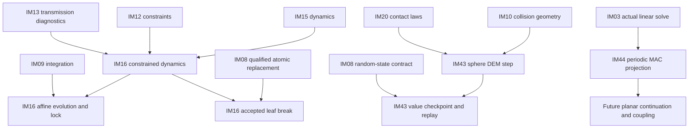
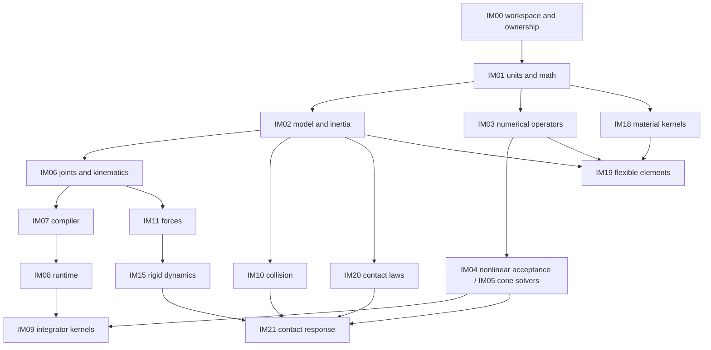

# Implementation dependency plan

Status: implementation active, 2026-10-03. The user authorized the complete plan and behavioral tests as the finish condition. PROGRESS.md owns current executable readiness/completion; this document retains the stable work IDs and dependency graph. PROGRESS.md records the verified initial numerical, kinematic, compiler, dynamics, constitutive, collision and runtime handoffs and current ready frontier. Complete requirement-domain closure and whole-target integration remain open; downstream production work starts only after its consumed contracts pass.

This document owns work IDs, prerequisite edges, requirement ownership, handoffs and parallel dispatch rules. [DESIGN.md](DESIGN.md) owns architectural composition; [SPEC.md](SPEC.md) owns the unchanged 210 behavioral requirements. [PROGRESS.md](PROGRESS.md) records the authorized implementation task. Its child IDs IM.IM00 through IM.IM47 map to this plan's IM00 through IM47; top-level IM48 owns whole-target integration after their parent IM completes.

## 1. Three dependency meanings

| Kind | Meaning | Start/completion consequence |
|---|---|---|
| Contract prerequisite | A supplier owns an API/data/units/ownership/failure contract consumed by another work item. | Consumer source using it waits for the validated, recorded handoff; names or mocks alone are not handoff evidence. |
| Implementation prerequisite | The supplier implementation provides actual equation operators, state semantics or adapter behavior needed for the consumer's local proof. | Consumer integration/completion waits for that path's behavioral evidence, not merely compilation. |
| Capability integration gate | SPEC G0–G5 qualifies an integrated capability profile and full-target claims. | It is a reporting/verification order; it is not an extra dependency edge between independent kernels. |

The table in §3 defines hard prerequisites for each complete work-item scope. Each edge includes the relevant validated contract and production behavior; concrete handoff evidence is recorded before dispatch. It does not require a supplier's unrelated future platform/feature profiles to be finished. No early contract handoff marks its whole requirement family implemented. A consumer may do read-only investigation before handoff; dependent production implementation cannot assume an unverified API or ownership model.

A task's primary requirement ownership is accountability for its implementation and evidence, not an assertion that every row becomes complete in its first baseline. Cross-feature extensions (contact wake behavior, schema registrations, checkpoint contributors, new target capabilities) are explicit handoffs to the same owners. Local completion records the exact supported subset; final closure of a requirement waits for all its specified domains and integration obligations. Generic provider interfaces do not make missing physics available.

## 2. Contracts and single writers

| Contract boundary | Producer / decision authority | Consumed by | Required handoff |
|---|---|---|---|
| Toolchain, real module/path ownership and composition graph | IM00 | All workers | Exact target/profile identity, permitted owned paths, design/test ownership and sole-writer registration procedure. |
| Units, transforms, spatial vectors and q/v conventions | IM01 | Model/numerical/physics scopes | Analytic/frame invariance and invalid-input evidence; precision and borrowed storage lifetime. |
| Model identity, shapes versus inertia and instance data | IM02 | IM06/07/10/19/20/38 | Documented representation authority, validation domains and revision-safe references. |
| Operators, sparse structure, solve acceptance and budgets | IM03/04/05 | Constraint, dynamics, integration, contact, flexible and optimization scopes | Actual manufactured solve/failure proof, original-equation residuals and state/cache ownership. |
| Joint manifold, Jacobian and constraint equations | IM06/12 | Compiler, transmissions, dynamics, analysis and planning | Coordinate layout, g/J/time terms, rank/singularity behavior and virtual-work evidence. |
| Compiled layout and capabilities | IM07 | Runtime, exchange and CAD | Immutable revision/layout, validator registration and unsupported-feature diagnostics. |
| Accepted/trial state and contributor lifetime | IM08 | Integrators, actuators, sensors, control, checkpoint and backends | Actual rollback, cancellation/shutdown, contributor-state and view lifetime proof. |
| Collision witnesses and contact law/response | IM10/20/21 | Hybrid/deforming/gear/contact-derivative scopes | Framed normals/points, law/model identity, force/impulse time semantics and accepted residuals. |
| Flexible nodal/material/interface data | IM18/19 | Flexible evolution, modes, distributed contact and CAD meshing | Stress/strain/tangent measures, material-state ownership, objectivity, element quality and refinement. |
| Derivatives and optimizer terminal status | IM30/31/32 | IK/planning/MPC/identification | Qualified domains and unsupported/nonsmooth failures; independent derivative/feasibility proof. |
| CAD geometry revision and queries | swift-CAD, checked by IM38 | IM38/39/40 | Clean pin and actual public query success/failure; missing exact moments remain a CAD-owned dependency gap. |

Shared provider APIs are changed by their producer only. A consumer reports the missing contract and impact; it does not patch another owner's public types or add a second copy. Before editing a shared contract, identify dependent rows in §3 and invalidate only evidence whose assumption changes. Worker instructions must state owned paths, test owner and the fact that other workers are present; no worker reverts another's edits.

IM00 is the sole writer of Package.swift, global toolchain/CI configuration, umbrella/facade wiring and module-root design indexes. Each task owns its component implementation, local tests and component DESIGN.md. The control/integration owner is the sole writer of task PROGRESS.md. No workers share mutable fixture files or a package manifest. Common oracle data is versioned immutable input; fixture updates are serialized by its owner.

Independence requires separating interface data from concrete engines. IM20 owns its minimal constitutive inputs (separation/penetration, framed relative velocities and material parameters) using IM01/02 values; it does not consume IM10's collision-specific witness type. IM10 owns geometric witnesses. IM21 owns the explicit translation between these published contracts. Likewise IM05 owns numerical cache values independently of runtime; IM24 binds them to IM08 checkpoint/transaction contracts. These adapters prevent hidden collision-law or solver-runtime dependency cycles.

IM03 owns shared numerical operator/status/budget/precision record contracts needed by both IM04 and IM05. IM04 owns nonlinear iteration and acceptance implementation; IM05 does not import that implementation merely to obtain common record definitions. Geometry-following constraints in IM12 consume explicitly supplied query contracts; CAD supplies one possible adapter, not a mandatory dependency of those kernels.

Concrete current module/path assignments, verified initial producers and the actual dispatched frontier are indexed in DESIGN.md. Additional assignments remain a prerequisite of their dispatch. IM00 assigns non-overlapping paths and the native SwiftPM graph before parallel production work; no 49-module structure or hypothetical component is treated as verified. Multiple task scopes may live in one real module only when their component contracts and paths remain independently owned.

## 3. Canonical prerequisite and ownership table

Arrows mean `prerequisite → consumer`. Direct prerequisite lists are authoritative; transitive prerequisites need not be copied. Requirement ranges are inclusive. Every SPEC requirement has exactly one primary owner. Integration obligations link to those owners rather than assigning duplicate implementations.

| Work ID | Responsibility | Direct prerequisites | Primary requirement IDs | Owned implementation scope | Local result and proof required |
|---|---|---|---|---|---|
| IM00 | Workspace composition | `none` | `PF-001..005` | Package.swift, toolchain profiles, target/test registration, facade composition | Select exact toolchain/profile; map each ready scope to real module/component directories; compile/link the empty-of-physics graph without claiming physics support. |
| IM01 | Units and spatial algebra | `IM00` | `MD-002..003;RB-003;RB-005` | Units, transforms, spatial algebra, orientation manifold | Prove frame/units, inertia transforms, q/v conventions and rotation integration primitives with analytic and invalid-input cases. |
| IM02 | Model records and inertia | `IM01` | `MD-001;MD-005;RB-001..002;RB-004;RB-006` | Mechanical identity, representation records and mass properties | Prove IDs, instance separation, body modes, inertia validity and analytic composite properties; publish validated model-record contracts. |
| IM03 | Linear algebra kernels | `IM01` | `SO-001..002;SO-006;SO-010` | Linear operators, dense/sparse solves and scaling | Publish operator/sparsity/borrow/precision contracts; prove manufactured solves, rank failures and residuals on the selected baseline. |
| IM04 | Nonlinear solve and acceptance | `IM03` | `SO-003;SO-007..009` | Nonlinear iteration, numerical acceptance and work budgets | Prove convergence/failure, original-equation residual checks and budget exhaustion; publish residual and solve-result contracts. |
| IM05 | Contact numerical kernels | `IM03` | `SO-004..005` | Cone/complementarity numerical methods and warm-start representation | Solve manufactured LCP/cone problems without scene geometry; qualify stopping measures and state-owned cache serialization. |
| IM06 | Joints and forward kinematics | `IM02` | `JT-001..004;KI-001..003` | Joint manifolds, tree transforms and Jacobian terms | Publish joint coordinate/q-v mappings and framed Jacobians; prove permitted/blocked DOF, moving-frame and virtual-work behavior. |
| IM07 | Mechanical compiler | `IM02,IM03,IM06` | `MD-004;MD-006..008;PF-010` | Compilation, revision/layout validation and capability registry | Compile admitted descriptors transactionally; publish layout, validator-registration and feature-manifest contracts; reject stale/invalid/unsupported models. |
| IM08 | State and runtime ownership | `IM07` | `RT-001..008;IO-002;PF-006` | State/workspace ownership, checkpoints, execution lifecycle and profiling | Prove independent states, contributor rollback/checkpoint, cancellation and shutdown; publish trial/accepted-state and observation-lifetime contracts. |
| IM09 | ODE integration kernels | `IM04,IM08` | `TI-001..003;TI-007;TI-009..010` | Smooth integrators, adaptive control and trial transactions | Integrate manufactured ODEs through real runtime transactions; prove order/error control, rejected-trial restoration and accepted-time semantics. |
| IM10 | Collision detection | `IM02` | `CL-001..010` | Collision shapes, queries, pair/manifold and CCD processing | Publish witness/manifold/TOI contracts; prove geometric queries, filtering, event identities, degeneracies and capacity failures independently of response. |
| IM11 | Passive loads and routing | `IM06` | `FL-001..008;RB-008` | Force laws, distributed loads, cable routing and impulse mapping | Publish framed force/port and routing-length derivatives; prove energy/virtual work and custom-law failure propagation. |
| IM12 | Constraint and assembly kernels | `IM04,IM05,IM06,IM08` | `CN-001..007;JT-005..006;KI-006..008` | Constraint equations, limits, passive joint laws, assembly and projection | Publish g/J/time terms and rank/reaction-ambiguity diagnostics; prove loops, projection, prescribed trajectories and supported path/surface queries. |
| IM13 | Transmission laws | `IM12` | `TR-001..011` | Ideal/constitutive gears, shafts, belts, clutches and linkage transmissions | Provide coordinate/force-port contributions through the constraint contracts; prove ratios, phase, backlash, loss and transmission state transitions. |
| IM14 | Actuation | `IM08,IM11` | `AC-001..008` | Actuator internal states, force laws and transmission ports | Prove drive-mode distinction, saturation/internal-state behavior, electromechanical/fluid/muscle laws and transmission work using published routing/state contracts. |
| IM15 | Rigid dynamics kernels | `IM03,IM06,IM11` | `DY-001..005;DY-007..008` | Mass/bias operators, forward/inverse/mixed dynamics and force budgets | Publish equation-term and wrench/energy-query contracts; prove independent rigid dynamics and inverse/forward consistency without requiring a contact world. |
| IM16 | Constrained mechanism execution | `IM08,IM09,IM12,IM13,IM14,IM15` | `RB-007;JT-007..008;CN-008;TI-004;TR-013` | Rigid mechanism orchestration, reactions, engagement and wake transitions | Bind integrator/dynamics/constraints; prove torque-driven gears, loop reactions, break/engagement and accepted-state transitions; later contact consumers extend wake evidence. |
| IM17 | Equilibrium and linearization | `IM04,IM12,IM15` | `ST-001..004;ST-008` | Static/quasi-static solving and operating-point linearization | Prove equilibrium, continuation, reaction ambiguity and smooth constrained linearization using equation operators rather than a GUI or trajectory runner. |
| IM18 | Constitutive and objectivity kernels | `IM01` | `FX-005..006` | Material response, constitutive state and finite-motion consistency | Publish stress/strain/tangent/state semantics; prove material cycles, dissipation, objectivity and constitutive failure before element composition. |
| IM19 | Flexible discretization | `IM02,IM03,IM18` | `FX-001..004;FX-007;FX-011..012` | Cable/beam/shell/solid elements, mass/tangents, mesh validation and reduction | Publish nodal layout, element matrices and interface DOF; prove patch/objectivity, refinement, eigenstructure and invalid-mesh behavior independent of rigid attachment. |
| IM20 | Contact constitutive laws | `IM02` | `CT-001;CT-003..007;CT-009..010` | Normal/tangent/rolling/spinning/cohesive laws and material pairing | Publish/evaluate minimal framed separation, velocity and material inputs; prove law domains, friction/dissipation and pair rules without consuming collision-specific types. |
| IM21 | Coupled contact response | `IM05,IM10,IM15,IM20` | `CT-002;CT-011..012` | Contact assembly, response solve and force/impulse observations | Bind collision witnesses, constitutive laws and mass operators; prove normal/cone residuals, multi-contact reactions and reported wrench/momentum balance. |
| IM22 | Distributed contact | `IM19,IM21` | `CT-008` | Pressure representations, contact patches and integrated wrenches | Prove valid representation pairings, pressure/wrench integration and mesh refinement; missing representations fail explicitly. |
| IM23 | Deforming geometry and self-contact | `IM10,IM19,IM21` | `FX-009` | Flexible collision update and self-contact coupling | Consume nodal state and collision/contact contracts; prove deforming and self-contact geometry/force consistency with budgets and invalidation. |
| IM24 | Impact and hybrid evolution | `IM08,IM09,IM15,IM21` | `DY-006;TI-005..006` | Impact impulses, event location and accepted contact evolution | Prove velocity jumps, impact law, simultaneous events and rollback; connect the accepted contact/wake events to the IM16 owner through its public contract. |
| IM25 | Mechanical observations | `IM15,IM16` | `SE-001..003` | Pose/joint/force/IMU observation definitions | Publish units, frames, mounting/time and force-versus-impulse semantics; prove analytic motion, support force and specific-force observations. |
| IM26 | Sensor scheduling and schemas | `IM08,IM10,IM21,IM24,IM25` | `SE-004..008` | Contact/range sensing, noise, schedules, observation buffers and schemas | Prove accepted-time sampling, seeded noise, delay/dropout, capacity and shutdown using real contact/runtime outputs. |
| IM27 | Rigid-flexible and multirate evolution | `IM08,IM09,IM12,IM14,IM15,IM19,IM23,IM24` | `FX-008;FX-010;TI-008;TR-014` | Attachments, flexible stresses, multirate coupling and loaded flexible transmissions | Prove interface power, force/stress output, synchronization and coupled gear/shaft behavior; state contributions obey the existing rollback contract. |
| IM28 | Modes and structural stability | `IM17,IM19` | `ST-005..007` | Modal/frequency/damped-response and buckling analysis | Bind flexible mass/tangents to analysis kernels; prove modes, frequency response and stability classification with boundary/material assumptions. |
| IM29 | Feedback systems and estimation | `IM08,IM14,IM16,IM17,IM25` | `CO-001..003;CO-005..008` | System ports, sampled controllers, LQR, task control, estimators and external clocks | Prove port/clock contracts, control limits, linearized design, estimation and contributor checkpoint; do not depend on a trajectory optimizer for ordinary feedback. |
| IM30 | Smooth derivatives | `IM06,IM12,IM15` | `OP-001..002` | Smooth analytic/automatic differentiation and parameter sensitivities | Publish derivative/product/domain contracts; prove directional derivatives and unsupported differentiated callbacks on real mechanics operations. |
| IM31 | Contact and impact derivatives | `IM21,IM24,IM30` | `OP-003` | Qualified derivatives at contact/impact model boundaries | Prove active-set/smoothing/generalized semantics and reject unsupported/nonsmooth requests; provide an additional qualified provider to derivative consumers. |
| IM32 | Optimization and identification | `IM04,IM30` | `OP-004;OP-009` | Optimization problems/solvers and parameter identification | Publish cost/constraint/derivative and terminal-status contracts; prove LP/QP/nonlinear status, identifiable directions and invalid observations. |
| IM33 | IK and trajectory/path planning | `IM10,IM12,IM16,IM30,IM32` | `KI-004..005;OP-005..008;OP-010` | Inverse/task kinematics, collision-aware planning, transcription, retiming and design sensitivity | Prove configurations/paths and independently replay optimized trajectories between knots; CAD-derived parameter mappings are an adapter input, not a core dependency. |
| IM34 | Predictive control | `IM29,IM32` | `CO-004` | MPC horizon construction and command/failure semantics | Bind feedback timing and optimization contracts; prove constraints, infeasibility and explicit response to failed solves without silently reusing commands. |
| IM35 | Native model exchange | `IM07` | `IO-001;IO-008` | Versioned native schema, parsing and bounded asset resolution | Publish model codec/extension contracts; prove supported-record round-trip and transactional malformed/missing/oversized input rejection. |
| IM36 | Result export | `IM25,IM26` | `IO-007` | Timestamped trajectories, physical quantities and diagnostic output | Prove units/frames/fidelity and failed-prefix status survive independent reconstruction; propagate IO failure. |
| IM37 | Foreign mechanics formats | `IM13,IM14,IM26,IM35` | `IO-003..006` | URDF/SDF/MJCF/OpenUSD semantic adapters | Select pinned versions/subsets and prove declared semantics/round-trip/loss reports; unsupported numerical laws are not replaced silently. |
| IM38 | CAD mechanical input | `IM02,IM06,IM07,IM08,IM13` | `CA-001..004;CA-006..007;CA-009..010` | CAD occurrence/anchor/material/inertia conversion and model revision handling | Resolve a clean CAD pin and required public geometry capabilities; prove actual geometry-to-model input, inertia, gear binding and stale-anchor failures. |
| IM39 | CAD collision and FEM derivation | `IM10,IM19,IM38` | `CA-005` | CAD proxy/FEM-domain generation with source/error mappings | Prove deviation, mesh quality, material/boundary assignments and source attribution; consume geometry queries rather than implementing a CAD kernel. |
| IM40 | CAD output association | `IM25,IM26,IM27,IM38` | `CA-008` | Mapping accepted pose/force/stress results back to CAD occurrences | Prove repeated-part identity, source revision and overlay association without mutating authoritative geometry. |
| IM41 | Accelerated and foreign backends | `IM08,IM15,IM21` | `PF-007..009` | Device/ABI/external-engine adapters and qualified capability profiles | Choose exact admitted profiles; prove actual device kernels/transfers, safe foreign handles and semantic differences; baseline capabilities remain independently verified. |
| IM42 | Vehicle and terrain assemblies | `IM13,IM14,IM16,IM21,IM29` | `EX-001..003` | Wheeled/tracked vehicles, tire/terrain laws and driver composition | Publish calibrated subsystem/port domains; prove acceleration, braking, load transfer, traction and track closure on actual mechanics. |
| IM43 | Granular systems | `IM08,IM21,IM24` | `EX-004` | Particle distributions, neighbor/contact evolution and rigid-boundary coupling | Prove collision, settling, shear, seeded reproducibility and neighbor/contact-capacity failures using CPU reference workloads. |
| IM44 | Fluid evolution | `IM03,IM08,IM09` | `EX-005` | Declared fluid discretization, boundaries and time evolution | Select equations/discretization and prove hydrostatics, viscous flow, refinement and stability/failure; do not wait for vehicle or control implementation. |
| IM45 | Domain and fluid-structure coupling | `IM27,IM29,IM42,IM44` | `EX-006;EX-008` | Rigid/flexible FSI and vehicle/terrain/fluid co-simulation | Prove exchanged power/momentum, synchronization, coupling convergence and participant failure/rollback on real domain contributors. |
| IM46 | Domain acceleration | `IM41,IM43,IM44` | `EX-007` | Accelerated/partitioned domain execution and communication accounting | Prove small CPU equivalence and actual device/partitioned scale with transfer, determinism and communication budgets. |
| IM47 | Tooth-resolved gear evolution | `IM13,IM21,IM24` | `TR-012` | Geometric tooth engagement and loaded transmission evolution | Use externally supplied validated tooth proxies or the CAD adapter; prove load, slip/separation and mesh/time refinement without hidden ideal coupling. |
| IM48 | Whole-target integration | `IM00,IM01,IM02,IM03,IM04,IM05,IM06,IM07,IM08,IM09,IM10,IM11,IM12,IM13,IM14,IM15,IM16,IM17,IM18,IM19,IM20,IM21,IM22,IM23,IM24,IM25,IM26,IM27,IM28,IM29,IM30,IM31,IM32,IM33,IM34,IM35,IM36,IM37,IM38,IM39,IM40,IM41,IM42,IM43,IM44,IM45,IM46,IM47` | `none` | Task-level integration evidence and complete capability/requirement audit | Check every requirement owner and applicable INT-01..10 production path after local contracts pass; no required planned/unverified row permits a complete-target claim. |

## 4. Parallel dispatch plan

The candidate groups below are antichains computed from §3: their members cannot consume one another. They belong to the same future implementation parent. They express permitted parallel scopes, not mandatory global waves. A consumer whose own prerequisites have passed can start while unrelated lower-numbered work remains in progress; do not add a dependency on completion of a whole cohort or G0–G5.

At dispatch, the control owner puts the actual ready sibling items into one explicit parallel group in PROGRESS.md, in topological order. Recompute that ready group when prerequisites pass, excluding in-progress/conflicting writers; record the group change before dispatch. This allows a frontier combining independent candidates from different PG cohorts without pretending a dependency-connected set is parallel. The current work remains the topmost ready item or its ready parallel group, as required by the project instructions. Candidate PG identifiers are stable planning references; the current executable parallel group has its own recorded ID.

| Candidate group | Work IDs | Safety relationship |
|---|---|---|
| PG00 | `IM00` | Sequential owner / integration point. |
| PG01 | `IM01` | Sequential owner / integration point. |
| PG02 | `IM02,IM03,IM18` | No dependency path exists between members; concrete path/state/test ownership still must pass dispatch checks. |
| PG03 | `IM04,IM05,IM06,IM10,IM19,IM20` | No dependency path exists between members; concrete path/state/test ownership still must pass dispatch checks. |
| PG04 | `IM07,IM11` | No dependency path exists between members; concrete path/state/test ownership still must pass dispatch checks. |
| PG05 | `IM08,IM15,IM35` | No dependency path exists between members; concrete path/state/test ownership still must pass dispatch checks. |
| PG06 | `IM09,IM12,IM14,IM21` | No dependency path exists between members; concrete path/state/test ownership still must pass dispatch checks. |
| PG07 | `IM13,IM17,IM22,IM23,IM24,IM30,IM41,IM44` | No dependency path exists between members; concrete path/state/test ownership still must pass dispatch checks. |
| PG08 | `IM16,IM27,IM28,IM31,IM32,IM38,IM43,IM47` | No dependency path exists between members; concrete path/state/test ownership still must pass dispatch checks. |
| PG09 | `IM25,IM33,IM39,IM46` | No dependency path exists between members; concrete path/state/test ownership still must pass dispatch checks. |
| PG10 | `IM26,IM29` | No dependency path exists between members; concrete path/state/test ownership still must pass dispatch checks. |
| PG11 | `IM34,IM36,IM37,IM40,IM42` | No dependency path exists between members; concrete path/state/test ownership still must pass dispatch checks. |
| PG12 | `IM45` | Sequential owner / integration point. |
| PG13 | `IM48` | Sequential owner / integration point. |

### Actual dispatch readiness

| Check | Evidence required before a worker edits production source |
|---|---|
| Scope | Responsibility, requirement subset, non-goals and falsifiable local completion proof are fixed. |
| Supplier handoff | Every direct prerequisite has provided the contract version and actual behavior needed by this scope. |
| Child design | Public inputs/outputs, errors, state/owner/lifetime, platform assumptions and test ownership are documented under the real directory. |
| Exclusive paths | Producer headers, shared fixture data, manifest, facade wiring and progress writes have one owner; owned component/test paths do not overlap peers. |
| Execution profile | Exact toolchain/SDK/target/backend and timeout strategy are selected; unsupported targets stay explicitly unverified. |
| Numerical evidence | Fixture scales/tolerances/model equations are fixed before candidate results; no mock success replaces the implementation path. |
| Commit/integration | Each coherent sprint is reviewed/tested and locally committed; integration consumes its exact contract/source revision. |

The first task is IM00. IM01 follows its baseline/path handoff. The first multi-worker cohort is **IM02 + IM03 + IM18** after IM01. Actual dispatch requires the checks above and recorded behavioral evidence. Parallelism is bounded by actual resources; no concurrency number or real-time budget is guessed here.

### Frozen AF16 source handoff and actual build edges

The following table fixes the integration input on 2026-10-04. These are **semantic component prerequisites for the admitted source domains**. AR01 consolidates them in one public SwiftMechanics target; the table preserves responsibility handoffs, not former module boundaries. The complete work-item prerequisites in §3 remain authoritative for the full requirement scope. A missing import is not proof that a full requirement has no semantic dependency.

| Source owner / work | Exclusive production and test paths | Consumed component contracts | Handoff / next gate |
|---|---|---|---|
| model_records / IM16 | `Sources/SwiftMechanics/Physics/Mechanisms/{ConstrainedDynamics,AffineEvolution,AcceptedTransitions,ConnectedSleep}`; `Tests/MechanicsMechanismsTests` | Core, Model, Compiler, Joints, Numerics, Nonlinear, Constraints, Transmissions, Dynamics, Loads, Runtime, Integration | Frozen source; root reviews/registers and runs actual constrained dynamics, lock and leaf-break tests. Actuation remains a full IM16 prerequisite; the admitted constant-drive source does not import it. |
| linear_kernels / IM43 | `Sources/SwiftMechanics/Physics/Granular/{ParticleState,NeighborContacts,ParticleEvolution,Replay}`; `Tests/MechanicsGranularTests` | Core, Model, Numerics, Collision, ContactLaws, Runtime | Frozen source; actual sphere/prescribed-plane evolution and in-process history/RNG replay await root qualification. ContactResponse and Hybrid remain complete-work prerequisites; this compliant DEM path does not import them. |
| material_kernels / IM44 | `Sources/SwiftMechanics/Physics/Fluids/PlanarProjection`; `Tests/MechanicsFluidsProjectionTests` | Core, Model, Numerics | Frozen source; actual periodic MAC projection/evolution awaits root qualification. Existing Fluids components also consume Joints, Compiler and Runtime for its qualified channel children. Planar Runtime continuation is a later explicit handoff. |
| root / composition | `Package.swift`, module-root indexes, `Verification/FoundationVerification`, shared scripts, `PROGRESS.md` and commits | Consumes the frozen handoffs above | Sole writer of registration and existing producer changes. No build may mix an evolving registered source snapshot. |

Abbreviated names above identify components within SwiftMechanics; they are not separately imported targets. Test-only oracle adapters are not production dependencies. All three frozen production scopes are independent: none imports another member, and no complete-work prerequisite path connects IM16, IM43 and IM44.



This is a view of selected lower handoffs, not a replacement for §3. Break publication waits for both physical mapping and atomic Runtime replacement. Granular Runtime transaction binding waits for the frozen particle/history/RNG contract; its current value checkpoint does not supply that binding. Planar continuation/coupling waits for verified pressure, divergence, momentum and energy acceptance. General mechanism charts, finite-mass granular boundaries, and full fluid/FSI remain open.

The next complete-work candidates include IM31 contact/impact derivatives, IM32 optimization/identification and IM38 CAD mechanical input. They are independent of these three current owners and of one another. Before dispatch, the corresponding owner must select only operations supported by the recorded producer handoffs; IM38 additionally needs a clean CAD pin and exercised public geometry queries. Candidate status alone does not authorize dependent source assumptions or qualify a capability.

## 5. Why major paths remain independent



This is a selected overview, not a second edge authority. Full prerequisites and proof obligations remain in §3. The numeric integrator's equations do not depend on a gear class. A contact constitutive law can evaluate its own framed separation/velocity/material inputs before collision processing is implemented; IM21 later maps geometric witnesses to those inputs. Flexible material/element kernels do not require a rigid simulation runner. Fluid evolution does not depend on vehicle/control products. CAD is an adapter prerequisite only where source-derived data is used; it is not a prerequisite for core dynamics, collision or tooth contact with externally supplied validated proxies.

Mechanism execution joins IM09/12/13/14/15 at IM16. Contact evolution joins numerical/collision/material/mass operators at IM21/24. Flexible attachment/evolution joins at IM27. Optimization joins mechanics derivatives at IM32/33; ordinary feedback IM29 does not wait for planning, while MPC IM34 waits for the optimizer. Domain coupling joins actual vehicle/fluid/flexible contributors at IM45. These joins are real behavior dependencies, not presentation-stage ordering.

## 6. External dependencies and unresolved readiness

| Dependency decision | Owner | Consumers blocked until resolved | Required evidence / safe boundary |
|---|---|---|---|
| Exact native/WASM/Embedded toolchain, SDK and target profiles | IM00; actual adapter owners | Only the affected compilation/runtime profile | Installed/official identities and actual compile/link/runtime; no silent older-toolchain or SDK substitution. |
| Concrete native SwiftPM modules, component paths and public boundary contracts | IM00 and corresponding producers | Every affected parallel dispatch | Child design/API usage and behavior; use the ecosystem structure and avoid classification-only directories. |
| Dense/sparse backend, scalar/borrow layout, solve algorithms | IM03/04/05 | Consumers of those specific operations | Real manufactured solves/failures, residuals, precision and ownership; library selection is not inferred from its name. |
| Contributor/checkpoint and trial/commit interfaces | IM08 | Stateful integrators/actuators/sensors/controllers/backend adapters | Rejected-trial, cancellation, checkpoint and lifetime behavior; no unprotected Embedded state branch. |
| Clean swift-CAD pin, product graph, geometric moments and anchor/proxy queries | IM38 | IM38/39/40 and CAD-specific integration evidence | Source observations alone do not certify full moments; absent queries fail explicitly and are addressed by the CAD owner. |
| Material/element/contact/fluid equations, domains and calibration | IM18/19/20/22/44 | The corresponding constitutive/profile implementation and coupling | Published equations and local analytic/reference/refinement evidence; never block an unrelated model. |
| Format versions/subsets and foreign/device execution capabilities | IM37/41 | The affected adapter/profile | Real round-trip/loss/ABI/device evidence with exact profile identity. |

No new third-party numerical dependency is selected by this plan. The CAD dependency intention is unchanged. Repository publication/visibility is separate from the implementation DAG and does not block local design or native mechanics development.

## 7. Integration and completion order

Each provider owns its local contract proof. Each composing item owns new interaction proof, not re-execution of every unchanged provider test. IM48 owns whole-target evidence after all items. Gate claims still follow SPEC, but implementation can follow any valid topological order.

| Integration responsibility | Required producer evidence | SPEC scenario linkage |
|---|---|---|
| IM16 mechanism execution | Model/runtime, ODE, constraints, transmissions, actuators and rigid equation operators | INT-01 (mechanics portion), INT-03 |
| IM21/24/47 contact and tooth execution | Collision, contact laws/numerics, mass operators and accepted hybrid evolution | INT-04 (non-CAD mechanics portion), INT-05 |
| IM27/28 flexible coupling/analysis | Elements/materials, attachments, time/contact and structural operators | INT-02, INT-06 |
| IM29/31/33/34 control/optimization | Observations, qualified derivatives, optimizer, plant/clock and replay paths | INT-07 |
| IM38/39/40 CAD integration | Clean CAD query behavior and actual model/proxy/mesh/output consumers | CAD portions of INT-01/04/06 |
| Runtime and platform owners, composed in IM48 | Contributor checkpoints, lifecycle and each exact profile's real paths | INT-08, INT-09 |
| IM42–46 domain integration | Calibrated domain contributors, interface/clock and actual acceleration | INT-10 |
| IM48 complete target | All preceding work, all requirement owners and declared-profile evidence | INT-01..10 plus requirement closure audit |

The prior planning verification proved only graph acyclicity, ownership coverage and documented parallel isolation conditions. Implementation now adds actual API/production-path evidence in PROGRESS.md and corresponding child designs/tests. No IM item is checked complete or dispatch-ready without actual prerequisite and local completion evidence; no complete-target claim is made before IM48 passes.

AF17 next source dispatch: linear_kernels owns only new MechanicsOptimization child directories and MechanicsOptimizationTests, after read-only actual producer tracing. Numerics/Nonlinear/Derivatives remain frozen. The [module index](Sources/SwiftMechanics/Analysis/Optimization/DESIGN.md) fixes the bounded affine convex first handoff and later nonlinear/physical-estimation responsibilities. It is unregistered during current profile builds, with no source dependency on Mechanisms, Granular or Fluids. Root alone registers a frozen handoff. CAD tracing established a clean remote candidate but no full-moments/error-bound contract; the affected exact CAD mass path remains blocked, not silently approximated.

AF18 observation source dispatch follows qualified selected mechanism handoff 965c326: model_records owns only new MechanicsObservations children and matching tests. Its exact lower source authority, frame/time/mounting and unavailable general reaction decomposition were traced before dispatch; the [module index](Sources/SwiftMechanics/Analysis/Observations/DESIGN.md) fixes this boundary. IM25 observation and IM32 optimization source paths are independent and unregistered while the qualified providers stay frozen. Full work-item requirements remain open where their selected supplier domains cannot provide a required quantity.

AF18 planar continuation source dispatch: material_kernels owns only new MechanicsFluids/PlanarContinuation and MechanicsFluidsRuntimeTests, excluded/unregistered until freeze. Qualified periodic projection and public immutable field records from 965c326 plus actual Runtime contributor/trial/checkpoint contracts are prerequisites. Root freezes all existing suppliers and serializes registration. Observation, optimization and planar-continuation source owners have disjoint paths, fixtures and mutable state; none consumes another current worker. The child owns new accepted-field wire/state semantics before declarations, without extending the claim to FSI or changing-grid migration.

AF18 root profile preparation is serialized with registration: OptimizationProbeContext/OptimizationVerification were explicitly excluded until the convex source/test handoff froze. Their [composition contract](Verification/FoundationVerification/DESIGN.md#af18-convex-composition-contract) fixes actual LP/QP/Farkas/refusal and physical scaling oracles before source; The frozen handoff is now registered with only Core/Model/Numerics edges; all 23 Native tests and selected original Native/WASM/Embedded public compositions passed. Full OP-004/009 remains open. The whole-checkpoint public Runtime admission contract already provides PlanarContinuation with prepublication physical time/sequence authority; no producer correction is required for that binding.

AF19 nonlinear dispatch follows convex commit 8450243. The new NonlinearKKT child and dedicated test target are excluded/unregistered while root qualifies the independent frozen observation/planar-continuation sources. Neither frozen source depends on this active worker. Numerical and convex producers remain immutable. Its [module dispatch contract](Sources/SwiftMechanics/Analysis/Optimization/DESIGN.md#af19-nonlinear-source-dispatch) fixes local-versus-global proof and explicit second-derivative authority before lower source. Unbounded LP and identification are still open requirements, not removed from IM32.

### AR01 authorized module consolidation

User-approved public boundary: one SwiftMechanics module, with component owners under Mathematics, Modeling, Physics, Execution, Analysis and Exchange. Root owns physical mapping, manifest and shared integration. AR01Implementation has three disjoint ready siblings: Machine declaration/lowering, scalar mathematical boundary and compiler/Runtime admission authority. All depend on the completed physical mapping. Their source/test paths do not overlap; verification starts after all handoffs freeze. Pending observations, planar continuation and nonlinear optimization remain excluded and retain their own work IDs. Source consolidation changes visibility, so owner-issued opaque construction tokens preserve admission/publication authority. The full requirement DAG and 210 rows remain unchanged.

### AF20 mechanism execution frontier
After consolidation commit 69a404d, unfinished IM16 execution contracts form the next ready frontier. NonlinearEvolution and SleepContinuation are disjoint sibling source/test responsibilities. Both consume frozen Runtime, numerical, kinematic and dynamics protocols; neither consumes the other's evolving implementation. Their source directories were excluded until the original frozen handoff and are now registered for integration. Lower contracts must be traced and written before production. Original position/velocity/momentum acceptance, failed supplier work, transaction rollback, contributor binding and replay are necessary evidence. Existing frozen observation/fluid/nonlinear-optimization work is preserved; AR01 is no longer an unresolved authorization hold, but their canonical prerequisites and current readiness still govern dispatch.

### AF22 geometry and topology execution frontier

IM16.9 owns GeometricRelations and ManifoldProjection plus MechanicsGeometricConstraintTests. Actual lower geometry/manifold behavioral qualification precedes IM16.10, which owns the common physical evolution engine, compatible quadratic facade and geometric facade under NonlinearEvolution and its dedicated tests. IM16.11 independently owns SubtreeTransitions, TopologyContinuation and MechanicsTopologyReleaseTests using frozen producer contracts. These sibling responsibilities share no evolving implementation; IM16.10 and IM16.11 may proceed in the AF22Mechanisms group after IM16.9 passes. Root owns source registration, exact-profile probes, parent indexes, progress and commits; all build operations use the actual registered graph, with unfinished independent directories excluded. IM16.12 owns final cohort composition. The lower and upper contracts retain the full IM16 requirement owner and explicit remaining domains.

```text
frozen Joints / Constraints / Numerics -> IM16.9 general geometry + manifold proof
                                           -> IM16.10 common physical evolution
frozen Runtime / Compiler / Dynamics / Actuation -> IM16.11 subtree + history
IM16.10 + IM16.11 -> IM16.12 original-profile composition
```

ReactionPaths joins that same ready sibling group with isolated source/tests and frozen Dynamics/Loads/Joints dependencies. Original body inertial wrench and identified applied-load balance are its authority; generalized force alone cannot qualify a unique bearing wrench. Root owns all shared manifest/probe registration and final profile execution after freeze.

The AF20 original ordinary/Embedded awake-sleep execution identifies excessive rich temporaries in the consumed AffineEvolution motion path. Root reassigns only that required motion phase/lifetime repair, lower design and affected old mechanism tests to the sleep owner. Source and profile qualification stay serial after freeze; public laws, work ledgers, synchronization and original stack reservation remain fixed.

### AF24 lower physical contract and dispatch frontier

After AF23 corrective/integrated commit 4fa27a5, IM16.19 closes read-only planar inertia and closed-loop physical reaction traces. The concrete lower contracts belong to [RigidEquations](Sources/SwiftMechanics/Physics/Dynamics/RigidEquations/DESIGN.md#af24-additive-planar-physical-source-contract) and [GeometricRelations](Sources/SwiftMechanics/Physics/Constraints/GeometricRelations/DESIGN.md#af24-planar-geometry-and-physical-row-authority). Original spatial APIs remain available; original 2D inertia is never synthesized as an artificial 3D tensor. Individual loop-path allocation with nonzero original reaction nullity is a typed ambiguity failure.

| Work | Sole mutable owner / paths | Prerequisite | Handoff |
|---|---|---|---|
| IM16.20 | nonlinear_mechanisms: Dynamics/RigidEquations and DenseDynamics; MechanicsDynamicsTests | qualified AF23 and planar source contract | additive source-tagged original physical equations/solves |
| IM16.21 | reaction_paths: Constraints/GeometricRelations; MechanicsGeometricConstraintTests | qualified AF23 and original geometry contract | planar original geometry and physical-row covectors |
| IM16.22 | root: registration, shared probes, parent indexes, focused Native and original profiles | both lower frozen handoffs | actual lower behavior before upper dispatch |
| IM16.23 | nonlinear_mechanisms: required ConstrainedDynamics/NonlinearEvolution consumers and matching tests | IM16.22 | planar physical mechanism evolution and cold continuation |
| IM16.24 | reaction_paths: new ClosedLoopReactionPaths and matching tests | IM16.22 | source-bound continuous body reactions; typed ambiguity |
| IM16.25 | root: full cohort integration, profile witnesses and commits | both upper qualified handoffs | selected evidence with explicit remaining domains |

IM16.20 and IM16.21 are disjoint ready siblings in AF24Lower; neither consumes another evolving owner. IM16.23 and IM16.24 may become disjoint AF24Upper siblings only after actual lower qualification and their own component contracts. Root alone changes shared manifest/probe/source registration and commits; workers do not build evolving source or modify existing unrelated producers. No new production module or C target is implied. PROGRESS owns actual readiness; the full 210-requirement DAG is preserved.

The AF24 upper read-only trace fixes disjoint consumer authority. IM16.23 adds actual tagged physical constrained/evolution paths while preserving the existing spatial ConstrainedMotion and injected legacy solver contracts. IM16.24 first admits spatial continuous closed-loop reactions through sealed physical rows and unchanged TreeReactionRecovery; planar individual cut/support recovery remains explicitly unsupported, not implicitly converted. IM16.24 consumes the existing spatial ConstrainedMotion contract and accepts an explicit original drive declaration, refuses nonzero generalized-only drive/loads, and independently rechecks original rows/rank/feasibility/generalized and body balance. It does not depend on an evolving new IM16.23 physical result. Full planar individual reaction allocation remains outside this bounded handoff and within the open full IM16 objective.


### AF25 remaining planar reactions and full prescribed-root frontier

The completed read-only handoff IM16.26 follows qualified AF24 commit 446c08d. Two disjoint lower writers update their canonical component designs before declarations. The existing spatial loop nullity refusal remains its qualified contract; an additive planar consumer distinguishes multiplier uniqueness from physical-wrench uniqueness through the lower certificate. Representative multipliers never become unique by relabeling.

| Work | Sole mutable owner / paths | Prerequisite | Behavioral handoff |
|---|---|---|---|
| IM16.27.1 | reaction_paths: GeometricRelations physical allocation; ReactionPaths reduced tree recovery; corresponding geometric/reaction tests/designs | IM16.26 | all original rows/rank retained, exact-zero redundant physical rows certified separately, actual planar Newton/Euler/cut/support balance |
| IM16.27.2 | nonlinear_mechanisms: PrescribedMotions; AssemblyProjection; corresponding Joints/Constraints tests/designs | IM16.26 | sealed planar/spatial base q/v/a/qdot, active-coordinate rank on full original layout including empty D/zero rows |
| IM16.27.3 | root: independent lower public callers | fixed child interfaces after IM16.26 | original physical oracles and original-profile phase requirements |
| IM16.27.4 | root: registration, focused Native plus original three-profile qualification, source review, commits | both lower frozen handoffs and public callers | actual original lower behavior |
| IM16.28 | reaction_paths: planar ClosedLoopReactionPaths; nonlinear_mechanisms: source-bound geometry/projection/constrained solve/power/evolution/history and corresponding tests | IM16.27 plus component contracts | ordinary planar coincidence and root-only/descendant prescribed-root physical acceptance, typed ambiguity and atomic replay/refusal |
| IM16.29 | root: shared probes, parent indexes, affected/cumulative Native and original three profiles, commits | upper frozen handoffs | integrated selected proof; full IM16/210 remains open |

```text
sealed base sampler + full-layout active-coordinate rank
 -> actual root authority/law binding and D-only configuration correction
 -> original geometric rows + genuine prescribed-root identity motion rows
 -> existing full original mass/Gram/inertial-force acceptance
 -> separated root effort / geometric reaction / original partitioned power
 -> full physical endpoint, history and fresh-context cold replay

all original physical covectors + all-original-row rank
 -> physical-wrench uniqueness certificate (exact-zero redundant rows only)
 -> original planar per-body Newton/Euler and tree/support balance
 -> planar closed-loop composition and independent physical acceptance
```

GeometricRelations has one mutable writer during IM16.27; full-root geometry starts only after ownership transfers following qualification. Root alone adds the shared ReactionPathError load-ledger-merge case used by the new planar port; reaction_paths owns its new consumer and corresponding failure tests. AssemblyProjection restricts columns explicitly without manufacturing an empty ConstraintCoordinateLayout. Root-only geometric rows may be truly empty under the new root-bound domain; the physical solve has three/six genuine root-motion rows. No second restricted-mass dynamics algorithm is introduced. Periodic/piecewise laws and broader allocation remain separate open requirement domains.

After exact production review/freeze, product-only original-profile builds may overlap the reaction owner's remaining test-only writing. Tests do not enter those product build graphs. Focused Native tests wait for all test files to freeze, and coherent source commits wait for both evidence sets. Any actual production finding reopens the affected snapshot and invalidates its corresponding proof; mutable production is never built as a qualified snapshot.

Reduced reaction outputs claim Fx/Fy/Mz only. Original load rotation and moment translation precede reduced admission, preserving existing off-plane raw-reference/couple cancellation success. Reports retain actual reference points; output frames must preserve the modeled plane and do not claim other bearing axes. Source/time/layout/inertia/law binding, original residuals, monotonic supplier work, cancellation and unchanged physical/history/RNG failure prefixes are component-owned proofs. Root owns actual unchanged profile/128 KiB qualification; private diagnostics never replace original artifacts.

### AF25 upper exclusive ownership after qualified lower

Lower source `27fffee` and original-profile qualification `595513d` precede mutable transfer. Ready siblings IM16.28.1/.28.2/.28.3 share AF25Upper with disjoint source/test responsibilities. Reaction owns only ClosedLoopReactionPaths and MechanicsClosedLoopReactionTests. Nonlinear owns GeometricRelations root-binding/empty-domain additions, ManifoldProjection, Dynamics/RigidEquations partitioned power, ConstrainedDynamics and NonlinearEvolution, with their corresponding geometric/dynamics/mechanisms/nonlinear tests. Existing GeometricPhysicalAllocation* and original fixed-root geometry semantics remain frozen dependencies of reaction; nonlinear may not alter that contract. Reaction reads the qualified original physical constrained and geometric sample contracts, and does not depend on unfinished full-root support. If a concrete change would invalidate those shared prerequisites, stop the affected parallel composition and report it to root.

Each owner updates canonical child designs before declarations, makes one owned original-source review and finding-only rechecks, and hands off frozen source/test behavior without build/commit. Nonlinear composes geometry binding, D-only projection, original partitioned power, genuine root motion rows/full-force acceptance, then common stage/endpoint/history in that order. No alternate restricted-mass algorithm or changed Compiler/Runtime/Integration is a prerequisite. Root owns parent indexes, shared errors if required, manifest/public callers, progress, actual Native/original3profile execution and commits. Within the root public-fixture item, machine_foundation exclusively writes PlanarLoopProbeModel.swift and PlanarLoopProbeContext.swift; admission_authority exclusively writes PrescribedRotorProbeModel.swift and PrescribedRotorProbeContext.swift; root writes remaining public files. Unsupported remaining laws/domains stay explicit, not successful fallbacks.

AF25 upper qualification discovered an actual missing RuntimeTrial acceleration read at the prescribed-root validator. Root owns the additive fixed-buffer typed accessor, Transactions contract and actual trial read/bounds/rollback proof; root acceleration validation remains intact. No state or synchronization ownership changes.


AF25 upper completed original-profile qualification after concrete rich-value lifetime findings. Sole owners phased Manifold/position acceptance and root-only rank acceptance without changing original operation order, rows, force/power acceptance or ledgers. Root corrected public canonical inertia order/admission and endpoint lifetimes. The final [integrated qualification](Verification/FoundationVerification/DESIGN.md#af25-upper-integrated-qualification) owns exact Native/original-profile/stack evidence. Remaining domains continue through the canonical requirement graph.


### AF26 selected prerequisite handoff and exclusive dispatch

Qualified AF25 source `76983de` and integrated proof `0e72830` are frozen prerequisites. The read-only path handoff found three actual missing contracts, not interchangeable declarations: new trajectory mathematics/boundary authority, original prescribed-root support recovery, and quadratic source-bound cold physical/history acceptance. Existing free subtree reconciliation cannot authorize retained-row target acceleration. The canonical child designs below own each contract; this parent owns sequencing and sole mutable paths only.

| Item | Sole writer / scope | Frozen assumptions | Actual completion evidence |
|---|---|---|---|
| IM16.31.1 | nonlinear_mechanisms: Joints/PrescribedMotions and MechanicsJointsTests | all old record/getter/sample/signature semantics; no upper or Compiler dependency | independent harmonic/quintic/qdot/boundary oracles and opaque source/work refusal |
| IM16.31.2 | reaction_paths: ReactionPaths and MechanicsReactionPathTests | old RootBinding/program/full-root constraints, original dynamics/gravity and allocation unchanged | planar original per-body support/cut/effort balance, source/rank/multiplier and supplier refusals |
| IM16.31.3 | admission_authority: NonlinearEvolution quadratic cold source/context/handler/reconciliation and MechanicsNonlinearMechanismTests | geometric/root path and legacy quadratic constructor/signature/free token unchanged | genuine retained B-C acceleration, same-revision physical-source refusal, strict saved force/history and whole-prefix failure |
| IM16.31.4 | root: only new public lower callers and entrypoint/parent registration | fixed child signatures; production builds wait for all owners to freeze | independent original service calls on Native/WASM/Embedded; no copied test helper authority |
| IM16.31.5 / .32 | root: reuse isolated owner proofs, one cumulative Native composition, original public profiles, exact stack evidence and commits | frozen source/tests; unchanged profiles and irreversible work | actual behavior and coherent source/integrated local commits |
| later upper handoff | root + explicit child writers after .32 | qualified new lower contracts | trajectory binding/knot-aware evolution and selected sleep retirement/topology publication designs before production |

```text
new trajectory mathematics/next-knot ----> qualified lower ----> later same-engine trajectory binding
original planar support recovery ------> qualified lower
source-bound quadratic cold reconcile -> qualified lower ----> sleep retirement + topology publication
```

NonlinearEvolution owns the bounded lossless physical-source identity needed by its new strict constructor; no existing public serializer admits this sixDOF domain. It reuses the actual original force/constraint engine and issues a distinct immutable reconciliation outcome. SleepContinuation owns original sleep retirement and takes additional contributors through the Runtime contract. TopologyContinuation consumes that authority plus the lower physical outcome and owns event/history/catalog publication. Root composes providers and genuine target evolution; no mutual concrete Sleep/Topology dependency is introduced. Exact selected upper scope excludes loaded-catalog migration, which needs a separate actual load authority.

All new lower algorithms reside in their existing components of the single SwiftMechanics module. Child designs are [trajectory](Sources/SwiftMechanics/Modeling/Joints/PrescribedMotions/DESIGN.md#af26-additive-lower-trajectory-contract), [support](Sources/SwiftMechanics/Physics/Mechanisms/ReactionPaths/DESIGN.md), [quadratic cold authority](Sources/SwiftMechanics/Physics/Mechanisms/NonlinearEvolution/DESIGN.md#af26-source-bound-quadratic-cold-authority), [sleep retirement](Sources/SwiftMechanics/Physics/Mechanisms/SleepContinuation/DESIGN.md) and [topology publication](Sources/SwiftMechanics/Physics/Mechanisms/TopologyContinuation/DESIGN.md). No declaration/source freeze completes a behavioral item. Old observation and other excluded/unowned files are preserved. Each AF26 lower owner immediately verifies its own stable overlay on an isolated copy of committed baseline 1fbf8f9, with an exclusive build path, exact Swift 6.4.0 release, four build jobs and a 240-second timeout. No owner consumes another evolving AF26 source. After any active build has stopped, its private copy may narrow test registration to the exact existing owned testTarget; every production/executable target, dependency, flag and source remains unchanged. This removes unrelated initial test compilation without qualifying the canonical full graph. Root alone builds the shared integrated graph, registers, stages and commits.

AF26 canonical build preparation is separated from behavioral execution after concrete 240-second setup interruptions before final link/sign. Root runs complete unchanged registered build/link/sign setup with a 1200-second external watchdog and four jobs, then test-only/public execution with the original 240-second external watchdog. Toolchain/SDK/compiler flags, original stack, numerical budgets and behavioral acceptance stay fixed. Private narrowed owner graphs only qualify their own isolated Native paths; canonical full composition remains required.


### AF26 upper exclusive implementation and independent verification

The actual lower qualification `56a57ba` is frozen. The upper interfaces and source authority are owned once in the [geometric binding](Sources/SwiftMechanics/Physics/Constraints/GeometricRelations/DESIGN.md), [manifold](Sources/SwiftMechanics/Physics/Constraints/ManifoldProjection/DESIGN.md), [nonlinear evolution](Sources/SwiftMechanics/Physics/Mechanisms/NonlinearEvolution/DESIGN.md), [sleep](Sources/SwiftMechanics/Physics/Mechanisms/SleepContinuation/DESIGN.md) and [topology](Sources/SwiftMechanics/Physics/Mechanisms/TopologyContinuation/DESIGN.md) designs. Root's [independent public evidence](Verification/FoundationVerification/DESIGN.md#af26-upper-independent-public-evidence-contract) fixes physical/history/replay/refusal proof rather than another API authority.

| Parallel owner | Exclusive source and tests | Frozen dependencies / independent verification | Integration responsibility |
|---|---|---|---|
| nonlinear_mechanisms | GeometricRelations, ManifoldProjection, NonlinearEvolution; MechanicsGeometricConstraintTests and MechanicsNonlinearMechanismTests | Qualified trajectory/sample/boundary and physical/cold producers; overlay only these paths onto committed56a57ba in `.build/af26-upper-independent-trajectory` | Actual geometric trajectory/root adapters and common-engine knot-aware evolution, source identity, legacy compatibility and actual owner Native behavior |
| sleep_mechanisms | SleepContinuation, TopologyContinuation; MechanicsSleepMechanismTests and MechanicsTopologyReleaseTests | Qualified quadratic reconciliation/cold handler and existing Runtime/Integration/Subtree contracts; overlay only these paths onto committed56a57ba in `.build/af26-upper-independent-sleep` | Own source equilibrium/retirement first, then actual retained-row target event/global history/contextual publication; serial dependency stays inside this owner |
| root | Parent indexes/plan/progress, shared manifest/entrypoint, public assertions, staged files/commits and original profile builds | Receives stable interfaces and owner source freezes; no shared build while source changes | Public composition, canonical Native and original Native/WASM/Embedded runtime/128KiB proof and coherent local commits |

Public builder writers are scalar_boundary (only `TrajectoryEvolutionProbeModel.swift` and `TrajectoryEvolutionProbeContext.swift`) and machine_foundation (only `SleepTopologyProbeModel.swift` and `SleepTopologyProbeContext.swift`) under Verification/FoundationVerification. They use the fixed public interfaces without editing producers, shared fixtures, root assertions or the entrypoint; no type-only success or shared build is claimed. After the trajectory owner's final bounded test and directory equality, root receives its stopped private copy and reuses completed objects for actual frozen trajectory public builders/oracle/assertions. Only the new trajectory public files and entrypoint call are overlaid; independent sleep production does not enter that copy. This closes concrete public boundary findings without waiting for sleep source writing. Shared canonical composition waits for all source/test/public freezes; selected proof is not generalized to that graph.

These two source/test owners have disjoint writers and do not consume the other's evolving upper implementation. Both use the qualified unchanged lower interfaces. The source copies are immutable outside each exclusive overlay; copy-only test registrations may retain the exact existing affected targets after all processes stop. Production/executable targets, dependencies and flags stay unchanged. Each owner freezes its source/tests before a focused exact-Swift6.4.0 Native run with four jobs; setup is bounded1200seconds and behavioral execution240seconds when separated. Root retains the separate unchanged canonical graph proof and selected original target proof. No owner stages, commits, edits PROGRESS or launches shared integrated builds. Supplier qualification, original source/work/cancellation, failure atomicity, legacy compatibility and the original128KiB reservation remain prerequisites/invariants. Full IM16/210 and excluded independent responsibilities remain open.

### AF27 independent source and verification dispatch

The selected AF26 qualification is committed at `1bf65c3`. AF27 executes independent remaining portions of IM31, IM32 and IM43, using only existing behaviorally qualified producer contracts. Its sibling execution leaves and integration edge are recorded in PROGRESS. Full requirement ownership remains with the original IM IDs.

| Owner | Exclusive mutable source/test paths | Required behavior | Read-only dependencies |
|---|---|---|---|
| nonlinear_mechanisms | Analysis/Derivatives/ContactProducts; Tests/MechanicsContactDerivativeTests | Fixed-active contact/impact products, validity boundaries and independent physical oracles | Derivatives, ContactLaws, ContactResponse, Hybrid, Dynamics |
| linear_kernels | Analysis/Optimization/NonlinearKKT; Tests/MechanicsNonlinearOptimizationTests | Actual nonlinear KKT, original constraints, LICQ and reduced-curvature local certificates | Nonlinear, Numerics, convex optimization, Derivatives |
| reaction_paths | Physics/Granular/RuntimeContinuation; Tests/MechanicsGranularRuntimeTests | Actual accepted particle history/RNG contributor, rejection, fresh-owner continuation | Granular, Runtime, Integration, Hybrid |
| root | Parent indexes, shared manifest/public callers/entrypoint, plan/progress, integration and commits | Frozen-source composition and original profile behavioral proof | Owner freezes |

Each owner traces actual selected public producer implementations and tests, writes its child DESIGN before declarations, then implements without waiting for independent owners. No producer changes or shared fixture writes are assigned. Frozen excluded observations stay untouched. Each owner creates an exclusive immutable baseline copy of committed `1bf65c3` under `.build/af27-independent-<owner>` and overlays only its owned paths. Copy-only manifests may register the selected new child/test and retain exact affected existing test targets; production/executable targets, dependency graph and compiler flags otherwise remain unchanged. Only root edits the workspace manifest. Setup build/link/sign is bounded1200seconds, behavioral execution240seconds, using exact Swift6.4.0 release and four jobs per owner. Owners report an actual counterexample for prerequisite gaps, rather than silently extending suppliers or qualifying unsupported domains. Source/tests freeze before independent Native proof and canonical integration. No owner stages or commits. The original128KiB WASI stack and all physical acceptance/failure/ledger contracts remain unchanged.

AF27 public builder writers are scalar_boundary (only NonlinearOptimizationProbe.swift and NonlinearOptimizationProbeContext.swift) and machine_foundation (only ContactDerivativeProbeContext.swift and ContactDerivativeProbeSource.swift) under FoundationVerification. They consume stable child public APIs, preserve independent formulas and original producer admission, and do not edit assertions, entrypoint, shared fixtures or run builds. Root owns those assertions and actual integration. The workspace manifest excludes pending child/public source until freeze; each independent owner copy registers only its own selected path.

AF27 admission_authority owns only GranularRuntimeProbeContext.swift and GranularRuntimeProbeSource.swift, constructing fresh original public granular/carrier/source/contributor/session inputs. Root retains physical/RNG/history/replay assertions. RuntimeContinuation uses bounded original public accepted-step reexecution because existing public producers do not issue arbitrary decoded granular/contact state; direct internal constructors are not an admission path. Full wire-history restore and broader EX004 domains are not claimed.

### AF28 independent frontier dispatch

AF27 source/integrated qualification `209ef09` is the immutable baseline. The topmost ready canonical leaf IM28 and independent ready siblings IM38/IM47 share AF28Independent under the existing IM parent. This is an actual antichain: supplied tooth proxies do not consume the unfinished CAD adapter. Full primary requirements remain with their original IDs; no completed-gate inference or easier replacement changes the target.

| Work ID / owner | Exclusive write authority | Required result and verification |
|---|---|---|
| IM28 / scalar_boundary | New Mathematics/Numerics/ComplexSpectrum and Analysis/StructuralAnalysis/GeneralDampedSpectrum, dedicated MechanicsComplexSpectrumTests/MechanicsDampedSpectrumTests; existing suppliers read-only | Actual bounded general complex/nonsymmetric spectral prerequisite, then genuine nonproportional damped quadratic pencil with original complex residuals, independent coupled roots/modes, failures and live work/storage accounting. Canonical child contracts precede declarations. Internal lower-to-upper sequencing stays inside this sole owner. |
| IM38 / admission_authority | Read-only clean swift-CAD committed pin/public products/queries/actual build investigation first; no source edits until root fixes actual package/provider handoff | Actual public occurrence/geometry/moments/revision authority and compatible package boundary, with concrete counterexamples for missing producer data. Preserve dirty CAD state and excluded observations. CAD does not become a baseline mechanics import. |
| IM47 / nonlinear_mechanisms | New Physics/Transmissions/ToothContacts and Tests/MechanicsToothContactTests; all existing physics/suppliers read-only | Actual externally supplied validated tooth proxies, original collision/contact force and rigid drive evolution; independent torque/load/slip/separation and mesh/time refinement, source/history/rollback and explicit exhausted/unsupported paths. No hidden ideal ratio or invented exact CAD geometry. |
| Root | Parent indexes, shared manifests/public evidence/entrypoint, plan/progress, integration and commits | Establish lower-contract compatibility, register only frozen source, independently inspect actual producer/caller behavior, then canonical Native and original selected profile/stack execution. |

Each owner first traces concrete public producers/callers/tests/designs and reports fixed supplier assumptions, exact public contract, ownership/lifetime/failure/resource bounds and independent behavioral proof. Production may follow immediately once these facts uniquely establish an owned contract; actual missing shared prerequisite or conflict is reported before affected edits. Root indexes each new child DESIGN and alone mutates shared parents and manifests. New child directories stay excluded from the shared package until freeze. No owner stages, commits or writes PROGRESS.

Each production owner uses an exclusive immutable committed209ef09 baseline copy under `.build/af28-independent-<owner>`, overlaying only owned paths. Copy-only manifests can register its own children/new tests and retain exact affected old test targets after all copy processes stop. Existing production/executable targets/dependencies/flags remain unchanged. Exact Swift6.4.0 release, four jobs, setup1200seconds and separate behavior240seconds apply. Source/tests freeze before owner Native proof and shared integration; original131072byte WASI stack, numerical equations, acceptance, failed work and synchronized ownership remain fixed. Native evidence never qualifies unexecuted profiles or full primary requirement domains.

AF28 external public builder ownership assigns reaction_paths only GeneralDampedSpectrumProbeContext.swift under FoundationVerification. It consumes actual equilibrium linearization and the structural model builder to produce the independent coupled pencil; root owns public assertions and entrypoint. The source owner remains scalar_boundary. Pending public files remain excluded until the supplying source and builder freeze.

AF28 IM38 actual production handoff follows the clean remote295a public Native14-assertion proof. admission_authority exclusively owns the new Adapters/SwiftMechanicsCAD package/module/GeometryAdmission designs, sources and tests. Root owns its manifest/resolution and system index. The dedicated companion package consumes the local mechanics package through ../.. and remote swift-CAD revision295a724cdf0219c904007c2735f2b99ef08200ca using individual public products. This development workspace dependency is explicit; no release/tag/publish claim is made. The core package has no reverse edge. Selected Native/macOS14 geometry-query issuance, explicit repeated occurrences and strict source/anchor invalidation precede exact moments, proxy/FEM, broader gear and migration responsibilities; those remain open. Owner actual proof uses a frozen committed209ef09 mechanics copy and the clean pinned CAD provider, never another mutable AF28 owner snapshot.

reaction_paths also owns only the new ToothContactProbeContext.swift public fixture after the damped fixture freeze. It supplies genuine public shaft/proxy/contact model inputs and an independent moved-sphere physical oracle; root owns ToothContactVerification.swift assertions/entrypoint. Two spherical patches qualify nominal public force/drive/replay behavior only, not CAD involute shape or owner mesh refinement.

AF28 selected source handoffs are committed as141a7ce/922f280/dc9d6a7. Shared registration and original-profile composition retain the same independent graph and writers; canonical evidence is [FoundationVerification](Verification/FoundationVerification/DESIGN.md#af28-integrated-selected-qualification). Full IM28/IM38/IM47 and210 requirement closure remain with their original work IDs.

### AF29 remaining-domain independent dispatch

Immutable baseline3fe26e1 qualifies AF28 selected suppliers. IM.AF29.1/.2/.0 are disjoint sibling leaves under IM.AF29, explicitly sharing AF29Independent. IM.AF29.3 requires qualified IM.AF29.0; after that handoff it joins the same independent group with the other ready leaves, preserving serial producer qualification before consumption. Full210 requirements and primary work IDs remain unchanged. Current contracts must be traced from actual production, public callers and behavioral tests before new API design; existing selected refusal is not a full-domain completion certificate.

| Owner | Responsibility and exclusive production/test authority | Prerequisite facts and completion evidence |
|---|---|---|
| scalar_boundary | Remaining ST005..007 audit and new StructuralAnalysis/NonlinearStability child with dedicated tests; qualified lower suppliers read-only | Genuine multi-coordinate nonlinear original force/tangent/source continuation, independent physical stability/bifurcation/limit-point and failure tests; no arbitrary matrix admission or mere extra special-case formula |
| admission_authority | New optional CAD GearBindings child/dedicated tests, and necessary GeometryAdmission public source-bound gear query under the same owner | Original295a public feature/query semantics, explicit source/units/axis/phase/fidelity plus actual shaft/compiler/torque path; full solid moments remain CAD-owned typed refusal |
| linear_kernels | New ContactLaws/Sampling and dedicated tests; necessary Response pure-kernel extraction under the same owner | Actual instantaneous unchanged-history sampling, original rate/power/cone/refusal and original trial regression; qualification precedes material tooth source |
| nonlinear_mechanisms | Necessary ToothContacts law/history/power extension and its dedicated tests; original collision/contact/dynamics suppliers read-only | Genuine original law-issued histories and forces, total stored energy/dissipation/mechanical-power acceptance, independent physical/friction/nonlinear refinement/replay/failure proof; no silent law replacement |
| root | Parent/system indexes, manifests/resolution, public assertions/builders/entrypoint, progress, integration and commits | Fixed producer assumptions before registration; isolated owner proofs, frozen canonical profile execution and meaningful full-domain limits |

Initial read-only handoff reports actual lower APIs and unresolved owner/authority/lifetime/failure judgments. Each owner writes child DESIGN before declarations and reports its unique compatible boundary before implementation; root confirms the shared handoff and indexes it. No owner edits shared parents, manifests, PROGRESS, other owner's sources or qualified supplier internals. Any necessary lower supplier change is a concrete prerequisite finding for root, not an automatic scope expansion.

Independent structural, CAD and Sampling private copies use immutable3fe26e1 and overlay only their own source/tests after all copy processes stop. Material tooth source requires the later qualified Sampling commit or an explicitly root-authorized immutable lower overlay; the original baseline lacks that producer. Exact Swift6.4.0 release and matching SDKs, original131072-byte WASI stack and numerical/physical acceptance bounds remain fixed. Four jobs per owner; build/link setup1200seconds and separate behavior240seconds. Root may reclaim completed private generated Native output only, preserving source fixtures/logs/digests and canonical artifacts. New source remains excluded from shared builds until freeze. CAD is still a separate optional Native package, with zero reverse core dependency. No owner stages/commits or performs broad unrelated audits.

AF29 concrete lower prerequisite: actual ContactLawEvaluating.evaluate always advances a positive interval/history; re-evaluation at an accepted force state double-integrates friction, and its trial response cannot represent a same-time current query. IM.AF29.0/linear_kernels exclusively owns new ContactLaws/Sampling, necessary original Response constitutive-kernel extraction and dedicated current-contact tests, with designs before source. Root owns ContactLaws parent indexes/manifest. Current input has no dt; output preserves original accepted history, source/time, normal/cohesive/resistance and accepted-bristle energy/force with actual cone/power checks. No zero/epsilon trial or fabricated history/time/sequence replaces this port. Existing evaluator semantics/work remain regression obligations. IM.AF29.3 implementation now depends on qualified .0; its affected read-only/design investigation continues only to resolve that prerequisite. Independent structural/CAD/lower sampling leaves continue concurrently. Full domain and primary requirement scope is unchanged.

AF29.3 material scope is fixed to the actual available original normal linear/damped/Hertz/Hunt-Crossley, elastic anisotropic friction, reversible cohesion and rolling/spinning laws. Read-only original BodyWrenchContribution/RigidEquationKernel evidence confirms finite negative cohesive potential and pure couples are supported without another producer. Upper ownership therefore includes equal-opposite original pure couples, Un+Ut+Uc once per pair, continuous Dn+Dr and exact discrete Dt separately, independent full force/couple power, opening work and refinement/replay/failure evidence. Complete reversible opening work is a potential difference and is not added again as dissipated energy. No new solver/history/geometry family or alternate lower law is introduced. Owned material DESIGN must reflect this contract before Swift; lower qualification still gates implementation.

Qualified lower commit48ec4df closes IM.AF29.0 and supplies the exact immutable material-tooth baseline. Native32 affected declarations and original Native/ordinary-WASM/Embedded public/131072-byte guard execution passed through root-owned evidence. IM.AF29.3 is now authorized for implementation in immutable48ec4df plus only its owned overlays; structural/CAD owners retain their independently fixed3fe26e1 supplier baselines and continue concurrently. The existing trial shared-kernel extraction preserves their unused old producer semantics. Root canonical builds pause until all currently registered ToothContacts source is frozen again.


AF29 selected dispatch is integrated and qualified through source sprints48ec4df/7e7a4e8/73920ba/3fe7d71 and root's conformance repair/public registration. Reaction_paths owns only the frozen MaterialToothContactProbeContext.swift public input context; root owns its assertions. After the isolated exact Embedded compiler diagnosis, root alone owns StabilitySolverEquations.swift and the single required solver-argument adaptation, with its child contract preceding source. No other owner or original solver/source/physics contract changes. Independent Native881 and current-root CAD17 evidence, corrected affected Native52 and complete original Native/ordinary-WASM/Embedded public/131072-byte execution converge this dispatch. [Canonical evidence](Verification/FoundationVerification/DESIGN.md#af29-integrated-selected-qualification) owns exact results and remaining full requirements. Additional broad reviews or unchanged repeated tests are unnecessary. Full210 and original primary work IDs remain active.


### AF30 independent source frontier

Qualified48cf8df is the immutable supplier baseline. Root explicitly transfers stopped, unregistered IM25 source ownership from absent model_records to reaction_paths; its only mutable paths are the four Observations child directories and MechanicsObservationsTests. Existing13 cases and original SI/frame/time/force-versus-impulse semantics remain proof obligations. Concrete opaque successful-output association counterexamples are fixed by child contracts before source. Root retains the parent index, shared manifests, public callers/assertions, progress, staging and commits.

Other independent dispatch scopes are fixed from original requirement/producer paths before source starts, without making a completed cohort a new prerequisite. ST005..007 evidence mapping uses valid actual earlier executions rather than speculative continuum requirements. A constraint-aware impact prerequisite is separate from upper sleep publication; postcontact projection cannot certify the original impact law. No owner changes another supplier, shared mutable fixture or target acceptance.

Independent proof copies use immutable48cf8df with only owned overlays, not another mutable owner snapshot. Exact Swift6.4.0 release, matching SDKs,131072-byte WASI stack and original numerical/physical checks remain fixed. Root manages generated-cache capacity and proof slots; no owner copies generated caches. Four jobs per proof, setup1200s and behavior240s watchdogs. Source implementation proceeds concurrently; actual proof setup begins only after the user's resource notice and an assigned independent proof slot.

AF30.2 assigns admission_authority only the new optional GearReinitialization and its dedicated test child. It consumes48cf8df plus the already qualified clean295a provider, original GeometryAdmission/GearBindings/compiler/constrained equation/Runtime contracts. Real source re-admission, compiled target, retained gear row and original physical cold state precede exact whole-checkpoint Runtime replacement. Explicit reinitialize does not certify compatible migration; unsupported extra contributors are refused, never dropped. Root owns parent/core/companion manifests and registration. This leaf has no dependency on unfinished Observations or a new contact/identification producer.

AF30.4 assigns linear_kernels only new Analysis/Optimization/ParameterIdentification and MechanicsParameterIdentificationTests. The old undeclared future name ParameterEstimation is superseded explicitly; no existing public API is renamed. Actual spatial rigid/load first parameter products and qualified bounded convex optimization are48cf8df read-only prerequisites. Original physical fitted acceptance, objective/bounds, identifiability and uncertainty assumptions are required, not a scalar-only least-squares surrogate. This leaf is independent of unfinished sensor scheduling/Observations, CAD and impact source. Root owns registration and immutable proof slots.

AF30.3 assigns sleep_mechanisms new Execution/Hybrid/ConstrainedNormalImpulse and MechanicsConstrainedImpactTests only. Qualified48cf8df supplies original rigid collision impact preparation, quadratic affine evaluation/rank, mass action/inverse, linear solve and restitution prediction. The concrete1:1 geared-striker example rejects the old unconstrained impulse followed by projection, and requires a simultaneous retained/contact impulse solve with original rebound/momentum/constraint/energy acceptance. Upper accepted Sleep/Hybrid publication and mixed awake/sleep omission depend serially on this qualified lower source; they are not part of this independent leaf.

The actual AF30Independent siblings are .1 Observations, .2 optionalCAD explicit reinitialization, .3 constrained impulse and .4 physical identification, all on frozen48cf8df suppliers and disjoint production/test directories. Observations consumes frozen Mechanisms, not new Hybrid; Identification consumes frozen Dynamics/Derivatives/ConvexPrograms, not Observations; CAD reinitialization consumes frozen quadratic/core/Runtime, not the new impulse port. Root is the single writer of shared graph/index/progress/public artifacts and local commits. Each owner performs one scoped source review plus concrete finding-only rechecks, and hands off frozen owned behavior before root composition.

AF30PublicInputs independently prepares public consumers of the stable child interfaces: machine_foundation owns only ParameterIdentificationProbeModel.swift and ParameterIdentificationProbeContext.swift; reaction_paths owns only ConstrainedImpactProbeModel.swift and ConstrainedImpactProbeContext.swift under FoundationVerification. The [public composition contract](Verification/FoundationVerification/DESIGN.md#af30-independent-physical-input-builders) owns their original physical inputs and root assertion oracles. Contexts may be written alongside disjoint producer/test work but are not executed or registered until the respective producer Native handoff freezes. Root retains manifests, assertions, entrypoint, proof slots and commits; no writer edits another owner's source or runs a shared build.

### AF31 independent source frontier

Qualified625f759 supplies the preserved original physical/Runtime/Integration contracts. Four ready disjoint source leaves share AF31Independent. Sleep_mechanisms owns the serial new StationaryIslandDynamics → IslandSleepContinuation → ConstrainedSleepEvolution chain and corresponding three test children; actual lower Native qualification precedes each upper implementation. The original all-zero sleep, free Hybrid, compiler, physical and Runtime/Integration suppliers stay read-only. Original compiler-issued structural islands and genuine row-free forward dynamics replace neither the original whole physical source nor original constrained impact acceptance. Root indexes each child only when its DESIGN exists.

Reaction_paths owns only new Observations/ContactRangeObservations and MechanicsContactRangeObservationTests. Actual model/state plus fixed body-local recipes issue the pose-bound raw scene; original geometry/persistence/current-law operations decide hit/contact/tactile outputs. Raw results explicitly carry no Runtime accepted-publication authority. The common witness midpoint matches the original material-tooth power convention while retaining the original distinct geometric witness points.

Machine_foundation owns only new Observations/SensorPipeline and MechanicsSensorPipelineTests. It wraps an actual private final RuntimeSession through the original RuntimeSessionOperating transaction port: rejected trial publishes no sensor state; accepted trial stages schedule/noise/delay/queue bytes before original finish; public read uses actual bound observe. Contributor bytes own persistent sensor state, common Mutex owns lifecycle/lease metadata, and no external mutable mirror or standalone admitted snapshot certifies publication. Raw contact/range and this generic pipeline may be implemented independently on625f759; their physical adapter composition waits for both handoffs.

Linear_kernels owns only new Execution/Control and its Ports, SampledFeedback, MechanicalPlant and Continuation children plus MechanicsControlTests. Execution is the semantic parent because this new responsibility orchestrates tentative sampled-controller state and physical evolution; Analysis remains the owner of read-only analysis certificates. Original qualified servo/filter/antiwindup, rigid inverse/forward/force and Runtime/Integration suppliers are consumed unchanged. Original classical RK4 and fixed sample boundaries/ZOH provide actual plant evolution; exact constant-acceleration motion is the independent oracle. Original sampled servo work is not silently relabeled as actual interval mechanical work. Control and sensor clocks remain separate contributor authorities, with Runtime solely committing whole state.

Root alone owns parents/master indexes, canonical/private registration, PROGRESS, public assertions and source/integration commits. Each source owner writes its child contract before Swift, uses one immutable625f759 archive plus only owned overlays, one source review and concrete finding-only rechecks. Exact Swift6.4.0/matching SDKs,131072-byte stack and original acceptance remain fixed; each separate Native cache uses four jobs,1200-second setup and separate240-second behavioral watchdog. Original canonical/profile composition waits for source freeze. Full210 and broader accepted-domain requirements retain their original work IDs; this frontier does not replace the goal.


### AF31 incremental integration and early public proof

Each completed function is reviewed, behavior-qualified, frozen, source-committed and registered independently by root. IM.AF31.20..25 own per-function actual public Native/WASM/Embedded qualification and integration commits; they depend only on their producer and required lower integration. The final .4/.5 reconciliation and accumulated interaction proof do not block earlier registration. In-progress child directories remain individually excluded, and no integration build reads an evolving registered source. Root is the sole writer of canonical/private manifests and shared entrypoints.

Public API verification consumers are prepared alongside disjoint source implementations against child contracts and original qualified mechanical fixtures. Execution begins as soon as that function has a coherent frozen source; original128KiB WASI stack, exact typed failure ABI and runtime lifetime paths are exercised early per function. An unfinished or uncompilable probe is not registered or accepted as evidence. Unchanged valid supplier/test evidence is reused, while changed consumer paths receive their own physical, failure and profile proof.

Progress reporting distinguishes implementation, behavioral qualification and integration per function, with the concrete prerequisite or owner wait stated. Sleep begins after actual StationaryIslandDynamics lower handoff, and event evolution begins after actual mixed-sleep handoff; other ready independent functions continue and integrate immediately. Sensor/control shared-world composition remains a separate unfinished requirement; two privately owned sessions do not establish one atomic world.

The AF31Independent group includes disjoint public consumer leaves .30..33 and ready per-function root integration leaves .20..25. Their mutable production/probe directories do not overlap. The common registrar is a single root owner: its shared manifest/entrypoint mutations and profile-build phases are serialized, never parallelized with another registration or an evolving registered source. Other owners run immutable private overlays, so root registration cannot change their proof snapshots. This preserves safe shared-source ownership while allowing the first finished feature to integrate during the remaining independent implementations.

## AF32 implementation-first dispatch

The current user instruction prioritizes independent source implementation and defers tests and verification. The integration owner retains the sole Package.swift, parent design index and PROGRESS.md responsibilities. Every worker writes only its new child directory against existing qualified suppliers; new AF32 children are not suppliers to other workers. Source handoff records implementation availability, never behavioral qualification. All new children remain excluded from the canonical target until the later verification/registration phase. The existing210 requirements and final integration obligations remain unchanged.

| Progress ID | Owned child | Requirement/domain | Supplier handoff | Later obligations |
|---|---|---|---|---|
| IM.AF32.1 | [Execution/Integration/ImplicitMethods](Sources/SwiftMechanics/Execution/Integration/ImplicitMethods/DESIGN.md) | TI-003 implicit integration | Existing qualified IM04/08/09; child design states exact consumed contracts | Source review, behavioral tests, original profiles, coherent commit and incremental registration |
| IM.AF32.2 | [Physics/Flexible/Shells](Sources/SwiftMechanics/Physics/Flexible/Shells/DESIGN.md) | FX-003 flat Mindlin plate/shell | Existing qualified IM02/03/18; child design states exact consumed contracts | Source review, behavioral tests, original profiles, coherent commit and incremental registration |
| IM.AF32.3 | [Physics/Granular/FiniteMassBoundaries](Sources/SwiftMechanics/Physics/Granular/FiniteMassBoundaries/DESIGN.md) | EX-004 finite-mass spheres | Existing qualified IM08/21/24 and selected IM43; child design states exact consumed contracts | Source review, behavioral tests, original profiles, coherent commit and incremental registration |
| IM.AF32.4 | [Physics/Fluids/SpatialProjection](Sources/SwiftMechanics/Physics/Fluids/SpatialProjection/DESIGN.md) | EX-005 periodic3D MAC | Existing qualified IM03/08/09 and selected IM44; child design states exact consumed contracts | Source review, behavioral tests, original profiles, coherent commit and incremental registration |
| IM.AF32.5 | [Analysis/Derivatives/InertialParameters](Sources/SwiftMechanics/Analysis/Derivatives/InertialParameters/DESIGN.md) | OP-001/002 inertial directions | Existing qualified IM06/12/15 and selected IM30; child design states exact consumed contracts | Source review, behavioral tests, original profiles, coherent commit and incremental registration |
| IM.AF32.6 | [Physics/Loads/PulleyWrapping](Sources/SwiftMechanics/Physics/Loads/PulleyWrapping/DESIGN.md) | FO cable routing and TR pulley domains | Existing qualified IM06/11; child design states exact consumed contracts | Source review, behavioral tests, original profiles, coherent commit and incremental registration |
| IM.AF32.7 | [Execution/Control/LinearQuadratic](Sources/SwiftMechanics/Execution/Control/LinearQuadratic/DESIGN.md) | CO-003 discrete LQR | Existing qualified IM03/04/08/17; child design states exact consumed contracts | Source review, behavioral tests, original profiles, coherent commit and incremental registration |
| IM.AF32.8 | [Execution/Control/LinearEstimation](Sources/SwiftMechanics/Execution/Control/LinearEstimation/DESIGN.md) | CO-006 linear estimation | Existing qualified IM03/08; child design states exact consumed contracts | Source review, behavioral tests, original profiles, coherent commit and incremental registration |

Each child owns its equations, admitted domain, failures and bounded storage/work contract. Parent documents link to child authority. Broader unsupported domains remain explicit requirements rather than hidden successful fallbacks. Source-only workers do not edit tests, verification executables, shared suppliers, shared registries or Git state. Final integration remains IM48.


## AF33 independent implementation-first dispatch

The continued user instruction prioritizes source implementation and defers new builds/tests/profile qualification. These selected-domain kernels consume the qualified supplier handoffs listed below, rather than assuming complete unqualified IM33/IM34/IM19 feature families. AF32 source is not a supplier. Each child owns its new design before implementation; root alone owns manifests, parent indexes, progress, eventual registration and Git. Full210 and behavioral completion obligations remain unchanged.

| Progress ID | Owned child | Requirements | Qualified prerequisites | Handoff |
|---|---|---|---|---|
| IM.AF33.1 | [Analysis/Planning/PoseIK](Sources/SwiftMechanics/Analysis/Planning/PoseIK/DESIGN.md) | KI-004;OP-005 | IM.IM04,IM.IM06,IM.IM12,IM.IM30.1 | Source/design only; qualification and commit deferred |
| IM.AF33.2 | [Analysis/Planning/DifferentialIK](Sources/SwiftMechanics/Analysis/Planning/DifferentialIK/DESIGN.md) | KI-005 | IM.IM03,IM.IM06,IM.IM12,IM.IM32.1 | Source/design only; qualification and commit deferred |
| IM.AF33.3 | [Analysis/Planning/CollisionPaths](Sources/SwiftMechanics/Analysis/Planning/CollisionPaths/DESIGN.md) | OP-007 | IM.IM02,IM.IM10 | Source/design only; qualification and commit deferred |
| IM.AF33.4 | [Execution/Control/Predictive](Sources/SwiftMechanics/Execution/Control/Predictive/DESIGN.md) | CO-004 | IM.IM03,IM.IM32.1,IM.AF31.23 | Source/design only; qualification and commit deferred |
| IM.AF33.5 | [Physics/Flexible/Hexahedra](Sources/SwiftMechanics/Physics/Flexible/Hexahedra/DESIGN.md) | FX-004;FX-006;FX-007 | IM.IM02,IM.IM03,IM.IM18,IM.IM19 | Source/design only; qualification and commit deferred |
| IM.AF33.6 | [Physics/Flexible/DiscreteCables](Sources/SwiftMechanics/Physics/Flexible/DiscreteCables/DESIGN.md) | FX-001;FX-006;FX-007 | IM.IM02,IM.IM03,IM.IM18 | Source/design only; qualification and commit deferred |
| IM.AF33.7 | [Physics/Constraints/RollingRelations](Sources/SwiftMechanics/Physics/Constraints/RollingRelations/DESIGN.md) | CN-002 | IM.IM06,IM.IM07,IM.IM12 | Source/design only; qualification and commit deferred |
| IM.AF33.8 | [Physics/Flexible/ModalReduction](Sources/SwiftMechanics/Physics/Flexible/ModalReduction/DESIGN.md) | FX-011 | IM.IM03,IM.IM19,IM.IM28 | Source/design only; qualification and commit deferred |

Per-feature AF32/AF33 leaves retain ownership of later behavioral qualification, review, coherent commit and root-controlled incremental registration. Their final `.9` item owns only cumulative interactions after those leaves close; it is not a prerequisite for a feature's own verification or registration. The current source-first instruction defers these phases without making an unverified source handoff complete.

## AF34 continuous implementation dispatch

The user explicitly instructed continuous implementation without stopping at source-cohort handoffs. Independent ready selected domains are implemented using qualified existing suppliers while new verification remains deferred. No unverified AF32/33/34 child is a supplier. Source-written status never completes a coding leaf. Root controls manifests/progress/Git and dispatches additional ready work when an owner frees up; each new responsibility is recorded before edits. AF34.1 exclusively owns its required existing Machines context and parent contract amendments; other producers stay frozen.

| Progress ID | Owned child | Requirements | Qualified prerequisites | Handoff |
|---|---|---|---|---|
| IM.AF34.1 | [Modeling/Machines/StructuralAuthoring](Sources/SwiftMechanics/Modeling/Machines/StructuralAuthoring/DESIGN.md) | MD/JT/KI authoring | AR01,IM.IM02,IM.IM06,IM.IM07 | Source/design first; later qualification and coherent commit required |
| IM.AF34.2 | [Exchange/XML](Sources/SwiftMechanics/Exchange/XML/DESIGN.md) | IO-003..006 input prerequisite | IM.IM01,IM.IM35 | Source/design first; later qualification and coherent commit required |
| IM.AF34.3 | [Analysis/Planning/TrajectoryOptimization](Sources/SwiftMechanics/Analysis/Planning/TrajectoryOptimization/DESIGN.md) | OP-006 | IM.IM03,IM.IM04,IM.IM11,IM.IM15,IM.IM32.2 | Source/design first; later qualification and coherent commit required |
| IM.AF34.4 | [Analysis/Planning/TimeParameterization](Sources/SwiftMechanics/Analysis/Planning/TimeParameterization/DESIGN.md) | OP-008 | IM.IM03,IM.IM06,IM.IM15 | Source/design first; later qualification and coherent commit required |
| IM.AF34.5 | [Execution/Control/TaskSpace](Sources/SwiftMechanics/Execution/Control/TaskSpace/DESIGN.md) | CO-005 | IM.IM03,IM.IM06,IM.IM12,IM.IM15 | Source/design first; later qualification and coherent commit required |
| IM.AF34.6 | [Physics/Flexible/Attachments](Sources/SwiftMechanics/Physics/Flexible/Attachments/DESIGN.md) | FX-008 | IM.IM06,IM.IM19,IM.IM23.2 | Source/design first; later qualification and coherent commit required |
| IM.AF34.7 | [Physics/Vehicles/TireLaws](Sources/SwiftMechanics/Physics/Vehicles/TireLaws/DESIGN.md) | EX-002 | IM.IM01,IM.IM02,IM.IM11,IM.IM20 | Source/design first; later qualification and coherent commit required |
| IM.AF34.8 | [Physics/Collision/ConvexQueries](Sources/SwiftMechanics/Physics/Collision/ConvexQueries/DESIGN.md) | CL-001;CL-004 | IM.IM01,IM.IM02,IM.IM10 | Source/design first; later qualification and coherent commit required |

AF34.10 is the independent root-owned IO-007 result archive/export implementation at Exchange/ResultExport, consuming qualified Core/Compiler/Runtime/Exchange and AF30 observation records. It shares no mutable source with workers and remains excluded/unqualified until later behavioral evidence. Its source-only progress joins AF34.9 only for eventual cumulative integration.

## AF35 continuous independent source dispatch

User instruction continues implementation and defers new tests. Root records the sibling work before source changes; each owner reads actual qualified supplier implementations and fixes the child contract first. No AF32/33/34 unqualified child is a supplier. Source-only status never closes a requirement. Root owns shared configuration/indexes/progress/Git.

| ID | Exclusive new source owner | Responsibility | Qualified prerequisites |
|---|---|---|---|
| IM.AF35.1 | [TriangleMeshes](Sources/SwiftMechanics/Physics/Collision/TriangleMeshes/DESIGN.md) | Bounded triangle-mesh proximity, ray and translating-sphere sweep with original feature/source/refit admission | IM.IM01,IM.IM02,IM.IM10 |
| IM.AF35.2 | [FieldOutputs](Sources/SwiftMechanics/Physics/Flexible/FieldOutputs/DESIGN.md) | Tet4 physical stress/strain/displacement/internal-force/energy queries with actual constitutive point and location/measure/projection metadata | IM.IM01,IM.IM03,IM.IM18,IM.IM19 |
| IM.AF35.3 | [ArticulatedDynamics](Sources/SwiftMechanics/Physics/Dynamics/ArticulatedDynamics/DESIGN.md) | Recursive articulated-body rigid dynamics using actual tree/inertia/load contracts and original body residuals | IM.IM03,IM.IM06,IM.IM15 |
| IM.AF35.4 | [TerrainLaws](Sources/SwiftMechanics/Physics/Vehicles/TerrainLaws/DESIGN.md) | Calibrated deformable-terrain sinkage/shear histories and explicit original force/work/energy diagnostics | IM.IM01,IM.IM02,IM.IM11,IM.IM20 |
| IM.AF35.5 | [GeometryParameters](Sources/SwiftMechanics/Analysis/Derivatives/GeometryParameters/DESIGN.md) | Analytic joint-placement/axis geometry parameter tangents with original kinematic replay/provenance | IM.IM02,IM.IM06,IM.IM30.1 |

IM.AF35.6 is the root-owned independent [ExternalCommands](Sources/SwiftMechanics/Execution/Control/ExternalCommands/DESIGN.md) source owner. It consumes qualified IM01/07/14 and AF31.23 public actuator/control binding contracts, preserves source timestamps/declared delay/order/interpolation and produces actual DriveCommand input without Runtime admission or silent stale-command reuse.

IM.AF35.7 owns independent [NonlinearEstimation](Sources/SwiftMechanics/Execution/Control/NonlinearEstimation/DESIGN.md) source using qualified IM03/06/15/25/30.1, actual nonlinear physical propagation/model tangents and covariance/timing failure semantics; no unqualified AF32 filter dependency.

IM.AF35.8 owns only the frozen XML prerequisite qualification in an isolated exact-source package, necessary to begin actual foreign-format consumers. Existing independent AF35 siblings keep implementing. Fixed release/matching SDK Native/ordinary/Embedded, original bounded stack before raw execution, independent behavioral and failure fixtures remain supplier requirements. Root retains canonical registration/Git; per-source qualification can finish without a cohort gate.

IM.AF35.10 owns independent [Refinement](Sources/SwiftMechanics/Physics/Flexible/Refinement/DESIGN.md) using qualified Core/Model/Numerics/Mesh/Tet4, retaining topology/material/boundary/source and original force/moment/virtual-work under conforming Tet4 refinement. Root owns shared files and Git.

AF34.1 expanded StructuralAuthoring depends additionally on qualified IM11/13/14 and IM16.15 selected physical loaded affine evolution, not complete IM16. AF35.7 actual observation producer is qualified AF30, alongside IM11/06/15/30.1; incomplete whole IM25 is not a supplier gate.

IM.AF35.11 owns [SpatialBeams](Sources/SwiftMechanics/Physics/Flexible/SpatialBeams/DESIGN.md): Actual spatial Euler-Bernoulli/Timoshenko beam axial/bending/shear/torsion operators and mass/damping/field outputs. Qualified prerequisites IM.IM01,IM.IM02,IM.IM03,IM.IM18,IM.IM19; immutable suppliers and root shared-file ownership retained.

IM.AF35.12 owns [FrictionalImpulse](Sources/SwiftMechanics/Execution/Hybrid/FrictionalImpulse/DESIGN.md): Physical Coulomb sticking/sliding point impulses and velocity jumps using original kinematics/mass and restitution/energy. Qualified prerequisites IM.IM03,IM.IM06,IM.IM10,IM.IM15,IM.IM20,IM.IM24; immutable suppliers and root shared-file ownership retained.

IM.AF35.13 owns [LinearPrograms](Sources/SwiftMechanics/Analysis/Optimization/LinearPrograms/DESIGN.md): General LP phase-I/II simplex with original feasibility/duality/Farkas/recession certificate and bounded degeneracy termination. Qualified prerequisites IM.IM03; immutable suppliers and root shared-file ownership retained.

IM.AF35.14 owns [CoSimulation](Sources/SwiftMechanics/Execution/CoSimulation/DESIGN.md): Explicit-clock rollback-capable physical co-simulation and power/synchronization acceptance from actual qualified participant contracts. Qualified prerequisites IM.IM08,IM.IM09,IM.IM15,IM.AF31.23; immutable suppliers and root shared-file ownership retained.

IM.AF35.15 owns [ParticleFlows](Sources/SwiftMechanics/Physics/Fluids/ParticleFlows/DESIGN.md): Weakly compressible SPH particle fluid with real density/pressure/viscosity, prescribed boundary reactions and original momentum/energy/stability. Qualified prerequisites IM.IM01,IM.IM02,IM.IM03,IM.IM08,IM.IM09; immutable suppliers and root shared-file ownership retained.

AF35.14 actual physical effort input is ControlSampleInput.Demand.servo(DriveCommand), not a mutable plant disturbance. It consumes qualified AF30 source-bound encoder issuance in addition to AF31.23. Coordinator owns both generated sessions, macro-boundary publication and bounded rollback; Runtime remains one-owner commit authority and rollback failure preserves actual prefixes and poisons coordinator health.

IM.AF35.16 independently owns [URDF](Sources/SwiftMechanics/Exchange/URDF/DESIGN.md), consuming the frozen actually qualified XML handoff AF35.8 plus qualified Core/Model/Joints/Compiler/Transmissions/Actuation/native exchange public contracts. XML canonical registration/commit proceeds independently under AF34.2 and is not a cohort barrier. NonlinearEstimation direct qualified edges are IM02/03/06/11/15/AF30/30.1.

IM.AF35.17 owns optional companion [ResultAssociations](Adapters/SwiftMechanicsCAD/Sources/SwiftMechanicsCAD/ResultAssociations/DESIGN.md), consuming qualified IM02/06/07/08/38.1 and AF30 original accepted-state/physical observation/opaque CAD geometry contracts. Existing clean pinned public CAD authority remains frozen; source-only consumer does not infer CAD field/mesh/mass capabilities. Root owns adapter manifest/index/Git.

AF35.18 owns exact private aggregate Native compilation and routing of actual failures to component owners, without admitting unqualified sources as behavioral suppliers. AF35.19/20/21 own independent SDF/MJCF/OpenUSD selected semantic sources under IM37/IO-004..006. SDF/MJCF use the individually qualified XML supplier from commit873adc9; new format sources are not suppliers before behavioral qualification. Root owns all shared registrations/progress/Git; current compiler repairs retain priority and exact source ownership.

AF35.23 owns [JointStops](Sources/SwiftMechanics/Physics/Constraints/JointStops/DESIGN.md) as the selected scalar bound/impact contributor for joint-limit requirements: original source-bound coordinate/rate and actual mass inverse/restitution/energy, separated from Runtime event enforcement and constrained/simultaneous impacts. It consumes only qualified base producers; unqualified formats remain consumers of no new supplier.

AF35.26 owns Collision/Heightfields (CL-002/008/010); AF35.27 owns Vehicles/WheeledAssemblies (EX-001); AF35.28 owns Exchange/AssetResolution (IO-008); AF35.29 owns ContactPatches/Hydroelastic (CT-008). The prerequisite graph in PROGRESS is authoritative. Each owner first traces actual qualified producers and fixes its child contract, then implements without changing shared suppliers. Unqualified earlier children are unavailable suppliers. Root indexes completed child contracts and integrates frozen sources independently; no cohort handoff stops ongoing work.

AF35.30 owns Collision/CompoundQueries for CL002, using only the existing qualified child-proxy geometry and filter contracts, without inferring a manifold or new shape capability.

AF35.31 now retains exact Native2353 compilation receipts (including environmental20 and Wheeled14), then copies immutable compiler outputs to independently owned SDF/OpenUSD public consumers before adding CompoundQueries10. No compiler proof qualifies feature behavior. AF35.28 prepares actual original asset-closure fixtures; AF35.6 root prepares actual delayed/interpolated command, original SI/time/replay and DriveEvaluating fixtures. These are existing feature qualification gaps, not a cohort barrier.
