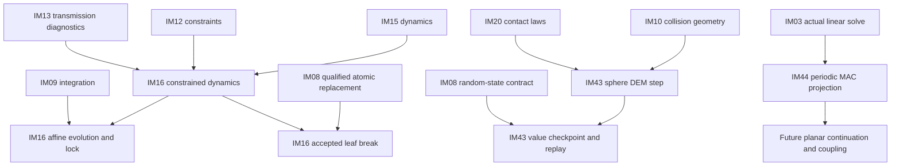
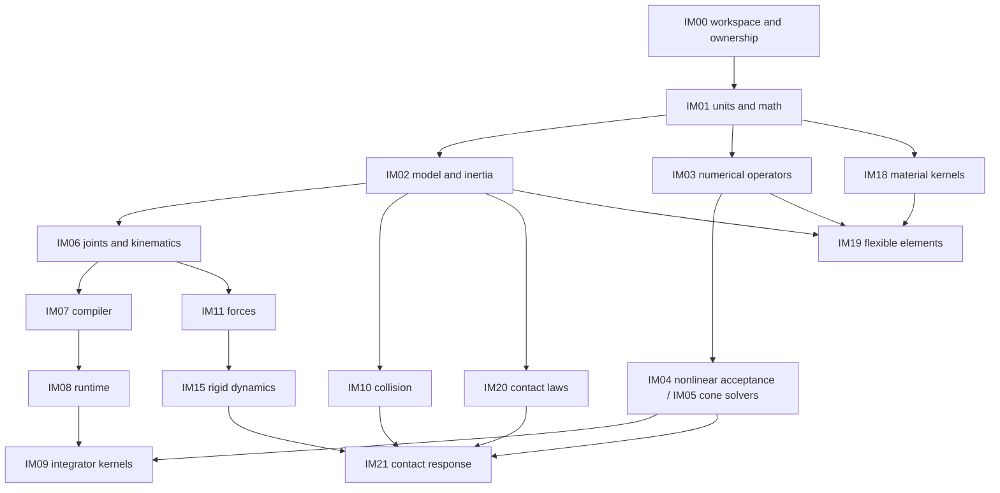

# Implementation dependency plan

Status: implementation active, 2026-10-03. The user authorized the complete plan and behavioral tests as the finish condition. PROGRESS.md owns current executable readiness/completion; this document retains the stable work IDs and dependency graph. PROGRESS.md records the verified initial numerical, kinematic, compiler, dynamics, constitutive, collision and runtime handoffs and current ready frontier. Complete requirement-domain closure and whole-target integration remain open; downstream production work starts only after its consumed contracts pass.

This document owns work IDs, prerequisite edges, requirement ownership, handoffs and parallel dispatch rules. [DESIGN.md](DESIGN.md) owns architectural composition; [SPEC.md](SPEC.md) owns the unchanged 210 behavioral requirements. [PROGRESS.md](PROGRESS.md) records the authorized implementation task. Its child IDs IM.IM00 through IM.IM47 map to this plan's IM00 through IM47; top-level IM48 owns whole-target integration after their parent IM completes.

## 1. Three dependency meanings

| Kind | Meaning | Start/completion consequence |
|---|---|---|
| Contract prerequisite | A supplier owns an API/data/units/ownership/failure contract consumed by another work item. | Consumer source using it waits for the validated, recorded handoff; names or mocks alone are not handoff evidence. |
| Implementation prerequisite | The supplier implementation provides actual equation operators, state semantics or adapter behavior needed for the consumer's local proof. | Consumer integration/completion waits for that path's behavioral evidence, not merely compilation. |
| Capability integration gate | SPEC G0–G5 qualifies an integrated capability profile and full-target claims. | It is a reporting/verification order; it is not an extra dependency edge between independent kernels. |

The table in §3 defines hard prerequisites for each complete work-item scope. Each edge includes the relevant validated contract and production behavior; concrete handoff evidence is recorded before dispatch. It does not require a supplier's unrelated future platform/feature profiles to be finished. No early contract handoff marks its whole requirement family implemented. A consumer may do read-only investigation before handoff; dependent production implementation cannot assume an unverified API or ownership model.

A task's primary requirement ownership is accountability for its implementation and evidence, not an assertion that every row becomes complete in its first baseline. Cross-feature extensions (contact wake behavior, schema registrations, checkpoint contributors, new target capabilities) are explicit handoffs to the same owners. Local completion records the exact supported subset; final closure of a requirement waits for all its specified domains and integration obligations. Generic provider interfaces do not make missing physics available.

## 2. Contracts and single writers

| Contract boundary | Producer / decision authority | Consumed by | Required handoff |
|---|---|---|---|
| Toolchain, real module/path ownership and composition graph | IM00 | All workers | Exact target/profile identity, permitted owned paths, design/test ownership and sole-writer registration procedure. |
| Units, transforms, spatial vectors and q/v conventions | IM01 | Model/numerical/physics scopes | Analytic/frame invariance and invalid-input evidence; precision and borrowed storage lifetime. |
| Model identity, shapes versus inertia and instance data | IM02 | IM06/07/10/19/20/38 | Documented representation authority, validation domains and revision-safe references. |
| Operators, sparse structure, solve acceptance and budgets | IM03/04/05 | Constraint, dynamics, integration, contact, flexible and optimization scopes | Actual manufactured solve/failure proof, original-equation residuals and state/cache ownership. |
| Joint manifold, Jacobian and constraint equations | IM06/12 | Compiler, transmissions, dynamics, analysis and planning | Coordinate layout, g/J/time terms, rank/singularity behavior and virtual-work evidence. |
| Compiled layout and capabilities | IM07 | Runtime, exchange and CAD | Immutable revision/layout, validator registration and unsupported-feature diagnostics. |
| Accepted/trial state and contributor lifetime | IM08 | Integrators, actuators, sensors, control, checkpoint and backends | Actual rollback, cancellation/shutdown, contributor-state and view lifetime proof. |
| Collision witnesses and contact law/response | IM10/20/21 | Hybrid/deforming/gear/contact-derivative scopes | Framed normals/points, law/model identity, force/impulse time semantics and accepted residuals. |
| Flexible nodal/material/interface data | IM18/19 | Flexible evolution, modes, distributed contact and CAD meshing | Stress/strain/tangent measures, material-state ownership, objectivity, element quality and refinement. |
| Derivatives and optimizer terminal status | IM30/31/32 | IK/planning/MPC/identification | Qualified domains and unsupported/nonsmooth failures; independent derivative/feasibility proof. |
| CAD geometry revision and queries | swift-CAD, checked by IM38 | IM38/39/40 | Clean pin and actual public query success/failure; missing exact moments remain a CAD-owned dependency gap. |

Shared provider APIs are changed by their producer only. A consumer reports the missing contract and impact; it does not patch another owner's public types or add a second copy. Before editing a shared contract, identify dependent rows in §3 and invalidate only evidence whose assumption changes. Worker instructions must state owned paths, test owner and the fact that other workers are present; no worker reverts another's edits.

IM00 is the sole writer of Package.swift, global toolchain/CI configuration, umbrella/facade wiring and module-root design indexes. Each task owns its component implementation, local tests and component DESIGN.md. The control/integration owner is the sole writer of task PROGRESS.md. No workers share mutable fixture files or a package manifest. Common oracle data is versioned immutable input; fixture updates are serialized by its owner.

Independence requires separating interface data from concrete engines. IM20 owns its minimal constitutive inputs (separation/penetration, framed relative velocities and material parameters) using IM01/02 values; it does not consume IM10's collision-specific witness type. IM10 owns geometric witnesses. IM21 owns the explicit translation between these published contracts. Likewise IM05 owns numerical cache values independently of runtime; IM24 binds them to IM08 checkpoint/transaction contracts. These adapters prevent hidden collision-law or solver-runtime dependency cycles.

IM03 owns shared numerical operator/status/budget/precision record contracts needed by both IM04 and IM05. IM04 owns nonlinear iteration and acceptance implementation; IM05 does not import that implementation merely to obtain common record definitions. Geometry-following constraints in IM12 consume explicitly supplied query contracts; CAD supplies one possible adapter, not a mandatory dependency of those kernels.

Concrete current module/path assignments, verified initial producers and the actual dispatched frontier are indexed in DESIGN.md. Additional assignments remain a prerequisite of their dispatch. IM00 assigns non-overlapping paths and the native SwiftPM graph before parallel production work; no 49-module structure or hypothetical component is treated as verified. Multiple task scopes may live in one real module only when their component contracts and paths remain independently owned.

## 3. Canonical prerequisite and ownership table

Arrows mean `prerequisite → consumer`. Direct prerequisite lists are authoritative; transitive prerequisites need not be copied. Requirement ranges are inclusive. Every SPEC requirement has exactly one primary owner. Integration obligations link to those owners rather than assigning duplicate implementations.

| Work ID | Responsibility | Direct prerequisites | Primary requirement IDs | Owned implementation scope | Local result and proof required |
|---|---|---|---|---|---|
| IM00 | Workspace composition | `none` | `PF-001..005` | Package.swift, toolchain profiles, target/test registration, facade composition | Select exact toolchain/profile; map each ready scope to real module/component directories; compile/link the empty-of-physics graph without claiming physics support. |
| IM01 | Units and spatial algebra | `IM00` | `MD-002..003;RB-003;RB-005` | Units, transforms, spatial algebra, orientation manifold | Prove frame/units, inertia transforms, q/v conventions and rotation integration primitives with analytic and invalid-input cases. |
| IM02 | Model records and inertia | `IM01` | `MD-001;MD-005;RB-001..002;RB-004;RB-006` | Mechanical identity, representation records and mass properties | Prove IDs, instance separation, body modes, inertia validity and analytic composite properties; publish validated model-record contracts. |
| IM03 | Linear algebra kernels | `IM01` | `SO-001..002;SO-006;SO-010` | Linear operators, dense/sparse solves and scaling | Publish operator/sparsity/borrow/precision contracts; prove manufactured solves, rank failures and residuals on the selected baseline. |
| IM04 | Nonlinear solve and acceptance | `IM03` | `SO-003;SO-007..009` | Nonlinear iteration, numerical acceptance and work budgets | Prove convergence/failure, original-equation residual checks and budget exhaustion; publish residual and solve-result contracts. |
| IM05 | Contact numerical kernels | `IM03` | `SO-004..005` | Cone/complementarity numerical methods and warm-start representation | Solve manufactured LCP/cone problems without scene geometry; qualify stopping measures and state-owned cache serialization. |
| IM06 | Joints and forward kinematics | `IM02` | `JT-001..004;KI-001..003` | Joint manifolds, tree transforms and Jacobian terms | Publish joint coordinate/q-v mappings and framed Jacobians; prove permitted/blocked DOF, moving-frame and virtual-work behavior. |
| IM07 | Mechanical compiler | `IM02,IM03,IM06` | `MD-004;MD-006..008;PF-010` | Compilation, revision/layout validation and capability registry | Compile admitted descriptors transactionally; publish layout, validator-registration and feature-manifest contracts; reject stale/invalid/unsupported models. |
| IM08 | State and runtime ownership | `IM07` | `RT-001..008;IO-002;PF-006` | State/workspace ownership, checkpoints, execution lifecycle and profiling | Prove independent states, contributor rollback/checkpoint, cancellation and shutdown; publish trial/accepted-state and observation-lifetime contracts. |
| IM09 | ODE integration kernels | `IM04,IM08` | `TI-001..003;TI-007;TI-009..010` | Smooth integrators, adaptive control and trial transactions | Integrate manufactured ODEs through real runtime transactions; prove order/error control, rejected-trial restoration and accepted-time semantics. |
| IM10 | Collision detection | `IM02` | `CL-001..010` | Collision shapes, queries, pair/manifold and CCD processing | Publish witness/manifold/TOI contracts; prove geometric queries, filtering, event identities, degeneracies and capacity failures independently of response. |
| IM11 | Passive loads and routing | `IM06` | `FL-001..008;RB-008` | Force laws, distributed loads, cable routing and impulse mapping | Publish framed force/port and routing-length derivatives; prove energy/virtual work and custom-law failure propagation. |
| IM12 | Constraint and assembly kernels | `IM04,IM05,IM06,IM08` | `CN-001..007;JT-005..006;KI-006..008` | Constraint equations, limits, passive joint laws, assembly and projection | Publish g/J/time terms and rank/reaction-ambiguity diagnostics; prove loops, projection, prescribed trajectories and supported path/surface queries. |
| IM13 | Transmission laws | `IM12` | `TR-001..011` | Ideal/constitutive gears, shafts, belts, clutches and linkage transmissions | Provide coordinate/force-port contributions through the constraint contracts; prove ratios, phase, backlash, loss and transmission state transitions. |
| IM14 | Actuation | `IM08,IM11` | `AC-001..008` | Actuator internal states, force laws and transmission ports | Prove drive-mode distinction, saturation/internal-state behavior, electromechanical/fluid/muscle laws and transmission work using published routing/state contracts. |
| IM15 | Rigid dynamics kernels | `IM03,IM06,IM11` | `DY-001..005;DY-007..008` | Mass/bias operators, forward/inverse/mixed dynamics and force budgets | Publish equation-term and wrench/energy-query contracts; prove independent rigid dynamics and inverse/forward consistency without requiring a contact world. |
| IM16 | Constrained mechanism execution | `IM08,IM09,IM12,IM13,IM14,IM15` | `RB-007;JT-007..008;CN-008;TI-004;TR-013` | Rigid mechanism orchestration, reactions, engagement and wake transitions | Bind integrator/dynamics/constraints; prove torque-driven gears, loop reactions, break/engagement and accepted-state transitions; later contact consumers extend wake evidence. |
| IM17 | Equilibrium and linearization | `IM04,IM12,IM15` | `ST-001..004;ST-008` | Static/quasi-static solving and operating-point linearization | Prove equilibrium, continuation, reaction ambiguity and smooth constrained linearization using equation operators rather than a GUI or trajectory runner. |
| IM18 | Constitutive and objectivity kernels | `IM01` | `FX-005..006` | Material response, constitutive state and finite-motion consistency | Publish stress/strain/tangent/state semantics; prove material cycles, dissipation, objectivity and constitutive failure before element composition. |
| IM19 | Flexible discretization | `IM02,IM03,IM18` | `FX-001..004;FX-007;FX-011..012` | Cable/beam/shell/solid elements, mass/tangents, mesh validation and reduction | Publish nodal layout, element matrices and interface DOF; prove patch/objectivity, refinement, eigenstructure and invalid-mesh behavior independent of rigid attachment. |
| IM20 | Contact constitutive laws | `IM02` | `CT-001;CT-003..007;CT-009..010` | Normal/tangent/rolling/spinning/cohesive laws and material pairing | Publish/evaluate minimal framed separation, velocity and material inputs; prove law domains, friction/dissipation and pair rules without consuming collision-specific types. |
| IM21 | Coupled contact response | `IM05,IM10,IM15,IM20` | `CT-002;CT-011..012` | Contact assembly, response solve and force/impulse observations | Bind collision witnesses, constitutive laws and mass operators; prove normal/cone residuals, multi-contact reactions and reported wrench/momentum balance. |
| IM22 | Distributed contact | `IM19,IM21` | `CT-008` | Pressure representations, contact patches and integrated wrenches | Prove valid representation pairings, pressure/wrench integration and mesh refinement; missing representations fail explicitly. |
| IM23 | Deforming geometry and self-contact | `IM10,IM19,IM21` | `FX-009` | Flexible collision update and self-contact coupling | Consume nodal state and collision/contact contracts; prove deforming and self-contact geometry/force consistency with budgets and invalidation. |
| IM24 | Impact and hybrid evolution | `IM08,IM09,IM15,IM21` | `DY-006;TI-005..006` | Impact impulses, event location and accepted contact evolution | Prove velocity jumps, impact law, simultaneous events and rollback; connect the accepted contact/wake events to the IM16 owner through its public contract. |
| IM25 | Mechanical observations | `IM15,IM16` | `SE-001..003` | Pose/joint/force/IMU observation definitions | Publish units, frames, mounting/time and force-versus-impulse semantics; prove analytic motion, support force and specific-force observations. |
| IM26 | Sensor scheduling and schemas | `IM08,IM10,IM21,IM24,IM25` | `SE-004..008` | Contact/range sensing, noise, schedules, observation buffers and schemas | Prove accepted-time sampling, seeded noise, delay/dropout, capacity and shutdown using real contact/runtime outputs. |
| IM27 | Rigid-flexible and multirate evolution | `IM08,IM09,IM12,IM14,IM15,IM19,IM23,IM24` | `FX-008;FX-010;TI-008;TR-014` | Attachments, flexible stresses, multirate coupling and loaded flexible transmissions | Prove interface power, force/stress output, synchronization and coupled gear/shaft behavior; state contributions obey the existing rollback contract. |
| IM28 | Modes and structural stability | `IM17,IM19` | `ST-005..007` | Modal/frequency/damped-response and buckling analysis | Bind flexible mass/tangents to analysis kernels; prove modes, frequency response and stability classification with boundary/material assumptions. |
| IM29 | Feedback systems and estimation | `IM08,IM14,IM16,IM17,IM25` | `CO-001..003;CO-005..008` | System ports, sampled controllers, LQR, task control, estimators and external clocks | Prove port/clock contracts, control limits, linearized design, estimation and contributor checkpoint; do not depend on a trajectory optimizer for ordinary feedback. |
| IM30 | Smooth derivatives | `IM06,IM12,IM15` | `OP-001..002` | Smooth analytic/automatic differentiation and parameter sensitivities | Publish derivative/product/domain contracts; prove directional derivatives and unsupported differentiated callbacks on real mechanics operations. |
| IM31 | Contact and impact derivatives | `IM21,IM24,IM30` | `OP-003` | Qualified derivatives at contact/impact model boundaries | Prove active-set/smoothing/generalized semantics and reject unsupported/nonsmooth requests; provide an additional qualified provider to derivative consumers. |
| IM32 | Optimization and identification | `IM04,IM30` | `OP-004;OP-009` | Optimization problems/solvers and parameter identification | Publish cost/constraint/derivative and terminal-status contracts; prove LP/QP/nonlinear status, identifiable directions and invalid observations. |
| IM33 | IK and trajectory/path planning | `IM10,IM12,IM16,IM30,IM32` | `KI-004..005;OP-005..008;OP-010` | Inverse/task kinematics, collision-aware planning, transcription, retiming and design sensitivity | Prove configurations/paths and independently replay optimized trajectories between knots; CAD-derived parameter mappings are an adapter input, not a core dependency. |
| IM34 | Predictive control | `IM29,IM32` | `CO-004` | MPC horizon construction and command/failure semantics | Bind feedback timing and optimization contracts; prove constraints, infeasibility and explicit response to failed solves without silently reusing commands. |
| IM35 | Native model exchange | `IM07` | `IO-001;IO-008` | Versioned native schema, parsing and bounded asset resolution | Publish model codec/extension contracts; prove supported-record round-trip and transactional malformed/missing/oversized input rejection. |
| IM36 | Result export | `IM25,IM26` | `IO-007` | Timestamped trajectories, physical quantities and diagnostic output | Prove units/frames/fidelity and failed-prefix status survive independent reconstruction; propagate IO failure. |
| IM37 | Foreign mechanics formats | `IM13,IM14,IM26,IM35` | `IO-003..006` | URDF/SDF/MJCF/OpenUSD semantic adapters | Select pinned versions/subsets and prove declared semantics/round-trip/loss reports; unsupported numerical laws are not replaced silently. |
| IM38 | CAD mechanical input | `IM02,IM06,IM07,IM08,IM13` | `CA-001..004;CA-006..007;CA-009..010` | CAD occurrence/anchor/material/inertia conversion and model revision handling | Resolve a clean CAD pin and required public geometry capabilities; prove actual geometry-to-model input, inertia, gear binding and stale-anchor failures. |
| IM39 | CAD collision and FEM derivation | `IM10,IM19,IM38` | `CA-005` | CAD proxy/FEM-domain generation with source/error mappings | Prove deviation, mesh quality, material/boundary assignments and source attribution; consume geometry queries rather than implementing a CAD kernel. |
| IM40 | CAD output association | `IM25,IM26,IM27,IM38` | `CA-008` | Mapping accepted pose/force/stress results back to CAD occurrences | Prove repeated-part identity, source revision and overlay association without mutating authoritative geometry. |
| IM41 | Accelerated and foreign backends | `IM08,IM15,IM21` | `PF-007..009` | Device/ABI/external-engine adapters and qualified capability profiles | Choose exact admitted profiles; prove actual device kernels/transfers, safe foreign handles and semantic differences; baseline capabilities remain independently verified. |
| IM42 | Vehicle and terrain assemblies | `IM13,IM14,IM16,IM21,IM29` | `EX-001..003` | Wheeled/tracked vehicles, tire/terrain laws and driver composition | Publish calibrated subsystem/port domains; prove acceleration, braking, load transfer, traction and track closure on actual mechanics. |
| IM43 | Granular systems | `IM08,IM21,IM24` | `EX-004` | Particle distributions, neighbor/contact evolution and rigid-boundary coupling | Prove collision, settling, shear, seeded reproducibility and neighbor/contact-capacity failures using CPU reference workloads. |
| IM44 | Fluid evolution | `IM03,IM08,IM09` | `EX-005` | Declared fluid discretization, boundaries and time evolution | Select equations/discretization and prove hydrostatics, viscous flow, refinement and stability/failure; do not wait for vehicle or control implementation. |
| IM45 | Domain and fluid-structure coupling | `IM27,IM29,IM42,IM44` | `EX-006;EX-008` | Rigid/flexible FSI and vehicle/terrain/fluid co-simulation | Prove exchanged power/momentum, synchronization, coupling convergence and participant failure/rollback on real domain contributors. |
| IM46 | Domain acceleration | `IM41,IM43,IM44` | `EX-007` | Accelerated/partitioned domain execution and communication accounting | Prove small CPU equivalence and actual device/partitioned scale with transfer, determinism and communication budgets. |
| IM47 | Tooth-resolved gear evolution | `IM13,IM21,IM24` | `TR-012` | Geometric tooth engagement and loaded transmission evolution | Use externally supplied validated tooth proxies or the CAD adapter; prove load, slip/separation and mesh/time refinement without hidden ideal coupling. |
| IM48 | Whole-target integration | `IM00,IM01,IM02,IM03,IM04,IM05,IM06,IM07,IM08,IM09,IM10,IM11,IM12,IM13,IM14,IM15,IM16,IM17,IM18,IM19,IM20,IM21,IM22,IM23,IM24,IM25,IM26,IM27,IM28,IM29,IM30,IM31,IM32,IM33,IM34,IM35,IM36,IM37,IM38,IM39,IM40,IM41,IM42,IM43,IM44,IM45,IM46,IM47` | `none` | Task-level integration evidence and complete capability/requirement audit | Check every requirement owner and applicable INT-01..10 production path after local contracts pass; no required planned/unverified row permits a complete-target claim. |

## 4. Parallel dispatch plan

The candidate groups below are antichains computed from §3: their members cannot consume one another. They belong to the same future implementation parent. They express permitted parallel scopes, not mandatory global waves. A consumer whose own prerequisites have passed can start while unrelated lower-numbered work remains in progress; do not add a dependency on completion of a whole cohort or G0–G5.

At dispatch, the control owner puts the actual ready sibling items into one explicit parallel group in PROGRESS.md, in topological order. Recompute that ready group when prerequisites pass, excluding in-progress/conflicting writers; record the group change before dispatch. This allows a frontier combining independent candidates from different PG cohorts without pretending a dependency-connected set is parallel. The current work remains the topmost ready item or its ready parallel group, as required by the project instructions. Candidate PG identifiers are stable planning references; the current executable parallel group has its own recorded ID.

| Candidate group | Work IDs | Safety relationship |
|---|---|---|
| PG00 | `IM00` | Sequential owner / integration point. |
| PG01 | `IM01` | Sequential owner / integration point. |
| PG02 | `IM02,IM03,IM18` | No dependency path exists between members; concrete path/state/test ownership still must pass dispatch checks. |
| PG03 | `IM04,IM05,IM06,IM10,IM19,IM20` | No dependency path exists between members; concrete path/state/test ownership still must pass dispatch checks. |
| PG04 | `IM07,IM11` | No dependency path exists between members; concrete path/state/test ownership still must pass dispatch checks. |
| PG05 | `IM08,IM15,IM35` | No dependency path exists between members; concrete path/state/test ownership still must pass dispatch checks. |
| PG06 | `IM09,IM12,IM14,IM21` | No dependency path exists between members; concrete path/state/test ownership still must pass dispatch checks. |
| PG07 | `IM13,IM17,IM22,IM23,IM24,IM30,IM41,IM44` | No dependency path exists between members; concrete path/state/test ownership still must pass dispatch checks. |
| PG08 | `IM16,IM27,IM28,IM31,IM32,IM38,IM43,IM47` | No dependency path exists between members; concrete path/state/test ownership still must pass dispatch checks. |
| PG09 | `IM25,IM33,IM39,IM46` | No dependency path exists between members; concrete path/state/test ownership still must pass dispatch checks. |
| PG10 | `IM26,IM29` | No dependency path exists between members; concrete path/state/test ownership still must pass dispatch checks. |
| PG11 | `IM34,IM36,IM37,IM40,IM42` | No dependency path exists between members; concrete path/state/test ownership still must pass dispatch checks. |
| PG12 | `IM45` | Sequential owner / integration point. |
| PG13 | `IM48` | Sequential owner / integration point. |

### Actual dispatch readiness

| Check | Evidence required before a worker edits production source |
|---|---|
| Scope | Responsibility, requirement subset, non-goals and falsifiable local completion proof are fixed. |
| Supplier handoff | Every direct prerequisite has provided the contract version and actual behavior needed by this scope. |
| Child design | Public inputs/outputs, errors, state/owner/lifetime, platform assumptions and test ownership are documented under the real directory. |
| Exclusive paths | Producer headers, shared fixture data, manifest, facade wiring and progress writes have one owner; owned component/test paths do not overlap peers. |
| Execution profile | Exact toolchain/SDK/target/backend and timeout strategy are selected; unsupported targets stay explicitly unverified. |
| Numerical evidence | Fixture scales/tolerances/model equations are fixed before candidate results; no mock success replaces the implementation path. |
| Commit/integration | Each coherent sprint is reviewed/tested and locally committed; integration consumes its exact contract/source revision. |

The first task is IM00. IM01 follows its baseline/path handoff. The first multi-worker cohort is **IM02 + IM03 + IM18** after IM01. Actual dispatch requires the checks above and recorded behavioral evidence. Parallelism is bounded by actual resources; no concurrency number or real-time budget is guessed here.

### Frozen AF16 source handoff and actual build edges

The following table fixes the integration input on 2026-10-04. These are **semantic component prerequisites for the admitted source domains**. AR01 consolidates them in one public SwiftMechanics target; the table preserves responsibility handoffs, not former module boundaries. The complete work-item prerequisites in §3 remain authoritative for the full requirement scope. A missing import is not proof that a full requirement has no semantic dependency.

| Source owner / work | Exclusive production and test paths | Consumed component contracts | Handoff / next gate |
|---|---|---|---|
| model_records / IM16 | `Sources/SwiftMechanics/Physics/Mechanisms/{ConstrainedDynamics,AffineEvolution,AcceptedTransitions,ConnectedSleep}`; `Tests/MechanicsMechanismsTests` | Core, Model, Compiler, Joints, Numerics, Nonlinear, Constraints, Transmissions, Dynamics, Loads, Runtime, Integration | Frozen source; root reviews/registers and runs actual constrained dynamics, lock and leaf-break tests. Actuation remains a full IM16 prerequisite; the admitted constant-drive source does not import it. |
| linear_kernels / IM43 | `Sources/SwiftMechanics/Physics/Granular/{ParticleState,NeighborContacts,ParticleEvolution,Replay}`; `Tests/MechanicsGranularTests` | Core, Model, Numerics, Collision, ContactLaws, Runtime | Frozen source; actual sphere/prescribed-plane evolution and in-process history/RNG replay await root qualification. ContactResponse and Hybrid remain complete-work prerequisites; this compliant DEM path does not import them. |
| material_kernels / IM44 | `Sources/SwiftMechanics/Physics/Fluids/PlanarProjection`; `Tests/MechanicsFluidsProjectionTests` | Core, Model, Numerics | Frozen source; actual periodic MAC projection/evolution awaits root qualification. Existing Fluids components also consume Joints, Compiler and Runtime for its qualified channel children. Planar Runtime continuation is a later explicit handoff. |
| root / composition | `Package.swift`, module-root indexes, `Verification/FoundationVerification`, shared scripts, `PROGRESS.md` and commits | Consumes the frozen handoffs above | Sole writer of registration and existing producer changes. No build may mix an evolving registered source snapshot. |

Abbreviated names above identify components within SwiftMechanics; they are not separately imported targets. Test-only oracle adapters are not production dependencies. All three frozen production scopes are independent: none imports another member, and no complete-work prerequisite path connects IM16, IM43 and IM44.

This is a view of selected lower handoffs, not a replacement for §3. Break publication waits for both physical mapping and atomic Runtime replacement. Granular Runtime transaction binding waits for the frozen particle/history/RNG contract; its current value checkpoint does not supply that binding. Planar continuation/coupling waits for verified pressure, divergence, momentum and energy acceptance. General mechanism charts, finite-mass granular boundaries, and full fluid/FSI remain open.

The next complete-work candidates include IM31 contact/impact derivatives, IM32 optimization/identification and IM38 CAD mechanical input. They are independent of these three current owners and of one another. Before dispatch, the corresponding owner must select only operations supported by the recorded producer handoffs; IM38 additionally needs a clean CAD pin and exercised public geometry queries. Candidate status alone does not authorize dependent source assumptions or qualify a capability.

## 5. Why major paths remain independent

This is a selected overview, not a second edge authority. Full prerequisites and proof obligations remain in §3. The numeric integrator's equations do not depend on a gear class. A contact constitutive law can evaluate its own framed separation/velocity/material inputs before collision processing is implemented; IM21 later maps geometric witnesses to those inputs. Flexible material/element kernels do not require a rigid simulation runner. Fluid evolution does not depend on vehicle/control products. CAD is an adapter prerequisite only where source-derived data is used; it is not a prerequisite for core dynamics, collision or tooth contact with externally supplied validated proxies.

Mechanism execution joins IM09/12/13/14/15 at IM16. Contact evolution joins numerical/collision/material/mass operators at IM21/24. Flexible attachment/evolution joins at IM27. Optimization joins mechanics derivatives at IM32/33; ordinary feedback IM29 does not wait for planning, while MPC IM34 waits for the optimizer. Domain coupling joins actual vehicle/fluid/flexible contributors at IM45. These joins are real behavior dependencies, not presentation-stage ordering.

## 6. External dependencies and unresolved readiness

| Dependency decision | Owner | Consumers blocked until resolved | Required evidence / safe boundary |
|---|---|---|---|
| Exact native/WASM/Embedded toolchain, SDK and target profiles | IM00; actual adapter owners | Only the affected compilation/runtime profile | Installed/official identities and actual compile/link/runtime; no silent older-toolchain or SDK substitution. |
| Concrete native SwiftPM modules, component paths and public boundary contracts | IM00 and corresponding producers | Every affected parallel dispatch | Child design/API usage and behavior; use the ecosystem structure and avoid classification-only directories. |
| Dense/sparse backend, scalar/borrow layout, solve algorithms | IM03/04/05 | Consumers of those specific operations | Real manufactured solves/failures, residuals, precision and ownership; library selection is not inferred from its name. |
| Contributor/checkpoint and trial/commit interfaces | IM08 | Stateful integrators/actuators/sensors/controllers/backend adapters | Rejected-trial, cancellation, checkpoint and lifetime behavior; no unprotected Embedded state branch. |
| Clean swift-CAD pin, product graph, geometric moments and anchor/proxy queries | IM38 | IM38/39/40 and CAD-specific integration evidence | Source observations alone do not certify full moments; absent queries fail explicitly and are addressed by the CAD owner. |
| Material/element/contact/fluid equations, domains and calibration | IM18/19/20/22/44 | The corresponding constitutive/profile implementation and coupling | Published equations and local analytic/reference/refinement evidence; never block an unrelated model. |
| Format versions/subsets and foreign/device execution capabilities | IM37/41 | The affected adapter/profile | Real round-trip/loss/ABI/device evidence with exact profile identity. |

No new third-party numerical dependency is selected by this plan. The CAD dependency intention is unchanged. Repository publication/visibility is separate from the implementation DAG and does not block local design or native mechanics development.

## 7. Integration and completion order

Each provider owns its local contract proof. Each composing item owns new interaction proof, not re-execution of every unchanged provider test. IM48 owns whole-target evidence after all items. Gate claims still follow SPEC, but implementation can follow any valid topological order.

| Integration responsibility | Required producer evidence | SPEC scenario linkage |
|---|---|---|
| IM16 mechanism execution | Model/runtime, ODE, constraints, transmissions, actuators and rigid equation operators | INT-01 (mechanics portion), INT-03 |
| IM21/24/47 contact and tooth execution | Collision, contact laws/numerics, mass operators and accepted hybrid evolution | INT-04 (non-CAD mechanics portion), INT-05 |
| IM27/28 flexible coupling/analysis | Elements/materials, attachments, time/contact and structural operators | INT-02, INT-06 |
| IM29/31/33/34 control/optimization | Observations, qualified derivatives, optimizer, plant/clock and replay paths | INT-07 |
| IM38/39/40 CAD integration | Clean CAD query behavior and actual model/proxy/mesh/output consumers | CAD portions of INT-01/04/06 |
| Runtime and platform owners, composed in IM48 | Contributor checkpoints, lifecycle and each exact profile's real paths | INT-08, INT-09 |
| IM42–46 domain integration | Calibrated domain contributors, interface/clock and actual acceleration | INT-10 |
| IM48 complete target | All preceding work, all requirement owners and declared-profile evidence | INT-01..10 plus requirement closure audit |

The prior planning verification proved only graph acyclicity, ownership coverage and documented parallel isolation conditions. Implementation now adds actual API/production-path evidence in PROGRESS.md and corresponding child designs/tests. No IM item is checked complete or dispatch-ready without actual prerequisite and local completion evidence; no complete-target claim is made before IM48 passes.

AF17 next source dispatch: linear_kernels owns only new MechanicsOptimization child directories and MechanicsOptimizationTests, after read-only actual producer tracing. Numerics/Nonlinear/Derivatives remain frozen. The [module index](Sources/SwiftMechanics/Analysis/Optimization/DESIGN.md) fixes the bounded affine convex first handoff and later nonlinear/physical-estimation responsibilities. It is unregistered during current profile builds, with no source dependency on Mechanisms, Granular or Fluids. Root alone registers a frozen handoff. CAD tracing established a clean remote candidate but no full-moments/error-bound contract; the affected exact CAD mass path remains blocked, not silently approximated.

AF18 observation source dispatch follows qualified selected mechanism handoff 965c326: model_records owns only new MechanicsObservations children and matching tests. Its exact lower source authority, frame/time/mounting and unavailable general reaction decomposition were traced before dispatch; the [module index](Sources/SwiftMechanics/Analysis/Observations/DESIGN.md) fixes this boundary. IM25 observation and IM32 optimization source paths are independent and unregistered while the qualified providers stay frozen. Full work-item requirements remain open where their selected supplier domains cannot provide a required quantity.

AF18 planar continuation source dispatch: material_kernels owns only new MechanicsFluids/PlanarContinuation and MechanicsFluidsRuntimeTests, excluded/unregistered until freeze. Qualified periodic projection and public immutable field records from 965c326 plus actual Runtime contributor/trial/checkpoint contracts are prerequisites. Root freezes all existing suppliers and serializes registration. Observation, optimization and planar-continuation source owners have disjoint paths, fixtures and mutable state; none consumes another current worker. The child owns new accepted-field wire/state semantics before declarations, without extending the claim to FSI or changing-grid migration.

AF18 root profile preparation is serialized with registration: OptimizationProbeContext/OptimizationVerification were explicitly excluded until the convex source/test handoff froze. Their [composition contract](Verification/FoundationVerification/DESIGN.md#af18-convex-composition-contract) fixes actual LP/QP/Farkas/refusal and physical scaling oracles before source; The frozen handoff is now registered with only Core/Model/Numerics edges; all 23 Native tests and selected original Native/WASM/Embedded public compositions passed. Full OP-004/009 remains open. The whole-checkpoint public Runtime admission contract already provides PlanarContinuation with prepublication physical time/sequence authority; no producer correction is required for that binding.

AF19 nonlinear dispatch follows convex commit 8450243. The new NonlinearKKT child and dedicated test target are excluded/unregistered while root qualifies the independent frozen observation/planar-continuation sources. Neither frozen source depends on this active worker. Numerical and convex producers remain immutable. Its [module dispatch contract](Sources/SwiftMechanics/Analysis/Optimization/DESIGN.md#af19-nonlinear-source-dispatch) fixes local-versus-global proof and explicit second-derivative authority before lower source. Unbounded LP and identification are still open requirements, not removed from IM32.

### AR01 authorized module consolidation

User-approved public boundary: one SwiftMechanics module, with component owners under Mathematics, Modeling, Physics, Execution, Analysis and Exchange. Root owns physical mapping, manifest and shared integration. AR01Implementation has three disjoint ready siblings: Machine declaration/lowering, scalar mathematical boundary and compiler/Runtime admission authority. All depend on the completed physical mapping. Their source/test paths do not overlap; verification starts after all handoffs freeze. Pending observations, planar continuation and nonlinear optimization remain excluded and retain their own work IDs. Source consolidation changes visibility, so owner-issued opaque construction tokens preserve admission/publication authority. The full requirement DAG and 210 rows remain unchanged.

### AF20 mechanism execution frontier
After consolidation commit 69a404d, unfinished IM16 execution contracts form the next ready frontier. NonlinearEvolution and SleepContinuation are disjoint sibling source/test responsibilities. Both consume frozen Runtime, numerical, kinematic and dynamics protocols; neither consumes the other's evolving implementation. Their source directories were excluded until the original frozen handoff and are now registered for integration. Lower contracts must be traced and written before production. Original position/velocity/momentum acceptance, failed supplier work, transaction rollback, contributor binding and replay are necessary evidence. Existing frozen observation/fluid/nonlinear-optimization work is preserved; AR01 is no longer an unresolved authorization hold, but their canonical prerequisites and current readiness still govern dispatch.

ReactionPaths joins that same ready sibling group with isolated source/tests and frozen Dynamics/Loads/Joints dependencies. Original body inertial wrench and identified applied-load balance are its authority; generalized force alone cannot qualify a unique bearing wrench. Root owns all shared manifest/probe registration and final profile execution after freeze.

The AF20 original ordinary/Embedded awake-sleep execution identifies excessive rich temporaries in the consumed AffineEvolution motion path. Root reassigns only that required motion phase/lifetime repair, lower design and affected old mechanism tests to the sleep owner. Source and profile qualification stay serial after freeze; public laws, work ledgers, synchronization and original stack reservation remain fixed.
