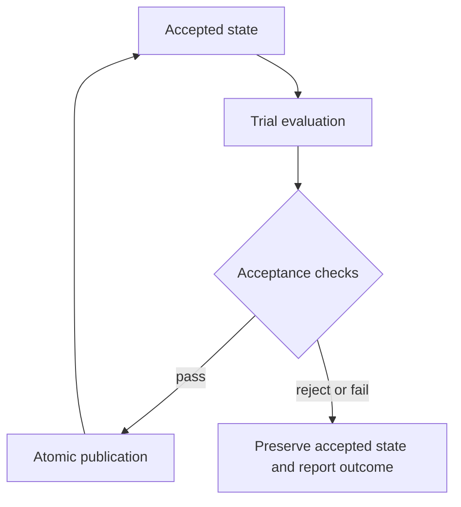

# Design Philosophy

swift-mechanics aims to make engineering machines natural to describe in Swift and rigorous to simulate. A readable declaration should lead to accountable physical results: a stated model, explicit assumptions, numerical evidence and an honest failure when those conditions cannot be met.

This document explains the project's values. [SPEC.md](SPEC.md) owns normative physical and numerical requirements; [DESIGN.md](DESIGN.md) and its children own architectural contracts. This philosophy guides decisions without replacing those authorities.

## Describe intent, preserve physical meaning

A machine declaration expresses composition. It identifies bodies, joints and relationships without owning the solver's mutable state. `Machine` and `MachineBuilder` provide the declarative foundation; compilation and execution have separate responsibilities.

Declare physical structure directly inside `body`. Nesting should express a connection, references should express cross-links, and named ports should express distinct mechanical roles. Spatial coincidence does not imply rigid attachment or shared motion. Runtime engagement is a physical state transition rather than reevaluation of a construction-time branch. The [Machines design](Sources/SwiftMechanics/Modeling/Machines/DESIGN.md#target-declarative-authoring-contract) owns the authoring contract and its distinction from the implemented foundation.

Convenience should preserve identity, units, coordinate conventions and failure information. A concise API is useful when its physical meaning remains explicit. Builder syntax cannot make an unsupported law or invalid assembly valid.

## Engineering evidence is the product

Animation communicates motion; engineering output must also explain loads, torque, reactions and error. A plausible picture, compiled type or successful iteration flag is insufficient evidence for the physical behavior being claimed.

Verification should be able to reject an incorrect implementation. Independent analytic cases, original-equation residuals, physical balances, convergence studies and adversarial failure cases serve different proof obligations. Their cost and scope should follow the actual change.

Evidence belongs to the exact operation, input domain, model, backend and platform exercised. Selected runtime success does not qualify an entire feature family. Implementation progress and full requirement completion remain distinct.

## Every result has a model

Ideal gear coupling, tooth contact, flexible deformation and contact friction make different assumptions and produce different quantities. Their distinctions must survive API composition and result reporting.

Use the physical formulation appropriate to the requested behavior. Report its limitations and diagnostics at the boundary that owns it. Approximation is a deliberate model choice with recorded consequences; it must not appear as an invisible substitution after failure.

## Ownership follows meaning

Geometry, mechanical equations, numerical acceptance and accepted state each have an owner. That owner defines the invariant, admits inputs and reports failures. Other components consume its published contract rather than reproducing its decisions or inspecting private state.

| Meaning | Authority |
|---|---|
| Exact geometry and topology | CAD provider |
| Mechanical interpretation and physical laws | Mechanical model and physics components |
| Numerical method and acceptance evidence | Numerical and integration components |
| Mutable state and publication | Execution owners |
| Visual presentation and user decisions | Application |

The present package uses one public `SwiftMechanics` module with responsibility-specific components. Independent adapters enforce external dependency boundaries. Create new package or module boundaries when they enforce a real contract, visibility, platform or dependency requirement.

## Swift is the implementation language

Use Swift's protocols, generics, value semantics, ownership and concurrency to express the mechanics contracts directly. The Native Swift CPU implementation is the correctness baseline. External engines may provide interoperability or independent references; they do not establish implementation of the native solver requirements.

Platform adapters should isolate genuine platform differences. State isolation and lifetime guarantees must remain coherent across Native, WASM and Embedded execution. A portability flag is not evidence that synchronization is unnecessary.

## State advances through acceptance

A trial may allocate work, evaluate laws, solve equations and fail. Accepted state must remain coherent through rejection, cancellation, resource exhaustion and restore. Checkpoints carry the admitted continuation state required by their model and history, not merely positions that look correct on screen.

State ownership and resource lifetime are part of correctness. Their success and failure paths require evidence alongside the equations.

## Performance has a contract

Bounded work, memory, allocation, stack use and continuation storage determine whether a simulation can execute reliably. Define the relevant budgets and failure behavior before optimizing them.

Measure the actual path. Favor reusable storage, borrowed views and static dispatch where the workload warrants them. Low-level implementation is justified by ownership guarantees and measured requirements, and must preserve physical acceptance. A larger stack, weaker tolerance or alternate model cannot disguise a defect.

## Parallel work consumes proven contracts

Independent components can progress concurrently after their producer handoffs are validated. Shared contracts and mutable files have explicit writers. Parallelism should reduce elapsed time without making ownership, evidence or publication ambiguous.

Delivery gates qualify integrated capability; they do not impose extra dependencies between unrelated kernels. The implementation plan owns prerequisites, and the progress record owns readiness. Changes to a supplier invalidate only the evidence whose assumptions changed.

## Ambition with honest boundaries

The full specification remains the target. Early milestones establish useful, explicitly bounded capabilities without shrinking the agreed requirements or claiming support that has not been demonstrated.

Prefer the smallest complete responsibility: one clear owner, a usable contract, explicit failure behavior and sufficient evidence. Stop when that obligation is proved. Independent improvements belong to separate work rather than expanding every task into a redesign.
