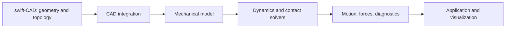

# swift-mechanics

Swift 向けの工学機構シミュレーションライブラリを設計するリポジトリです。機構の運動、力・トルク、接触、柔軟体、制御、最適化を対象にします。

**現在は実装中です。SwiftPM package と MechanicsCore の基盤 API・動作テストを追加しています。** 210 要件全体、機構シミュレーター、CAD 連携の完了はまだ主張していません。文書の機能一覧は検証を伴う開発要件です。

| 文書 | 正本として所有する内容 |
|---|---|
| [SPEC.md](SPEC.md) | 機能要件、入力範囲、失敗契約、受入証拠、段階別の完了条件 |
| [DESIGN.md](DESIGN.md) | 提案する責務分離、依存方向、状態所有、実行フロー |
| [IMPLEMENTATION_PLAN.md](IMPLEMENTATION_PLAN.md) | 49 作業項目の実装依存 DAG、210 要件の担当、並列開始条件・統合順序 |
| [SOURCES.md](SOURCES.md) | 参照した公式資料と比較の根拠、swift-CAD の確認範囲 |
| [PROGRESS.md](PROGRESS.md) | 実装・テスト・全体統合の進捗 |

swift-CAD を CAD 連携の依存先にする方針です。CAD 連携を利用する構成では必須ですが、形状を外部から与えて計算するコアは CAD カーネルに依存しません。形状生成・位相管理は swift-CAD、質量・慣性・関節・荷重・時間発展は swift-mechanics が所有します。現在の Package.swift は基盤のみで、CAD 依存は実際の連携契約を検証する IM38 で設定します。

Project Chrono、Simbody、Drake、MuJoCo、Bullet、Rapier の機能を参照して目標を定めています。既存ライブラリの完全互換や、すべての物理現象への対応を意味するものではありません。数学モデル、適用範囲、誤差、バックエンドを区別し、未対応や未収束を成功として扱わないことを基本契約にします。

仕様は英語の技術契約として記述しています。要件 ID は実装、設計、テスト、機能一覧を結ぶ識別子です。本文の `planned` は未実装を意味します。

## 仕様の索引

**23 分野・210 要件**です。以下は詳細な契約への索引であり、対応済み機能の一覧ではありません。

| ID | 分野 | 主な対象 | 要件数 |
|---|---|---|---:|
| MD | 機械モデル | 単位・座標系、部品 ID、モデル検証・コンパイル | 8 |
| RB | 剛体・慣性 | 質量、重心、慣性テンソル、浮遊基部、衝撃 | 8 |
| JT | ジョイント | 回転・直動・球面・万能・ねじ・汎用関節、限界・破断 | 8 |
| CN | 拘束 | 閉ループ、非ホロノミック拘束、冗長性、初期組立、ドリフト | 8 |
| KI | 運動学 | 順・逆運動学、ヤコビアン、速度・加速度、軌道・追従 | 8 |
| DY | 動力学 | 順・逆・混合動力学、質量行列、衝突応答、反力・エネルギー | 8 |
| ST | 静解析・振動 | 静的平衡、準静的解析、線形化、固有モード、周波数応答、座屈 | 8 |
| TR | 伝達機構 | 平・内・かさ・はすば・ウォームギア、ラック、遊星、ベルト、クラッチ、歯面接触 | 14 |
| FL | 力・荷重 | 重力、ばね、ダンパー、ブッシュ、分布荷重、流体抵抗、腱・ケーブル | 8 |
| AC | アクチュエーター | 力・速度・位置駆動、サーボ、電動・油圧・空圧・筋肉モデル | 8 |
| CL | 衝突検出 | 基本形状、凸・凹メッシュ、接触集合、CCD、フィルター、距離・レイ問い合わせ | 10 |
| CT | 接触・摩擦 | 剛体・柔接触、静動摩擦、異方性、転がり・ねじり抵抗、反発、圧力分布、凝着 | 12 |
| SO | 数値ソルバー | 密・疎行列、非線形、相補性、接触最適化、条件数、残差・資源上限 | 10 |
| TI | 時間積分 | 固定・可変刻み、陽・陰解法、DAE、衝撃、イベント、多重時間刻み、棄却時の復元 | 10 |
| FX | 柔軟体 | ケーブル、梁、膜・シェル・布、固体要素、超弾性・塑性、剛柔連成、応力 | 12 |
| CO | 制御 | システム合成、PID、計算トルク、LQR、MPC、作業空間制御、状態推定 | 8 |
| OP | 最適化・計画 | 微分、自動微分、制約最適化、軌道最適化、経路計画、同定、設計感度 | 10 |
| SE | センサー | エンコーダー、力・トルク、IMU、接触・距離、ノイズ・遅延、観測スキーマ | 8 |
| RT | 実行基盤 | 状態所有、同期、保存・復元、再現性、並列ロールアウト、停止、割当・性能計測 | 8 |
| CA | CAD 連携 | swift-CAD、部品配置、質量特性、衝突・FEM メッシュ、アンカー、形状更新 | 10 |
| IO | 入出力 | ネイティブ形式、状態保存、URDF、SDF、MJCF、OpenUSD、結果出力 | 8 |
| PF | 実行環境・API | Swift CPU、macOS・Linux・iOS、WASM・Embedded、GPU、C ABI、機能マニフェスト | 10 |
| EX | 工学向け拡張 | 車両・タイヤ・地盤・履帯、粒状体、流体、流体構造連成、協調シミュレーション | 8 |

初期段階から最終目標までの順序は SPEC の delivery gates に定義しています。期限に合わせて必須要件を消すことは完了条件に含めていません。一方、物理モデルの適用範囲や数値誤差を無視した「どんな入力でも正確に解ける」という保証もしません。

## 並列実装の依存関係

delivery gates は統合済みの機能を確認する順序です。実装作業の前提は [IMPLEMENTATION_PLAN.md](IMPLEMENTATION_PLAN.md) の DAG が所有します。無関係な分野が同じ段階にあるという理由で待たせません。

| 作業経路 | 合流する作業 |
|---|---|
| 空間数学 → モデル・慣性 ／ 数値演算 ／ 材料則 | 先行契約の検証後、IM02・IM03・IM18 が最初の並列候補 |
| 衝突検出 ／ 接触則 ／ 接触数値ソルバー | IM21 で接触応答へ合流 |
| 剛体動力学 ／ 数値積分 ／ 拘束・伝達・駆動 | IM16 で機構実行へ合流 |
| 柔軟体要素 ／ 剛体・接触・時間発展 | IM27 で剛柔連成へ合流 |
| 機構・観測 ／ 微分・最適化 | 通常の制御と軌道計画は独立、MPC は最適化を利用 |

IM00・IM01 の基盤は実装と動作検証が済んでいます。IM02・IM03・IM18 は検証済みの MechanicsCore を共通の前提とし、それぞれ独立した source・test パスを所有します。後続作業も、先行する所有者の公開契約と動作証拠を確認してから並列 dispatch します。`Package.swift`・共有 API・統合設定は root が所有します。
