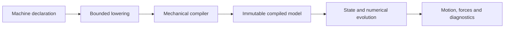
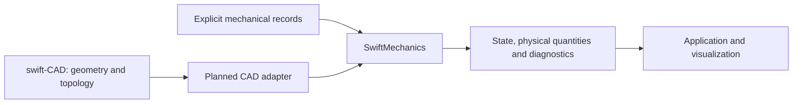

# swift-mechanics

**Declarative engineering mechanics in Swift.**

Describe a machine as a composition of bodies and joints, then compile and evaluate it through explicit mechanical and numerical contracts. The project targets motion, forces, torque, reactions, contact and deformation, with control and optimization built on the same foundations.

The package exposes one public module: `SwiftMechanics`.

## Project status

**Active development.** The declarative foundation and selected mechanics paths are implemented and behaviorally verified. The complete specification contains **210 requirements across 23 domains**; that target is not yet fully implemented or verified. Public APIs are still evolving.

Capability claims are specific to the implemented model, input domain, solver and execution profile. Selected macOS, WASI and Embedded WASI paths have runtime evidence. This does not establish support for every feature on those platforms, browser execution, actual WASI multithreading, Linux or iOS.

Use [PROGRESS.md](PROGRESS.md) and the corresponding component designs to check current implementation and evidence. The feature specification is a target contract, not a list of available features.

## Declarative machines

`Machine` provides a SwiftUI-like composition model through `var body: some Machine` and `MachineBuilder`. The intended authoring model declares bodies and their connections directly inside `body`:

**Target API sketch:** the high-level primitives below are not implemented yet. The authoring surface describes 3D machines without dimensional suffixes. This example illustrates structure; geometry, inertia and initialization inputs are omitted, so it is not a runnable simulation.

```swift
import SwiftMechanics

struct HingeAssembly: Machine {
    var body: some Machine {
        RigidBody("base") {
            RevoluteJoint("hinge", axis: .z) {
                RigidBody("arm")
            }
            .offset(z: 0.1)
        }
        .fixed()
    }
}
```

Declarations should produce immutable mechanical definitions; identity, units, physical parameters and connections are admitted during lowering and compilation. Mutable simulation state belongs to execution owners rather than stored body or joint objects in the declaration.

Nesting expresses articulated structure. Cross-references close loops or connect independent components; named ports express multi-terminal transmissions. Placement, persistent constraints, force laws and runtime engagement have distinct meanings. The declaration tree is not the physical connection graph.

The [declarative authoring design](Sources/SwiftMechanics/Modeling/Machines/DESIGN.md#target-declarative-authoring-contract) owns the structure catalog, coordinate conventions, example syntax, lowering obligations and implementation prerequisites. Its sketches are target design, not a capability claim. Existing planar kernels and low-level records remain part of the specification.

The implemented foundation currently uses `MachineBody` and `MachineJoint` to compose validated records. Its builder supports conditionals, `switch`, optional content, reusable scoped instances, type erasure through `AnyMachine`, and bounded lazy repetition through `ForEachMachine`.

`MachineDefinition` lowers declarations into a descriptor and delegates physical admission to the mechanical compiler. A successfully constructed declaration is not yet a valid compiled model. Simulation steps operate on compiled models and state; they do not reevaluate the declaration.

See the [Machine contract](Sources/SwiftMechanics/Modeling/Machines/DESIGN.md) and [compilation tests](Tests/SwiftMechanicsMachineTests/MachineCompilationTests.swift) for actual compilation, articulated motion, scoped identity and failure behavior.



## Scope

The target includes the following areas. Each area has its own supported subsets and remaining work.

| Area | Target responsibilities |
|---|---|
| Models and kinematics | Units, frames, identity, inertia, joint manifolds, assembly and constraints |
| Dynamics and transmission | Forward and inverse dynamics, gears, drives, passive loads and physical reactions |
| Contact and time evolution | Collision queries, friction, impact, integration and hybrid events |
| Flexible mechanics and analysis | Constitutive laws, elements, equilibrium, vibration and stability |
| Control and optimization | Observations, feedback, derivatives, identification and planning |
| Execution and exchange | State ownership, rollback, checkpoints, replay and bounded model codecs |
| Engineering integration | CAD-derived mechanical input and selected particle, fluid and coupled models |

[SPEC.md](SPEC.md) defines the input domains, failure conditions and acceptance evidence for every requirement. Project Chrono, Simbody, Drake, MuJoCo, Bullet and Rapier inform the scope; the project does not promise complete compatibility with their APIs or extensions.

## CAD and mechanics

Geometry and mechanics have separate authorities. **swift-CAD** is the intended geometry dependency for a separate CAD adapter package. The current core package has no swift-CAD dependency, and CAD integration remains planned.



swift-CAD owns geometry, topology and geometric queries. swift-mechanics owns mechanical interpretation, inertia, joints, constitutive laws and simulation state. Applications own visualization and interaction. A missing CAD query remains a dependency gap rather than becoming a second geometry kernel here.

## Using the package

The development baseline is **Swift 6.4.0**. The manifest declares macOS 13 for the library; individual operations and tests have additional availability requirements. For example, Mutex-based runtime paths require the platform's `Synchronization` support. Deployment declarations alone are not runtime qualification.

Until a release is available, add the current development branch to your Swift package:

```swift
.package(
    url: "https://github.com/1amageek/swift-mechanics.git",
    branch: "codex/specification"
)
```

Add the product to your target's dependencies:

```swift
.product(name: "SwiftMechanics", package: "swift-mechanics")
```

Use `import SwiftMechanics`. Pin a reviewed commit when reproducible integration is required.

## Verification

Run focused Native tests with the repository's timeout wrapper and the pinned toolchain:

```sh
python3 Scripts/run_with_timeout.py 240 \
    swift test --filter SwiftMechanicsMachineTests
```

The package also provides `mechanics-core-verification` and `mechanics-foundation-verification` executables for public API qualification. WebAssembly verification uses matching Swift 6.4.0 SDKs, separate build paths and actual WASI execution. Compile and link success alone do not establish runtime support.

The [Core verification design](Verification/CoreVerification/DESIGN.md) and [Foundation verification design](Verification/FoundationVerification/DESIGN.md) own the exact execution profiles and recorded evidence. Changes to physics require appropriate physical oracles, residuals, conservation or balance checks, and explicit failure tests.

## Documentation and contributions

| Document | Responsibility |
|---|---|
| [PHILOSOPHY.md](PHILOSOPHY.md) | Design values and decision principles |
| [AGENTS.md](AGENTS.md) | Repository workflow and contributor instructions |
| [SPEC.md](SPEC.md) | Functional requirements and acceptance contracts |
| [DESIGN.md](DESIGN.md) | System architecture and child design index |
| [IMPLEMENTATION_PLAN.md](IMPLEMENTATION_PLAN.md) | Requirement ownership, prerequisites and parallel handoffs |
| [PROGRESS.md](PROGRESS.md) | Current implementation progress and qualification |
| [SOURCES.md](SOURCES.md) | Reference observations and dependency investigation |

Contributions should identify the requirement, design owner, supported domain and behavioral evidence they change. Follow the prerequisite graph, preserve other contributors' work, and distinguish a verified subset from completion of an entire requirement.
