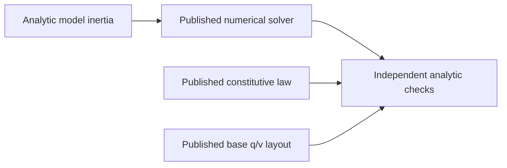

# FoundationVerification

## Purpose and Scope
Parent: [system/package](../../DESIGN.md). Children: none. Root owns this synchronous executable for the IM02/03/04/05/06/07/10/11/18 producer handoff. It exercises real public model, numerical, material, kinematic, load, compiler and collision contracts in one process on exact target profiles. It is not a multibody, contact or element simulator.

## Responsibilities and Boundaries
The executable checks independent analytic mass/inertia, linear solve, tree/Schur reduction, quaternion base layout and constitutive state/stress expectations through the published services. Native test targets own broader local evidence. Root owns target registration and selected-profile compile/link/runtime composition; no library-private storage is accessed.

## Related Designs
| Design | Relationship | Contract used | Summary | Cautions |
|---|---|---|---|---|
| [Root](../../DESIGN.md) | parent | Verified producer handoff | Profile composition evidence | Whole-target IM48 remains separate |
| [Core](../MechanicsCore/DESIGN.md) | depends on | SI values, frames and rotations | Mathematical foundation | No dynamics inferred |
| [Model](../MechanicsModel/DESIGN.md) | depends on | MassPropertyCalculating, base layout | Analytic mass and q/v admission | Model graph compiler remains downstream |
| [Numerics](../MechanicsNumerics/DESIGN.md) | depends on | LinearSolving, TreeLinearSolving, SchurSolving | Original-residual accepted solves | Generic tree reduction is not articulated-body dynamics |
| [Materials](../MechanicsMaterials/DESIGN.md) | depends on | LinearElasticResponding, HyperelasticResponding, PlasticResponding | Qualified stress and history | No element formulation or universal material claim |

## Architecture

## Contracts and Invariants
Every check calls actual production code. Nonzero exit is required for unexpected failure or failed analytic expectation. Expected invalid model/capability requests must throw. The admitted Float64 and Float32 paths execute independently with explicit tolerances/budgets, not a backend substitution.

The AF04 Loads extension is executed on the profiles recorded below. It exercises Loads through required service methods: polynomial spring/damper force and energy, affine gravity force and potential, straight affine-waypoint cable derivatives and pulling work, a pure custom provider with independent derivative/energy admission, and point-force mapping on the existing articulated hinge. Compiler checks compile a two-body spatial descriptor through MechanicalModelCompiling, inspect actual motion/layout/structural pattern, and require stale-state and inconsistent-source-pose failure. The requested CompilerTarget label follows the actual compile target in a stateless entry-point adapter. Collision checks call real framed sphere/box/plane witnesses, conservative discovery, geometric manifold continuation, translating moving-plane CCD and typed unsupported-pair failure. Compiler also invokes a pure concrete extension validator through its required validate method and checks independently bounded returned work; this qualifies descriptor admission, not force execution. The executed selected-profile scope is recorded below. This extends selected operation coverage only; full dynamics, contact response and undeclared law domains remain separate.

The PG03 extension executes a budgeted cubic equation through NonlinearSolving, independently checks its root and rejects a false internal residual. It solves an analytic orthant problem and associated friction cone through ComplementaritySolving, including validated warm restart and stale identity rejection. Kinematic service checks exercise a fixed-root offset hinge, analytic point motion/Jacobian/virtual power, spherical q-v dimensions and stale-state failure propagation through public protocols; the Native test owner checks the exact JointError case. These operations extend the probe scope; the actual selected-profile results are recorded below.

## State, Ownership, and Lifecycle
Only immutable input/response values and synchronous local variables exist. No shared mutable storage, async stream, pointer, persistent state or target-specific synchronization branch is introduced.

## Failure, Concurrency, and Constraints
Root translates an unexpected verification operation failure to FoundationVerificationError and exits with failure. This executable does not alter library failure contracts. Small caller-selected fixture budgets bound solves. Target support is reported only after actual execution; compilation alone is insufficient.

## Verification and Change Impact
Native, WASM and Embedded WASM are separately built with Swift 6.4.0 and matching SDKs, then actually run with a timeout. Node WASI Preview 1 is the WASM runtime, not browser integration. Each child design records the exact evidence scope. A changed consumed API or formula requires rechecking this executable and its relevant native test owner.

### Executed profile evidence (2026-10-03)
Native execution and both separately compiled/linked WASM SDK artifacts exited 0. Exact baseline/runtime identifiers are recorded in the module producer handoffs. This verifies the listed public protocol operations and independent analytical expectations, not whole feature families.

### Exact Embedded provider/link constraints
Swift 6.4.0 release Embedded witness specialization asserts for a nongeneric equation provider whose associated scalar is concretely Double. An isolated one-requirement protocol with BinaryFloatingPoint & Sendable scalar reproduces the same assertion without this library or error/solver machinery. A generic provider specialized to Double compiles; RuntimeCubicEquation uses that same mathematical/protocol path on every profile. Evidence therefore qualifies the exercised generic provider, not arbitrary conformers. The selected Embedded package invocation adds --traits EmbeddedUnicode so Swift String hashing/comparison links the SDK-provided tables. Native and ordinary WASM omit that trait. These constraints do not change physical laws, precision, identity equality, state or synchronization.

### PG03 executed profile evidence (2026-10-03)
The final generic provider and link profile compiled/linked and actually executed with exit 0 on Native, swift-6.4.0-RELEASE_wasm and swift-6.4.0-RELEASE_wasm-embedded (--traits EmbeddedUnicode). Node.js 24.19.0 WASI Preview 1 ran each WASM artifact independently. Every listed numerical/kinematic analytic and failure check executed. The package Native run passed 77 tests; after the explicit Complementarity import correction its affected eight tests passed again. Compiler warnings were an unused clang -rdynamic argument and a test's unnecessary try; neither establishes a physics/backend claim. The Embedded-only failed nongeneric experiment is excluded from qualified provider coverage rather than hidden by a different numerical implementation.

### AF04 Loads executed profile evidence (2026-10-03)
The selected Loads extension and canonically equivalent Unicode frame-ID equality/dictionary hashing compiled/linked and actually ran with exit 0 on Native, ordinary WASM and Embedded WASM. Commands used Swift 6.4.0 release and exact matching SDK IDs; Embedded retained --traits EmbeddedUnicode. Node.js 24.19.0 WASI Preview 1 executed each WASM artifact. Loads native focused tests passed 12 cases/four suites. Compiler and Collision additions are pending producer freeze and independent composition evidence; they are excluded from this execution claim.

### AF04/05 Compiler and Collision executed composition (2026-10-03)
The registered Native package passed 120 behavioral tests (Compiler 17, Collision 14, Loads 12 and the 77 existing producer cases). Native, ordinary WASM and Embedded WASM separately compiled/linked and actually executed the expanded public-protocol probe with exit 0. The real generic extension provider's required validate callback ran and its independent 12-operation/one-scalar evidence was checked. Compiler admission/motion/pattern and exact expected stale/pose failures, analytic witnesses/discovery/manifold ID continuation, moving-plane TOI enclosing 4/11 s and unsupported-pair rejection all executed. Evidence uses the exact Swift 6.4.0 release and matching SDK IDs; Embedded retained --traits EmbeddedUnicode. A Collision Discovery explicit import correction was followed by its affected three Native tests and the successful Embedded rebuild/run. Native and ordinary WASM mathematical results remain valid because that correction changes only module visibility. Async cancellation is proved in the Native test owner, not inferred for the synchronous WASI probe. Whole-target IM48 remains incomplete.
