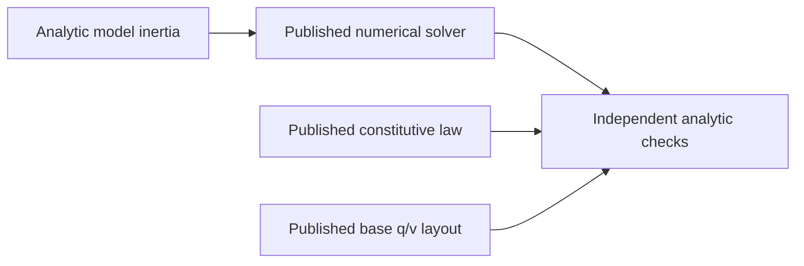

# FoundationVerification

## Purpose and Scope
Parent: [system/package](../../DESIGN.md). Children: none. Root owns this synchronous executable for the IM02/03/04/05/06/07/10/11/15/18 producer handoff. It exercises real public model, numerical, material, kinematic, load, compiler and collision contracts in one process on exact target profiles. It is not a multibody, contact or element simulator.

## Responsibilities and Boundaries
The executable checks independent analytic mass/inertia, linear solve, tree/Schur reduction, quaternion base layout and constitutive state/stress expectations through the published services. Native test targets own broader local evidence. Root owns target registration and selected-profile compile/link/runtime composition; no library-private storage is accessed.

## Related Designs
| Design | Relationship | Contract used | Summary | Cautions |
|---|---|---|---|---|
| [Root](../../DESIGN.md) | parent | Verified producer handoff | Profile composition evidence | Whole-target IM48 remains separate |
| [Core](../MechanicsCore/DESIGN.md) | depends on | SI values, frames and rotations | Mathematical foundation | No dynamics inferred |
| [Model](../MechanicsModel/DESIGN.md) | depends on | MassPropertyCalculating, base layout | Analytic mass and q/v admission | Model graph compiler remains downstream |
| [Integration](../MechanicsIntegration/DESIGN.md) | depends on | ExplicitIntegrating, SmoothODEEquations, IntegrationContinuationProvider | Real RK4/Heun-Euler transactions and restart | Euclidean manufactured ODE only |
| [Exchange](../MechanicsExchange/DESIGN.md) | depends on | NativeModelCoding, NativeModelLoading | SMNX records and required compiler callback | Opaque assets have no physical geometry qualification |
| [Numerics](../MechanicsNumerics/DESIGN.md) | depends on | LinearSolving, TreeLinearSolving, SchurSolving | Original-residual accepted solves | Generic tree reduction is not articulated-body dynamics |
| [ContactLaws](../MechanicsContactLaws/DESIGN.md) | depends on | ContactMaterialPairing, ContactLawEvaluating, ContactImpactPredicting | Normal/friction/cohesion/resistance law and scalar restitution | Constitutive prediction only; no coupled response or impact trajectory |
| [Flexible](../MechanicsFlexible/DESIGN.md) | depends on | TetrahedralMeshValidating, TetrahedralAssembling | Affine force/energy, mass/damping, refinement and failure | Closed homogeneous constant-F tetrahedra only |
| [Dynamics](../MechanicsDynamics/DESIGN.md) | depends on | RigidEquationComputing, RigidDynamicsSolving | Offset-COM pendulum, passive-load work, independent residual and failure | Admitted spatial dense equations only; no trajectory/contact proof |
| [Materials](../MechanicsMaterials/DESIGN.md) | depends on | LinearElasticResponding, HyperelasticResponding, PlasticResponding | Qualified stress and history | No element formulation or universal material claim |

## Architecture

## Contracts and Invariants
Every check calls actual production code. Nonzero exit is required for unexpected failure or failed analytic expectation. Expected invalid model/capability requests must throw. The admitted Float64 and Float32 paths execute independently with explicit tolerances/budgets, not a backend substitution.

The AF04 Loads extension is executed on the profiles recorded below. It exercises Loads through required service methods: polynomial spring/damper force and energy, affine gravity force and potential, straight affine-waypoint cable derivatives and pulling work, a pure custom provider with independent derivative/energy admission, and point-force mapping on the existing articulated hinge. Compiler checks compile a two-body spatial descriptor through MechanicalModelCompiling, inspect actual motion/layout/structural pattern, and require stale-state and inconsistent-source-pose failure. The requested CompilerTarget label follows the actual compile target in a stateless entry-point adapter. Collision checks call real framed sphere/box/plane witnesses, conservative discovery, geometric manifold continuation, translating moving-plane CCD and typed unsupported-pair failure. Compiler also invokes a pure concrete extension validator through its required validate method and checks independently bounded returned work; this qualifies descriptor admission, not force execution. The executed selected-profile scope is recorded below. This extends selected operation coverage only; full dynamics, contact response and undeclared law domains remain separate.

The PG03 extension executes a budgeted cubic equation through NonlinearSolving, independently checks its root and rejects a false internal residual. It solves an analytic orthant problem and associated friction cone through ComplementaritySolving, including validated warm restart and stale identity rejection. Kinematic service checks exercise a fixed-root offset hinge, analytic point motion/Jacobian/virtual power, spherical q-v dimensions and stale-state failure propagation through public protocols; the Native test owner checks the exact JointError case. These operations extend the probe scope; the actual selected-profile results are recorded below.

The IM15 extension assembles an offset-COM hinge with actual supplied generalized velocity and deliberately nonzero snapshot acceleration. It checks mass/bias/gravity separately, adds a published passive damper response, solves forward/inverse/mass-only/mixed equations through protocol requirements, and verifies independent physical residual plus kinetic/potential/dissipation rates. It rejects mismatched velocity and nonuniform gravity explicitly. Each operation retains separate cumulative NumericalWork and LoadWork. Exact-profile results are recorded only after execution.

The IM19 extension validates a frame-identified tetrahedron, assembles actual polynomial-hyperelastic energy gradient, tangent and reference mass/damping, and independently checks an affine uniaxial patch. It verifies force covariance under rotation, centroid refinement energy/mass preservation and exact frame/inversion failure. Constitutive invocation and numerical arithmetic ledgers remain distinct. Actual profile evidence is recorded after execution.

The IM20 extension combines explicit material pairs and executes linear/Hertz/Hunt-Crossley, history-bearing static/sliding/release friction, rolling/spinning resistance and finite-range cohesion through required service witnesses. Independent force/energy/power/ellipse expectations and separate threshold restitution predictions are checked. Stale geometry and incompatible normal-loss selection must fail. These constitutive checks do not qualify a coupled contact solve or a drop trajectory.

## State, Ownership, and Lifecycle
Only immutable input/response values and synchronous local variables exist. No shared mutable storage, async stream, pointer, persistent state or target-specific synchronization branch is introduced.

## Failure, Concurrency, and Constraints
Root translates an unexpected verification operation failure to FoundationVerificationError and exits with failure. This executable does not alter library failure contracts. Small caller-selected fixture budgets bound solves. Target support is reported only after actual execution; compilation alone is insufficient.

## Verification and Change Impact
Native, WASM and Embedded WASM are separately built with Swift 6.4.0 and matching SDKs, then actually run with a timeout. Node WASI Preview 1 is the WASM runtime, not browser integration. Each child design records the exact evidence scope. A changed consumed API or formula requires rechecking this executable and its relevant native test owner.

### Executed profile evidence (2026-10-03)
Native execution and both separately compiled/linked WASM SDK artifacts exited 0. Exact baseline/runtime identifiers are recorded in the module producer handoffs. This verifies the listed public protocol operations and independent analytical expectations, not whole feature families.

### Exact Embedded provider/link constraints
Swift 6.4.0 release Embedded witness specialization asserts for a nongeneric equation provider whose associated scalar is concretely Double. An isolated one-requirement protocol with BinaryFloatingPoint & Sendable scalar reproduces the same assertion without this library or error/solver machinery. A generic provider specialized to Double compiles; RuntimeCubicEquation uses that same mathematical/protocol path on every profile. Evidence therefore qualifies the exercised generic provider, not arbitrary conformers. The selected Embedded package invocation adds --traits EmbeddedUnicode so Swift String hashing/comparison links the SDK-provided tables. Native and ordinary WASM omit that trait. These constraints do not change physical laws, precision, identity equality, state or synchronization.

### PG03 executed profile evidence (2026-10-03)
The final generic provider and link profile compiled/linked and actually executed with exit 0 on Native, swift-6.4.0-RELEASE_wasm and swift-6.4.0-RELEASE_wasm-embedded (--traits EmbeddedUnicode). Node.js 24.19.0 WASI Preview 1 ran each WASM artifact independently. Every listed numerical/kinematic analytic and failure check executed. The package Native run passed 77 tests; after the explicit Complementarity import correction its affected eight tests passed again. Compiler warnings were an unused clang -rdynamic argument and a test's unnecessary try; neither establishes a physics/backend claim. The Embedded-only failed nongeneric experiment is excluded from qualified provider coverage rather than hidden by a different numerical implementation.

### AF04 Loads executed profile evidence (2026-10-03)
The selected Loads extension and canonically equivalent Unicode frame-ID equality/dictionary hashing compiled/linked and actually ran with exit 0 on Native, ordinary WASM and Embedded WASM. Commands used Swift 6.4.0 release and exact matching SDK IDs; Embedded retained --traits EmbeddedUnicode. Node.js 24.19.0 WASI Preview 1 executed each WASM artifact. Loads native focused tests passed 12 cases/four suites. Compiler and Collision additions are pending producer freeze and independent composition evidence; they are excluded from this execution claim.

### AF04/05 Compiler and Collision executed composition (2026-10-03)
The registered Native package passed 120 behavioral tests (Compiler 17, Collision 14, Loads 12 and the 77 existing producer cases). Native, ordinary WASM and Embedded WASM separately compiled/linked and actually executed the expanded public-protocol probe with exit 0. The real generic extension provider's required validate callback ran and its independent 12-operation/one-scalar evidence was checked. Compiler admission/motion/pattern and exact expected stale/pose failures, analytic witnesses/discovery/manifold ID continuation, moving-plane TOI enclosing 4/11 s and unsupported-pair rejection all executed. Evidence uses the exact Swift 6.4.0 release and matching SDK IDs; Embedded retained --traits EmbeddedUnicode. A Collision Discovery explicit import correction was followed by its affected three Native tests and the successful Embedded rebuild/run. Native and ordinary WASM mathematical results remain valid because that correction changes only module visibility. Async cancellation is proved in the Native test owner, not inferred for the synchronous WASI probe. Whole-target IM48 remains incomplete.

### IM15 executed composition (2026-10-03)
The Dynamics extension separately compiled/linked and executed with exit0 on Native and both exact Swift 6.4.0 release WASM SDKs; Embedded retained --traits EmbeddedUnicode. Node.js 24.19.0 WASI Preview 1 independently ran each WASM artifact. Every listed pendulum/load/scaled solve/energy and exact failure check executed through public required methods. Dynamics Native focused proof passed ten tests; the prior 120-test cohort evidence is unchanged and is not mislabeled as a new 130-test whole-package run. WorldRigidBody's explicit Model import correction affects visibility only. Whole-target IM48 and subsequent Runtime/ContactLaws composition remain incomplete.

### IM19/IM20 selected-profile composition evidence
The expanded registered package passed 154 Native behavioral tests: the previous 120, Dynamics ten, Flexible ten and ContactLaws fourteen. Native and both separately compiled/linked Swift 6.4.0 release WASM SDK artifacts actually executed all listed Flexible/ContactLaws public-service analytic and failure checks with exit 0. Embedded retained --traits EmbeddedUnicode; Node.js 24.19.0 WASI Preview 1 ran both WASM artifacts. No browser, minimum macOS 13, parallel WASI, Runtime, coupled contact or whole-target IM48 qualification follows from these synchronous selected paths.

### Runtime transaction composition scope
The IM08 extension executes a real compiled fixed-root hinge through RuntimeSessionOperating, with required eight-byte counter validation and explicit SplitMix64 continuation. It checks accepted/rejected contributor/random/physical state, independent owners, exact checkpoint round-trip/restart replay, corrupt-prefix preservation and actual transaction counters. An observation lease must reject competing mutation and hold shutdown in draining; the release hook reenters snapshot/shutdown outside locks, then closes once. Mutable probe counters/retained-owner storage use the same Mutex declarations on every target. Runtime methods depending on Mutex/strict UTF8 declare macOS15/iOS18/tvOS18/watchOS11 availability; unsupported Native OS fails this executable instead of skipping the probe. Actual target evidence is recorded after execution; synchronous WASI does not qualify parallel WASI, measured allocator/phase profiling, strong determinism or accepted mechanical evolution.

### IM08 selected-profile composition evidence
The listed Runtime extension separately compiled/linked and actually exited 0 on Native and both exact Swift 6.4.0 release WASM SDK artifacts. Node.js 24.19.0 WASI Preview1 executed each WASM artifact; Embedded retained --traits EmbeddedUnicode. Native focused Runtime evidence is sixteen tests, separate from the prior 154-test cohort rather than a new 170-test whole-package run. The final lifecycle probe captures its Sendable reference owner with identical Mutex fields on all targets; direct escaping capture of a noncopyable Mutex value is rejected by this fixed Embedded compiler. Native/ordinary/Embedded actually exercised the same reentrant release behavior after that probe ownership repair. Full integration IM48 remains incomplete.

### Coupled contact response composition scope
The IM21 extension binds actual collision sphere witnesses and body-local placements to a real prismatic rigid mass operator, current frame/model/geometry revisions and an explicitly paired undamped frictionless linear law. Public required response methods execute one frozen-geometry implicit endpoint step. Independent effective mass, normal force, velocity, finite-interval equivalent impulse, power and original law/cone/momentum/wrench residual expectations are checked. Two dependent contact rows have unique compliant forces while mass rank remains unavailable; a stale collision revision fails. This is a local declared approximation, not a pose integrator, hard impact, frictional grasp, exact Coulomb or tooth-refinement qualification. Actual target evidence is recorded after execution.

### Explicit integration and native exchange composition scope
Integration executes a manufactured constant angular acceleration on an actual compiled revolute chart through required equation witnesses and RuntimeSession transactions. RK4 and adaptive Heun-Euler must reach the independent analytic q=1.25, v=3 at t=0.5 from q=0, v=2. Adaptive rejected trials must preserve random history; checkpoint restart must yield identical accepted state/bytes. Incomplete derivatives must fail and preserve the prefix. Both probe sessions shut down synchronously. Native local tests own observed order and resource/cancellation proof; this synchronous selected path does not imply implicit/manifold integration or parallel WASI.

Exchange executes public SMNX encode/decode/load with current compiler descriptors, an explicit dimensioned stiffness extension and a retained opaque inline asset with Unicode provenance. The injected required compiler validator must actually return its checked work evidence; loaded kinematics must retain angular velocity. Malformed headers and a zero wire budget must fail explicitly. This qualifies the selected current-record wire/load path, not external file I/O, CAD geometry or foreign formats. These additions are pending compile/link/runtime proof and do not extend previous execution claims.

Fixed Swift 6.4.0 Embedded debug code allocates large static frames for these value-rich fixtures. Setup, initial-step, continuation and expected-failure checks therefore execute through separate non-inlined synchronous functions, with a single operation-owned immutable context. Setup temporaries leave the stack before integration begins; sessions still use the same required providers and Mutex owners. This source decomposition preserves the original runtime memory/stack profile, numerical methods and assertions. A private diagnostic relocation of stack memory is causal investigation only and is never shipped or counted as the supported profile.

### AF09 executed composition evidence (2026-10-04)
Native and separately compiled/linked ordinary and Embedded WASM artifacts actually exited 0 with every new Integration, ContactResponse and Exchange check listed above. Exact Swift6.4.0 release/matching SDKs, EmbeddedUnicode and Node24.19.0 WASI Preview1 remain unchanged. Contact's monolithic fixed frame (95,920 bytes Embedded; 99,600 ordinary) caused stack corruption; its phased solve measures 7,248 bytes with a largest phase 24,464 bytes on the failing-debug-profile investigation. A subsequent Embedded Integration chain held 101,616 bytes in four caller frames before lower compiler/kinematics calls. Instruction-identical private stack relocation isolated each failure; production trial and probe setup/check phases now release temporaries before nested admission. The final original-stack profiles actually pass. These are causal source repairs, not allocator/latency benchmarks or alternate memory settings.

Native registered-cohort execution covered 205 tests: 204 passed and one invalid fixed-joint authority fixture failed. Correcting that fixture was followed by all sixteen Exchange tests passing. The subsequent Integration phase change was followed by its nine tests passing. Contact's ten tests and unchanged supplier tests retain their cohort evidence; this is composite evidence with focused rechecks, not a claimed new all-205 execution. Root's coherent source/contract review and findings-limited rechecks cover the final handoff. Whole-target IM48 remains incomplete.
