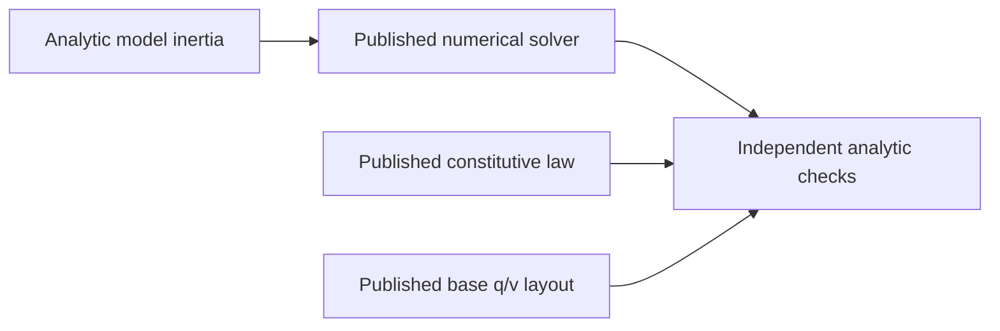

# FoundationVerification

## Purpose and Scope
Parent: [system/package](../../DESIGN.md). Children: none. Root owns this synchronous executable for the IM02/03/18 producer handoff. It exercises real public model, numerical and material contracts in one process on exact target profiles. It is not a multibody, contact or element simulator.

## Responsibilities and Boundaries
The executable checks independent analytic mass/inertia, linear solve, tree/Schur reduction, quaternion base layout and constitutive state/stress expectations through the published services. Native test targets own broader local evidence. Root owns target registration and selected-profile compile/link/runtime composition; no library-private storage is accessed.

## Related Designs
| Design | Relationship | Contract used | Summary | Cautions |
|---|---|---|---|---|
| [Root](../../DESIGN.md) | parent | Verified producer handoff | Profile composition evidence | Whole-target IM48 remains separate |
| [Core](../MechanicsCore/DESIGN.md) | depends on | SI values, frames and rotations | Mathematical foundation | No dynamics inferred |
| [Model](../MechanicsModel/DESIGN.md) | depends on | MassPropertyCalculating, base layout | Analytic mass and q/v admission | Model graph compiler remains downstream |
| [Numerics](../MechanicsNumerics/DESIGN.md) | depends on | LinearSolving, TreeLinearSolving, SchurSolving | Original-residual accepted solves | Generic tree reduction is not articulated-body dynamics |
| [Materials](../MechanicsMaterials/DESIGN.md) | depends on | LinearElasticResponding, HyperelasticResponding, PlasticResponding | Qualified stress and history | No element formulation or universal material claim |

## Architecture

## Contracts and Invariants
Every check calls actual production code. Nonzero exit is required for unexpected failure or failed analytic expectation. Expected invalid model/capability requests must throw. The admitted Float64 and Float32 paths execute independently with explicit tolerances/budgets, not a backend substitution.

## State, Ownership, and Lifecycle
Only immutable input/response values and synchronous local variables exist. No shared mutable storage, async stream, pointer, persistent state or target-specific synchronization branch is introduced.

## Failure, Concurrency, and Constraints
Root translates an unexpected verification operation failure to FoundationVerificationError and exits with failure. This executable does not alter library failure contracts. Small caller-selected fixture budgets bound solves. Target support is reported only after actual execution; compilation alone is insufficient.

## Verification and Change Impact
Native, WASM and Embedded WASM are separately built with Swift 6.4.0 and matching SDKs, then actually run with a timeout. Node WASI Preview 1 is the WASM runtime, not browser integration. Each child design records the exact evidence scope. A changed consumed API or formula requires rechecking this executable and its relevant native test owner.

### Executed profile evidence (2026-10-03)
Native execution and both separately compiled/linked WASM SDK artifacts exited 0. Exact baseline/runtime identifiers are recorded in the module producer handoffs. This verifies the listed public protocol operations and independent analytical expectations, not whole feature families.
