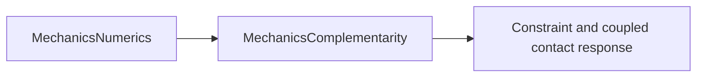

# MechanicsComplementarity

## Purpose and Scope
Parent: [system/package](../../DESIGN.md). Responsibility IM05: contact numerical complementarity/cone solve and revision-aware value-owned continuation cache, requirements SO-004/005 in [SPEC](../../SPEC.md). Children: [Problem](Problem/DESIGN.md), [Projection](Projection/DESIGN.md), [Solve](Solve/DESIGN.md). Each establishes its contract before source and records behavioral handoff. Full feature/platform closure remains the task-level integration responsibility.

## Responsibilities and Boundaries
Contact numerical complementarity/cone solve and revision-aware value-owned continuation cache. Components own admitted domains, original-equation acceptance and explicit failure. Constraint and coupled contact response consume public contracts and own their mechanical graph, runtime state, physical formulation and composition.

## Related Designs
| Design | Relationship | Contract used | Summary | Cautions |
|---|---|---|---|---|
| [Root](../../DESIGN.md) | parent | Work ownership and SPEC requirements | Single-writer package composition | No placeholder capability claims |
| [MechanicsNumerics](../MechanicsNumerics/DESIGN.md) | depends on | Operator, linear solve, scalar, tolerance, budget and termination records | Verified producer handoff at commit 7f72ee4 | Only documented admitted domains/profile paths are qualified |
| [Problem](Problem/DESIGN.md) | child | Admitted numeric cone problem, identities and cache values | Component owns source and local proof | Detailed contract is authoritative |
| [Projection](Projection/DESIGN.md) | child | Explicit cone projection and dual feasibility | Component owns source and local proof | Detailed contract is authoritative |
| [Solve](Solve/DESIGN.md) | child | Bounded projected solve and independent optimality evidence | Component owns source and local proof | Detailed contract is authoritative |

## Architecture

Component internals remain directory-owned. Dependencies above are the real planned target imports; source/test paths are disjoint from other PG03 owners. Root alone registers targets when actual source exists.

## Contracts and Invariants
Contracts inherit SPEC section 2. Public service protocols declare all callable operations as requirements. Numerical output carries original-equation/domain evidence; unavailable metrics and unsupported capability are explicit. No consumer reaches another scope's private workspace or mutates its state. Component designs own precise coordinates, equations, derivative assumptions and falsifiable guarantees.

## State, Ownership, and Lifecycle
Use immutable Sendable records and exclusively operation-owned workspace. Caches and trial state are caller-owned values; runtime acceptance/checkpoint lifetime remains IM08. Any genuinely shared mutable reference storage requires identical Mutex/actor and Sendable contracts on Native, WASM and Embedded before implementation.

## Failure, Concurrency, and Constraints
Typed errors propagate invalid inputs, original-residual disagreement, numerical/domain failure, cancellation and exhausted policy. Tolerances, capacity/work limits and supported algorithm/profile choices are explicit caller policy. No precision, physical-model or backend substitution is silent.

## Verification and Change Impact
Tests/MechanicsComplementarityTests owns analytic/manufactured success, actual failure and applicable coordinate/power/domain proofs. Root owns combined compile/link/runtime composition and exact-profile evidence. Changed child contracts invalidate only affected clients; whole mechanisms and the 210-requirement closure remain unverified until their owning integration paths execute.

### Qualified producer handoff (2026-10-03)
Native focused tests passed 8 behavioral tests on Swift 6.4.0 release/reference CPU. Root's combined package run passed 77 tests across seven targets; this module's implementation path was included. [FoundationVerification](../FoundationVerification/DESIGN.md) then executed Float64/referenceCPU orthant LCP, associated circular cone, independent analytic balances, original acceptance, validated warm cache restoration and stale identity rejection on Native and independently compiled/linked ordinary WASM and Embedded WASM, all with exit 0. Exact SDK IDs are swift-6.4.0-RELEASE_wasm and swift-6.4.0-RELEASE_wasm-embedded; WASI runtime is Node.js 24.19.0 Preview 1. Embedded invocation selects the documented EmbeddedUnicode link trait. Profile evidence is limited to those exercised operations; Native broader branch coverage does not transfer to another target. Full downstream mechanical feature closure and unrelated platforms remain unverified.

Ownership review found immutable Sendable public descriptors/results and synchronous operation-owned value workspace only. The nonlinear context is exclusively inout-owned; no shared mutable reference state, target-specific storage/isolation, unchecked conformance, escaping pointer or silent fallback is introduced. There is no claim about the future mutable runtime's race semantics.
