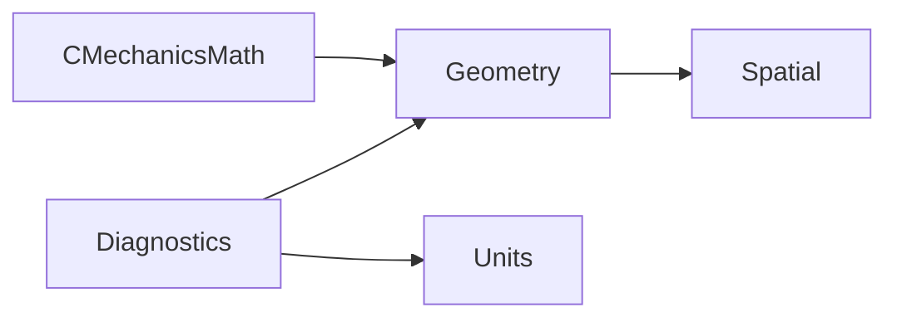

# MechanicsCore

## Purpose and Scope

Parent: [system/package design](../../DESIGN.md). Children: [Diagnostics](Diagnostics/DESIGN.md), [Geometry](Geometry/DESIGN.md), [Spatial](Spatial/DESIGN.md), [Units](Units/DESIGN.md). This module implements IM01 foundational SI, finite-value geometry, manifold orientation and spatial/inertia transformations. It is not a dynamics engine or a complete PF capability claim.

## Responsibilities and Boundaries

Core owns immutable Float64 values, shared physical dimensions and mathematical frame conventions. Models own physical inertia realizability and body/occurrence identity. Numerical modules own general dense/sparse solves. No Foundation, GUI, CAD or mutable global state is required.

## Related Designs

| Design | Relationship | Contract used | Summary | Cautions |
|---|---|---|---|---|
| [Root](../../DESIGN.md) | parent | SPEC MD-002/003, RB-003/005 and IM01 | Foundation supplied to physics scopes | Does not imply full requirement closure for every target |
| [CMechanicsMath](../CMechanicsMath/DESIGN.md) | depends on | System scalar sin/cos/atan2/hypot | Portable libm boundary | Exact target compile/link/runtime must be verified |
| Children above | child | Typed failures, finite geometric values, SI conversion, spatial algebra | Independent component contracts | Each child owns its detailed semantics |

## Architecture

## Contracts and Invariants

Stored numeric values are finite and immutable. Public service interfaces are protocols; callable existential operations are requirements, never extension-only methods. CoreError propagates invalid input and computation overflow; no hidden default/identity/zero fallback is allowed. Value operations use fixed fields, avoiding heap buffers and intermediate arrays. Canonical coordinates are right-handed; quaternion components are w,x,y,z; active R maps source components to destination components.

## State, Ownership, and Lifecycle

All storage is value-owned immutable fields or immutable static constants. There is no publicly shared mutable state, owner/lease or asynchronous resource. Static unit symbols are immutable Strings outside repeated arithmetic paths. No target condition may weaken Sendable/isolation.

## Failure, Concurrency, and Constraints

Checked boundaries throw CoreError. Parallel calls on these value services are independent. Extremely large finite operands can cause a nonFiniteResult even if an arbitrary-precision formulation could solve them; finite input does not promise unlimited numerical range. Caller-supplied tolerances are explicit rather than global guessed constants.

## Verification and Change Impact

Owner: Tests/MechanicsCoreTests and Sources/CoreVerification. Native tests cover analytic transforms, unit mismatch, singular/overflow cases, orientation and power. The headless executable exercises actual protocol requirements on native, WASM and Embedded WASM; compile success alone is insufficient. Interface/convention changes require rechecking all importing module assumptions; published supported subsets and platform evidence stay explicit.

### IM01 foundation handoff evidence (2026-10-03)

- Apple Swift 6.4, compiler tag swift-6.4.0-RELEASE, macOS SDK 27.0, arm64: timeout-wrapped swift test passed 11 behavioral tests in four suites. Package deployment minimum is macOS 13 to match the linked runtime; execution evidence concerns the current machine, not a macOS 13 machine.
- Native CoreVerification exercised every listed service protocol requirement and expected unit/singularity failures, with exit 0.
- swift-6.4.0-RELEASE_wasm and swift-6.4.0-RELEASE_wasm-embedded separately compiled/linked the real CoreVerification. Both artifacts ran with Node.js 24.19.0 WASI Preview 1, with exit 0 and all analytic/protocol/failure checks accepted.
- Production ownership review: all stored numeric/value fields and static constants are immutable. Matrix3.maximumMagnitude is a read-only computed property. No target-specific storage, shared mutable state, unchecked Sendable, unsafe pointer or async resource exists in these components. Concurrency semantics of a future mutable runtime are not certified by this evidence.

This handoff qualifies the foundational contracts needed by IM02/03/18. Full MD/RB model-frame and physics feature closure, Linux/iOS, browser JS integration, GPU and allocation/performance claims are not established. The full 210-requirement goal remains active.
