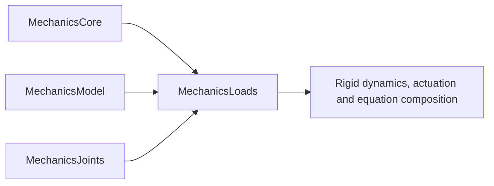

# MechanicsLoads

## Purpose and Scope
Parent: [system/package](../../DESIGN.md). Responsibility IM11: Framed passive force/work contributions, gravity and routed cable derivatives. Component contracts are established before their source and indexed at handoff. The complete target remains governed by [SPEC](../../SPEC.md) and [plan](../../IMPLEMENTATION_PLAN.md).

## Responsibilities and Boundaries
Framed passive force/work contributions, gravity and routed cable derivatives. Rigid dynamics, actuation and equation composition consume published contracts and own subsequent state evolution/physics and integration. Component designs own exact domains, failure guarantees and verification; root alone owns target/manifest and module indexes.

## Related Designs
| Design | Relationship | Contract used | Summary | Cautions |
|---|---|---|---|---|
| [Root](../../DESIGN.md) | parent | Scope, owner and requirement DAG | Single-writer package composition | Full feature closure remains IM48 |
| [MechanicsCore](../MechanicsCore/DESIGN.md) | depends on | Units, geometric/spatial values and explicit frames | Verified producer handoff at f291f24 | Only documented operations/profiles are qualified |
| [MechanicsModel](../MechanicsModel/DESIGN.md) | depends on | Body identity/inertia and provenance | Verified producer handoff at f291f24 | Only documented operations/profiles are qualified |
| [MechanicsJoints](../MechanicsJoints/DESIGN.md) | depends on | Kinematic snapshots and Jacobian transpose/power products | Verified producer handoff at f291f24 | Only documented operations/profiles are qualified |

## Architecture

## Contracts and Invariants
Public service operations are protocol requirements. Accepted records/results satisfy the admitted original invariants, with explicit typed failures identifying unavailable/unsupported capability. Providers and consumers share immutable public values only. A feature declaration or registered callback does not prove its numerical implementation. Component contracts and behavioral tests establish concrete acceptance and failure paths before composition.

## State, Ownership, and Lifecycle
Immutable Sendable inputs/results and exclusively operation-owned mutable value workspace. Shared references require an identical Mutex/actor boundary on every declared target. No target-specific weaker storage/conformance or implicit current-caller isolation is admitted. Evolution/checkpoint acceptance remains IM08.

## Failure, Concurrency, and Constraints
Caller capacity/operation limits and tolerance/domain policy are explicit. Invalid input, incompatible references, cancellation, overflow, unsupported feature and exhausted policy propagate; no partial compiled success, invented force or silent alternate law is returned. Native/ordinary WASM/Embedded evidence is separately qualified with the exact toolchain/SDK/link profile from FoundationVerification.

## Verification and Change Impact
Tests/MechanicsLoadsTests owns actual analytic/manufactured behavior and invalid/failure proofs for its components. Root owns exact-profile runtime composition, integration and local commits. Changed producer assumptions invalidate affected compiler/runtime/dynamics/exchange clients; static structures and successful compilation alone are not mechanical evidence.
