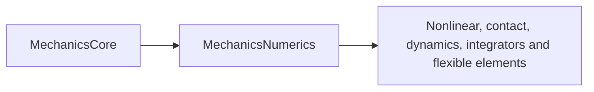

# MechanicsNumerics

## Purpose and Scope

Parent: [system/package](../../DESIGN.md). Ownership: IM03, requirements SO-001/002/006/010 in [SPEC](../../SPEC.md). This module owns linear operators, checked matrix storage, factorization, reduced operations and solve evidence. Children: [LinearAlgebra](LinearAlgebra/DESIGN.md), [Scaling](Scaling/DESIGN.md), [Reduction](Reduction/DESIGN.md). Each component establishes its contract before source; behavior/profile evidence is recorded at handoff. No downstream physics or whole-platform capability is inferred from this module.

## Responsibilities and Boundaries

Linear operators, checked matrix storage, factorization, reduced operations and solve evidence. Components own their exact admitted domains and failure/acceptance rules. Nonlinear, contact, dynamics, integrators and flexible elements consume public contracts and retain their own graph, state, physical formulation and composition authority.

## Related Designs

| Design | Relationship | Contract used | Summary | Cautions |
|---|---|---|---|---|
| [Root](../../DESIGN.md) | parent | Implementation ownership and SPEC IDs | Module composition authority | Full target remains incomplete |
| [Core](../MechanicsCore/DESIGN.md) | depends on | MechanicsCore error/tolerance and finite scalar conventions | Verified foundation, commit ba1ff0c | Handoff certifies Core only; new algorithms require their own actual evidence |
| [LinearAlgebra](LinearAlgebra/DESIGN.md) | child | Operators, factorization and solve evidence | Owns its implementation and behavioral evidence | Its detailed contract is authoritative |
| [Scaling](Scaling/DESIGN.md) | child | Explicit scaling and perturbation policy | Owns its implementation and behavioral evidence | Its detailed contract is authoritative |
| [Reduction](Reduction/DESIGN.md) | child | Schur and generic tree reduction | Owns its implementation and behavioral evidence | Its detailed contract is authoritative |

## Architecture

The target imports MechanicsCore. Component internals stay inside their directory; component composition consumes documented public contracts. Cross-module dependency changes are coordinated through the root package owner.

## Contracts and Invariants

SI, finite-input and explicit failure contracts inherit SPEC section 2. Service protocols declare callable operations as requirements. Every produced response is owned by its caller and includes the qualification needed by its consumers. Component designs own the precise representations, numerical domains and falsifiable guarantees. Partial feature/platform coverage stays explicit.

## State, Ownership, and Lifecycle

Immutable value records and operation-local mutable workspace have no shared mutation. Any reference-owned shared mutable state requires the same Mutex or actor and Sendable/ownership contract on Native, WASM and Embedded; component designs must establish that boundary before source creation. Borrowed storage cannot outlive its owner.

## Failure, Concurrency, and Constraints

Invalid inputs, numerical/domain failure and unsupported formulations are typed failures. No silent precision, physical-model or backend fallback is admitted. Resource limits and tolerances are explicit caller policy where they affect acceptance; estimated constants do not establish correctness.

## Verification and Change Impact

The corresponding Tests/MechanicsNumericsTests owns behavioral evidence for the component contracts. Native tests must exercise actual production operations, success, invalid input and arithmetic/domain failure. Producer handoff records verified algorithms and exact profile evidence. Changed contracts require rechecking their direct clients; compiler, mechanism execution and full target integration remain separate owners.

### Producer handoff evidence (2026-10-03)

10 native tests in three suites passed. The composite executable actually calls existential Float64 LU and certified CSR CG, Float32 Cholesky, tree and Schur reductions, dimensional scaling/recovery and explicit perturbation effect, including rejected precision mismatch on each profile. Arbitrary CSR direct solve, other Float32 paths, articulated mechanical equivalence and device execution remain unverified.

Native: Apple Swift 6.4 compiler tag swift-6.4.0-RELEASE on arm64 macOS 27.0; Testing target arm64e-apple-macos14.0. Root's combined native run passed 40 tests across Core, Model, Numerics and Materials; after explicit dependency-import corrections, the affected 10 Numerics tests passed again. FoundationVerification exited 0 on Native and separately compiled/linked artifacts for swift-6.4.0-RELEASE_wasm and swift-6.4.0-RELEASE_wasm-embedded, both executed with Node.js 24.19.0 WASI Preview 1. These are selected real API runtime paths; they do not certify every branch, browser, Linux/iOS, GPU or a whole mechanical simulation.

Ownership review: immutable Sendable values and operation-local workspace. Numerics' mutable NumericalWork is a value owned by the current operation and mutated through exclusive inout; no reference-owned shared state, target-dependent storage/conformance, unsafe pointer or unchecked isolation bypass exists. No synchronization was removed for Embedded. Runtime sessions and shared mutable state remain future owners.
