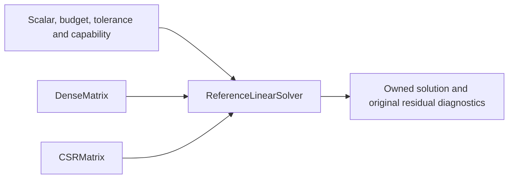

# Linear algebra

## Purpose and Scope

Parent: [MechanicsNumerics](../DESIGN.md). Owns the IM03 SO-001/010 baseline and shared numerical contracts consumed by IM04/05. Scalar profiles are explicit `Float` (binary32) and `Double` (binary64), CPU reference only.

## Responsibilities and Boundaries

Owns checked row-major dense and canonical sorted CSR matrices, operator multiplication, LU with row partial pivoting, SPD Cholesky, sparse SPD conjugate gradient, original-equation residual acceptance, and immutable diagnostics. Caller owns physical equation identity, units, layout and tolerance selection. No nonlinear algorithm, physical model, device backend, preconditioner or articulated dynamics is supplied.

## Related Designs

| Design | Relationship | Contract Used | Summary | Cautions |
|---|---|---|---|---|
| [Core](../../MechanicsCore/DESIGN.md) | depends on | finite scalar conventions | Foundation | Numerical policy is caller-owned |
| [Reduction](../Reduction/DESIGN.md) | used by | checked operators/solves | reduced equation composition | rank failure propagates |
| [Scaling](../Scaling/DESIGN.md) | used by | dense representation/residual evidence | explicit equation perturbation | original residual differs from perturbed residual |

## Architecture

## Contracts and Invariants

`LinearOperating` and `LinearSolving` declare operations as protocol requirements. `NumericalTermination`, `NumericalError`, `NumericalBudget`, `NumericalWork`, `LinearTolerance`, `LinearCapability` and `ResidualEvidence` are shared records; downstream nonlinear/contact solvers can use them without importing either implementation. Tree no-pivot breakdown and nonsymmetry classify unsupported algorithm domain, not a proof of original matrix singularity/indefiniteness. Rows are equation coordinates, columns are unknown coordinates; multiplication is A*x. Dimensions and canonical CSR offsets/strictly increasing columns are validated. Dense general systems use LU, row swaps only, natural column ordering; SPD systems use Cholesky and must pass exact symmetry plus tolerance-qualified positive pivot checks. The admitted sparse CG profile is exactly symmetric, strictly positively diagonally dominant CSR; that sufficient SPD certificate is checked before every solve, including zero RHS. Other CSR matrix classes are unsupported. Iteration additionally checks positive curvature on each traversed direction. All algorithms execute in the selected scalar. Requested backend/precision/algorithm is validated before solving. Rank diagnostics are threshold-qualified; singular LU runs column-skipping elimination to report the numerical rank of its work matrix. CG reports iteration count and no factorization or rank certificate. Successful solves independently recompute infinity-norm residual against the supplied original A and b, using the caller's absolute plus relative tolerance and reference scale max(||Ax||inf, ||b||inf). Zero RHS remains subject to absolute tolerance. A scalar residual norm requires dimensionless rows or one common equation dimension; heterogeneous physical rows must be nondimensionalized first. Diagnostics disclose factorization, pivoting, ordering, backend, precision, operations, workspace and original residual.

## Runtime Flows

Validate capability/input -> check storage -> factor/iterate with work charges -> solve -> recompute original residual -> accept or throw. An exhausted budget never returns a partial successful solution.

## State, Ownership, and Lifecycle

Immutable Sendable value records own COW arrays. Every solve owns its mutable workspace and returns owned arrays; no shared mutable caches, global state, unsafe pointers, or platform-dependent isolation are used. Matrix input ownership lasts through the synchronous operation. Cancellation is checked at bounded iteration/factorization safe points.

## Failure, Concurrency, and Constraints

Invalid dimensions, nonfinite inputs/results, numerical rank loss, nonpositive curvature/pivots, unsupported capability, cancellation and exhausted caller budgets are typed failures. CG allocates its image workspace once before iteration and multiplies into that owned buffer; no per-iteration array materialization is used. Public operator/result boundaries allocate their owned output once. No fallback changes precision, backend or algorithm. Checked products precede allocation; conservative simultaneous scalar workspace and arithmetic work are charged before use. The caller chooses resource limits and tolerances. Independent calls share no mutable state.

## Verification and Change Impact

[Test owner](../../../Tests/MechanicsNumericsTests) checks manufactured SPD and indefinite saddle systems, singular numerical rank, CSR equivalence, selected Float32 differential error, unsupported requests, finite/shape/index/overflow failures, cancellation and storage/work/iteration exhaustion. Native behavioral proof does not qualify WASM/Embedded or GPU. Changes to shared records require IM04/05 consumer review.
