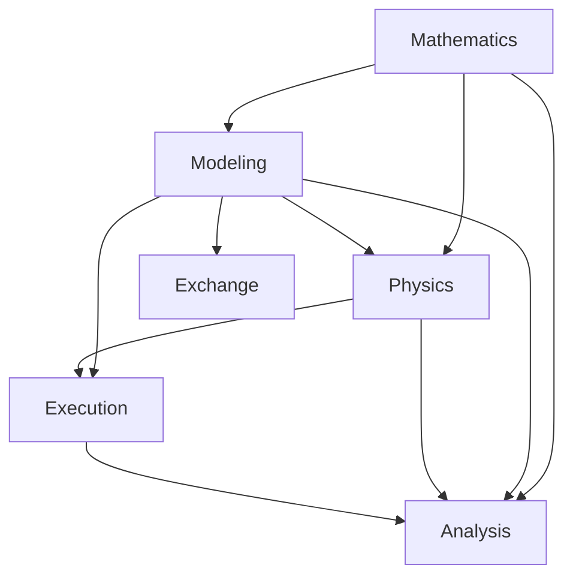

# SwiftMechanics

## Purpose and Scope
The single public SwiftPM mechanics module, preserving the complete requirement scope. Parent: [system/package](../../DESIGN.md). Children: [Mathematics](Mathematics/DESIGN.md), [Modeling](Modeling/DESIGN.md), [Physics](Physics/DESIGN.md), [Execution](Execution/DESIGN.md), [Analysis](Analysis/DESIGN.md), [Exchange](Exchange/DESIGN.md).

## Responsibilities and Boundaries
Composes Mathematics, Modeling, Physics, Execution, Analysis and Exchange. CAD and foreign backend dependencies belong to separate adapter packages. Child contracts own each operation and failure domain. Consumers depend on published protocols and admitted immutable records. Internal visibility is not permission to bypass validation.

## Related Designs
| Design | Relationship | Contract used | Cautions |
|---|---|---|---|
| [system/package](../../DESIGN.md) | parent | Composition and dependency authority | Changed assumptions require parent requalification |
| [Mathematics](Mathematics/DESIGN.md) | child | Published responsibility contracts | Admission authority remains with its owner |
| [Modeling](Modeling/DESIGN.md) | child | Published responsibility contracts | Admission authority remains with its owner |
| [Physics](Physics/DESIGN.md) | child | Published responsibility contracts | Admission authority remains with its owner |
| [Execution](Execution/DESIGN.md) | child | Published responsibility contracts | Admission authority remains with its owner |
| [Analysis](Analysis/DESIGN.md) | child | Published responsibility contracts | Admission authority remains with its owner |
| [Exchange](Exchange/DESIGN.md) | child | Published responsibility contracts | Admission authority remains with its owner |

## Architecture

These arrows consume semantic child contracts inside one compiler-enforced SwiftPM module. Physics equation suppliers expose bounded operations; Execution alone publishes accepted session state. Analysis may consume admitted snapshots without mutating Runtime. Exchange compiles validated input through Modeling. Machine lowering is model construction. Scoped IDs are resolved before actual compilation; no declarative tree remains in the stepping loop. Adapter packages consume the public module and own CAD, foreign ABI and environment dependencies.

The approved high-level authoring direction is [owned by Modeling/Machines](Modeling/Machines/DESIGN.md#target-declarative-authoring-contract). It adds structural declarations and relationship bindings without moving equation authority into the builder or accepted-state authority out of Execution. Current Machine lowering emits body/joint records only; the broader draft and capability bindings remain planned. This target authoring surface is 3D; existing planar mechanics contracts remain intact.

## Contracts and Invariants
Preserve units, frames, stable identity, original residual acceptance and bounded caller policy. No partial result is published as success. Lower contracts retain their documented capability limits. AnyMachine preserves concrete lowering behind an immutable non-associated box; TupleMachine uses typed binary composition with buildPartialBlock at macOS 13 deployment baseline. Physical identity uses explicit IDs and scoped instances, not structural tuple paths.

## State, Ownership, and Lifecycle
Immutable Sendable values are shared; mutable workspace belongs to the documented operation/session owner. Mutex or actor protection and Sendable requirements are identical on Native, WASM and Embedded. Borrowed data cannot outlive its retained owner. Declaration expansion occurs during model construction, not a simulation step.

## Failure, Concurrency, and Constraints
Invalid values, exhausted capacity, cancellation, incompatible model identity and unsupported domains propagate typed failures. Caller budgets bound the admitted operation; plain Swift result-builder loops materialize before lowering and require caller-side construction bounds. No silent alternate physical law is selected.

## Verification and Change Impact
Responsibility-specific Tests targets own child behavior. Package verification runs the actual public path on each declared fixed toolchain/SDK profile. Recheck affected upper consumers after a lower contract changes. Migration requires consolidated Native behavioral tests and matching WASM/Embedded execution; compile success alone is not qualification.
