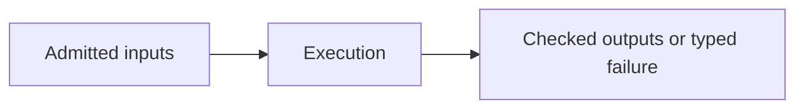

# Execution

## Purpose and Scope
Trial ownership, cancellation, time integration, sampled control and atomic accepted-state publication. Parent: [SwiftMechanics](../DESIGN.md). Children: [Runtime](Runtime/DESIGN.md), [Integration](Integration/DESIGN.md), [Hybrid](Hybrid/DESIGN.md), [Control](Control/DESIGN.md).

## Responsibilities and Boundaries
Trial ownership, cancellation, time integration and atomic accepted-state publication. Child contracts own each operation and failure domain. Consumers depend on published protocols and admitted immutable records. Internal visibility is not permission to bypass validation.

## Related Designs
| Design | Relationship | Contract used | Cautions |
|---|---|---|---|
| [SwiftMechanics](../DESIGN.md) | parent | Composition and dependency authority | Changed assumptions require parent requalification |
| [Runtime](Runtime/DESIGN.md) | child | Its documented assumption/guarantee | Preserve documented capability limits |
| [Integration](Integration/DESIGN.md) | child | Its documented assumption/guarantee | Preserve documented capability limits |
| [Hybrid](Hybrid/DESIGN.md) | child | Its documented assumption/guarantee | Preserve documented capability limits |
| [Control](Control/DESIGN.md) | child | Sampled physical control through original Runtime and Integration | Runtime alone commits; selected initial plant and clock domains remain explicit |

## Architecture

## Contracts and Invariants
Preserve units, frames, stable identity, original residual acceptance and bounded caller policy. No partial result is published as success. Lower contracts retain their documented capability limits. Runtime trial controls and accepted states require owner-issued construction/binding authority.

## State, Ownership, and Lifecycle
Immutable Sendable values are shared; mutable workspace belongs to the documented operation/session owner. Mutex or actor protection and Sendable requirements are identical on Native, WASM and Embedded. Borrowed data cannot outlive its retained owner. Declaration expansion occurs during model construction, not a simulation step.

## Failure, Concurrency, and Constraints
Invalid values, exhausted capacity, cancellation, incompatible model identity and unsupported domains propagate typed failures. Caller budgets bound the admitted operation; plain Swift result-builder loops materialize before lowering and require caller-side construction bounds. No silent alternate physical law is selected.

## Verification and Change Impact
Responsibility-specific Tests targets own child behavior. Package verification runs the actual public path on each declared fixed toolchain/SDK profile. Recheck affected upper consumers after a lower contract changes. Migration requires consolidated Native behavioral tests and matching WASM/Embedded execution; compile success alone is not qualification.

## Selected checkpointed mechanical co-simulation

Child [CoSimulation](CoSimulation/DESIGN.md) owns exclusive equal-clock two-prismatic held-effort coupling, complete contributor checkpoint/restart, bounded failure prefixes and common Mutex state. Original Native10/public9 succeeds against the matched phase-lifetime repair producer; qualified source and evidence remain in the child design. General concurrent shutdown, total stack bounds, external engines and portable qualification remain open.
