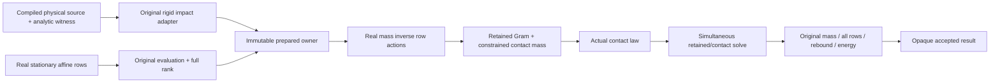

# Constrained Normal Impulse

## Purpose and Scope

This child of [Hybrid](../DESIGN.md) owns one bounded physical responsibility: a single closing, analytic, frictionless normal contact resolved simultaneously with nonempty stationary affine mechanical rows. It prepares immutable source-bound input and accepts a result against the original mass operator, every retained row, and the actual contact law. Native, ordinary WASM and Embedded qualification is pending implementation and execution.

It does not publish Runtime state, wake Sleep, advance time, alter topology, or own checkpoint/RNG/history. Those consumers must preserve their own accepted source and event sequence. Multiple contacts, nonlinear/time-dependent retained rows, prescribed motion, friction, cohesion, resistance and nonunique retained reactions remain explicit typed refusals. This lower domain is a prerequisite of RB007 impact wake, not completion of that requirement.

## Responsibilities and Boundaries

The preparer owns finite admission, original compiled physical source retention, exact retained equation/layout association, stationary affine and initial position/velocity acceptance, and full-row rank admission. The solver owns constrained effective contact mass, simultaneous contact/retained impulse, original physical acceptance and separately reported work ledgers. Existing suppliers retain their physical/numerical algorithms.

No consumer can mint the prepared or accepted owners: their construction is component-private. The prepared owner retains the original `HardImpactInput`, genuine `PreparedImpact`, quadratic system, sampled original rows and admitted policy. A result retains that exact prepared owner, so same model stamp with altered q/v/time, inertia, collision witness or equation cannot be substituted after preparation. The original adapter evaluates the real compiled state and geometrical witness; no synthetic normal row is admitted.

## Related Designs

| Design | Relationship | Contract Used | Summary | Cautions |
|---|---|---|---|---|
| [Hybrid](../DESIGN.md) | parent | Composition boundary | Registers this additive lower impact domain | Upper event/publication work is separate |
| [Impact Ports](../ImpactPorts/DESIGN.md) | depends on | `RigidHardImpactAdapter`, `HardImpactInput`, `PreparedImpact`, `HybridPolicy`, cancellation | Real geometry, compiled source and mass assembly | Adapter stays frozen; its typed failures and work survive |
| [Normal Impulse](../NormalImpulse/DESIGN.md) | coordinates with | Existing independent-contact domain | Old free normal solver remains compatible | Its result is never projected to stand in for this solver |
| [Constraints](../../../Physics/Constraints/DESIGN.md) | depends on | `ConstraintEvaluating`, `ConstraintRankAnalyzing`, quadratic/layout/sample and solve policy | Original equation and rank admission | No inferred dynamic reaction from rank evidence alone |
| [Dynamics](../../../Physics/Dynamics/DESIGN.md) | depends on | `RigidDynamicsSolving`, `RigidEquationComputing`, solve/admission contracts | Real mass inverse and original mass action | No private reporting constructors or copied dynamics |
| [Contact Impact](../../../Physics/ContactLaws/Impact/DESIGN.md) | depends on | `ContactImpactPredicting`, law pair and `ContactWork` | Actual restitution/threshold/lost-energy prediction | Contact logical work is not NumericalWork |
| [Tests](../../../../../Tests/MechanicsConstrainedImpactTests/DESIGN.md) | used by | Public preparation/solve and opaque accepted ownership | Independent physical and refusal evidence | Test design owns the exact oracle |

## Architecture

## Contracts and Invariants

`ConstrainedImpactPreparing.prepare(input:constraints:policy:admission:loadWork:work:cancellation:) throws(ConstrainedImpactError) -> PreparedConstrainedImpact` is the public preparation operation. `ReferenceConstrainedImpactPreparer` consumes injected `RigidEquationComputing`, `ConstraintEvaluating`, and `ConstraintRankAnalyzing`; it invokes the genuine `RigidHardImpactAdapter` rather than an injected alternate geometric adapter. Supplier contracts are qualified assumptions; their reported result shape, source association and original residuals are checked locally.

`ConstrainedNormalImpulseSolving.solve(_:work:contactWork:cancellation:) throws(ConstrainedImpactError) -> ConstrainedNormalImpulseResult` consumes one prepared owner. `ReferenceConstrainedNormalImpulseSolver` injects `RigidDynamicsSolving`, `RigidEquationComputing`, `ContactImpactPredicting`, and `LinearSolving<Double>`. `ConstrainedImpactPolicy` stores `HybridPolicy`, `ConstraintSolvePolicy`, `DynamicsSolvePolicy`, maximum factor entries and minimum positive effective inverse mass. Caller numerical/load/contact budgets remain separate and mandatory.

Admission checks counts/products before traversal or allocation; one contact, scalar fixed-root chart with matching position/velocity coordinates, exact coordinate IDs/dimensions/scales/revision, nonempty rows and finite source/domain are required. All Hessian/mixed/time coefficients must actually be zero, not approximately discarded. Original q and normalized velocity residuals must pass the constraint policy. Full retained row rank and zero reaction nullity are required; redundant/ambiguous reaction domains are refused. Original evaluation preserves row order and IDs.

For physical velocity rows `B = normalizedJacobian / coordinateScale` and actual contact row `J`, compute `G = B M^-1 Bᵀ`, `r = B M^-1 Jᵀ`, `c = J M^-1 Jᵀ`, and `w = c - rᵀ G^-1 r`. Require finite `w` above the policy floor and a genuinely closing speed `J v-`. The actual law receives `0.5 * (J v-)² / w`. Its restitution/rebound/loss must be finite and consistent. Solve the augmented system `[G r; rᵀ c] [lambda; p] = [0; -(1+e) Jv-]` and form `v+ = v- + M^-1(Bᵀ lambda + Jᵀ p)`. No post-contact projection occurs.

Before issuing success independently check original `M(v+ - v-) = Bᵀ lambda + Jᵀ p`, every original retained row at v+, nonnegative p, actual `J v+` equal to predicted rebound, and original kinetic energies/loss/nonincrease. Retained rows use their dimensionless normalization; lambda has energy-times-time units, contact p has linear impulse units, and generalized impulse coordinates use caller `HybridPolicy.impulseScales`. No claim of closed-world body momentum is made: grounded joint support impulses are outside this generalized source law.

The result exposes exact source time/event/row IDs, contact impulse, retained multipliers/generalized reaction, post velocity, pre/post normal speeds, original kinetic energies/lost energy, and normalized momentum/constraint/law/energy residuals. It retains the prepared source owner. q/time are unchanged; there is no accepted-step counter, RNG mutation or Runtime success token here.

## Runtime Flows

Preparation: preflight bounds/cancellation → genuine adapter → real equation evaluation → initial q/v acceptance → actual full-rank evidence → immutable owner. Solve: bounded inverse actions → retained Gram solve → effective mass → real law → simultaneous augmented solve → original full-mass acceptance → final cancellation → immutable result. Rich immutable phase contexts are references; noninline supplier phases finish before future acceptance/publication temporaries exist. No callback executes under a lock.

## State, Ownership, and Lifecycle

Prepared/result owners are immutable `Sendable` references. Suppliers are `Sendable`; ledgers are caller-exclusive inout values. No cache, global mutable owner state or hidden work retry exists. `HybridCancellation` retains its existing common `Mutex` contract on every target. Immutable contexts retain the source/arrays through each synchronous call and release them when the owning operation/result releases. No pointer/view escapes or target-specific raw mutable storage is introduced.

## Failure, Concurrency, and Constraints

`ConstrainedImpactError` stores a typed reason plus `failedSupplierWorkUnavailable`. Reasons preserve original Hybrid/Constraint/Dynamics/Contact/Load/Numerical errors and owner admission/source/residual/rank/unsupported/ledger refusals. Original cancellation is retained even when a supplier also corrupts its ledger; the unavailable flag identifies unknown work. A supplier ledger breach takes priority over non-cancellation physical failure, with the original typed cause retained. No retry is allowed after opaque work failure.

Every injected callback receives a nonzero owner admission charge and a known snapshot before invocation. Numerical/load/contact ledger budgets and monotonically increasing counters/peak storage are checked on success and failure. A reset restores the known admitted prefix and refuses success; no fabricated supplier work is added. Linear solves receive a bounded budget and return actual diagnostics work: successful work is validated and absorbed; a thrown linear failure has no public failed-work report, so its admitted prefix survives and failed work is explicitly unavailable. Load and Contact work are never converted into numerical operations. Capacity failure before a callback does not invoke it.

Let n be velocity count and m retained rows, checked before allocation. Live owner storage is bounded by `O(n² + n(m+1) + (m+1)² + n + m)` plus explicitly reserved supplier workspaces. At most m+1 real mass inverse calls, two linear solves, one contact-law call and three original mass actions occur per solve. Both n² and all Gram/augmented entries must fit `maximumFactorEntries`; caller remaining budgets include owner live storage. The operation count is finite, bounded by these calls and original supplier capacities (dense mass calls may each cost O(n³)). Failure/cancellation retain all known work in its original scope.

## Verification and Change Impact

The dedicated test owner proves actual compiler gear constraints/analytic witness, independent e0/e1 simultaneous impact, original generalized momentum and kinetic/law balance, changed normalization/source refusal, ambiguity/unsupported/blocked/grazing rejection, capacity-before-call, corrupt/failed supplier ledgers and cancellation. Existing free Hybrid behavior remains unchanged. Root owns integrated Native/WASM/Embedded qualification and original 128 KiB stack proof. Future Sleep/Hybrid publication must separately prove accepted checkpoint/event/history/RNG association and atomicity before RB007 can close.
