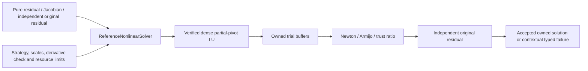

# Nonlinear equation solve

## Purpose and Scope

Parent: [MechanicsNonlinear](../DESIGN.md). Owns IM04 SO-003/007/008/009 baseline: finite square smooth equations, dense Newton directions, Armijo backtracking or clipped-Newton trust region, and independent original-equation acceptance. Native Float64 and Float32 CPU-reference profiles are explicit; no contact/nonlinear-mechanics formulation is inferred.

## Responsibilities and Boundaries

Owns numerical iterates, trial buffers, merit/step acceptance, shared work-budget composition, explicit dense factor-capacity limit and diagnostic availability. The equation provider owns equation identity, domain, correctly differentiated row-major Jacobian and independent original residual. Evaluations are pure with respect to caller accepted state; provider callbacks may only update supplied output and work buffers. No runtime checkpoint or stateful mechanical callback is supplied; IM08 owns those contracts.

## Related Designs

| Design | Relationship | Contract Used | Summary | Cautions |
|---|---|---|---|---|
| [Linear algebra](../../Numerics/LinearAlgebra/DESIGN.md) | depends on | Float scalar, dense LU, numerical budget/work/termination, residual evidence | committed IM03 supplier | tangent singularity is a typed failure; no alternative backend |
| [Module](../DESIGN.md) | parent | ownership and integration boundary | public composition | constraints/runtime/mechanics evidence remains downstream |
| [Tests](../../../../../Tests/MechanicsNonlinearTests/DESIGN.md) | verified by | manufactured equation callbacks | algorithm and failure evidence | fixtures own tolerances |

## Architecture

## Contracts and Invariants

All operations of `NonlinearEquations` and `NonlinearSolving` are protocol requirements. The admitted equation is F(x)=0 with n unknowns and n residuals. Equation identity and coordinate count are captured once as solver-owned metadata; domain/residual/Jacobian callbacks must preserve them, and pre/post checks reject changes. Output length is checked against this captured layout, never a changed provider count. Rows must be dimensionless or have one common residual dimension; a caller-selected finite positive reference scale defines absolute+relative residual acceptance. No step-size convergence flag can bypass independent original residual recomputation. Jacobian entries are dF_i/dx_j in row-major order. The provider's derivative must be exact within caller-selected directional-check tolerance: the solver checks J*p against a forward difference in its computed direction before trial acceptance. Check probe size is explicit; domain-invalid derivative probes fail rather than weakening the test. This is a local directional certificate, not a global derivative proof.

Newton accepts a finite in-domain full direction. Line search accepts an Armijo decrease of phi=0.5*||F||2^2 with caller contraction and minimum step fraction. Trust region clips the Newton direction to the supplied Euclidean radius, computes predicted decrease from F+J*p, accepts using actual/predicted ratio and updates radius within supplied limits. Rejected trials retain the last numerical iterate. A direction must have finite positive predicted decrease; singular tangents, inaccurate directional derivatives, stalled steps and exhausted search radius fail explicitly. No regularization, derivative approximation substitute or algorithm fallback occurs.

`NumericalBudget` and `NumericalWork` are reused. All nested LU and optional conditioning solves consume remaining operation/iteration/storage budgets and are absorbed into the solve-wide record. Factor fill-capacity is the n*n dense factor slot envelope; `maximumFactorEntries` is an explicit separate caller limit, not a sparse fill estimate. Counts and products are checked before allocation. Provider domain/residual/Jacobian/original callbacks all receive the same inout NumericalWork and must charge their arithmetic before execution and retain supplied output lengths. Outputs are poisoned with NaN before callbacks; every entry must be overwritten, and finite/shape validation rejects incomplete writes rather than reusing prior or zero values. Diagnostics include nonlinear iterations, accepted/rejected trials, evaluations, original/internal residuals, last step fraction/trust ratio, tangent rank and optional norm-1 condition estimate ||J||1*||J^-1||1. The estimate uses n actual inverse-column LU solves and is budgeted; it is not a cheap structural heuristic. Active-set changes, constraint rank, feasibility and optimality are explicitly unavailable because a generic equation provider defines none of those meanings. Singular-tangent failure carries LU rank/pivot; no condition estimate is invented.

## Runtime Flows

Validate inputs/capability -> evaluate initial residual -> reserve owned buffers -> evaluate tangent -> solve direction -> optional condition estimate -> directional derivative check -> evaluate trial and accept/reject -> independently recompute original equations at internal convergence -> return. Failures carry equation identity, capability, phase, last residual availability, last iterate and known outer work. A failed supplier LU exposes no partial work record; failedSupplierWorkUnavailable marks that omission. Its remaining-budget bound still applies, and failure terminates the nonlinear solve immediately without retry. Successful supplier calls are completely absorbed. Budget exhaustion never returns a truncated successful result.

## State, Ownership, and Lifecycle

Immutable Sendable policies, input providers and results; all mutable context is local to one synchronous solve. Caller input points are owned value arrays and are never mutated. Residual/Jacobian/trial/probe/image buffers are allocated once and overwritten through inout callbacks; no per-scalar or per-trial array construction occurs. DenseMatrix and LU solution creation are explicit immutable supplier boundaries; their COW copies and workspaces are reserved in budget. Optional inverse-column estimation allocates one column buffer, reused across columns; returned supplier solutions are owned output boundaries. No shared state, unsafe pointers, asynchronous resources or target-conditional isolation.

## Failure, Concurrency, and Constraints

Provider domain, failed evaluation, invalid output length/nonfinite values and directional derivative disagreement are explicit typed causes. Numerical failures retain their original type within the contextual failure. Cancellation is checked before and after every domain/residual/Jacobian/original callback, at trial safe points and in supplier factorization. Scalar-storage, operation, shared iteration and dense factor-capacity limits are caller-selected. No platform, precision, backend or model substitution is admitted.

## Verification and Change Impact

Manufactured cubic equilibrium from a difficult initial point exercises rejected line-search/trust trials; linear ill-conditioning has an independently known condition number and inverse; wrong/singular Jacobians fail. A dishonest internal residual reporting zero is rejected against independent original residual. Every budget dimension, domain failure, derivative probe boundary, cancellation and caller input retention is tested. Any changed equation/Jacobian/acceptance/resource contract invalidates downstream nonlinear consumers. Full equilibrium/constraint/integrator/runtime proof remains IM09/12/17/IM48-owned.

### Embedded provider constraint
Root's [profile probe](../../../../../Verification/FoundationVerification/DESIGN.md) owns the isolated Swift 6.4.0 Embedded witness-specialization finding. Its generic scalar provider preserves the same equation protocol, precision and mathematical operations on all profiles. A nongeneric associated-scalar conformer is not qualified on that Embedded compiler; Native local tests do not remove that limitation.
