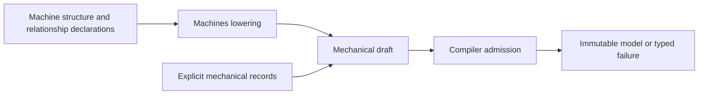

# Modeling

## Purpose and Scope
Mechanical declaration, model identity, kinematic charts, structural validation and immutable compilation. Parent: [SwiftMechanics](../DESIGN.md). Children: [Model](Model/DESIGN.md), [Joints](Joints/DESIGN.md), [Compiler](Compiler/DESIGN.md), [Machines](Machines/DESIGN.md).

## Responsibilities and Boundaries
Mechanical declaration, model identity, kinematic charts, structural validation and immutable compilation. Child contracts own each operation and failure domain. Consumers depend on published protocols and admitted immutable records. Internal visibility is not permission to bypass validation.

[Machines](Machines/DESIGN.md#target-declarative-authoring-contract) owns the approved structural authoring design. Its target lowering resolves declaration scopes, attachment placement and cross-links into mechanical input; Compiler still owns graph, physical and capability admission. The current body/joint facade remains the implemented subset. Additional relationship records and their supplier contracts must be admitted before broader authoring declarations become callable production APIs.

## Related Designs
| Design | Relationship | Contract used | Cautions |
|---|---|---|---|
| [SwiftMechanics](../DESIGN.md) | parent | Composition and dependency authority | Changed assumptions require parent requalification |
| [Model](Model/DESIGN.md) | child | Its documented assumption/guarantee | Preserve documented capability limits |
| [Joints](Joints/DESIGN.md) | child | Its documented assumption/guarantee | Preserve documented capability limits |
| [Compiler](Compiler/DESIGN.md) | child | Its documented assumption/guarantee | Preserve documented capability limits |
| [Machines](Machines/DESIGN.md) | child | Its documented assumption/guarantee | Preserve documented capability limits |

## Architecture

## Contracts and Invariants
Preserve units, frames, stable identity, original residual acceptance and bounded caller policy. No partial result is published as success. Lower contracts retain their documented capability limits. Compiler results and admitted state values require owner-issued immutable tokens; constructors accepting unchecked raw fields are not permitted.

## State, Ownership, and Lifecycle
Immutable Sendable values are shared; mutable workspace belongs to the documented operation/session owner. Mutex or actor protection and Sendable requirements are identical on Native, WASM and Embedded. Borrowed data cannot outlive its retained owner. Declaration expansion occurs during model construction, not a simulation step.

## Failure, Concurrency, and Constraints
Invalid values, exhausted capacity, cancellation, incompatible model identity and unsupported domains propagate typed failures. Caller budgets bound the admitted operation; plain Swift result-builder loops materialize before lowering and require caller-side construction bounds. No silent alternate physical law is selected.

## Verification and Change Impact
Responsibility-specific Tests targets own child behavior. Package verification runs the actual public path on each declared fixed toolchain/SDK profile. Recheck affected upper consumers after a lower contract changes. Migration requires consolidated Native behavioral tests and matching WASM/Embedded execution; compile success alone is not qualification.
