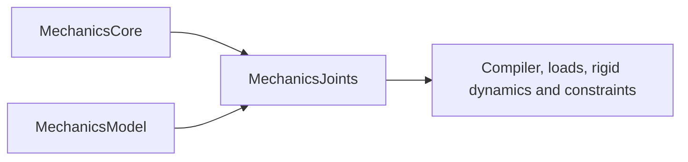

# Joints component

## Purpose and Scope
Parent: [responsibility owner](../DESIGN.md). Responsibility IM06: joint coordinate manifolds, tree transforms, framed jacobian and motion terms, requirements JT-001..004 and KI-001..003 in [SPEC](../../../../SPEC.md). Components: [KinematicAlgebra](KinematicAlgebra/DESIGN.md), [JointManifolds](JointManifolds/DESIGN.md), [ArticulatedTrees](ArticulatedTrees/DESIGN.md), [Jacobians](Jacobians/DESIGN.md), [PrescribedMotions](PrescribedMotions/DESIGN.md). Full feature/platform closure remains the task-level integration responsibility.

## Responsibilities and Boundaries
Joint coordinate manifolds, tree transforms, framed Jacobian and motion terms. Components own admitted domains, original-equation acceptance and explicit failure. Compiler, loads, rigid dynamics and constraints consume public contracts and own their mechanical graph, runtime state, physical formulation and composition.

## Related Designs
| Design | Relationship | Contract used | Summary | Cautions |
|---|---|---|---|---|
| [Responsibility owner](../DESIGN.md) | parent | Work ownership and SPEC requirements | Single-writer package composition | No placeholder capability claims |
| [MechanicsCore](../../Mathematics/Core/DESIGN.md) | depends on | SI geometry, quaternions and spatial algebra | Verified producer handoff at commit 7f72ee4 | Only documented admitted domains/profile paths are qualified |
| [MechanicsModel](../Model/DESIGN.md) | depends on | Validated body identity/inertia and base q-v records | Verified producer handoff at commit 7f72ee4 | Only documented admitted domains/profile paths are qualified |

## Architecture

Component internals remain directory-owned. Dependencies above are the real planned target imports; source/test paths are disjoint from other PG03 owners. Root alone registers targets when actual source exists.

## Contracts and Invariants
Contracts inherit SPEC section 2. Public service protocols declare all callable operations as requirements. Outputs publish their exact pose, geometric motion, coordinate-rate and Jacobian frame conventions; graph/chart/domain rejection is explicit. These kinematic queries do not claim numerical solve residual or convergence diagnostics. No consumer reaches another scope's private workspace or mutates its state. Component designs own precise coordinates, equations, derivative assumptions and falsifiable guarantees.

## State, Ownership, and Lifecycle
Use immutable Sendable records and exclusively operation-owned workspace. Caches and trial state are caller-owned values; runtime acceptance/checkpoint lifetime remains IM08. Any genuinely shared mutable reference storage requires identical Mutex/actor and Sendable contracts on Native, WASM and Embedded before implementation.

## Failure, Concurrency, and Constraints
JointError and Core/Model errors propagate invalid IDs, topology, dimensions, chart, missing/stale derivatives, capacity and finite-arithmetic failures. Quaternion/rank tolerances and body/velocity/Jacobian capacities are explicit caller policy. Synchronous bounded evaluation has no internal task-cancellation operation; the future runtime owns cancellation around admitted queries. No precision, physical-model or backend substitution is silent.

## Verification and Change Impact
Tests/MechanicsJointsTests owns analytic/manufactured success, actual failure and applicable coordinate/power/domain proofs. Root owns combined compile/link/runtime composition and exact-profile evidence. Changed child contracts invalidate only affected clients; whole mechanisms and the 210-requirement closure remain unverified until their owning integration paths execute.

### Qualified producer handoff (2026-10-03)
Native focused tests passed 18 behavioral tests on Swift 6.4.0 release/reference CPU. Root's combined package run passed 77 tests across seven targets; this module's implementation path was included. [FoundationVerification](../../../../Verification/FoundationVerification/DESIGN.md) then executed spherical 4/3 coordinate-rate mapping, fixed-root offset hinge, independent point position/velocity/centripetal acceleration, point Jacobian/transpose virtual power and stale-state failure propagation on Native and independently compiled/linked ordinary WASM and Embedded WASM, all with exit 0. Exact SDK IDs are swift-6.4.0-RELEASE_wasm and swift-6.4.0-RELEASE_wasm-embedded; WASI runtime is Node.js 24.19.0 Preview 1. Embedded invocation selects the documented EmbeddedUnicode link trait. Profile evidence is limited to those exercised operations; Native broader branch coverage does not transfer to another target. Full downstream mechanical feature closure and unrelated platforms remain unverified.

Ownership review found immutable Sendable public descriptors/results and synchronous operation-owned value workspace only. no shared mutable reference state, target-specific storage/isolation, unchecked conformance, escaping pointer or silent fallback is introduced. There is no claim about the future mutable runtime's race semantics.

### Consolidation contract
This directory is a component inside the SwiftMechanics module, not a separate SwiftPM target. Its existing public behavior and exact-profile evidence remain its contract authority. Cross-component access uses the documented contracts; internal visibility alone does not grant admission or publication authority. Source relocation requires integrated behavioral requalification.

### AF23 motion-program authority

[PrescribedMotions](PrescribedMotions/DESIGN.md) owns bounded immutable relative trajectory generation and original mathematical sample verification. It consumes Core/ArticulatedTrees mathematical values and the explicit Numerics work contract, without a Compiler/Runtime dependency. Compiled model/body authority, complete required frames and physical/history association belong to consumers. The selected component and upper execution have passed [AF23 qualification](../../../../Verification/FoundationVerification/DESIGN.md#af23-integrated-qualification); qualification is limited to the actual motion programs and composed profiles recorded there.

The additive [AF26 trajectory contract](PrescribedMotions/DESIGN.md#af26-additive-lower-trajectory-contract) owns harmonic/C2 piecewise mathematical source, sealed sampling and earliest-knot authority. Existing quadratic records/getters/signatures remain the old contract. Compiler/physical/history binding stays with later consumers; no backedge is introduced. New source execution is pending.
