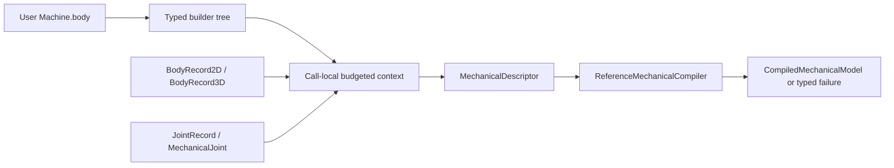

# Machines

## Purpose and Scope
Immutable declarative model construction in the single SwiftMechanics module. Parent: [Modeling](../DESIGN.md). This component owns Machine, its builder, scoped definition expansion and the descriptor facade. It has no child components.

## Responsibilities and Boundaries
Machine declarations produce existing body and joint records. The call-local context owns lowering work, identity admission and expansion limits. The existing compiler owns topology, coordinate layout, physical validation and compiled-model publication. Simulation steps never reevaluate declarations. Gear laws, runtime mutation and new physical laws are outside this foundation.

## Related Designs
| Design | Relationship | Contract Used | Summary | Cautions |
|---|---|---|---|---|
| [Modeling](../DESIGN.md) | parent | Modeling composition | Registers this component | Recheck composition after API changes |
| [Model](../Model/DESIGN.md) | depends on | Immutable admitted body records and EntityID | Retains geometry, modes, representations and inertia | Namespace remapping changes identity only |
| [Joints](../Joints/DESIGN.md) | depends on | JointRecord, anchors, manifold and state | Retains actual kinematic laws | State coordinates follow compiler canonical joint order |
| [Compiler](../Compiler/DESIGN.md) | depends on | MechanicalDescriptor and ReferenceMechanicalCompiler | Owns complete physical admission | Definition success alone does not prove compilability |

## Architecture

## Contracts and Invariants
Machine's required non-generic lowering operation is the only erased dispatch operation. Default lowering visits body. Primitive and builder composites have Body = Never and their lowering never accesses body. AnyMachine retains immutable generic final-class storage behind a private non-associated Sendable protocol; it never stores an existential Machine.

Builder lowering preserves source and selected-branch order; tuples are binary generic pairs without packs. buildPartialBlock preserves macOS 13 deployment. Optional, if/else, switch, availability, empty groups and plain for are supported. Plain Swift for constructs the compiler-provided array before lowering; lowering policy cannot bound that allocation or construction closures. Callers must bound plain construction loops; ForEachMachine is the lazy bounded alternative.

IDs are explicit. Root-scope IDs remain unchanged. Scoped IDs encode every namespace and the local key with Character length prefixes (consistent with Swift canonical-equivalent String identity) and a reserved leading marker; root IDs beginning with that marker are rejected. This keeps keys injective, including nested namespaces and separators inside user IDs. Entity kind remains part of equality. Duplicate entity definitions and duplicate instance paths fail even for empty instances. MachineJoint endpoints are local by default; explicitly absolute references connect an instance to an outer body. Metadata IDs and initial-state anchor frames are already absolute and are never inferred from declaration order.

Selected branch or collection changes are model-construction changes: callers compile a new definition and manage revision/state migration through the existing compiler/runtime contracts. There is no automatic same-revision declaration swapping. MachineDefinition returns a descriptor only after complete lowering. It returns a compiled model only after actual compiler admission. Failed drafts remain private and are discarded. The public context's append operations retain valid budget state after rejected admission; external custom Machine implementations must propagate failures and route recursive traversal through context.lower.

## Runtime Flows
MachineDefinition constructs a fresh context, reserves world identity, traverses the immutable declaration and publishes a complete descriptor. compile(using:) calls the injected MechanicalModelCompiling owner with the supplied validation policy; the convenience overload supplies ReferenceMechanicalCompiler with NoMechanicalExtensions. MachineInstance enters its namespace before traversal and restores it on success or failure. ForEachMachine admits an iteration before running either its explicit-ID closure or content closure, so exhausted budget never executes the next closure.

## State, Ownership, and Lifecycle
Declarations are immutable Sendable values. AnyMachine's concrete box strongly retains content until all erased copies release it. Mutable arrays, identity sets, counters and namespace are private to a lowering call, never shared across calls. No conditional target-specific synchronization or Sendable weakening exists.

## Failure, Concurrency, and Constraints
MachineDefinitionPolicy bounds traversal nodes, entity records plus explicit instance paths, aggregate identifier bytes, recursion depth and lazy iterations. Invalid policy, invalid namespace, reserved identities, duplicates, capacity, record-construction failure and compiler failure are typed. Work limits are caller-selected nonnegative capacities with positive maximumDepth. Independent definitions can execute concurrently because each creates its own context. Custom lowering implementations own termination within their own code; only context-mediated work can be metered.

## Verification and Change Impact
[Machine tests](../../../../Tests/SwiftMechanicsMachineTests/DESIGN.md) own ordering, selected branches, explicit namespace identity, duplicate rejection, lazy closure bounds, atomic facade publication, retained-box lifetime and real compiler/motion behavior. Root integration owns fixed Native / WASM / Embedded compile, link and runtime qualification. A language-only probe is evidence for its tested dispatch pattern, not full physical-path qualification. Recheck Modeling and compiler consumers when the public definition API changes.

### AR01 foundation qualification
Twelve focused Native tests passed using actual Mathematics and Modeling sources: selected branches/order, empty/erased composition, scoped repeated instances, real hinge pose/rate, duplicate and capacity/depth rejection, bounded lazy closure calls, and retained-box release. The final consolidated qualification is owned by [system integration](../../../../DESIGN.md#ar01-integrated-qualification-2026-10-04); exact public profile execution is owned by [FoundationVerification](../../../../Verification/FoundationVerification/DESIGN.md#ar01-public-profile-execution).
