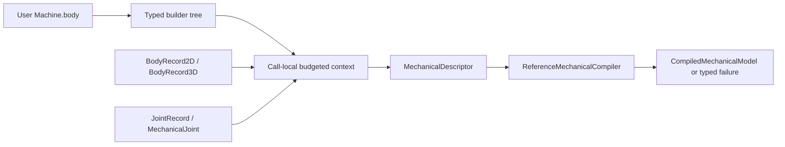
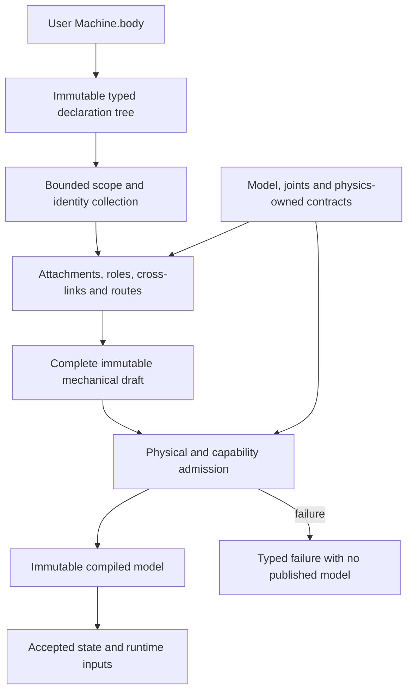

# Machines

## Purpose and Scope
Immutable declarative model construction in the single SwiftMechanics module. Parent: [Modeling](../DESIGN.md). This component owns Machine, its builder, scoped definition expansion, the descriptor facade and the target structural authoring contract below. It has no child components.

## Responsibilities and Boundaries
The implemented Machine foundation produces existing body and joint records. The call-local context owns lowering work, identity admission and expansion limits. The existing compiler owns topology, coordinate layout, physical validation and compiled-model publication. Simulation steps never reevaluate declarations. The target authoring surface additionally describes relationships and bindings; their equations, runtime mutation and physical laws remain with the existing physical/execution owners.

## Related Designs
| Design | Relationship | Contract Used | Summary | Cautions |
|---|---|---|---|---|
| [Modeling](../DESIGN.md) | parent | Modeling composition | Registers this component | Recheck composition after API changes |
| [Model](../Model/DESIGN.md) | depends on | Immutable admitted body records and EntityID | Retains geometry, modes, representations and inertia | Namespace remapping changes identity only |
| [Joints](../Joints/DESIGN.md) | depends on | JointRecord, anchors, manifold and state | Retains actual kinematic laws | State coordinates follow compiler canonical joint order |
| [Compiler](../Compiler/DESIGN.md) | depends on | MechanicalDescriptor and ReferenceMechanicalCompiler | Owns complete physical admission | Definition success alone does not prove compilability |
| [Physics](../../Physics/DESIGN.md) | coordinates with | Target law-input and binding contracts | Physical suppliers retain equation authority for the target catalog | Current Machine facade does not lower these laws; concrete schemas need owner qualification |
| [Transmissions](../../Physics/Transmissions/DESIGN.md) | depends on (target) | Identified transfer terminals and admitted laws | Supplies pair and multi-terminal semantics | A gear reference alone is not a coordinate binding |
| [Loads](../../Physics/Loads/DESIGN.md) | depends on (target) | Attachment, passive force and route contracts | Supplies spring and cable semantics | Preserve force application, frame and tension-domain assumptions |
| [Flexible](../../Physics/Flexible/DESIGN.md) | depends on (target) | Material-site and deformable boundary contracts | Supplies non-rigid attachment meaning | Rigid frames cannot substitute for material-site admission |
| [Execution](../../Execution/DESIGN.md) | coordinates with | Accepted state, input and transition contracts | Owns runtime activation and publication | Construction branches never replace accepted-time transitions |
| [Machine tests](../../../../Tests/SwiftMechanicsMachineTests/DESIGN.md) | used by | Definition/compiler public path | Owns authoring qualification | Existing record fixtures do not qualify proposed structural primitives |

## Architecture


## Contracts and Invariants
Machine's required non-generic lowering operation is the only erased dispatch operation. Default lowering visits body. Primitive and builder composites have Body = Never and their lowering never accesses body. AnyMachine retains immutable generic final-class storage behind a private non-associated Sendable protocol; it never stores an existential Machine.

Builder lowering preserves source and selected-branch order; tuples are binary generic pairs without packs. buildPartialBlock preserves macOS 13 deployment. Optional, if/else, switch, availability, empty groups and plain for are supported. Plain Swift for constructs the compiler-provided array before lowering; lowering policy cannot bound that allocation or construction closures. Callers must bound plain construction loops; ForEachMachine is the lazy bounded alternative.

IDs are explicit. Root-scope IDs remain unchanged. Scoped IDs encode every namespace and the local key with Character length prefixes (consistent with Swift canonical-equivalent String identity) and a reserved leading marker; root IDs beginning with that marker are rejected. This keeps keys injective, including nested namespaces and separators inside user IDs. Entity kind remains part of equality. Duplicate entity definitions and duplicate instance paths fail even for empty instances. MachineJoint endpoints are local by default; explicitly absolute references connect an instance to an outer body. Metadata IDs and initial-state anchor frames are already absolute and are never inferred from declaration order.

Selected branch or collection changes are model-construction changes: callers compile a new definition and manage revision/state migration through the existing compiler/runtime contracts. There is no automatic same-revision declaration swapping. MachineDefinition returns a descriptor only after complete lowering. It returns a compiled model only after actual compiler admission. Failed drafts remain private and are discarded. The public context's append operations retain valid budget state after rejected admission; external custom Machine implementations must propagate failures and route recursive traversal through context.lower.

## Runtime Flows
MachineDefinition constructs a fresh context, reserves world identity, traverses the immutable declaration and publishes a complete descriptor. compile(using:) calls the injected MechanicalModelCompiling owner with the supplied validation policy; the convenience overload supplies ReferenceMechanicalCompiler with NoMechanicalExtensions. MachineInstance enters its namespace before traversal and restores it on success or failure. ForEachMachine admits an iteration before running either its explicit-ID closure or content closure, so exhausted budget never executes the next closure.

## State, Ownership, and Lifecycle
Declarations are immutable Sendable values. AnyMachine's concrete box strongly retains content until all erased copies release it. Mutable arrays, identity sets, counters and namespace are private to a lowering call, never shared across calls. No conditional target-specific synchronization or Sendable weakening exists.

## Failure, Concurrency, and Constraints
MachineDefinitionPolicy bounds traversal nodes, entity records plus explicit instance paths, aggregate identifier bytes, recursion depth and lazy iterations. Invalid policy, invalid namespace, reserved identities, duplicates, capacity, record-construction failure and compiler failure are typed. Work limits are caller-selected nonnegative capacities with positive maximumDepth. Independent definitions can execute concurrently because each creates its own context. Custom lowering implementations own termination within their own code; only context-mediated work can be metered.

## Verification and Change Impact
[Machine tests](../../../../Tests/SwiftMechanicsMachineTests/DESIGN.md) own ordering, selected branches, explicit namespace identity, duplicate rejection, lazy closure bounds, atomic facade publication, retained-box lifetime and real compiler/motion behavior. Root integration owns fixed Native / WASM / Embedded compile, link and runtime qualification. A language-only probe is evidence for its tested dispatch pattern, not full physical-path qualification. Recheck Modeling and compiler consumers when the public definition API changes.

### AR01 foundation qualification
Twelve focused Native tests passed using actual Mathematics and Modeling sources: selected branches/order, empty/erased composition, scoped repeated instances, real hinge pose/rate, duplicate and capacity/depth rejection, bounded lazy closure calls, and retained-box release. The final consolidated qualification is owned by [system integration](../../../../DESIGN.md#ar01-integrated-qualification-2026-10-04); exact public profile execution is owned by [FoundationVerification](../../../../Verification/FoundationVerification/DESIGN.md#ar01-public-profile-execution).

## Target Declarative Authoring Contract

This section is the canonical design for the user-approved structural authoring direction (2026-10-05). It extends the design target, not the implemented capability. Earlier sections describe the current foundation. No high-level declaration below is currently qualified by the record-based Machine tests. Names other than existing Machine APIs are illustrative surface spellings pending concrete public-contract qualification. Examples intentionally omit full geometry, inertia, material and initialization inputs; they are structural sketches, not executable simulation fixtures.

### Current Facts and Required Change

| Layer | Current implementation | Target change |
|---|---|---|
| Composition | Machine, MachineBuilder, typed tuples/branches, AnyMachine, MachineInstance and bounded ForEachMachine | Preserve these foundations and author physical structure directly in body |
| Primitive lowering | MachineBody appends MechanicalBody; MachineJoint appends MechanicalJoint with explicit references | Add nested structural context, attachment bindings and relationship declarations |
| Definition facade | MachineDefinition emits a MechanicalDescriptor containing body and joint records | Admit a broader immutable mechanical draft through supplier-owned record contracts |
| Physical admission | Existing compiler validates the descriptor and publishes a compiled model or failure | Preserve authority; qualify each additional declaration/law combination before accepting it |
| Execution | Compiled model and state are evaluated without declaration reevaluation | Bind declared inputs/events to existing execution contracts; never run body on a step |

Current implementation paths: [Machine](Machine.swift), [builder](MachineBuilder.swift), [context](MachineDefinitionContext.swift), [body facade](MachineBody.swift), [joint facade](MachineJoint.swift) and [definition facade](MachineDefinition.swift). Existing [compilation tests](../../../../Tests/SwiftMechanicsMachineTests/MachineCompilationTests.swift) check actual record-based hinge motion and failure. They do not establish nested-parent inference or relationship lowering.

The high-level authoring surface describes 3D machines and uses standard physical names without a 3D suffix: RigidBody, RevoluteJoint, PrismaticJoint and other concrete joint names. Joint is an abstraction rather than a substitute for a concrete physical pair. A planar joint constrains motion within a plane in 3D. This does not remove existing planar kernels, record APIs or SPEC RB-001's 2D/3D scope.

### Structural Architecture



The declaration tree is an authoring structure, not the mechanical connection graph or a solver spanning tree. Cross-links may form cycles. Compiler and mechanism owners choose any required tree/cut representation and retain the full physical constraints. Builder source order is not a reference-resolution dependency or a force-flow direction.

| Authoring form | Owned meaning |
|---|---|
| Nested content | Rigid composition or joint-mediated structure, as defined by the enclosing primitive |
| Placement modifier | Initial/local placement in a documented coordinate frame |
| Kind-specific reference | Existing body, joint coordinate, frame, shape, axis or attachment binding |
| Named role/port | Distinct physical terminals, including multi-terminal mechanisms |
| Ordered route | Cable, belt or chain traversal with declared endpoints and guides |
| Declared law | Explicit elastic, dissipative, contact or transmission formulation |
| Declared input/condition | Runtime actuation or accepted engagement/release transitions |
| Composite Machine | Reusable composition of the same primitives and relationships |

### Content, Identity and Connection Contract

Content-bearing declarations are generic over Content: Machine, accept an @MachineBuilder construction closure and retain the resulting immutable content value. Ordinary construction evaluates that closure once per declaration instance. Lowering traverses stored content; stepping never evaluates it. Existing ForEachMachine remains the separately budgeted lazy expansion path, and plain Swift loops retain their documented pre-lowering allocation limitation. This contract does not require a new existential Machine or a retained arbitrary reconstruction closure.

| Rule | Guarantee or rejection condition |
|---|---|
| Direct declaration | Physical parts and connections are authored directly in body; stored part/joint variables are not required by the authoring model |
| Rigid composition | Shapes/rigidly mounted constituents inside an explicitly rigid owner share one motion; they do not acquire independent coordinates |
| Separate body | Another body requires an explicit connecting relation or an independent root; arbitrary nesting never silently welds bodies |
| Nested joint | The nearest enclosing physical body supplies one endpoint; exactly one connected physical body supplies the other |
| Reference joint | Exactly two explicit attachment endpoints connect already declared bodies, including loop closure; endpoints must not contradict an enclosing inferred endpoint |
| Non-joint relationship | A spring, mesh or other relation consumes its declared endpoint kinds; it does not infer parent/child motion from lexical nesting |
| Identity | Explicit IDs and MachineInstance namespaces retain the current injective identity contract; tuple paths and branch positions are not physical identities |
| Reference scope | References are kind-specific and scoped; external references are explicit. Missing, wrong-kind, ambiguous and duplicate bindings fail |
| Forward references | Resolve after collection, independently of declaration order. Reference resolution never recursively expands a referenced declaration |
| Rigid mass | Aggregate constituent inertia through RB-002..004; keep geometric overlap/density policy explicit and do not double-count independently registered bodies |
| Role cardinality | Each relationship admits only its specified endpoint kinds, count and named roles. A generic MachineBuilder alone is not proof of a legal connection |
| Reuse | Instance-local references resolve separately; cross-instance links require explicit scoped/external bindings |

References do not own simulation state. ShaftReference may identify a rotary terminal only when its declared shaft/connection provides a unique admitted binding. Multiple possible coordinates or reference supports require an explicit port binding and otherwise fail. Geometry/part identity is not itself a generalized coordinate.

### Coordinate and Placement Contract

Storage and conversion follow SPEC MD-002..003. Structural examples use meters for lengths and radians for unwrapped angular coordinates unless a dimensioned conversion is explicit. Axes are expressed in their declared attachment frames. A transform maps coordinates from its source frame to its destination frame.

| Declaration location | Placement frame and effect |
|---|---|
| Root body | World frame; placement sets its reference/initial pose, not a motion law |
| Rigid constituent | Owning rigid body's frame; placement contributes shape and mass placement |
| Joint nested in a body | Parent-body frame; placement sets the parent attachment |
| Body connected through a joint | Moving joint frame; placement sets the child body relative to that frame and is converted to the child attachment exactly once |
| Explicit attachment | Referenced body's frame; placement selects the attachment, not the body's pose |
| Reusable assembly | Instance placement composes into its structural roots and attachments once; it does not rewrite another referenced body |
| Persistent geometric relation | Separate constraint declaration; an initial placement modifier never implicitly installs it |

For a parent body P, child body C and joint frame J, preserve the existing joint convention:

```text
T_world_child = T_world_parent * T_parent_joint * M(q) * inverse(T_child_joint)
```

Nested joint placement contributes T_parent_joint. Child placement contributes inverse(T_child_joint). Default attachment placement is identity where a primitive explicitly allows it. Lowering must not apply the same offset both as a body pose and as an attachment. Initial q and initial body poses must be consistent under assembly; no placement silently overrides initial state.

### Structural Example Vocabulary

#### Nested Articulation and Rigid Shaft Composition

```swift
struct CompoundGearAssembly: Machine {
    var body: some Machine {
        RigidBody("housing") {
            RevoluteJoint("drive", axis: .z) {
                Shaft("shaft") {
                    SpurGear("small", teeth: 20, module: 0.002)
                    SpurGear("large", teeth: 40, module: 0.002)
                        .offset(z: 0.02)
                }
            }
        }
        .fixed()
    }
}
```

Shaft here is a rigid physical owner with mounted constituents, not an automatic independent rotational coordinate. The RevoluteJoint supplies that coordinate. Two gears fixed to this shaft share its rigid motion regardless of tooth counts. Coaxial independent rotation instead requires separate bodies/joints and a geometric axis relation.

#### Cross-Links and Loop Closure

The following fragments assume their referenced entities are declared in the same admitted scope. Attachment identifies a body-local mount; it does not create another body.

```swift
RevoluteJoint("closure", axis: .z) {
    Attachment("coupler", frame: "end")
    Attachment("rocker", frame: "end")
}

Coaxial {
    JointAxis("input")
    JointAxis("output")
}

Spring("return", stiffness: 100, restLength: 0.2) {
    Attachment("housing", frame: "springMount")
    Attachment("arm", frame: "springMount")
}
```

Endpoint order defines the documented signed joint/force convention; it does not create a directed physical tree. Coaxial constrains axis geometry, not equality of rotational coordinates. Spring returns a force law, not a fixed-distance constraint.

#### Transmission Roles and Routes

```swift
GearMesh("mesh", model: .ideal) {
    GearReference("small")
    GearReference("output")
}

PlanetaryGearSet("planetary") {
    Sun { ShaftReference("sun") }
    Ring { ShaftReference("ring") }
    Carrier { ShaftReference("carrier") }
}

Cable("liftingCable") {
    Attachment("load")
    Over(PulleyReference("movingPulley"))
    Over(PulleyReference("fixedPulley"))
    Attachment("housing")
}
```

Ideal transmission laws bind actual admitted coordinates, signs, units and reference supports. A tooth-contact model is a different explicit law and capability, not a fallback. Transmission ratios follow their law owner's convention; syntax never guesses them from source order. Route order is physically meaningful. Guide geometry, winding/branch selection, taut/slack behavior and force application belong to the routing/force suppliers. A planetary or differential relationship is multi-terminal, not a sequence of unrelated pairwise ratios.

#### Contact, Engagement and Reaction Support

```swift
CamFollower("valveDrive", model: .contact) {
    CamReference("cam")
    FollowerReference("follower")
}

Clutch("clutch") {
    RotaryPort("input")
    RotaryPort("output")
}
.engagement(.input("clutchCommand"))

TorqueMotor("motor", axis: .z) {
    Rotor { BodyReference("shaft") }
    Stator { BodyReference("housing") }
}
.torque(.constant(1))
```

The torque motor's illustrated axis is in its declared stator attachment frame. Rotor/stator bindings identify the equal-and-opposite effort application; they do not silently install a revolute joint. A coordinate-driven motor instead binds an admitted coordinate and its support. Input references must resolve to declared typed inputs. Cam contact requires admitted geometric/contact data; an ideal follower trajectory is a separate model. Example arguments are not a finalized complete physical-parameter interface.

### Mechanical Structure Coverage

This catalog is an expression-coverage target. Each named mechanism still requires its own admissible model and qualified suppliers. It does not require a distinct primitive type for every mechanism, assert complete upstream compatibility, or add completion claims to the 210 SPEC requirements.

| Family | Structures to express | Declarative form | Existing physical requirement families |
|---|---|---|---|
| Composition | One rigid body; rigid assembly | Rigid owner content or explicit fixed connection | MD, RB, JT |
| Supports | Fixed, moving and floating supports | Explicit root/support mode and bindings | RB, JT, KI |
| Graph topology | Serial chains, branches, closed loops, parallel mechanisms, shared loops, independent mechanisms | Nested articulation plus reference connections | MD, JT, CN, KI |
| Reuse | Repeated/reusable assemblies | Scoped Machine instances and bounded repetition | MD |
| Coordinates | Local and mounting frames | Identified frames and placements | MD, KI |
| Geometry | Coincident points; coaxial/concentric; parallel; perpendicular; specified angle | Kind-specific geometric relations | CN, KI |
| Distance | Distances and offsets between points, axes and planes | Placement or persistent relation, explicitly distinguished | MD, CN |
| Guided motion | Point-on-line, point-on-plane, point-on-curve, point-on-surface | Attachment and admitted guide references | CN, KI |
| Layout | Symmetric, circular, linear and grid patterns | Placement/repetition composition, not implicit runtime constraints | MD, RB |
| Elementary pairs | Fixed/weld, revolute, prismatic, screw/helical, cylindrical, universal, spherical, planar, free/floating | Concrete joint with nested or explicit endpoints | JT, RB, KI |
| Common shafts | Rigidly mounted gears/pulleys/rotors; compound gears | One rigid shaft owner with constituents | RB, TR |
| Independent coaxial shafts | Independent rotation; nested hollow shafts | Distinct bodies/joints with axis alignment | JT, CN, TR |
| Shaft mounts | Keyed/fixed spline; sliding spline | Explicit rotary and axial connection semantics | JT, CN, TR |
| Shaft couplings | Rigid coupling; flexible coupling | Fixed connection or elastic frame relation | JT, FL, TR, FX |
| Bearings | Radial/thrust support; locating/nonlocating support; multiple bearings | Supported directions at declared mounts; explicit ideal/detailed model | JT, CN, FL, CT |
| Articulated shaft drives | Constant-velocity joints; Cardan shaft | Joint/transfer composition | JT, TR |
| Gear pairs | External/internal spur; helical; bevel; worm; hypoid | Gear geometry plus explicit mesh formulation | TR, CL, CT |
| Gear networks | Simple, compound and reverted trains | Rigid mounts and mesh relationships | RB, TR |
| Multi-terminal drives | Planetary gears; differentials; power split | Named mechanical roles and admitted terminals | TR, AC |
| Variable/friction transfer | Noncircular gears; friction wheels | Position-dependent transfer or explicit contact law | TR, CT |
| Flexible transmissions | Open/crossed/timing belts; chains and sprockets | Routes, winding and explicit transfer/contact laws | TR, FL, CT |
| Cable systems | Wires; tendons; capstan/wrapping; fixed/moving pulleys; pulley blocks | Ordered endpoint/guide route and tension law | FL, TR |
| Rotary-linear drives | Rack/pinion; lead screw; ball screw | Rotary and linear terminals with an explicit formulation | JT, TR, AC |
| Composite reducers | Strain-wave/harmonic and cycloidal drives | Composite Machine with qualified transfer/contact/deformation model | TR, FX, CT |
| Four-bar structures | Four-bar; crank-rocker; double-crank; double-rocker; parallelogram | Body/joint composition and loop closure | JT, CN, KI |
| Rotary-reciprocating links | Slider-crank; offset slider-crank; Scotch yoke | Revolute/prismatic structure plus loop/slot relation | JT, CN, KI, CT |
| Multi-link structures | Toggle; pantograph; scissor; Watt/Stephenson six-bar; general multi-bar | Reusable link compositions and shared loops | JT, CN, KI |
| Path/spatial linkages | Straight-line generators; spatial and spherical linkages | Spatial mounts and composite loops | JT, CN, KI |
| Robots | Serial robot; Stewart platform; Delta; other parallel robots | Serial/parallel composites and admitted actuation | JT, CN, AC, CO |
| Vehicle linkages | Double-wishbone/MacPherson suspension; steering/Ackermann linkage | Bodies, joints, loops and force elements | JT, CN, FL, EX |
| Cams | Disc, translating, cylindrical/barrel, grooved and conjugate cams | Cam/follower geometry and explicit contact/ideal law | CN, KI, CT |
| Followers | Roller; flat-face; tip followers | Shape-specific follower connection | CL, CT |
| Intermittent mechanisms | Geneva; ratchet/pawl; escapement | Composite contact, direction and engagement relations | CT, TR, TI |
| Directional transmission | One-way/overrunning clutch | State-dependent transmission law | TR, TI |
| Passive force elements | Translational/torsional springs and dampers; series/parallel networks | Point/frame/rotary terminals and constitutive law | FL, JT |
| Compliant supports | Bushings; elastic mounts | Frame terminals and multidirectional law | FL, FX |
| Flexible structures | Flexible shaft/link/beam; flexure mechanisms | Deformable constituents and boundary bindings | FX, ST |
| Mixed rigid/flexible structures | Rigid-to-flexible attachments | Body mount to material point/node/region binding | FX |
| Constitutive state | Preload; nonlinear and history-dependent laws | Explicit parameters and continuation state contract | FL, FX, RT |
| Tension-only systems | Slack/taut cable | Route and unilateral tension law | FL, TI |
| Contact | Unilateral/frictional contact; no-slip/slipping rolling; impact/rebound; tooth contact | Geometry pairs/sets and explicit contact or velocity law | CL, CT, CN, TR, TI |
| Clearance | Backlash; bearing/guide clearance | Dead-zone/contact model and declared geometry | TR, JT, CT |
| Stops | Joint limits and physical stops | Coordinate limit or contact surface | JT, CT, TI |
| Switching connections | Friction/toothed clutch; brake; latch; lock | Terminals, explicit model and declared input/condition | TR, AC, TI |
| Release | Breakable/disengaging connection | Physical criterion and accepted transition | JT, TI, RT |
| Actuation | Torque/force drive; prescribed angle/position/speed | Typed input and effort or motion authority | AC, FL, KI |
| Drive composition | Elastic drive; hydraulic/pneumatic cylinder; tendon/cable drive | Mechanical and domain ports plus qualified suppliers | AC, FL, EX |
| Reactions and networks | Rotor/stator; housing support; multi-terminal power network | Explicit support and power-conjugate terminal bindings | AC, TR, DY |

### Runtime State and Failure Boundaries

| Object/state | Owner and lifetime |
|---|---|
| Declaration and stored content | Immutable Machine value, retained through model construction only as needed |
| Collected scopes, IDs and unresolved bindings | One bounded lowering call; unpublished on failure |
| Admitted relationship/law input | Supplier-owned immutable model contract consumed by Compiler |
| Compiled graph and capabilities | Compiler-issued immutable model revision |
| q/v, deformation, constitutive/contact history | Existing per-session state/contributor owners |
| Input schedule and clutch/latch activation | Execution and the owning law's accepted-state contract |
| Break/release topology | Existing accepted topology transition and revision/migration authority |
| CAD geometry/material-point source | Corresponding geometry/flexible authority with retained provenance |

Construction-time if, switch and optional content select a model. Changing that selection creates a new definition and requires explicit compile/revision/state migration. Runtime clutch, latch and break conditions are declared model inputs/events; they do not reevaluate body. A mode change with compatible layout follows its law's state-transition contract; a graph/layout change follows the existing topology publication contract. Trial failure/cancellation preserves the last accepted state, including activation and constitutive history.

The target must report typed failures for invalid content kind/cardinality, missing or ambiguous reference, invalid scope/frame/axis/unit, inconsistent assembly, missing inertia/geometry/law data, unsupported formulation/combination, resource exhaustion and failed supplier admission. Errors retain declaration/entity context where admitted by the resource policy. Missing support terminals, physical properties or geometry are not filled with invented values. An unsupported detailed model never becomes an ideal coupling silently. No partially bound draft or compiled model is published.

### Supplier Dependencies and Implementation Order

These are required contract handoffs, not a replacement for the stable work IDs or dispatch readiness in [IMPLEMENTATION_PLAN](../../../../IMPLEMENTATION_PLAN.md). No source task is dispatched by this documentation update. Public interfaces remain focused protocols with separate concrete implementations; compiler/law authority stays with the supplier.

| Target responsibility | Required supplier contract | Dependency consequence |
|---|---|---|
| Nested bodies/joints | Model body/inertia records, joint anchors/manifolds, builder/scoped identity | Can be qualified independently of transmission/contact syntax |
| Reference connections | Complete identity collection, explicit frames, compiler graph/assembly admission | Must precede loop and cross-instance authoring qualification |
| Named transfer ports | Identified coordinate/frame/support bindings and transmission law records | Multi-terminal examples cannot be accepted before genuine terminal binding |
| Cable/belt routes | Geometry/guide queries, wrapping selection, tension/transfer laws | Route syntax cannot qualify force or contact behavior by itself |
| Flexible attachments | Deformable topology/material-site bindings and constitutive input | Must not reuse rigid attachment assumptions for material regions |
| Contact declarations | Collision geometry/pair bindings and selected contact-law capability | Detailed gear/cam/friction examples require their exact contact suppliers |
| Input/stateful connection | Actuation/input contracts, law continuation and accepted transitions | Requires accepted-state evidence, not builder conditionals |
| Composite mechanism library | Qualified primitives and only the suppliers actually consumed | Different composites may proceed independently after their own prerequisites |

Within lowering, collect definitions before resolving forward references, then admit complete bindings before compiler publication. Independent suppliers need not wait for unrelated mechanism families. Shared facade/schema/identity contracts require one writer; physical supplier ownership is unchanged.

### Target Verification Matrix

The [Machine test owner](../../../../Tests/SwiftMechanicsMachineTests/DESIGN.md) qualifies authoring/lowering and actual compiler equivalence. Existing physical owners qualify equations and accepted transitions. The cases below are required future evidence, not recorded passing tests.

| Invariant | Falsifiable behavioral evidence | Owner/specification |
|---|---|---|
| Nested topology | Nested hinge matches explicit records in pose/rate; branches have independent coordinates; invalid child count fails | Machine tests; MD, JT, KI |
| Rigid shaft composition | Two mounted gears add no separate DOF; aggregate mass/inertia matches analytic values and no double counting | Machine + Model tests; RB, TR |
| Coordinate placement | Nonidentity parent and child translations/rotations match explicit anchor algebra; repeated instance transform applied once | Machine + Joint tests; MD, KI |
| Geometry versus motion | Coaxial independent shafts retain different speeds; initial placement alone installs no persistent constraint | Machine + Constraint tests; CN |
| Identity/reference resolution | Forward/reordered definitions bind the same graph; missing/wrong-kind/ambiguous/duplicate references fail without publication | Machine + Compiler tests; MD |
| Closed loops | Four-bar assembly satisfies original position/velocity constraints; contradictory loop fails with documented diagnosis | Machine + Mechanism tests; CN, KI |
| Multi-terminal transfer | Planetary/differential terminal signs, units, relative supports and power balance match analytic equations; missing role fails | Machine + Transmission tests; TR |
| Routes | Pulley block displacement/tension and force application match an independent oracle; winding/slack ambiguity is explicit | Machine + Load/Transmission tests; FL, TR |
| Flexible attachment | Correct material-site binding and balance; stale site, unsupported region or invalid provenance fails | Machine + Flexible tests; FX |
| Model distinction | Ideal gear and tooth contact request different capabilities; unsupported detailed law fails instead of producing ideal motion | Machine + Contact/Compiler tests; TR, CT |
| Effort versus motion | Torque-driven output responds to inertia/load; prescribed motion has explicit required effort/reaction; stator action/reaction balances | Machine + Actuation/Dynamics tests; AC, DY |
| Runtime transition | Slip/engage/release at accepted time; rejected trial restores activation/history; checkpoint replay reproduces events; body invocation count stays unchanged | Machine + Hybrid/Runtime tests; TI, RT |
| Bounded construction | Reference/role/route collection and expansion honor admitted work/storage limits; failure executes no unadmitted callback and publishes no draft | Machine + Compiler tests; MD, PF |
| Platform scope | Actual supported declarations compile/link/run through fixed Native/WASM/Embedded public paths; evidence remains formulation/profile-specific | Root verification; PF |

### Remaining Implementation Decisions

The approved expression patterns and semantic distinctions above are the design baseline. Before implementing any affected primitive, its owner must finalize only the contracts needed by that scope:

- Concrete public spelling, generic content constraints and extension/admission hooks for that primitive.
- Physical parameter, initial-state, port-binding and geometry/inertia input APIs; the sketches intentionally omit these inputs.
- The supplier-issued relationship draft/schema and compiler registration needed for that exact formulation, without changing unrelated existing publication contracts.
- The supported law/geometry/domain combination and its actual behavioral/profile evidence.

These decisions are not resolved by a plausible code example or a new type declaration. This update authorizes the design direction; it neither reports implementation completion nor declares every catalog entry ready for production implementation.
