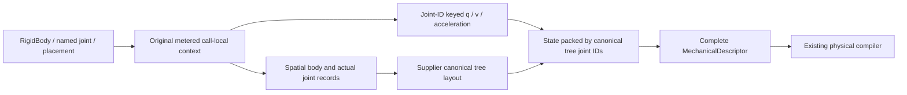
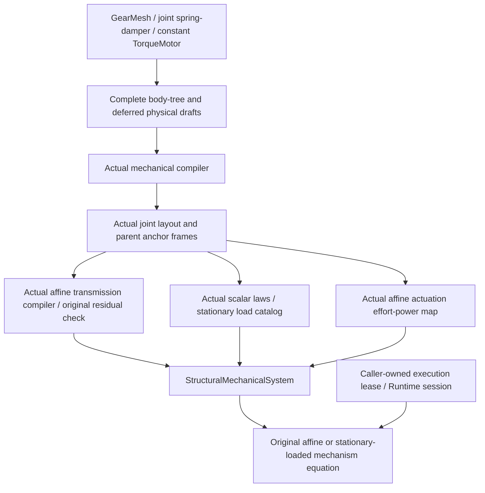

# Structural Authoring

## Purpose and Scope
AF34.1 spatial nested authoring and executable physical composition. Parent: [Machines](../DESIGN.md). No children. This component owns `RigidBody`, named elementary joints, local placement, an explicit existing-body reference, gear/passive/constant-torque declarations and their real producer-to-mechanism composition facade. The current 37 Swift files comprise the original 19 spatial/body/joint sources and the additive 18 physical-composition sources. [StructuralAuthoringQualification](../../../../../Verification/StructuralAuthoringQualification/DESIGN.md) owns actual selected physical-path evidence: complete registered1910 Native Structural8/legacy12/Pair2 plus public7, and selected1608 ordinary/Embedded public7. Execution and Git remain root-scheduled. These results do not qualify every declared joint chart or the broader parent target.

## Responsibilities and Boundaries
Immutable declarations are constructed once and lowered through the original `Machine` requirement. The call-local `MachineDefinitionContext` owns mutable lexical state and original identity/work admission. This child interprets nesting and prepares actual body/joint records and initial chart coordinates. The original compiler remains the sole body/tree publication authority. A separately owned structural-system composition consumes qualified physical producers and returns executable physical values, not compiler extension metadata. Inertia comes from `InertialRepresentation3D`; no geometry-derived inertia, rigid aggregation, contact, electrical motor or accepted execution transition is supplied.

## Related Designs
| Design | Relationship | Contract Used | Summary | Cautions |
|---|---|---|---|---|
| [Machines](../DESIGN.md) | parent | Machine dispatch, explicit namespaces and metered lowering | Preserves AR01 foundation | Legacy `MachineDefinition` cannot consume structural chart drafts |
| [Bodies](../../Model/Bodies/DESIGN.md) | depends on | BodyRecord3D and motion modes | Explicit physical inputs | Dynamic inertia is mandatory; static is not a weld |
| [Joint manifolds](../../Joints/JointManifolds/DESIGN.md) | depends on | JointManifold and JointMotionEvaluator | Actual chart admission and motion | Quaternion q and v have different sizes; axes/order are supplier-owned |
| [Articulated trees](../../Joints/ArticulatedTrees/DESIGN.md) | depends on | KinematicTree and canonical layout | Joint-ID sorting followed by supplier tree traversal determines coordinate order | Loop/disconnected domains retain explicit rejection |
| [Compiler](../../Compiler/DESIGN.md) | depends on | MechanicalDescriptor and injected MechanicalModelCompiling | Physical admission/publication | Definition lowering is not compilation evidence |
| [Ideal networks](../../../Physics/Transmissions/IdealNetworks/DESIGN.md) | depends on | AffineTransmissionCompiler and AffineTransmissionOperator | Actual external/internal gear rows and signed frame ports | Fixed supports and supplied numeric coordinate/row identities only |
| [Passive laws](../../../Physics/Loads/PassiveLaws/DESIGN.md) | depends on | PolynomialSpringDamper and ScalarLoadEvaluator | Actual scalar elastic/dissipative forces | A joint law does not imply a point-to-point spring |
| [Actuation ports](../../../Physics/Actuation/Ports/DESIGN.md) | depends on | AffineTransmission and ReferenceActuationTransmitter | Constant torque and conjugate power | Rotor/stator are the actual joint child/parent; no electrical circuit or continuation |
| [Affine evolution](../../../Physics/Mechanisms/AffineEvolution/DESIGN.md) | used by | AffineMechanismEquation and StationaryAffineMechanismEquation | Executable gear/drive/passive equation construction | These consumers own runtime and ledger lifetime; no zero-row constraint is fabricated |
| [Stationary loads](../../../Physics/Mechanisms/StationaryLoads/DESIGN.md) | depends on | StationaryLoadCatalog and required execution service | Source-bound passive programs | Execution lease is supplied by the caller |
| [Machine tests](../../../../../Tests/SwiftMechanicsMachineTests/DESIGN.md) | verified by | Legacy builder/context and direct pair regressions | Unchanged legacy12 and new Pair2 pass in Native1910 | Physical primitive evidence belongs to the separate qualification owner |
| [Structural authoring qualification](../../../../../Verification/StructuralAuthoringQualification/DESIGN.md) | verified by | Complete selected declaration-to-real-mechanism path | Independent gear inertia, torque, passive energy and refusal cases | Native1910 and portable1608 graph authorities differ; wider domains are not implied |

## Architecture

## Contracts and Invariants
- `StructuralMachineDefinition` requires explicit root, root base/authority, world frame, revision/time, base coordinates/acceleration and construction content. `RigidBody` requires explicit body/frame identity, placement role, representations and inertia input; mode is explicit or dynamic by default. `.fixed()` is an immutable mode change to `.static`, not an implicit joint.
- A root body uses `.world(bodyToWorld:)`; an attached body uses `.connected`. A nested body under another body without a joint fails. A nested joint infers the nearest body as parent and requires exactly one direct connected body or reference in its selected content. Empty/multiple selected endpoints fail; descendant bodies do not count toward that direct cardinality.
- Nine named primitives lower the supplier fixed, revolute, prismatic, screw, cylindrical, universal, spherical, planar and six-DOF manifolds. Parent/child anchor frame IDs and fixed anchor-to-body transforms are explicit. `JointInitialState` requires actual q/v/acceleration arrays; chart admission invokes `JointMotionEvaluator` with the supplied policy before child traversal. Fixed joint authority is `.fixed`; every other authority is supplied explicitly and compiler-validated.
- If P is parent-body-to-world, A is parent-anchor-to-parent-body, X(q) is actual joint motion and C is child-anchor-to-child-body, child-body-to-world is `P * A * X(q) * inverse(C)`. `PlacedMachine` composes its local transform into A once, or into the root world placement once. Entering a body/joint resets the placement accumulator. Placement between a joint and its child endpoint is explicitly rejected: the child mount is already supplied as C.
- `BodyReference` resolves explicit local/absolute body references without expanding declarations. Already registered spatial bodies can provide one nested child endpoint. A forward reference explicitly fails because deferred collection is not implemented. A reference never changes a stored body pose; the compiler checks its declared pose against the actual joint configuration. Cycles/multiple parents still fail in the original compiler.
- The facade sorts physical joint records exactly as the original compiler, constructs the supplier tree, and packs samples by that tree's joint IDs. It preserves actual q/v sizes and never packs by lexical traversal. Spatial floating base pose is decoded from supplied base q/v; it must match the explicit root body pose through compiler admission. Planar-floating roots are explicitly unsupported in this spatial surface.
- Existing `MachineBody`/`MachineJoint` and structural declarations cannot be mixed in this facade; an explicit end-of-lowering ledger check rejects unaccounted records. Legacy `MachineDefinition`/namespace/remapping/work semantics are unchanged; new structural declarations reject that legacy facade before appending records.
- Labels are not implemented in this selected domain. No initializer parameter is interpreted as a display label. Identity is entirely `EntityID` plus the existing namespace encoding.

## Runtime Flows
The facade creates a context, enables structural lowering, reserves the world frame and traverses stored content. Body lowering appends through the original body admission, installs its absolute parent ID/world pose, clears the pending child slot and lowers its content. Joint lowering evaluates the real chart and reserves its original entity/anchor identities and parent-reference bytes before child callbacks, installs one child slot, traverses content, checks cardinality, charges the child-reference bytes, appends the original joint using absolute endpoints and records admitted samples. Each body/joint/placement restores every lexical field with `defer`, including on failure. Pending reservations remain private to the failed draft and prevent incomplete descriptor publication. The complete descriptor remains private until the canonical state is built; compilation delegates the complete descriptor to the injected compiler. Stepping never traverses declarations.

## State, Ownership, and Lifecycle
Declarations and samples are immutable Sendable values. Additional context fields contain existing spatial/identity/state record types only; excluding this child introduces no new-type dependency in the legacy context. Mutable state is exclusively owned by one lowering call, accessed under its inout exclusivity; no shared state or target-specific synchronization branch is introduced. The joint sample dictionaries are bounded by successfully admitted joint identities, with at most 7 q and 6 v/acceleration scalars per joint. Ancestor state lives in depth-bounded lowering frames and is restored before leaving each frame.

## Failure, Concurrency, and Constraints
All lowering errors remain `MachineDefinitionFailure`; structural diagnostics use existing structured `CompilationFailure` codes and affected IDs. Existing policy bounds nodes, depth, entities, paths, identifier bytes and lazy iteration before callbacks. Fixed-size chart checks reject oversized sample arrays before motion evaluation. Already admitted body records bound reference lookup. Failed admission appends no record; failed complete definitions publish no descriptor/model. Structural misuse, missing or wrong-kind endpoints, zero/multiple selected children, missing initial samples and unsupported forward/placement/mixed/planar domains fail explicitly. Existing compiler owns body-mode, physical inertia, topology, initial-pose consistency and final capability rejection. Independent calls share no mutable workspace.

## Verification and Change Impact
The actual selected fixed-root two-revolute cases exercise facade/compiler/tree lowering, nonzero initial revolute coordinates, both anchors and once-only placement, original signed/phase/scoped gear rows, physical inertia/torque response, passive energy, typed physical refusals, capacities, retained work and lexical cleanup. Complete registered1910 Native also executes actual Task cancellation and unchanged legacy12 plus Pair2. The same seven synchronous physical cases pass on selected1608 ordinary and Embedded WASM with the original131072-byte stack guard before raw execution. Non-revolute chart combinations, quaternion packing, arbitrary topology and wider general-consumer domains require separate behavioral evidence. Source registration and whole-task integration remain root-owned; these selected results do not complete the broader catalog.

## Executable Physical Composition
`GearMesh` declares an ideal external/internal gear relation between two explicit local/absolute joint references, with nonzero tooth counts, physical angular phase, positive angular phase scale, EntityID and caller-issued UInt64 row identity. `JointSpringDamper` declares one supplier polynomial law bound to one scalar joint and a caller-issued load identity. `TorqueMotor` declares a finite constant torque bound to an actual revolute joint; the mechanical joint supplies its rotor, stator, axis and coordinate. These declarations reserve their identity/reference bytes before collecting immutable drafts. Joint references resolve after complete body/joint collection; they never expand another declaration. The collection stores qualified existing record types or fully specified value tuples, without changing Compiler/Exchange/Mechanisms registration or authority.

The original compiler has no executable transmission/load/actuation extension schema. `makeDescriptor` and model-only `compile` therefore reject physical declarations before returning body-only success. `makePhysicsDraft` retains the complete source descriptor and declarations; `ReferenceStructuralSystemCompiler`, behind `StructuralSystemCompiling`, produces `StructuralMechanicalSystem` containing the actual compiled mechanical model, optional admitted transmission network, explicit canonical coordinate bindings, actual stationary passive catalog, constant drive vector and source-bound motor transfer bindings. Physical EntityIDs, supplier UInt64 identities, law parameters and joint endpoints are retained together; no hashed/truncated identity mapping is used.

The caller supplies one explicit numeric coordinate ID, positive SI scale and finite position interval per actual scalar joint, time scale/domain, supplier transmission tolerances/budgets, and stationary catalog capacity plus an explicit caller-owned selection (program ID, revision and generation). Records are reordered by the actual compiled tree layout, never declaration order. This selected composition requires fixed root, supplied spatial inertia for every body including the static root, dynamic scalar revolute/prismatic joints and no prescribed anchors. Gears require two distinct revolute joints with genuinely static parent supports. Their parent-anchor-to-world transforms come from the compiled initial snapshot, so supplier parallel-axis orientation determines the signed coefficient: external `N1*q1+s*N2*q2-phase`, internal `N1*q1-s*N2*q2-phase`. The declaration does not infer tooth contact or rotating reference support. Missing/wrong-kind/nonstatic/nonparallel bindings fail explicitly. The real transmission compiler produces physical and normalized rows; its operator checks original initial position/speed and zero-effort power before publication. Initial inconsistent configurations are rejected, never projected behind the caller's back.

Passive laws bind the actual joint coordinate dimension and canonical numeric coordinate ID. The original scalar evaluator checks the initial law domain and the stationary catalog retains exact model/layout/law provenance. Motors create actual one-hot `AffineTransmission` ports in the compiled world frame and use the original actuation transmitter at initial velocity to validate conjugate effort/power; their returned efforts are accumulated into the finite constant drive used by the real mechanism equation. Generalized torque is relative child-versus-parent torque, not torque against an inferred world stator. Motor binding metadata names actual child/parent support and joint identities. No Servo/ActuatorState/Runtime continuation is invented for this memoryless constant source.

The result's equation factory directly passes the retained model, real network equations and physical drive to `AffineMechanismEquation`; the loaded factory passes its retained passive catalog and caller-owned selection/execution lease to `StationaryAffineMechanismEquation`. No gear declaration means no transmission equations: equation construction explicitly refuses this unsupported unconstrained composition rather than manufacturing a zero row. The retained passive catalog and motor ports remain usable through their original public services. Shared Runtime/registry/checkpoint changes are outside this additive composition.

The original `QuadraticConstraintSystem` requires nonempty rows, and `MassWeightedMechanismSolver` requires a positive original row count. Both factory entry points therefore mark and reject the no-transmission domain immediately; an unsupported loaded call has the same explicit refusal as an unloaded call. The marker correction changes no executable branch, public declaration, ABI or physical input. Fixed-joint and general-chart physical composition remains refused by the actual affine consumer. Qualification must retain these boundaries rather than invent a relation solely to enter that consumer.

Orchestration, transmission, load and actuation ledgers are caller-owned and separate. Orchestration admits counts, checked scalar storage and bounded lookup work before allocation; each actual producer retains its own inout work on success/failure. No failed producer is retried, and no reset or substituted ledger conceals partial work. All source/result bindings are immutable Sendable values; equation factories allocate only supplier-owned equation objects and take explicit caller selection/execution authority; the compiler does not generate an accepted selection or history generation. The verification owner now exercises declared two-gear equation motion and torque/inertia response, signed/phase/scoped ID binding, initial physical residual refusal, passive energy/dissipation, motor power/support identity and exhausted work failure. Evidence is limited to its explicit selected physical inputs and profiles.

The current37 child sources and explicit call-local Context replacement are bound into the complete registered1910 Native producer. Structural8, unchanged legacy12, Pair2 and the same public7 pass. The accepted parent builder return change and Pair1 close the original deep accumulated-type stack counterexample without changing these physical declarations or fixtures. Selected1608 ordinary and Embedded execute the same public7; their source/module authority is distinct from registered1910 Native. [Qualification authority](../../../../../Verification/StructuralAuthoringQualification/DESIGN.md) owns the exact receipts. Other joint charts and general consumer domains remain outside that evidence.
