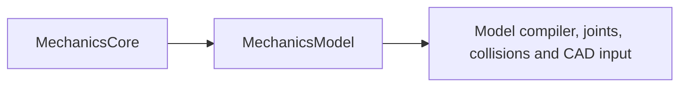

# Model component

## Purpose and Scope

Parent: [responsibility owner](../DESIGN.md). Ownership: IM02, requirements MD-001, MD-005, RB-001/002/004/006 in [SPEC](../../../../SPEC.md). This module owns mechanical identity, independent representations, validated inertia and generalized base records. Children: [Identity](Identity/DESIGN.md), [Representations](Representations/DESIGN.md), [Inertia](Inertia/DESIGN.md), [Bodies](Bodies/DESIGN.md), [Coordinates](Coordinates/DESIGN.md). Each establishes its contract before source; evidence is recorded at handoff. No downstream physics or whole-platform capability is inferred from this module.

## Responsibilities and Boundaries

Mechanical identity, independent representations, validated inertia and generalized base records. Components own their exact admitted domains and failure/acceptance rules. Model compiler, joints, collisions and CAD input consume public contracts and retain their own graph, state, physical formulation and composition authority.

## Related Designs

| Design | Relationship | Contract used | Summary | Cautions |
|---|---|---|---|---|
| [Responsibility owner](../DESIGN.md) | parent | Implementation ownership and SPEC IDs | Module composition authority | Full target remains incomplete |
| [Core](../../Mathematics/Core/DESIGN.md) | depends on | MechanicsCore finite immutable SI geometry and inertia transforms | Verified foundation, commit ba1ff0c | Handoff certifies Core only; new algorithms require their own actual evidence |
| [Identity](Identity/DESIGN.md) | child | Typed identities and revision-safe references | Owns implementation and proof | Detailed component contract is authoritative |
| [Representations](Representations/DESIGN.md) | child | Independent provenance-bearing mechanical representations | Owns implementation and proof | Detailed component contract is authoritative |
| [Inertia](Inertia/DESIGN.md) | child | Analytic mass and physical inertia validation | Owns implementation and proof | Detailed component contract is authoritative |
| [Bodies](Bodies/DESIGN.md) | child | 2D/3D mode and representation records | Owns implementation and proof | Detailed component contract is authoritative |
| [Coordinates](Coordinates/DESIGN.md) | child | Fixed/floating generalized base layout | Owns implementation and proof | Detailed component contract is authoritative |

## Architecture

The target imports MechanicsCore. Component internals stay inside their directory; component composition consumes documented public contracts. Cross-module dependency changes are coordinated through the root package owner.

## Contracts and Invariants

SI, finite-input and explicit failure contracts inherit SPEC section 2. Service protocols declare callable operations as requirements. Every produced response is owned by its caller and includes the qualification needed by its consumers. Component designs own the precise representations, numerical domains and falsifiable guarantees. Partial feature/platform coverage stays explicit.

## State, Ownership, and Lifecycle

Immutable value records and operation-local mutable workspace have no shared mutation. Any reference-owned shared mutable state requires the same Mutex or actor and Sendable/ownership contract on Native, WASM and Embedded; component designs must establish that boundary before source creation. Borrowed storage cannot outlive its owner.

## Failure, Concurrency, and Constraints

Invalid inputs, numerical/domain failure and unsupported formulations are typed failures. No silent precision, physical-model or backend fallback is admitted. Resource limits and tolerances are explicit caller policy where they affect acceptance; estimated constants do not establish correctness.

## Verification and Change Impact

The corresponding Tests/MechanicsModelTests owns behavioral evidence for the component contracts. Native tests must exercise actual production operations, success, invalid input and arithmetic/domain failure. Producer handoff records verified algorithms and exact profile evidence. Changed contracts require rechecking their direct clients; compiler, mechanism execution and full target integration remain separate owners.

### Producer handoff evidence (2026-10-03)

10 native tests in three suites passed, covering identities/representations, inertia/analytic composition and base q/v records. The composite executable calls MassPropertyCalculating, invalid-density rejection and spatial 7/6 encode/decode on each profile. Global graph compilation, contact reactions, joint dynamics and CAD integration remain downstream evidence.

Native: Apple Swift 6.4 compiler tag swift-6.4.0-RELEASE on arm64 macOS 27.0; Testing target arm64e-apple-macos14.0. Root's combined native run passed 40 tests across Core, Model, Numerics and Materials; after explicit dependency-import corrections, the affected 10 Numerics tests passed again. FoundationVerification exited 0 on Native and separately compiled/linked artifacts for swift-6.4.0-RELEASE_wasm and swift-6.4.0-RELEASE_wasm-embedded, both executed with Node.js 24.19.0 WASI Preview 1. These are selected real API runtime paths; they do not certify every branch, browser, Linux/iOS, GPU or a whole mechanical simulation.

Ownership review: immutable Sendable values and operation-local workspace. Numerics' mutable NumericalWork is a value owned by the current operation and mutated through exclusive inout; no reference-owned shared state, target-dependent storage/conformance, unsafe pointer or unchecked isolation bypass exists. No synchronization was removed for Embedded. Runtime sessions and shared mutable state remain future owners.

### Consolidation contract
This directory is a component inside the SwiftMechanics module, not a separate SwiftPM target. Its existing public behavior and exact-profile evidence remain its contract authority. Cross-component access uses the documented contracts; internal visibility alone does not grant admission or publication authority. Source relocation requires integrated behavioral requalification.
