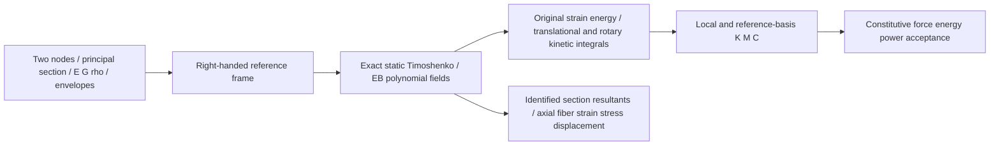

# Spatial Beams

## Purpose and Scope
AF35.11 selected FX-002/007/010 spatial two-node, twelve-coordinate small-strain/small-rotation beam. Parent: [Flexible](../DESIGN.md); no children. Own Euler–Bernoulli and shear-deformable Timoshenko interpolation, axial/biaxial bending/shear/torsion, oriented mass/stiffness/damping, constitutive response and identified section/fiber fields. Selected Native assembly/response/field qualification is recorded below; ordinary/Embedded, Git integration and full FX closure remain separate obligations.

## Responsibilities and Boundaries
The element owns homogeneous isotropic section equations and reference-basis transforms. Callers supply material/section inputs, node/reference identity, admissible slenderness and calibrated linear envelopes. Mesh assembly, constraints, global solve/evolution, CAD section membership, warping, plasticity and finite rotation belong to other owners. The old planar Hermite beam remains unchanged and supplies no three-dimensional capability.

## Related Designs
| Design | Relationship | Contract Used | Cautions |
|---|---|---|---|
| [Flexible](../DESIGN.md) | parent | Disjoint spatial element ownership | Selected Native domain only |
| [Core geometry](../../../Mathematics/Core/Geometry/DESIGN.md) | depends on | Vector3/Matrix3 directional algebra | Right-handed reference coordinates; no unchecked rotation |
| [Model representations](../../../Modeling/Model/Representations/DESIGN.md) | depends on | SourceProvenance and EntityID | Source/frame identities are retained without invented geometry |
| [Flexible mesh](../Mesh/DESIGN.md) | depends on | FlexibleNode immutable reference position | Nodes retain explicit UInt64 identity; no tetrahedral inference |
| [Materials elasticity](../../Materials/Elasticity/DESIGN.md) | depends on | IsotropicElasticity physical admission | Caller E and G imply bulk through the same isotropic relation; no modulus substitution |
| [Numerics](../../../Mathematics/Numerics/LinearAlgebra/DESIGN.md) | depends on | NumericalWork checked work/storage | Separate metadata/operation bounds, no hidden solver |
| [Existing beams](../Beams/DESIGN.md) | coordinates with | Existing small-slope planar conventions | Separate source and authority; no claim of reused spatial qualification |
| [Qualification](../../../../../Verification/SpatialBeamsQualification/DESIGN.md) | used by | Actual public element operations | Selected Native proof; portable and broader domains remain open |

## Architecture

## Contracts and Invariants
Reference coordinates are right-handed. Local x runs first→second node; local y is the normalized projection of the supplied principal-section y direction perpendicular to x; z=x×y. A caller sine threshold rejects collinear/near-collinear orientation. Q has local axes as columns; all nodal translation/rotation triples use Qᵀ for reference→local and Q for local→reference. Coordinates are `[u,v,w,thetaX,thetaY,thetaZ]` at node1 then node2; translations are m and infinitesimal rotations rad. No absolute finite rotation/quaternion is interpreted as a linear coordinate.

Material input includes positive finite E [Pa], G [Pa], rho [kg/m³], material EntityID and source. Physical isotropy requires 0<E/G<3 (−1<nu<0.5); the derived bulk E/[3(3−E/G)] is admitted through the original IsotropicElasticity. Section input includes A [m²], Iy/Iz/J [m⁴], ky/kz>0, positive supplied outer bounds cy/cz [m] and radius-of-gyration-based slenderness range. Iy≤A*cz² and Iz≤A*cy² are necessary bounds; product of inertia is assumed zero by the caller's declared principal axes. J is the supplied Saint-Venant torsion constant, distinct from mass polar area moment Iy+Iz. E/G/rho and section coefficients are never guessed or replaced.

The original generalized strain vector is `[u', v'−thetaZ, w'+thetaY, thetaX', thetaY', thetaZ']`. D=diag(EA,kyGA,kzGA,GJ,EIy,EIz); Euler–Bernoulli enforces both transverse shear strains exactly zero. Timoshenko uses the exact static homogeneous interpolation for each transverse pair, not a locking-prone linear-displacement/linear-rotation interpolation. For v/thetaZ, a=(v2−v1)/L−(thetaZ1+thetaZ2)/2, s=(S L²)/(S L²+12EI), h=12EI/(S L²+12EI), gamma=h*a. With xi=x/L, F=s(3xi²−2xi³)+h*xi, v=v1+L theta1(xi−xi²/2)+L theta2 xi²/2+L*a*F, theta=theta1(1−xi)+theta2 xi+6s*a*xi(1−xi). The w plane uses theta=−thetaY and EIy/kzGA. EB is s=1,h=0. Both are cubic displacement/quadratic rotation fields, retain six infinitesimal rigid null modes and positive strain energy on deformation. There is no selective-underintegration/hourglass branch.

K=∫BᵀDB dx uses four-point Gauss integration, exact for these stiffness polynomials; Mconsistent=∫rho(A NuᵀNu+(Iy+Iz) NthetaXᵀNthetaX+Iy NthetaYᵀNthetaY+Iz NthetaZᵀNthetaZ) dx uses the same exact degree-seven quadrature. Supplied density/section moments provide all three rotary inertias. Consistent M is positive definite and preserves the interpolated translational/rotary kinetic energy, including rigid motion. Explicit endpoint-lumped M assigns rho*A*L/2 to each nodal translation and rho*(Iy+Iz,Iy,Iz)*L/2 to each rotation: positive, exact total translational mass/section rotary inertia, but transverse line-distribution inertia is the admitted endpoint quadrature approximation. It is not claimed to preserve the consistent transverse rigid-rotation kinetic energy. C=alpha*M+beta*K, alpha,beta≥0; vᵀCv≥0. Mass-proportional damping is an explicit reference-frame viscous contribution and can damp rigid modes; it is not internally self-balanced elasticity.

## Runtime Flows
Assembler admits metadata/counts/work before allocation, builds the physical frame and s/h factors, integrates original strain and kinetic forms into symmetric local operators, transforms them into reference coordinates and constructs damping. Original normalized rigid-mode action and symmetry/finite checks reject inconsistent operators before publication. Cholesky admission of the length-normalized full mass and the six-coordinate stiffness with the first node held fixed rejects lost positive inertia/deformation pivots; this internal check adds no boundary condition to returned operators. No geometric stiffness is added. Reference damping is constructed from the returned reference M/K so its public Rayleigh identity holds directly.

State retains the exact immutable beam definition; evaluator compares that entire source/law/frame value against assembly. All twelve displacement/rate inputs are finite. Each operation reapplies its current orientation/slenderness admission, then checks the caller linear envelope throughout each polynomial field. Axial/fiber strain and curvature attain their maxima at endpoints; rotation/slope quadratic extrema are included analytically, not inferred from quadrature samples. Component extrema produce conservative L1 rotation/slope/shear bounds and cy+cz bounds the outer twist radius. Calibrated envelope values are strictly between zero and one. This may reject states below the less conservative Euclidean limits, and never expands the declared linear domain. Out-of-domain state fails. Original quadrature derives response energy, gradient and elastic power independently of returned matrix action. Those are compared to Kq and qᵀKq/2; nodal force and moment balance, original strain/resultant power and nonnegative damping dissipation decide response publication. The same section law used by field queries supplies endpoint tractions: the first-node gradient is minus the x=0 force/moment and the second-node gradient is plus the x=L force/moment. This independent boundary-traction check includes EB moment-gradient shear and fixes its sign to the actual force path. Field publication separately uses the same admitted source/state/envelope and original section laws. Restoring elastic force is −dU/dq; the returned positive tangent is d²U/dq², so derivative of restoring force is its negative. Returned nodal vectors remain in the identified reference frame.

Field queries specify xi∈[0,1] and declared section coordinates y/z within the caller-supplied bounds. They retain element/node/material/source/revision, reference/element frame and location. Section resultants `[N,Vy,Vz]` and `[T,My,Mz]` use original section laws; EB shear is recovered from moment gradients (Vy=−Mz', Vz=My'), while its constitutive shear strain/energy remains zero. Fiber axial strain=epsilon+z*kappaY−y*kappaZ and normal Cauchy stress=E*strain (linear small-strain measure). The explicitly named rigid-section fiber displacement includes the infinitesimal section-rotation offset; it is the selected one-dimensional beam kinematic field and does not include an unresolved Saint-Venant axial warping displacement. Typed measure/projection tags distinguish this reduced kinematic output, axial Cauchy stress, engineering strain/curvature and constitutive versus moment-gradient recovered shear resultants. The query labels axial stress only, with no averaging and no stress projection from nodal forces. General resolved torsion/transverse shear stress needs section warping/distribution geometry and fails explicitly when requested. Bounds are not CAD material-point membership: the caller owns the declared section location's physical interpretation. Rotations/strain are local engineering measures; reference displacement/resultants use Q.

## State, Ownership, and Lifecycle
Inputs, assembly, state, field and response are immutable Sendable values, with exact source retained. Only caller-exclusive NumericalWork and operation-local dense 12×12 storage are mutable. No global cache, target-conditioned state, unsafe pointers or callbacks under a lock. Operators and outputs share immutable Array backing when possible. The caller owns the assembly/response lifetime; no deferred work or continuation is installed.

| Public interface | Concrete path | Output authority |
|---|---|---|
| SpatialBeamAssembling.assemble | ReferenceSpatialBeamAssembler | Immutable physical operators/frame |
| SpatialBeamEvaluating.evaluate | ReferenceSpatialBeamEvaluator | Constitutive energy/force/power and positive energy tangent |
| SpatialBeamEvaluating.field | ReferenceSpatialBeamEvaluator | Unaveraged engineering-strain/linear-axial-Cauchy measures and section resultants |

| Logical state | Native / WASM / Embedded storage | Access / release |
|---|---|---|
| Definitions, state, outputs | Immutable Sendable values, same declarations | Value reads; caller lifetime |
| Work/scratch | Caller-exclusive inout NumericalWork / operation-local arrays, same declarations | Synchronous exclusive mutation; return/throw releases local storage |

Conservative preallocation scalar bounds are 2304 for assembly and 4096 for response/field including retained assembly and live scratch. Charges are deterministic upper operation reservations immediately before bounded loops; metadata charges one scan operation per admitted byte. This is logical work/storage accounting, not measured allocation or performance evidence.

## Failure, Concurrency, and Constraints
Policy owns positive metadata/work/storage capacities, orientation condition, admissible slenderness interval and dimensional absolute+relative acceptance tolerances (normalized operator/energy/power/force/moment). Finite every-term admission rejects overflow; positive physical coefficient/factor/pivot scales that underflow to zero fail. Original nonzero strain/rate/velocity square forms that underflow to zero also fail rather than publishing zero energy. Ordinary signed contractions remain floating arithmetic subject to the supplied dimensional acceptance tolerances. Metadata is scanned with bounded work; cancellation is checked during quadrature/matrix rows and before publication. Every operation preserves its retained NumericalWork prefix on failure. Callable finite-rotation and resolved section stress selections carry immediate incomplete markers and typed errors. Thermal/prestress/warping displacement laws have no declarations in this child. No fallback to planar EB, mass form or alternate material/integration law.

## Verification and Change Impact
The selected independent Native fixtures check axial extension, each bending plane, twist and Timoshenko shear compliance; rigid six-mode null action; frame covariance; original field energy/force/power/resultant signs; consistent and explicit lumped mass kinetic identities; damping dissipation; EB slender and shear-soft limits; section/fiber metadata; finite-rotation/slenderness/location/work/cancel refusal. Source-only review is one coherent pass and causal repair. The selected Native evidence below binds the implemented linear domain; full finite-rotation FX-002 remains unimplemented.

### Assigned independent qualification preparation
[SpatialBeamsQualification](../../../../../Verification/SpatialBeamsQualification/DESIGN.md) owns six shared analytic public cases and one separately awaited Native Task cancellation case. The existing25 source contracts, physical coefficients,12DOF ordering, small-rotation domain and error branches remain unchanged. The historical Native2363 preparation supplies no fresh inputs; the selected AF38 common-producer proof below owns the exact Native source/object/module association. Root owns compiler lease/registration and shared documents.

## AF38 Selected Native Closure

[Qualification](../../../../../Verification/SpatialBeamsQualification/DESIGN.md#af38-fresh-common-native-contract) owns the fresh common-producer reader contract, exact source/object/module binding, selected physical fixtures and target availability admission. The original25 production sources, equations, tolerances, accounting and incomplete finite-rotation/resolved-stress refusals remain unchanged. The original immutable2363 record above is historical and supplies no fresh objects. Actual Native results must be recorded before any selected behavior claim; broader FX closure and portable execution remain separate obligations.

### AF38 Actual Native Evidence
The common producer contains actual2270 frozen sources: committed f0325b0 baseline2124, the original seven cohorts129 and the Root-admitted SDF17 cohort. This component consumes only its original qualified Core/model/material/numerical contracts; SDF supplies no beam feature. All25 production Swift files remain byte-identical to the original production freeze.

The same fresh module/dynamic library passed seven original tests (six independent physical cases plus actually awaited self-cancelled Task) and six original public groups. Stiffness/compliance, consistent/endpoint mass, Rayleigh damping, frame covariance, energy/virtual power, field/source identity, refusals and exact logical-work prefixes retained their original oracles. Support/Public actually compile for macOS13; Testing actually compiles for macOS14; real Mutex15 fixture code is entered through typed runtime availability admission. The production equations, API, tolerances and work contracts are unchanged.

[Qualification](../../../../../Verification/SpatialBeamsQualification/DESIGN.md#af38-actual-native-evidence) owns receipts, the causal fixture-only typedthrows repair and exact read-only producer/consumer before-after bindings. This selected Native evidence is not ordinary/Embedded, mesh/evolution, resolved stress or finite-rotation qualification. Root owns final additive registration and commit.
