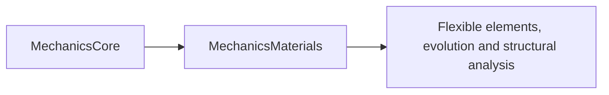

# Materials component

## Purpose and Scope

Parent: [responsibility owner](../DESIGN.md). Ownership: IM18, requirements FX-005/006 in [SPEC](../../../../SPEC.md). This module owns stress/strain measures, constitutive response, tangent consistency and material state. Children: [Constitutive](Constitutive/DESIGN.md), [Elasticity](Elasticity/DESIGN.md), [Plasticity](Plasticity/DESIGN.md). Each component establishes its contract before source; behavior/profile evidence is recorded at handoff. No downstream physics or whole-platform capability is inferred from this module.

## Responsibilities and Boundaries

Stress/strain measures, constitutive response, tangent consistency and material state. Components own their exact admitted domains and failure/acceptance rules. Flexible elements, evolution and structural analysis consume public contracts and retain their own graph, state, physical formulation and composition authority.

## Related Designs

| Design | Relationship | Contract used | Summary | Cautions |
|---|---|---|---|---|
| [Responsibility owner](../DESIGN.md) | parent | Implementation ownership and SPEC IDs | Module composition authority | Full target remains incomplete |
| [Core](../../Mathematics/Core/DESIGN.md) | depends on | MechanicsCore finite matrices, rotations and SI conventions | Verified foundation, commit ba1ff0c | Handoff certifies Core only; new algorithms require their own actual evidence |
| [Constitutive](Constitutive/DESIGN.md) | child | Measures, domain errors and shared response | Owns its implementation and behavioral evidence | Its detailed contract is authoritative |
| [Elasticity](Elasticity/DESIGN.md) | child | Linear and objective hyperelastic response | Owns its implementation and behavioral evidence | Its detailed contract is authoritative |
| [Plasticity](Plasticity/DESIGN.md) | child | Bounded plastic history, return map and tangent | Owns its implementation and behavioral evidence | Its detailed contract is authoritative |

## Architecture

The target imports MechanicsCore. Component internals stay inside their directory; component composition consumes documented public contracts. Cross-module dependency changes are coordinated through the root package owner.

## Contracts and Invariants

SI, finite-input and explicit failure contracts inherit SPEC section 2. Service protocols declare callable operations as requirements. Every produced response is owned by its caller and includes the qualification needed by its consumers. Component designs own the precise representations, numerical domains and falsifiable guarantees. Partial feature/platform coverage stays explicit.

## State, Ownership, and Lifecycle

Immutable value records and operation-local mutable workspace have no shared mutation. Any reference-owned shared mutable state requires the same Mutex or actor and Sendable/ownership contract on Native, WASM and Embedded; component designs must establish that boundary before source creation. Borrowed storage cannot outlive its owner.

## Failure, Concurrency, and Constraints

Invalid inputs, numerical/domain failure and unsupported formulations are typed failures. No silent precision, physical-model or backend fallback is admitted. Resource limits and tolerances are explicit caller policy where they affect acceptance; estimated constants do not establish correctness.

## Verification and Change Impact

The corresponding Tests/MechanicsMaterialsTests owns behavioral evidence for the component contracts. Native tests must exercise actual production operations, success, invalid input and arithmetic/domain failure. Producer handoff records verified algorithms and exact profile evidence. Changed contracts require rechecking their direct clients; compiler, mechanism execution and full target integration remain separate owners.

### Producer handoff evidence (2026-10-03)

9 native tests in two suites passed, including analytic/shear/recovery, plastic cycles, history isolation, objectivity and directional tangents. The composite executable actually calls the linear/hyperelastic/plastic service protocols, finite rotation, dissipation and virgin-history tangent on each profile. Element/corotational/ANCF pairing, evolution/coupling, other calibrated laws and device paths remain downstream evidence.

Native: Apple Swift 6.4 compiler tag swift-6.4.0-RELEASE on arm64 macOS 27.0; Testing target arm64e-apple-macos14.0. Root's combined native run passed 40 tests across Core, Model, Numerics and Materials; after explicit dependency-import corrections, the affected 10 Numerics tests passed again. FoundationVerification exited 0 on Native and separately compiled/linked artifacts for swift-6.4.0-RELEASE_wasm and swift-6.4.0-RELEASE_wasm-embedded, both executed with Node.js 24.19.0 WASI Preview 1. These are selected real API runtime paths; they do not certify every branch, browser, Linux/iOS, GPU or a whole mechanical simulation.

Ownership review: immutable Sendable values and operation-local workspace. Numerics' mutable NumericalWork is a value owned by the current operation and mutated through exclusive inout; no reference-owned shared state, target-dependent storage/conformance, unsafe pointer or unchecked isolation bypass exists. No synchronization was removed for Embedded. Runtime sessions and shared mutable state remain future owners.

### Consolidation contract
This directory is a component inside the SwiftMechanics module, not a separate SwiftPM target. Its existing public behavior and exact-profile evidence remain its contract authority. Cross-component access uses the documented contracts; internal visibility alone does not grant admission or publication authority. Source relocation requires integrated behavioral requalification.

### Additional Maxwell law
Child: [Maxwell](MaxwellRelaxation/DESIGN.md). Contract and qualification belong to that child; existing Runtime/evolution scope is unchanged.

### Additional Thermal law
Child [Thermal](Thermoelasticity/DESIGN.md) owns its selected service contract and independent verification. Existing evolution and parent qualification are retained.

### Nine-service additive children
- [KelvinVoigt](KelvinVoigt/DESIGN.md): selected independent constitutive service; qualification belongs to child.
- [OrthotropicElasticity](OrthotropicElasticity/DESIGN.md): selected independent constitutive service; qualification belongs to child.

### Additional relaxation, creep and finite-elasticity children
- [StandardLinearSolid](StandardLinearSolid/DESIGN.md): selected public constitutive service; behavior and qualification owned by child.
- [BurgersCreep](BurgersCreep/DESIGN.md): selected public constitutive service; behavior and qualification owned by child.
- [NeoHookean](NeoHookean/DESIGN.md): selected public constitutive service; behavior and qualification owned by child.

### Additional invariant potentials
Child: [InvariantHyperelasticity](InvariantHyperelasticity/DESIGN.md). Six selected immutable potential implementations share the existing HyperelasticResponding public interface and the additive Constitutive public mapping; calibration, tangent and profile proof belong to the child.
