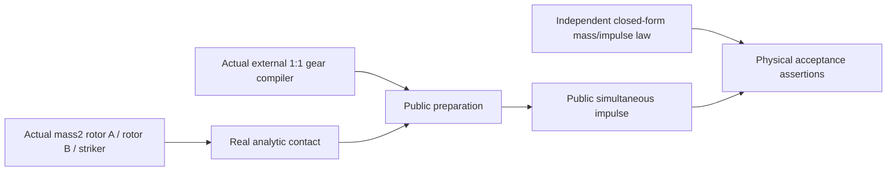

# Mechanics Constrained Impact Tests

## Purpose and Scope

This test target proves the [Constrained Normal Impulse](../../Sources/SwiftMechanics/Execution/Hybrid/ConstrainedNormalImpulse/DESIGN.md) child through public producers and physical behavior. Parent: [Tests](../DESIGN.md). It owns the independent constrained gear/striker oracle and scoped failure fixtures; root owns target registration and final profile execution. Evidence is pending implementation and actual execution.

## Responsibilities and Boundaries

Tests compile the real fixed-root model, real transmission relation and analytic collision witness. They do not mint prepared/result evidence or use a post-contact projection as the expected solver. Sleep/Runtime wake/publication/checkpoint/RNG/history are subsequent integration responsibilities and are not certified by this lower target.

## Related Designs

| Design | Relationship | Contract Used | Summary | Cautions |
|---|---|---|---|---|
| [Tests](../DESIGN.md) | parent | Target ownership | Dedicated lower behavioral evidence | Registration belongs to root |
| [Constrained Normal Impulse](../../Sources/SwiftMechanics/Execution/Hybrid/ConstrainedNormalImpulse/DESIGN.md) | depends on | Preparation, opaque source/result, solve, policy and typed failure | Sole algorithm authority | No private producer constructors |
| [Hybrid Tests](../MechanicsHybridTests/DESIGN.md) | coordinates with | Existing actual analytic-impact approach | Preserve old independent impact behavior | No shared mutable fixture or edits |

## Architecture

## Contracts and Invariants

The exact fixture has grounded Z rotors A/B with Izz=2, a Y slider striker with mass=2, source angular velocities zero and striker velocity -1, an actual 1:1 external gear row `B=[1,1,0]`, and analytic lever-arm contact `J=[-1,0,1]`. Source positions satisfy the actual gear relation and the striker touches rotor A at lever x=1. Actual generalized mass is `diag(2,2,2)`. The constrained inverse normal mass is 3/4.

| Restitution | Contact impulse | Post velocity A/B/striker | Retained multiplier | K before/after | Lost energy |
|---|---|---|---|---|---|
| 1 | 8/3 | -2/3, +2/3, +1/3 | 4/3 | 1 / 1 | 0 |
| 0 | 4/3 | -1/3, +1/3, -1/3 | 2/3 | 1 / 1/3 | 2/3 |

Assertions independently calculate original MΔv, contact plus retained generalized impulse, Bv+, actual Jv+ and kinetic energy. The e1 counterexample distinguishes the implementation from free impulse p=2 followed by gear projection, which gives [-1/2,+1/2,0], rebound1/2 and K1/2. Grounded bearing support explains lack of closed-world linear momentum conservation; the tested owner invariant is original generalized mass balance.

## Runtime Flows

Fresh local fixture → original compiler/transmission/collision suppliers → public preparer → public solver → independent physical assertions. Negative tests alter one admitted bound/source/law/domain or inject one protocol fault. Counters use a common Mutex on all targets; independent test instances avoid shared mutable state. No build/cache snapshot is created before root grants the resource slot.

## State, Ownership, and Lifecycle

Fixture source and expected values are immutable and local. Test suppliers use `Mutex` for call counts and controlled fault state; callbacks remain outside locks. Source owners retained by results prove exact source lifetime. No target branch weakens Sendable or synchronization.

## Failure, Concurrency, and Constraints

Cover nonzero q/time/layout scales and unchanged original source; malformed/revision/layout dimensions; redundant retained rows; blocked normal mode; nonclosing contact; multiple/time-dependent/nonlinear unsupported domains; factor/storage/work caps before call; original supplier typed errors; numerical/contact/load reset on success/failure; unknown failed linear work; cancellation before and during supplier. Known charged prefixes must survive refusals and no failed callback is retried. Success must report actual nonzero separate supplier work.

## Verification and Change Impact

Implement one scoped comprehensive review and finding-limited recheck, then root-controlled focused Native and original Native/WASM/Embedded profiles. Tests exercise both e0/e1 and refusal/work/cancellation behavior. Existing producer algorithms and free Hybrid target are read-only. This target alone cannot qualify upper sleep contact wake or broad multi-contact impact.
