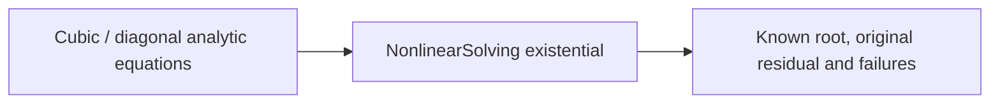

# Nonlinear behavioral evidence

## Purpose and Scope

Parent: [MechanicsNonlinear](../../Sources/SwiftMechanics/Mathematics/Nonlinear/DESIGN.md). Owns native CPU-reference IM04 manufactured equation tests. SO-003/007/008/009 are qualified for the documented square-equation baseline, not complete mechanical behavior.

## Responsibilities and Boundaries

Fixtures supply original equations, analytic Jacobians, known solutions, dimensional/reference scales and fixed tolerances. They exercise production public protocols and supplier LU; no internal success flag or mock replaces residual evidence. Equation callbacks charge work and overwrite solver-owned outputs.

## Related Designs

| Design | Relationship | Contract Used | Summary | Cautions |
|---|---|---|---|---|
| [NonlinearSolve](../../Sources/SwiftMechanics/Mathematics/Nonlinear/NonlinearSolve/DESIGN.md) | verifies | strategy, domain, derivative and original acceptance | real production path | conditioning belongs to the recorded tangent point |
| [Linear algebra](../../Sources/SwiftMechanics/Mathematics/Numerics/LinearAlgebra/DESIGN.md) | depends on | actual dense LU | singular/rank/resource behavior | failed supplier work is unavailable |

## Architecture

## Contracts and Invariants

Float64 cubic F=x^3-1 starts at x=0.1 with expected root 1. Residual tolerance is absolute 1e-10 plus relative 1e-10 against reference scale 1; root error <1e-9. Directional probes use distance 1e-6 and derivative absolute/relative tolerances 1e-6/1e-5, admitting forward-difference truncation while rejecting a doubled analytic derivative. Armijo contraction=0.5, sufficient decrease=1e-4, minimum fraction=1e-8. Trust initial/min/max radii 10/1e-8/20 and ratio thresholds 0.1/0.25/0.75, contraction/expansion 0.5/2 produce actual rejected trials. The bounded cubic domain x<=2 tests domain rejection and retained initial input. x=0 has singular derivative rank 0. Internal residual intentionally returning zero is rejected by independent original x^3-1. The diagonal linear equation has Jacobian diag(1e-8,1), known root (1,2), rank 2 and condition-one-norm 1e8. Float32 residual tolerances 1e-5/1e-5, probe distance 1e-3 and derivative tolerances 1e-2/1e-3 account for representational/truncation errors and root error <1e-5; requested Float64 on Float32 rejects. Limits are fixture-selected, never library defaults.

## State, Ownership, and Lifecycle

Each test owns immutable equation values and local buffers/results. Caller input arrays remain unchanged through rejected/failed trials. No shared mutable fixtures. The deliberately mutating layout negative fixture owns a per-instance Mutex; its class and dedicated test require macOS 15+, the actual verification host satisfies that availability. Production retains no shared state and does not acquire that platform restriction. Cancellation tests own, finish and await their AsyncStream/task. Production is synchronous and owns no external stream/session resource.

## Failure, Concurrency, and Constraints

Separate scalar-storage, arithmetic, shared iteration, nested-LU and dense-factor capacity limits force contextual failures with known last residual and phase. Invalid derivative output length, wrong derivatives, singularity, stalled steps, domain violations and premature internal acceptance fail. Failed supplier work availability is tested rather than inventing a consumed-work value. A callback that changes both metadata and output length is rejected against captured layout. An original-residual callback that cancels its current task cannot return an accepted result.

## Verification and Change Impact

Use `python3 Scripts/run_with_timeout.py 180 swift test --build-path .build/nonlinear-kernels --filter NonlinearSolverTests`. The final native focused snapshot passed all 11 tests with Swift 6.4 release and reference CPU; the dedicated metadata test executed on the macOS 15+ host. Root owns whole-cohort and exact WASM/Embedded profile qualification. Mechanics, runtime rollback and constrained equilibrium are integration gaps owned by downstream tasks.
