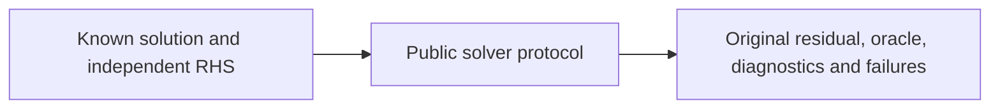

# Numerical behavioral evidence

## Purpose and Scope

Parent: [MechanicsNumerics](../../Sources/SwiftMechanics/Mathematics/Numerics/DESIGN.md). Owns IM03 native CPU reference evidence for SO-001/002/006/010. This is the real SwiftPM MechanicsNumericsTests target.

## Responsibilities and Boundaries

Manufactured equations and independently assembled dense matrices are frozen before evaluating results. Tests own expected results and tolerances, not numerical algorithms. Mechanical articulated-body behavior, nonlinear/contact iterations and complete platform qualification remain downstream-owned.

## Related Designs

| Design | Relationship | Contract Used | Summary | Cautions |
|---|---|---|---|---|
| [Linear algebra](../../Sources/SwiftMechanics/Mathematics/Numerics/LinearAlgebra/DESIGN.md) | verifies | operator/solver/capability/work | actual LU, Cholesky and CSR CG | CG admits strict diagonal dominance |
| [Reduction](../../Sources/SwiftMechanics/Mathematics/Numerics/Reduction/DESIGN.md) | verifies | Schur and tree coordinates | independent dense oracle | generic tree only |
| [Scaling](../../Sources/SwiftMechanics/Mathematics/Numerics/Scaling/DESIGN.md) | verifies | SI scales and diagonal perturbation | original equation effects | original residual need not pass after perturbation |

## Architecture

## Contracts and Invariants

Float64 equations use absolute/relative residual tolerances 1e-12/1e-12 and absolute pivot threshold 1e-14 for order-one fixtures. Float32 uses 1e-6/1e-6 and 1e-7, with differential solution error <1e-6 against Float64. SPD fixture has entries of magnitude 1–4 and x=(1,-2,3); saddle fixture uses a zero multiplier block and real LU. Singular rank test has a zero first column but two independent remaining columns, falsifying naive pivot-count rank reporting. CSR fixture has seven nonzeros and exactly matches the independently manufactured dense operator. Tree branching fixture uses four named positions in a topologically ordered parent array and explicitly assembled dense off-diagonals. Schur fixture separately checks x and multiplier coordinates against a three-by-three dense oracle. Mixed scaling uses unknown SI magnitudes 1e-6 kg and 1e6 m, row references 1000 N and 1 m. Explicit 0.1 coefficient regularization with 0.2 same-dimension bounds solves a singular original matrix, and original residual equals the negative reported model effect. No shared mutable fixtures or static test state.

## State, Ownership, and Lifecycle

Tests use local immutable inputs and local task/workspace results. The cancellation test owns and finishes its AsyncStream continuation and awaits the cancelled task. Parallel test execution has no common resource.

## Failure, Concurrency, and Constraints

Shape/product overflow, nonfinite data/arithmetic, malformed CSR/graph, singularity, indefiniteness, unsupported precision/backend, dimension mismatch and over-policy perturbation must throw typed errors. Storage/work/iteration budgets independently reject. All test commands are run with Scripts/run_with_timeout.py; no test outcome implies an unexecuted target/backend.

## Verification and Change Impact

Run `python3 Scripts/run_with_timeout.py 180 swift test --build-path .build/linear-kernels --filter 'LinearAlgebraTests|ReductionTests|ScalingTests'`. A numerical contract or fixture change invalidates only dependent evidence. Root owns native/WASM/Embedded composition validation; mechanisms remain unverified here.
