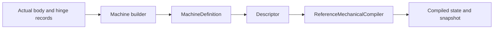

# Machine Tests

## Purpose and Scope
Behavioral qualification of [Machines](../../Sources/SwiftMechanics/Modeling/Machines/DESIGN.md). Parent: [SwiftMechanics](../../DESIGN.md). No child designs.

## Responsibilities and Boundaries
This target owns declarative builder, scoped identity and budget behavior plus actual descriptor/compiler/tree motion. Root verification owns matching Native/WASM/Embedded runtime profiles. Tests do not substitute fake physics or erased Machine existential dispatch.

## Related Designs
| Design | Relationship | Contract Used | Summary | Cautions |
|---|---|---|---|---|
| [Machines](../../Sources/SwiftMechanics/Modeling/Machines/DESIGN.md) | depends on | Complete definition or typed failure | Direct public facade use | Declaration success does not establish compiler admission |
| [Compiler](../../Sources/SwiftMechanics/Modeling/Compiler/DESIGN.md) | depends on | compile/makeState/evaluate | Checks actual articulated motion | Qualification is limited to exercised profile |

## Architecture

## Contracts and Invariants
Selected-branch source order, empty and heterogeneous declarations, scoped reusable instances, canonical-equivalent namespace keys, duplicate rejection and lazy closure execution limits are tested. A failed facade call must publish no descriptor/model. Generic concrete box lifetime is observed through an immutable Sendable class with a Mutex-backed deallocation counter.

## State, Ownership, and Lifecycle
Each test owns independent records and counters. Mutable observation counters use Synchronization.Mutex with the same implementation on all targets. Counter/lifetime tests require macOS 15 because that platform supplies Synchronization.Mutex; production declarations retain macOS 13 deployment. No global mutable fixtures are shared. Lowering contexts remain call-local values.

## Verification and Change Impact
Run the focused SwiftMechanicsMachineTests target with an external timeout after root registration. Actual hinge tests assert rotation and angular velocity; repeated instance tests compile scoped joints connected to an outer root. Budget tests reject before additional lazy closures, and independent retry verifies failed drafts are discarded. Recheck these cases after builder dispatch, namespace encoding, facade publication or budget changes.

### Target authoring qualification

The [Machines verification matrix](../../Sources/SwiftMechanics/Modeling/Machines/DESIGN.md#target-verification-matrix) owns the obligations for the approved structural authoring surface. These tests are planned, not present or passed. This target will own syntax lowering, typed reference/role admission, coordinate placement and actual compiler equivalence. Physical law, deformation, contact and accepted-transition tests remain with their existing responsibility-specific targets; root owns integrated profile qualification. Existing record-based hinge evidence does not qualify the proposed nested primitives.
