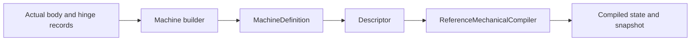

# Machine Tests

## Purpose and Scope
Behavioral qualification of [Machines](../../Sources/SwiftMechanics/Modeling/Machines/DESIGN.md). Parent: [SwiftMechanics](../../DESIGN.md). No child designs.

## Responsibilities and Boundaries
This target owns declarative builder, scoped identity and budget behavior plus actual descriptor/compiler/tree motion. Root verification owns matching Native/WASM/Embedded runtime profiles. Tests do not substitute fake physics or erased Machine existential dispatch.

## Related Designs
| Design | Relationship | Contract Used | Summary | Cautions |
|---|---|---|---|---|
| [Machines](../../Sources/SwiftMechanics/Modeling/Machines/DESIGN.md) | depends on | Complete definition or typed failure | Direct public facade use | Declaration success does not establish compiler admission |
| [Compiler](../../Sources/SwiftMechanics/Modeling/Compiler/DESIGN.md) | depends on | compile/makeState/evaluate | Checks actual articulated motion | Qualification is limited to exercised profile |

## Architecture

## Contracts and Invariants
Selected-branch source order, empty and heterogeneous declarations, scoped reusable instances, canonical-equivalent namespace keys, duplicate rejection and lazy closure execution limits are tested. A failed facade call must publish no descriptor/model. Generic concrete box lifetime is observed through an immutable Sendable class with a Mutex-backed deallocation counter.

## State, Ownership, and Lifecycle
Each test owns independent records and counters. Mutable observation counters use Synchronization.Mutex with the same implementation on all targets. Counter/lifetime tests require macOS 15 because that platform supplies Synchronization.Mutex; production declarations retain macOS 13 deployment. No global mutable fixtures are shared. Lowering contexts remain call-local values.

## Verification and Change Impact
Run the focused SwiftMechanicsMachineTests target with an external timeout after root registration. Actual hinge tests assert rotation and angular velocity; repeated instance tests compile scoped joints connected to an outer root. Budget tests reject before additional lazy closures, and independent retry verifies failed drafts are discarded. Recheck these cases after builder dispatch, namespace encoding, facade publication or budget changes.

### Target authoring qualification

The [Machines verification matrix](../../Sources/SwiftMechanics/Modeling/Machines/DESIGN.md#target-verification-matrix) owns the obligations for the approved structural authoring surface. This target owns the legacy foundation and direct pair regressions. Selected nested structural syntax, coordinate placement, real physical composition and refusals are implemented and exercised by [StructuralAuthoringQualification](../../Verification/StructuralAuthoringQualification/DESIGN.md). Broader matrix cases remain future evidence. Physical law, deformation, contact and accepted-transition tests remain with their existing responsibility-specific targets; root owns integrated profile qualification. Record-based hinge evidence is not substituted for the independent nested physical cases.

The [optional label contract](../../Sources/SwiftMechanics/Modeling/Machines/DESIGN.md#optional-labels-and-initializer-contract) additionally requires identical physical output for label-free/string/closure overloads, label-versus-ID separation, scoped metadata binding, once-only construction and explicit metadata failure. The canonical matrix owns these planned cases; this target has not implemented or passed them.

### Erased binary-pair regression

[MachinePairTests](MachinePairTests.swift) owns direct original-TupleMachine versus ErasedPairMachine comparisons: physical record order, exact pair/leaf node and depth boundaries, and immediate first-failure stopping before the second declaration. [PairObservedMachine](PairObservedMachine.swift) records invocation through the existing per-test Mutex counter and retains the original typed failure. Production storage remains immutable Sendable on all targets; only the Native test observer requires macOS 15. These added tests supplement the unchanged twelve legacy cases and do not replace the unchanged Structural physical fixture or its root-owned portable evidence. Source preparation alone is not a passing result.

The selected1798 Native producer and fresh consumer execute all unchanged twelve legacy cases plus both new Pair cases successfully. Structural8 and the unchanged seven public physical cases pass through the same library. Exact source/object/module authority is retained in [consumer-final-binding](../../.build/af35-structural-authoring-qualification/builder-pair-native/consumer-final-binding.json); The complete registered1910 Native producer now repeats all14 cases alongside Structural8 and public7, using the same-package current module and actual linked objects. [Current qualification authority](../../Verification/StructuralAuthoringQualification/DESIGN.md#complete-registered1910-native-evidence) binds this result. Portable guard/runtime evidence remains selected1608 and belongs to that owner.
