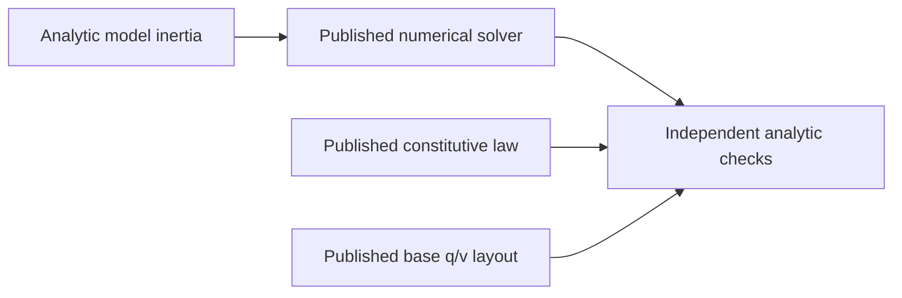

# FoundationVerification

## AF20 selected mechanism composition contract
Root owns public compositions for [NonlinearEvolution](../../Sources/SwiftMechanics/Physics/Mechanisms/NonlinearEvolution/DESIGN.md), [SleepContinuation](../../Sources/SwiftMechanics/Physics/Mechanisms/SleepContinuation/DESIGN.md) and [ReactionPaths](../../Sources/SwiftMechanics/Physics/Mechanisms/ReactionPaths/DESIGN.md). Root registered their source and tests after the original frozen handoff; a confirmed platform counterexample reopens only the affected owner scope before the next frozen build. New verification helpers may use only public SwiftMechanics contracts and actual compiled mechanical models. This composition does not replace child physical tests or close all IM16 requirements.

| Path | Required behavior | Failure evidence |
|---|---|---|
| Nonlinear evolution | Original position and velocity constraints, independent q/v chart and accepted acceleration; checkpoint/restart repeats accepted state | Inconsistent initial state and rejected/cancelled prefix preserve accepted state |
| Sleep continuation | Actual stationary dynamics omission, checkpoint-bound dwell/state, commanded or physical impulse wake, restored replay | Stale physical/time/sequence contributor association fails without publication |
| Reaction recovery | Original body inertial wrench minus physically identified loads; explicit point/frame and equal opposite joint reports | Unrepresented generalized-force allocation is refused |

Setup, nested operations and assertion/checkpoint comparisons use separate non-inlined phases so the existing debug WASM stack reservation is retained. All sessions shut down. Native focused child tests precede one integrated build/test on the frozen graph. Exact Swift 6.4.0 and matching ordinary/Embedded WASM SDKs compile/link and execute the public composition using the original artifacts and profile; EmbeddedUnicode and Node WASI configuration remain unchanged. Logs must include path completion witnesses and exit status. Target-local evidence remains distinct from actual multithread WASI and unsupported domain claims.

The initial registered Native command passed 510 behavioral cases across 35 test targets (124 suites); its independently listed 510 names agree with the successful per-target footers. The full public Native composition exited zero. Original ordinary/Embedded artifacts compiled and linked but failed at runtime. Private immediate stack-boundary diagnostic artifacts stop at Nonlinear->MassWeightedMechanismSolver.accept (Embedded) and SleepMechanismEquation.prepare->restCertificate (ordinary). `.build/af20-debug-owned/frames.txt` records measured static frames: Embedded nonlinear advance 20,816 B, attempt 22,512 B, consistent 11,072 B, solve 19,280 B before frozen mass solve/accept; sleep restCertificate 40,864 B Embedded / 38,160 B ordinary. These diagnostics are not qualification artifacts. The owned execution phases must shorten actual temporary lifetime; numerical equations, accepted-state validation and the original stack profile remain fixed. Only affected Native tests and original public artifact builds/runs require renewal; unchanged producer evidence remains valid.

The first lifetime correction passed thirteen nonlinear and nine sleep Native cases and the full original Native public composition. The original ordinary artifact fails on the awake Sleep -> Integration -> AffineMechanismEquation.motion -> MassWeightedMechanismSolver.accept -> original inertial-force path. The original Embedded artifact fails earlier during cold Sleep.prepareProof -> restCertificate -> restEquilibrium -> the same original mass acceptance. `.build/af20-debug-owned/embedded-phase-guard-full.log` identifies that distinct path; its restEquilibrium frame is 10,192 B, with 2,400 B restCertificate and 2,352 B prepareProof callers. The ordinary immediate boundary diagnostic `.build/af20-debug-owned/wasm-phase-guard-full.log` identifies the actual call chain; raw frame evidence `.build/af20-debug-owned/wasm-phase-frames.txt` shows the existing affine motion retains 19,776 B before nested solves. The necessary affine motion phase/lifetime repair is owned with sleep execution; earlier unrelated producers and original stack configuration remain unchanged. This snapshot does not qualify WASM/Embedded completion.

### AF20 selected original-profile qualification

The final frozen source compiled and linked using exact Swift 6.4.0 RELEASE, Native arm64 macOS 27 and the matching ordinary/Embedded WASM SDKs; Embedded retained EmbeddedUnicode. Unmodified produced public executables each exited zero and reached nonlinear, sleep, tree-reaction and full Foundation completion witnesses. Node.js 24.19.0 WASI Preview 1 ran both WASM artifacts with their original 128 KiB stack reservation. `.build/af20-{native,wasm,embedded}-wake-build.log` and `.build/af20-{native,wasm,embedded}-wake-runtime.log` own final profile evidence. No private guard artifact or enlarged stack qualifies a path.

The registered Native graph passed 510 cases in 35 test targets/124 suites after the shared original acceptance repair (`.build/af20-native-acceptance-final.log`). The final subsequent wake-only lifetime repair passed all nine affected sleep cases (`/tmp/mechanics-sleep-wake-phases-native.log`); unchanged supplier evidence remains valid. Earlier thirteen nonlinear and nine reaction physical/failure cases remain qualified. Root performed one source review plus counterexample-specific repairs and stopped when the actual original-profile gap closed. These are selected synchronous paths, not arbitrary loop/force/topology/mesh domains, multithread WASI, browser, other Apple deployment versions or full 210-requirement/IM48 completion.

## Purpose and Scope
The AF13 extensions register selected public operations for Transmissions, Equilibrium and ContactPatches only after their source freeze. Their selected analytic and typed-failure checks executed with exit 0 on the exact Native/ordinary-WASM/Embedded-WASM profiles recorded below; only those paths extend qualification. Transmission checks bind actual constraint assembly and scalar efforts; Equilibrium checks actual force, statics, continuation and spatial mass linearization; ContactPatches checks supplied affine pressure and exact Tet4-plane force/moment/power. Full requirement ownership remains with the corresponding module designs.

Hybrid replay probe separates restart, each actual evolution call and independent result/checkpoint comparison. Immutable result owners retain completed public values without keeping future checkpoint/comparison temporaries on the nested evolution stack. Replay uses the actual second session and identical required operations, not a diagnostic stack relocation or substitute numerical result.

Parent: [system/package](../../DESIGN.md). Children: none. Root owns this synchronous executable for the IM02/03/04/05/06/07/10/11/15/18 producer handoff. It exercises real public model, numerical, material, kinematic, load, compiler and collision contracts in one process on exact target profiles. It is not a multibody, contact or element simulator.

## Responsibilities and Boundaries
The executable checks independent analytic mass/inertia, linear solve, tree/Schur reduction, quaternion base layout and constitutive state/stress expectations through the published services. Native test targets own broader local evidence. Root owns target registration and selected-profile compile/link/runtime composition; no library-private storage is accessed.

## Related Designs
| Design | Relationship | Contract used | Summary | Cautions |
|---|---|---|---|---|
| [Root](../../DESIGN.md) | parent | Verified producer handoff | Profile composition evidence | Whole-target IM48 remains separate |
| [Core](../../Sources/SwiftMechanics/Mathematics/Core/DESIGN.md) | depends on | SI values, frames and rotations | Mathematical foundation | No dynamics inferred |
| [Model](../../Sources/SwiftMechanics/Modeling/Model/DESIGN.md) | depends on | MassPropertyCalculating, base layout | Analytic mass and q/v admission | Model graph compiler remains downstream |
| [Integration](../../Sources/SwiftMechanics/Execution/Integration/DESIGN.md) | depends on | ExplicitIntegrating, SmoothODEEquations, IntegrationContinuationProvider | Real RK4/Heun-Euler transactions and restart | Euclidean manufactured ODE only |
| [Exchange](../../Sources/SwiftMechanics/Exchange/DESIGN.md) | depends on | NativeModelCoding, NativeModelLoading | SMNX records and required compiler callback | Opaque assets have no physical geometry qualification |
| [Numerics](../../Sources/SwiftMechanics/Mathematics/Numerics/DESIGN.md) | depends on | LinearSolving, TreeLinearSolving, SchurSolving | Original-residual accepted solves | Generic tree reduction is not articulated-body dynamics |
| [ContactLaws](../../Sources/SwiftMechanics/Physics/ContactLaws/DESIGN.md) | depends on | ContactMaterialPairing, ContactLawEvaluating, ContactImpactPredicting | Normal/friction/cohesion/resistance law and scalar restitution | Constitutive prediction only; no coupled response or impact trajectory |
| [Flexible](../../Sources/SwiftMechanics/Physics/Flexible/DESIGN.md) | depends on | TetrahedralMeshValidating, TetrahedralAssembling | Affine force/energy, mass/damping, refinement and failure | Closed homogeneous constant-F tetrahedra only |
| [Dynamics](../../Sources/SwiftMechanics/Physics/Dynamics/DESIGN.md) | depends on | RigidEquationComputing, RigidDynamicsSolving | Offset-COM pendulum, passive-load work, independent residual and failure | Admitted spatial dense equations only; no trajectory/contact proof |
| [Materials](../../Sources/SwiftMechanics/Physics/Materials/DESIGN.md) | depends on | LinearElasticResponding, HyperelasticResponding, PlasticResponding | Qualified stress and history | No element formulation or universal material claim |

## Architecture


## Contracts and Invariants
IM24 selected composition owns a real compiled vertical prismatic sphere above an analytic static plane. Required HybridEvolving calls must reintegrate smooth motion in isolated Runtime owners, locate the closing root, apply a mass-based impulse, reset actual Integration history and publish explicit event continuation. Independent fall time, rebound momentum/energy and post-event motion are checked, followed by checkpoint replay and cancellation preserving the current accepted prefix. This qualifies only the declared constant-acceleration, frictionless sphere/plane domain after actual execution. It does not qualify resting support, general simultaneous coupled impulses or constrained wake behavior. Non-inlined model, context, trajectory and assertion phases retain the original memory/stack profile.

IM14 composition uses an actual compiled revolute binding, required servo and motor witnesses, conjugate affine port power, and a required ActuatorRuntimeContributors owner. The selected probe checks circuit/energy values and real rejected-trial/checkpoint/restart continuation. Calibrated chamber/muscle behavior remains Native-local evidence; accepted motor-driven mechanics and prescribed reactions are downstream. Non-inlined setup, trial and continuation checks preserve the existing original stack profile.

The IM12 composition calls published constraint, assembly and scalar-port witnesses. Independently checked circle intersections, weighted velocity projection, redundant-row ambiguity and passive power must execute on each exact profile. Contradictory original rows must fail. This selected stateless quadratic/scalar domain does not qualify general geometric loops, dynamic reactions, quaternion projection or accepted mechanism evolution. Setup and solve phases use separate non-inlined functions to bound overlapping fixture stack frames. Execution evidence is recorded after runtime verification.

Every check calls actual production code. Nonzero exit is required for unexpected failure or failed analytic expectation. Expected invalid model/capability requests must throw. The admitted Float64 and Float32 paths execute independently with explicit tolerances/budgets, not a backend substitution.

The AF04 Loads extension is executed on the profiles recorded below. It exercises Loads through required service methods: polynomial spring/damper force and energy, affine gravity force and potential, straight affine-waypoint cable derivatives and pulling work, a pure custom provider with independent derivative/energy admission, and point-force mapping on the existing articulated hinge. Compiler checks compile a two-body spatial descriptor through MechanicalModelCompiling, inspect actual motion/layout/structural pattern, and require stale-state and inconsistent-source-pose failure. The requested CompilerTarget label follows the actual compile target in a stateless entry-point adapter. Collision checks call real framed sphere/box/plane witnesses, conservative discovery, geometric manifold continuation, translating moving-plane CCD and typed unsupported-pair failure. Compiler also invokes a pure concrete extension validator through its required validate method and checks independently bounded returned work; this qualifies descriptor admission, not force execution. The executed selected-profile scope is recorded below. This extends selected operation coverage only; full dynamics, contact response and undeclared law domains remain separate.

The PG03 extension executes a budgeted cubic equation through NonlinearSolving, independently checks its root and rejects a false internal residual. It solves an analytic orthant problem and associated friction cone through ComplementaritySolving, including validated warm restart and stale identity rejection. Kinematic service checks exercise a fixed-root offset hinge, analytic point motion/Jacobian/virtual power, spherical q-v dimensions and stale-state failure propagation through public protocols; the Native test owner checks the exact JointError case. These operations extend the probe scope; the actual selected-profile results are recorded below.

The IM15 extension assembles an offset-COM hinge with actual supplied generalized velocity and deliberately nonzero snapshot acceleration. It checks mass/bias/gravity separately, adds a published passive damper response, solves forward/inverse/mass-only/mixed equations through protocol requirements, and verifies independent physical residual plus kinetic/potential/dissipation rates. It rejects mismatched velocity and nonuniform gravity explicitly. Each operation retains separate cumulative NumericalWork and LoadWork. Exact-profile results are recorded only after execution.

The IM19 extension validates a frame-identified tetrahedron, assembles actual polynomial-hyperelastic energy gradient, tangent and reference mass/damping, and independently checks an affine uniaxial patch. It verifies force covariance under rotation, centroid refinement energy/mass preservation and exact frame/inversion failure. Constitutive invocation and numerical arithmetic ledgers remain distinct. Actual profile evidence is recorded after execution.

The IM20 extension combines explicit material pairs and executes linear/Hertz/Hunt-Crossley, history-bearing static/sliding/release friction, rolling/spinning resistance and finite-range cohesion through required service witnesses. Independent force/energy/power/ellipse expectations and separate threshold restitution predictions are checked. Stale geometry and incompatible normal-loss selection must fail. These constitutive checks do not qualify a coupled contact solve or a drop trajectory.

## State, Ownership, and Lifecycle
Only immutable input/response values and synchronous local variables exist. No shared mutable storage, async stream, pointer, persistent state or target-specific synchronization branch is introduced.

## Failure, Concurrency, and Constraints
Root translates an unexpected verification operation failure to FoundationVerificationError and exits with failure. This executable does not alter library failure contracts. Small caller-selected fixture budgets bound solves. Target support is reported only after actual execution; compilation alone is insufficient.

## Verification and Change Impact
Native, WASM and Embedded WASM are separately built with Swift 6.4.0 and matching SDKs, then actually run with a timeout. Node WASI Preview 1 is the WASM runtime, not browser integration. Each child design records the exact evidence scope. A changed consumed API or formula requires rechecking this executable and its relevant native test owner.

### Executed profile evidence (2026-10-03)
Native execution and both separately compiled/linked WASM SDK artifacts exited 0. Exact baseline/runtime identifiers are recorded in the module producer handoffs. This verifies the listed public protocol operations and independent analytical expectations, not whole feature families.

### Exact Embedded provider/link constraints
Swift 6.4.0 release Embedded witness specialization asserts for a nongeneric equation provider whose associated scalar is concretely Double. An isolated one-requirement protocol with BinaryFloatingPoint & Sendable scalar reproduces the same assertion without this library or error/solver machinery. A generic provider specialized to Double compiles; RuntimeCubicEquation uses that same mathematical/protocol path on every profile. Evidence therefore qualifies the exercised generic provider, not arbitrary conformers. The selected Embedded package invocation adds --traits EmbeddedUnicode so Swift String hashing/comparison links the SDK-provided tables. Native and ordinary WASM omit that trait. These constraints do not change physical laws, precision, identity equality, state or synchronization.

### PG03 executed profile evidence (2026-10-03)
The final generic provider and link profile compiled/linked and actually executed with exit 0 on Native, swift-6.4.0-RELEASE_wasm and swift-6.4.0-RELEASE_wasm-embedded (--traits EmbeddedUnicode). Node.js 24.19.0 WASI Preview 1 ran each WASM artifact independently. Every listed numerical/kinematic analytic and failure check executed. The package Native run passed 77 tests; after the explicit Complementarity import correction its affected eight tests passed again. Compiler warnings were an unused clang -rdynamic argument and a test's unnecessary try; neither establishes a physics/backend claim. The Embedded-only failed nongeneric experiment is excluded from qualified provider coverage rather than hidden by a different numerical implementation.

### AF04 Loads executed profile evidence (2026-10-03)
The selected Loads extension and canonically equivalent Unicode frame-ID equality/dictionary hashing compiled/linked and actually ran with exit 0 on Native, ordinary WASM and Embedded WASM. Commands used Swift 6.4.0 release and exact matching SDK IDs; Embedded retained --traits EmbeddedUnicode. Node.js 24.19.0 WASI Preview 1 executed each WASM artifact. Loads native focused tests passed 12 cases/four suites. Compiler and Collision additions are pending producer freeze and independent composition evidence; they are excluded from this execution claim.

### AF04/05 Compiler and Collision executed composition (2026-10-03)
The registered Native package passed 120 behavioral tests (Compiler 17, Collision 14, Loads 12 and the 77 existing producer cases). Native, ordinary WASM and Embedded WASM separately compiled/linked and actually executed the expanded public-protocol probe with exit 0. The real generic extension provider's required validate callback ran and its independent 12-operation/one-scalar evidence was checked. Compiler admission/motion/pattern and exact expected stale/pose failures, analytic witnesses/discovery/manifold ID continuation, moving-plane TOI enclosing 4/11 s and unsupported-pair rejection all executed. Evidence uses the exact Swift 6.4.0 release and matching SDK IDs; Embedded retained --traits EmbeddedUnicode. A Collision Discovery explicit import correction was followed by its affected three Native tests and the successful Embedded rebuild/run. Native and ordinary WASM mathematical results remain valid because that correction changes only module visibility. Async cancellation is proved in the Native test owner, not inferred for the synchronous WASI probe. Whole-target IM48 remains incomplete.

### IM15 executed composition (2026-10-03)
The Dynamics extension separately compiled/linked and executed with exit0 on Native and both exact Swift 6.4.0 release WASM SDKs; Embedded retained --traits EmbeddedUnicode. Node.js 24.19.0 WASI Preview 1 independently ran each WASM artifact. Every listed pendulum/load/scaled solve/energy and exact failure check executed through public required methods. Dynamics Native focused proof passed ten tests; the prior 120-test cohort evidence is unchanged and is not mislabeled as a new 130-test whole-package run. WorldRigidBody's explicit Model import correction affects visibility only. Whole-target IM48 and subsequent Runtime/ContactLaws composition remain incomplete.

### IM19/IM20 selected-profile composition evidence
The expanded registered package passed 154 Native behavioral tests: the previous 120, Dynamics ten, Flexible ten and ContactLaws fourteen. Native and both separately compiled/linked Swift 6.4.0 release WASM SDK artifacts actually executed all listed Flexible/ContactLaws public-service analytic and failure checks with exit 0. Embedded retained --traits EmbeddedUnicode; Node.js 24.19.0 WASI Preview 1 ran both WASM artifacts. No browser, minimum macOS 13, parallel WASI, Runtime, coupled contact or whole-target IM48 qualification follows from these synchronous selected paths.

### Runtime transaction composition scope
The IM08 extension executes a real compiled fixed-root hinge through RuntimeSessionOperating, with required eight-byte counter validation and explicit SplitMix64 continuation. It checks accepted/rejected contributor/random/physical state, independent owners, exact checkpoint round-trip/restart replay, corrupt-prefix preservation and actual transaction counters. An observation lease must reject competing mutation and hold shutdown in draining; the release hook reenters snapshot/shutdown outside locks, then closes once. Mutable probe counters/retained-owner storage use the same Mutex declarations on every target. Runtime methods depending on Mutex/strict UTF8 declare macOS15/iOS18/tvOS18/watchOS11 availability; unsupported Native OS fails this executable instead of skipping the probe. Actual target evidence is recorded after execution; synchronous WASI does not qualify parallel WASI, measured allocator/phase profiling, strong determinism or accepted mechanical evolution.

### IM08 selected-profile composition evidence
The listed Runtime extension separately compiled/linked and actually exited 0 on Native and both exact Swift 6.4.0 release WASM SDK artifacts. Node.js 24.19.0 WASI Preview1 executed each WASM artifact; Embedded retained --traits EmbeddedUnicode. Native focused Runtime evidence is sixteen tests, separate from the prior 154-test cohort rather than a new 170-test whole-package run. The final lifecycle probe captures its Sendable reference owner with identical Mutex fields on all targets; direct escaping capture of a noncopyable Mutex value is rejected by this fixed Embedded compiler. Native/ordinary/Embedded actually exercised the same reentrant release behavior after that probe ownership repair. Full integration IM48 remains incomplete.

### Coupled contact response composition scope
The IM21 extension binds actual collision sphere witnesses and body-local placements to a real prismatic rigid mass operator, current frame/model/geometry revisions and an explicitly paired undamped frictionless linear law. Public required response methods execute one frozen-geometry implicit endpoint step. Independent effective mass, normal force, velocity, finite-interval equivalent impulse, power and original law/cone/momentum/wrench residual expectations are checked. Two dependent contact rows have unique compliant forces while mass rank remains unavailable; a stale collision revision fails. This is a local declared approximation, not a pose integrator, hard impact, frictional grasp, exact Coulomb or tooth-refinement qualification. Actual target evidence is recorded after execution.

### Explicit integration and native exchange composition scope
Integration executes a manufactured constant angular acceleration on an actual compiled revolute chart through required equation witnesses and RuntimeSession transactions. RK4 and adaptive Heun-Euler must reach the independent analytic q=1.25, v=3 at t=0.5 from q=0, v=2. Adaptive rejected trials must preserve random history; checkpoint restart must yield identical accepted state/bytes. Incomplete derivatives must fail and preserve the prefix. Both probe sessions shut down synchronously. Native local tests own observed order and resource/cancellation proof; this synchronous selected path does not imply implicit/manifold integration or parallel WASI.

Exchange executes public SMNX encode/decode/load with current compiler descriptors, an explicit dimensioned stiffness extension and a retained opaque inline asset with Unicode provenance. The injected required compiler validator must actually return its checked work evidence; loaded kinematics must retain angular velocity. Malformed headers and a zero wire budget must fail explicitly. This qualifies the selected current-record wire/load path, not external file I/O, CAD geometry or foreign formats. These additions are pending compile/link/runtime proof and do not extend previous execution claims.

Fixed Swift 6.4.0 Embedded debug code allocates large static frames for these value-rich fixtures. Setup, initial-step, continuation and expected-failure checks therefore execute through separate non-inlined synchronous functions, with a single operation-owned immutable context. Setup temporaries leave the stack before integration begins; sessions still use the same required providers and Mutex owners. This source decomposition preserves the original runtime memory/stack profile, numerical methods and assertions. A private diagnostic relocation of stack memory is causal investigation only and is never shipped or counted as the supported profile.

### AF09 executed composition evidence (2026-10-04)
Native and separately compiled/linked ordinary and Embedded WASM artifacts actually exited 0 with every new Integration, ContactResponse and Exchange check listed above. Exact Swift6.4.0 release/matching SDKs, EmbeddedUnicode and Node24.19.0 WASI Preview1 remain unchanged. Contact's monolithic fixed frame (95,920 bytes Embedded; 99,600 ordinary) caused stack corruption; its phased solve measures 7,248 bytes with a largest phase 24,464 bytes on the failing-debug-profile investigation. A subsequent Embedded Integration chain held 101,616 bytes in four caller frames before lower compiler/kinematics calls. Instruction-identical private stack relocation isolated each failure; production trial and probe setup/check phases now release temporaries before nested admission. The final original-stack profiles actually pass. These are causal source repairs, not allocator/latency benchmarks or alternate memory settings.

Native registered-cohort execution covered 205 tests: 204 passed and one invalid fixed-joint authority fixture failed. Correcting that fixture was followed by all sixteen Exchange tests passing. The subsequent Integration phase change was followed by its nine tests passing. Contact's ten tests and unchanged supplier tests retain their cohort evidence; this is composite evidence with focused rechecks, not a claimed new all-205 execution. Root's coherent source/contract review and findings-limited rechecks cover the final handoff. Whole-target IM48 remains incomplete.

### IM12 executed composition (2026-10-04)
The selected Constraints checks above compiled, linked and actually executed with exit 0 on Native and both exact Swift 6.4.0 release WASM SDK profiles. Embedded retained EmbeddedUnicode, and Node24.19.0 WASI Preview1 ran each WASM artifact. Existing composition checks also executed. Native constraint evidence is fourteen initial successes plus the single corrected floating-point comparison recheck, establishing fifteen cases without claiming a new whole-package run. Full constraint families, browser execution and IM48 remain incomplete.

### IM14 executed composition (2026-10-04)
All selected Actuation checks above separately compiled, linked and actually exited0 on Native and both exact Swift6.4.0 release WASM SDK artifacts. Embedded retained EmbeddedUnicode; Node24.19.0 WASI Preview1 ran each WASM artifact. The final Embedded foreign-module imports affect visibility only; previous Native/ordinary behavior and eighteen Native local tests remain valid. Real required contributor/servo trial rejection and restart preserve the accepted physical/history/random prefix. This qualifies the selected scalar motor/servo/affine composition, not minimum macOS13, parallel WASI, chamber/muscle runtime profiles or integrated driven mechanisms. Whole-target IM48 remains incomplete.

### AF13 admitted consumer and nested lifetime evidence
The registered Native cohort passed 299 behavioral tests, including Transmissions 13, Equilibrium 24, ContactPatches 9 and Hybrid 15. The final ImpactPorts lifetime correction was followed by its fifteen Hybrid tests passing again; unchanged producer/cohort evidence remains valid. Native and both separately compiled/linked original WASM artifacts executed every selected public check and exited 0. Commands used Swift 6.4.0 release and matching ordinary/Embedded SDK identifiers; Embedded retained EmbeddedUnicode. Node24.19.0 WASI Preview1 executed the WASM artifacts. No relocated stack artifact qualifies this result. A private immediate stack-boundary diagnostic on the final Embedded body also exited 0 with the original 128 KiB reservation; that diagnostic is excluded from public qualification.

Measured nested debug failures required shorter temporary lifetimes in Runtime checkpoint admission, Integration trial phases, Hybrid event queries/rows and replay probe phases. Public laws, validation order, original residuals, accepted-prefix behavior, supplier work and isolation remain unchanged. Final proof includes analytic restitution/momentum/energy, actual reintegrated event times, required contributor serialization/restart, replay equality and cancelled-prefix preservation. Full 210-requirement delivery, IM16 integration, arbitrary event/impact domains, browser/parallel WASI and unexercised platform paths remain incomplete.

The AF14 material-site prerequisite probe is root-owned and executed successfully on the original Native/ordinary-WASM/Embedded profiles. It must use same physical body references and two distinct real site identities through actual required pairing/history/response operations; analytic friction energy/power, site-revision stale rejection and storage/metadata failure are separate from deforming geometry qualification.

AF14 prerequisite evidence: final original public artifacts each exited 0. Native focused runs passed nineteen ContactLaws and eleven ContactResponse cases; an additional independently reconstructed identity replay test qualifies the immutable site-owner value semantics locally. Native arm64 macOS27, exact Swift6.4.0 release SDK identifiers, EmbeddedUnicode and Node24.19.0 WASI Preview1 remain unchanged. The initial flat optional-site extension exceeded the original ordinary-WASM stack during rigid witness preparation; the shared immutable pair owner removes those replicated site values without changing constitutive arithmetic or equality. A private immediate stack-boundary check on the corrected ordinary artifact exited 0 with the original reservation; that modified artifact is diagnostic only. This is no allocator/latency claim and no general stack bound.

AF14 initial structural/deforming composition: all 346 Native cases across 25 registered test modules passed. DeformingContactVerification invokes genuine same-body Tet4 interior witness and required actual contact law/force/history operations, checks force (1,0,10) N, power -1 W, moment/force residual, value rejection/acceptance and current cell-policy failure. StructuralVerification invokes required actual Hermite assembly and modes/harmonic/buckling/truss operations against independent cantilever/Euler/complex-oscillator/cubic-limit oracles and marked nonlinear-beam rejection. ConstraintVerification additionally invokes the standalone required rank protocol on actual evaluator rows. Original Native, ordinary WASM and Embedded public artifacts exit 0 using the unchanged exact profiles above; these new paths execute before the existing runtime/hybrid sequence. An Embedded compile exposed a missing direct MechanicsFlexible import in the structural helper; the import was corrected without changing algorithm/storage/isolation. Native and ordinary-WASM behavioral evidence is reused because that import-only correction does not change their tested equations. No private altered artifact is qualification evidence. Full fluid, mechanism, derivative, coupled nodal evolution, general spectrum and nonlinear continuum domains remain incomplete.

Runtime replacement probe executes the required RuntimeModelReplacing witness on a compiled hinge-to-sixDOF target, explicit schema/handler switch, preserved RNG/global sequence, stale-source rejection, actual target trial and checkpoint/restart. Integration probe separately exercises nested unknown-work propagation after real charged derivative execution. Same source/profile; no enlarged stack or target fallback. Native race/lifetime proof remains in Runtime tests.

Frozen Derivatives and channel Fluids are added through required public protocols: analytic pendulum mass/gravity/implicit products and complete drive Jacobian, hydrostatic/Couette/BE original balance, actual fluid Runtime accept/reject/checkpoint replay and explicit invalid/stale/failed-work domains. This selected probe does not qualify planar projection, general CFD or all derivative charts.

AF16 final selected public additions executed with exit 0 on Native arm64 macOS27, swift-6.4.0-RELEASE_wasm and matching embedded SDK (--traits EmbeddedUnicode), Node24.19.0 WASI Preview1. Original profile/stack reservation and unmodified produced artifacts were used. Logs `.build/af16-physical-{native,wasm,embedded}-run.log` record final executions. Twenty-seven registered Native modules passed 391 tests in `.build/af16-integrated-native.log`. This is selected capability evidence; it does not close all 210 requirements or IM48.

AF17 adds required public constrained-gear evolution, Native stationary engagement and public actual removed-leaf topology mapping, granular sphere collision/value replay and periodic MAC original pressure/evolution probes from fixed source handoffs. Probe inputs are independently specified physical fixtures; expected torques, accelerations, impulses, mass and pressure gradients are analytic. Root owns the executable composition. New source remains unqualified until each original exact profile actually runs.

AF17 original Embedded nested gear evolution exposed an actual 131072-byte stack boundary violation. The original probe retained a 20080-byte frame containing completed reaction/topology values during integration. Root phases independent gear replay and leaf-break probes so those past/future temporaries do not share the nested integration lifetime. Actual producer calls, physics, state and original stack reservation remain unchanged; private guard artifacts diagnose the boundary and are not qualification. Further producer-lifetime corrections require this concrete path to remain failing.

## Selected AF17 Qualification

Root registered the fixed source graph after lower review and exercised actual implementations. All 436 Native behavioral tests in 30 registered modules passed in `.build/af17-integrated-native.log`. Selected public compositions compiled/linked and exited 0 on original Native arm64 macOS27, swift-6.4.0-RELEASE_wasm and its matching Embedded SDK with EmbeddedUnicode, Node24.19.0 WASI Preview1; `.build/af17-{native,wasm,embedded}-run.log` owns execution output. Original stack reservation and unmodified produced artifacts were used. This is selected-path evidence, not all Native test paths on WASM, target-wide performance, actual WASI parallelism or full requirement closure.

## AF18 Convex Composition Contract

Root owns new OptimizationProbeContext and OptimizationVerification. They were excluded during source preparation and registered only after the Optimization source/test handoff froze. They consume [ProblemContracts](../../Sources/SwiftMechanics/Analysis/Optimization/ProblemContracts/DESIGN.md) and [ConvexPrograms](../../Sources/SwiftMechanics/Analysis/Optimization/ConvexPrograms/DESIGN.md) through required OptimizationSolving, with Core/Model/Numerics for original inputs and caller budgets. Non-inlined LP, QP and infeasibility/refusal phases retain operation-local workspace/ledger and do not overlap future certificate temporaries with nested solves.

Actual normalized LP min(-x-2y), x+y<=1, 0<=x,y<=2 has analytic point (0,1), objective -2 and original nonnegative multipliers. Actual strictly convex QP H=[[2,1],[1,2]], c=(-3,0), x+y=1 on the same box has point (1,0), objective -2, equality multiplier 1 and y-lower multiplier 2. Independent original primal, stationarity and complementary products must pass; certificates alone are not the oracle. Original infeasible x<=-1 with 0<=x<=2 must return an independently reconstructed Farkas normal cancellation and strictly negative weighted right-hand side. Caller zero candidate allowance must produce typed nonconvergence before solving and preserve immutable input, never infeasible status. Physical scaling maps y to 4 m and objective to -6 J on the LP. Same source/storage/protocol calls apply on all three original profiles; all selected checks compiled/linked and exited 0 in `.build/af18-optimization-{native,wasm,embedded}-run.log`. General unbounded/nonlinear/identification scope stays with IM32.

## AF19 Observation Composition Contract

Root owns stateless ObservationProbeContext/ObservationVerification and registers only frozen [Observations](../../Sources/SwiftMechanics/Analysis/Observations/DESIGN.md) source/tests. Its actual source preparation uses the existing independently identified compiled fixed-root hinge, q=0, omega=2 rad/s and alpha=3 rad/s², explicit supplied-state acceleration provenance. A fixed sensor offset 2 m on body X must produce world geometric velocity (0,4,0) m/s and acceleration (-8,6,0) m/s². A pi/2 mounting rotation with zero instantaneous gravity must produce specific force (6,8,0) m/s² and gyro (0,0,2) rad/s. Encoder units/time/layout remain original source-bound. A caller-identified world force (0,20,0) N and torque (0,0,3) N m about world origin shifted to mount X=1 and rotated pi/2 must give sensor force (20,0,0) and torque Z=-17, retaining physical path identity. Stale exact-time gravity must throw before publishing an observation. Required services, short non-inlined operation phases, immutable source and exclusive NumericalWork apply identically on Native/ordinary/Embedded. These paths are unqualified until actually executed. Native tests separately own real dynamically solved static support, force-versus-impulse/COM compensation and wider chart/failure evidence; no general bearing reaction is fabricated.

### AR01 consolidated public verification
The executable lives outside production Sources and imports the single SwiftMechanics module. All previously admitted physical oracles remain independent execution checks. Scalar expected values call platform libm directly, rather than the internal ScalarMath helper under test. Machine foundation verification composes actual descriptors and compiler output; declaration syntax alone does not qualify mechanical behavior. Observation probe sources remain excluded until IM25 admission. Matching Native/WASM/Embedded runtime must reach its completion witness; exit zero without execution is insufficient.

### AR01 public profile execution
Swift 6.4.0 RELEASE compiled and linked the consolidated public executable for Native (macOS 27 runtime, production deployment 13), swift-6.4.0-RELEASE_wasm and swift-6.4.0-RELEASE_wasm-embedded. Both WASI artifacts executed under Node.js 24.19.0 Preview 1 with argv0 and original stack profiles. All three reached Machine and full Foundation completion witnesses and exited zero. New selected paths lower conditional/erased declarations into real hinge motion, resolve scoped endpoints and reject duplicate/iteration exhaustion. Existing physical/RNG/continuation/restart/rollback paths remain executed. This is selected synchronous WASI evidence, not multithread race or Linux/iOS qualification. [Root integration](../../DESIGN.md#ar01-integrated-qualification-2026-10-04) owns complete task evidence.

## AF21 Planar Runtime Qualification Contract

[PlanarContinuation](../../Sources/SwiftMechanics/Physics/Fluids/PlanarContinuation/DESIGN.md) owns exact field/context/ledger admission. This executable consumes its public codec, required whole-checkpoint handler and trial operation with a real compiled static-root carrier and actual periodic MAC solver. Immutable probe setup ends before non-inlined trial/replay phases. Rejected trials must preserve the whole checkpoint and RNG; accepted vortices must produce nonzero pressure, dissipate energy and satisfy independently computed discrete divergence. Exact contributor restoration and fresh-owner replay, structurally valid forged field time, and actual exhausted-solver unknown work must exercise the real publication boundary. Runtime contributor association remains a required witness, not optional local validation. Native tests own the supplier-reset regression; original Native/WASM/Embedded artifacts own selected public execution. Qualification is pending until both evidence sets pass. No change to original stack reservation, SDK, physics, shared-state isolation or broader domain qualification is admitted.

### AF21 Selected Original-Profile Qualification

The fixed registered source passed all 526 Native tests in 36 targets/129 suites (`.build/af21-integrated-native.log`); the affected owner independently passed sixteen tests in five suites (`.build/af21-planar-native-green.log`). The supplier-reset parameterized test contains four real-MAC cases: zero/precharged incoming ledger crossed with return/throw after reset. The preceding red run actually failed those cases; final guard restores known work, marks unavailable supplier cost and refuses publication. Boundary-operation exhaustion proves zero supplier invocations and unchanged accepted checkpoint/RNG.

Exact Swift 6.4.0 RELEASE compiled/linked the public Foundation executable for Native arm64 macOS27 and both matching WASM SDKs. Embedded retained EmbeddedUnicode; Node.js24.19.0 WASI Preview1 ran both unmodified produced WASM artifacts with the original 128KiB stack profile. Every artifact exited zero and reached Planar Runtime plus full Foundation witnesses. `.build/af21-{native,wasm,embedded}-build.log` and `.build/af21-{native,wasm,embedded}-runtime.log` own profile evidence. The actual vortex pressure/dissipation/divergence, accept/reject/RNG, same/fresh-owner restart, forged-time refusal and exhausted actual pressure solver all execute through public required contracts. No producer mathematics, stack reservation or isolation was changed. This qualifies selected synchronous static-carrier periodic-flow continuation, not moving-grid/model migration, general CFD/FSI, real WASI parallelism, browser, Linux/other Apple deployment or full IM44/IM48.

## AF22 Closed-Loop and Topology Composition Contract

Root owns an independently constructed public four-bar model and original trigonometric geometry/velocity/acceleration/energy oracles. Lower geometry/retraction is exercised before upper time evolution. The existing actual public compiler, Joints and inertia services construct the real model; no fake compiled token or quadratic closure substitutes for the nonpolynomial relation. Root composes frozen topology/history/law-continuation providers with actual Runtime replacement and checkpoint codecs. Native component tests establish their local contract; original Native/WASM/Embedded public artifacts establish only the selected compositions actually executed. Source setup and physical/replay checks use separated immutable phases to preserve original stack/lifetime profiles. The qualification sections below own exact evidence and its limits.

The selected topology composition uses the four-bar model as an articulated tree without its loop relation attached. A moving crank subtree is released first, then its internal coupler joint is released at the same physical time. The remaining rocker servo preserves its real codec state and binding semantics through changed coordinate ranges. Original body pose/twist, independent initial rod kinetic energy and target mass/bias force equations are checked before exact Runtime publication. The two-event sequence preserves RNG, refuses stale publication, reproduces checkpoint bytes from the source revision and restores saved bytes into an explicitly bound cold final owner. This does not establish cutting an active geometric loop or general law migration.

The upper dynamic public composition attaches the actual endpoint coincidence relation to the four-bar and applies a constant crank torque from rest. The common projected evolution service is invoked through its required existential operation. Independent trigonometric position, velocity and acceleration closure checks and analytic rod kinetic energy versus torque times crank displacement validate the accepted physical endpoint. Exact initial-checkpoint restart and reexecution must reproduce the complete accepted state and contributor bytes. Quaternion mixed-chart evolution remains a dedicated Native witness unless separately executed in a public target profile.

The physical constraint Gram solver is explicitly configured as reference partial-pivot LU, retaining Cholesky for the physical mass and independent tangent position assembly. The lower inverse-mass Gram is formed by separate solves and its reference Cholesky capability requires exact symmetry; the owner already documents this capability boundary. The initial public caller choice of Cholesky reached an original constrained-solve rejection. This probe chooses the supported LU capability explicitly and propagates every failure; it does not change or retry the lower producer algorithm.

## AF22 Selected General Geometry Qualification

Root registered the frozen GeometricRelations and ManifoldProjection children in the single SwiftMechanics production target. Eleven dedicated Native tests passed, including actual nonidentity frame geometry, explicit target/distance derivatives, floating-root/spherical/sixDOF tangent semantics, regular two-row axis alignment, original physical cross acceptance, manifold assembly and supplier/source/work failures. The registered Native graph then passed 537 tests in 37 targets and 131 suites with exit zero. Logs: `.build/af22-geometric-native.log` and `.build/af22-geometry-integrated-native.log`.

The final source/probe snapshot compiled, linked and executed unmodified on Swift 6.4.0 release Native arm64 macOS27, matching ordinary WASM and Embedded WASM SDKs. EmbeddedUnicode, original 128 KiB WASM stack and Node24.19.0 WASI Preview1 remain the fixed profiles. Each artifact reached both the Geometric and complete Foundation witnesses and exited zero. Logs: `.build/af22-geometry-{native,wasm,embedded}-{build,runtime}.log`. The public path constructs a real compiled four-bar and independently checks trigonometric g/rate/acceleration, all retained rows, feasible tangent-metric correction and bounded failure. Mixed quaternion/axis-alignment behavioral evidence is Native-only at this boundary; the selected public path does not extend that evidence to WASM.

The original three-row cross-product alignment chart was never qualified or released: its off-manifold rank changes from three to two at alignment. The final two-row transverse chart keeps the physical hemisphere branch and separately retains the full axis-cross residual. Existing row-relative rank semantics remain unchanged; the Native witness records roundoff-level nonidentity toggle rows and their numerical rank rather than claiming a global singular-value floor. General closed-loop dynamic evolution, prescribed/disconnected/planar domains, topology continuation and full IM16/IM48 remain pending.

## AF22 Selected Topology Public Execution

The selected `TopologyProbeContext` / `TopologyVerification` composition passed actual compile, link and runtime on fixed Swift 6.4.0 Native, ordinary `swift-6.4.0-RELEASE_wasm` and `swift-6.4.0-RELEASE_wasm-embedded` with matching SDKs and EmbeddedUnicode. Original WASI artifacts retained the 128 KiB stack and ran under Node 24.19.0 WASI Preview 1 without artifact modification. Each reached the two-cut/original-force/servo/reexecution/cold-restart witness and the final Foundation witness, then exited zero. Logs: `.build/af22-topology-{native,wasm,embedded}-{build,runtime}.log`.

The probe evaluates the actual moving source, checks independent initial rod kinetic energy, compares every incoming body pose/twist after both cuts, and verifies all target `M*a+b-load-drive` rows. A migrated scalar servo is stepped with its original internal state, encoded and decoded through the real codec. Historical event IDs, same-time ordering, global accepted sequence and RNG are exact. Fresh source-revision reexecution produces identical checkpoint bytes. An explicitly bound restore-only final owner refuses bootstrap advancement and repeatedly restores the exact saved checkpoint. The public builder/reconciler/publisher/codec operations run through protocol requirements. Embedded verification uses ordinary field closures because key paths are unavailable in that profile.

Nine dedicated cases in three Native suites passed in `.build/af22-mechanisms-native.log`. They separately establish moving deep parents/nonidentity anchors, downstream joint and floating raw-prefix preservation, independent body P/L/K, actual target force equations, bounded history and genuine continued actuator/integration state, stale/omitted/removed-law/reset/cancel refusal and actual Runtime capacity/profile rejection with unchanged prefix/RNG. Active-loop cuts, general law migration, prescribed Runtime continuation, unsupported bearing metrics, concurrency on WASI and full IM16/IM48 completion remain outside this evidence. The final combined public artifacts repeat this selected topology path as recorded by the integrated qualification section below.

## AF22 Integrated Mechanism Qualification

Final registered Native execution passed 557 cases across 38 test targets and 136 suites, with zero failures (`.build/af22-integrated-native.log`). The focused run passed all 24 nonlinear mechanism cases and nine topology cases (`.build/af22-mechanisms-native.log`). The new eleven geometric evolution cases independently establish ten-second torqued four-bar closure/velocity/acceleration/reaction power and rod-energy/work balance, fourth-order refinement, mixed 18q/15v moving-axis quaternion motion and full physical axis derivatives, analytic moving targets, separate position/impulse energy correction, strict initial charts, bounded stage correction, metadata binding and exact endpoint/source/ledger/cancellation/physical-history-RNG rollback. Mixed chart behavior is Native-only in this qualification.

The final unmodified Native, ordinary WASM and Embedded WASM public artifacts compiled, linked and ran to completion with exit zero under fixed Swift 6.4.0 and matching SDKs. Each reached the actual torque-driven four-bar original q/v/a, independent rod kinetic energy versus input work, exact checkpoint-byte replay, two subtree cuts/servo migration/cold restart and final Foundation witnesses. Logs: `.build/af22-final-{native,wasm,embedded}-{build,runtime}.log`. The original 128 KiB WASI stack, EmbeddedUnicode and Node 24.19.0 WASI Preview 1 were retained. No private producer copy, artifact patch, larger stack, tolerance relaxation or changed numerical producer supplied qualification.

These selected compositions extend the lower geometry handoff and preserve the existing quadratic facade's actual original public path. The first public physical Cholesky constraint choice rejected the original solve; final caller policy explicitly selects supported partial-pivot LU for that Gram while retaining physical-mass and position-assembly Cholesky. All failures remain failures; no automatic backend substitution exists. General imposed motion, planar physical inertia, active-loop cuts, broader law migration/load sleep/bearing reaction allocation, other target platforms and the complete 210-requirement/IM48 objective remain open.

## AF23 Complete-Anchor Public Composition Contract

Root constructs an actual compiled hinge with a prescribed translating/rotating parent anchor, including an exact negative quaternion representative and signed-zero components. Public Runtime sessions must preserve every physical scalar bit and the complete v2 byte representation across fresh-owner restore and subsequent advancement. Independent analytic frame pose, angular rate/acceleration and translation derivatives check actual compiled evaluation. Rejected randomized trials and stale-time samples must preserve the whole accepted checkpoint. Setup and execution are separate non-inlined phases. This lower retention probe does not establish motion-law authority or dynamic power balance; those remain the geometric upper composition. Original Native/WASM/Embedded artifacts, exact release SDKs and 128 KiB stack remain the qualification boundary. Selected original-profile execution is recorded in [AF23 integrated qualification](#af23-integrated-qualification).

## AF23 Physical-Load Sleep Public Composition Contract

The independent public fixture is a fixed-root pair of vertical prismatic bodies, each of mass 2 kg, constrained by q0-q1=0. At q=[-1,-1] m, gravity -10 m/s² and each passive spring k=20 N/m balance exactly. Actual loaded dynamics must certify rest, omit only a certified zero vector field, and expose reduced equation work. Switching accepted gravity to -8 m/s² must produce a=[2,2] m/s² at the unchanged source, wake atomically and evolve position-dependent spring motion. Cold restore into a fresh loaded owner must independently validate actual loads, retain its distinct checkpoint-admission receipt and reproduce continuation. Changed physical source/catalog/solver policy must refuse association. Native local evidence and original-profile public behavior remain distinct; [AF23 integrated qualification](#af23-integrated-qualification) records actual execution of these paths.

## AF23 Moving-Base Dynamic Public Composition Contract

The actual public model has a static root, a prescribed fixed bridge and base, and two revolute-Z dynamic rotors with unit mass and unit central inertia. The rotor body-frame unit-X directions use the regular aligned-axis chart, providing a genuine rank-one coupling with one redundant row. The original physical unit-X tip coincidence and its time derivatives are independent acceptance oracles. Three-row point coincidence changes rank off the diagonal and is not used to qualify off-manifold assembly. A torque tau=1 acts on the first rotor. With equal initial q=0.3 rad and v=0.1 rad/s, prescribed base angular acceleration alpha=0.2 gives independent a1=a2=0.3 rad/s² and generalized reactions [-0.5,+0.5] N m. Nonidentity base pose and accelerating translation ensure nonzero moving-body drift. Full physical K=1.5|V|²+0.5 omega²+(omega+v)², virtual power=tau v and prescribed power=3 V dot c+(alpha+tau) omega independently qualify original geometry/rate/acceleration, coupling/reaction and energy balance. Exact cold checkpoint replay follows actual stage sampling and accepted Integration history. Equal stored-acceleration corruption, which retains constraint acceleration compatibility, must still fail original force association; changing only the prescribed angular rate must fail original law association. Both refuse restart without changing saved bytes or RNG. The frozen selected source executed under the original profiles; [AF23 integrated qualification](#af23-integrated-qualification) records the actual evidence and its limits.

### AF23 Native composition qualification

The actual public Native artifact compiled, linked and reached all three AF23 witnesses plus the original full Foundation completion with exit zero in `.build/af23-final-native-{build,runtime}.log`. Exact Swift 6.4.0 release, macOS 27 arm64, original compiled model/Runtime/Integration authorities and caller budgets were retained. The moving-base path executes full original q/v/a, rank-one reaction, physical kinetic energy, virtual/prescribed power, cold force/law corruption refusal and byte-exact fresh-owner replay. Loaded rest executes nonzero gravity/passive equilibrium, omitted work, actual selected-load wake and independent RK4 motion. Changed mass, catalog and coherent solve policy preserve identical identity/revision/layout but fail the existing Integration signature authority with exact `incompatibleContinuation`; the accepted checkpoint bytes/snapshot/RNG remain unchanged. Full handler admission into an unwarmed fresh loaded owner exposes the actual distinct cold load receipt. Complete-anchor v2 restore retains raw quaternion/sign-zero bits and all frame derivatives. One artifact review and one finding-only recheck resolved the missing changed-source/catalog/policy refusal proof. Concrete compile corrections and the exact lower signature-error oracle were confirmed by this actual Native run. This Native step was followed by the whole registered graph and final original-profile qualification recorded below; it does not establish full IM16/RB007 or 210-requirement completion.

### AF23 original-profile lifetime counterexample

Whole registered Native integration passed 592 tests in 38 targets/148 suites. Both exact release WASM profiles compiled and linked, but original Embedded execution failed in loaded constraint evaluation and ordinary execution retained a corrupted nonterminating prefix. Private immediate 128 KiB boundary diagnostics on artifact copies independently trapped at actual QuadraticConstraintEvaluator validation (Embedded) and TreeKinematicsEvaluator evaluation (ordinary). These modified copies are diagnostics only. Measured original Embedded caller frames total 134896 bytes at that boundary, including the new stationaryMotion 10992, loaded prepare 8576, restProof 3344 and public enterLoadedSleep 7648 bytes. Root separates first-step receipt/work extraction, discarded settling advancement and final omission assertions into noninline phases so a rich first Integration result never overlaps later nested dynamics. Upper loaded owners separately repair their phase temporaries. Original equations, accounting, source association, checkpoints and the fixed stack remain unchanged; only affected Native and original public runtime behavior after source freeze can requalify this correction.

The next newly reached original-profile boundary is the actual constrained inverse-mass path, with the owned affine motionSolve retaining 11168 bytes during the physical supplier. The root public verifyLoadedSleepMechanisms retains 6448 bytes, including future fresh-owner model/admission temporaries. Root completes fresh-owner construction and cold receipt validation in separate noninline phases returning only the real session/owner references, so those future rich values are absent while initial loaded integration executes. Successful ownership transfers return to the caller shutdown scope; a failed freshly created session is shut down before propagating its actual failure. This preserves cold-before-warm validation, exact replay and all refusal assertions.

After the original ordinary-WASM artifact completed with exit zero, the newly reached Embedded post-load-change advance exposed the public wakeLoadedSleep 8128-byte frame retaining already verified wake/source/history/work values across the next integrator call. Root separates selected-load wake assertions from actual subsequent integration, returning only the real acceptedTime scalar between phases. Expected selection, q/v/acceleration, history, RNG and load receipt are fully checked before transfer; the independent RK4 oracle uses that retained accepted time after the actual next step. Production source remains frozen for this correction.

### AF23 integrated qualification

The frozen registered Native graph passed 592 tests across 38 target runs and 148 suites with zero failures (`.build/af23-integrated-native.log`). This whole-graph run preceded the narrowly causal loaded-lifetime repairs described above. After the final production repair, all affected 21 Sleep tests in eight suites and 16 Mechanisms tests in seven suites passed (`.build/af23-loaded-lifetime-native.log`). The repairs changed only owned orchestration lifetimes; unaffected whole-graph evidence remains valid. The whole graph was not rerun after these repairs.

The final original Native, ordinary WASM and Embedded WASM public artifacts independently compiled, linked and completed with exit zero. Logs are `.build/af23-final-{native,wasm,embedded}-{build,runtime}.log`. Every runtime reached complete-anchor v2 raw-bit/derivative and rejected-prefix witnesses, moving-base original physical q/v/a/reaction/kinetic-energy/virtual-power/prescribed-power and cold replay witnesses, and actual nonzero gravity/spring rest, work omission, selected-load wake and fresh-owner replay witnesses. The original Machine, AF22 geometry/topology, zero-load sleep, reaction, planar and Hybrid paths also reached the full Foundation completion. Equal-ID changed physical source, catalog and coherent solve policy retain the exact lower `incompatibleContinuation` refusal and accepted checkpoint/snapshot/RNG preservation. Cold loaded admission occurs before fresh-session construction or warm memo use and reports its separate real load receipt.

All commands retained a 240-second timeout and Swift 6.4.0 release from `/Users/1amageek/Library/Developer/Toolchains/swift-6.4.0-RELEASE.xctoolchain/usr/bin/swift`, using `-j 4`. Native execution was macOS 27 arm64; production deployment remains macOS 13 and test deployment macOS 14, with Mutex execution availability macOS 15. Ordinary SDK identity was `swift-6.4.0-RELEASE_wasm`; Embedded SDK identity was `swift-6.4.0-RELEASE_wasm-embedded` with `EmbeddedUnicode`. Both WASI artifacts used the unchanged 128 KiB stack and `/usr/local/bin/node` 24.19.0 WASI Preview 1 through `Scripts/run_wasi.mjs`. Original build paths were `.build/ar01-{native,wasm,embedded}`. No enlarged/relocated stack, patched public artifact, producer substitution, changed tolerance or automatic backend fallback established this qualification.

A separate final private diagnostic copy guarded all 17,161 stack-pointer writes against the original Embedded boundary (initial 303,440; lower 172,368). It completed all witnesses with exit zero (`.build/af23-stack-diagnostic/final-embedded-guard.log`). The retained original raw copy and guarded copy are diagnostic artifacts only; the independent unmodified public Embedded execution above is the qualification evidence.

These results qualify the selected bounded analytic prescribed-base and stationary affine physical-load compositions. They do not qualify full floating-root coordinates, planar physical inertia, arbitrary time-dependent loads, all RB-007 sleep/contact/topology domains, mixed-chart public WASM behavior, actual WASI multithreading, Linux/iOS/browser execution, or the complete 210-requirement/IM48 objective. Changes to the repaired phase contracts require affected Native and original-profile requalification; remaining independent domains retain their own owners.

## AF24 Lower Physical Public Composition Contract

Root owns the public lower handoff for [RigidEquations](../../Sources/SwiftMechanics/Physics/Dynamics/RigidEquations/DESIGN.md#af24-additive-planar-physical-source-contract), [DenseDynamics](../../Sources/SwiftMechanics/Physics/Dynamics/DenseDynamics/DESIGN.md#af24-additive-physical-solve-contract) and [GeometricRelations](../../Sources/SwiftMechanics/Physics/Constraints/GeometricRelations/DESIGN.md#af24-planar-geometry-and-physical-row-authority). Immutable compiled BodyRecord2D fixtures retain original validated MassProperties2D and actual public tree/source contracts. Model construction, equation assembly, physical solving and final evidence queries are distinct noninline phases; no future rich publication value stays live across a nested supplier. No shared mutable fixture state or target-dependent isolation is introduced.

```text
compiled original 2D model -> public physical equation/solve -> independent M/C/a/K/P/L/work
compiled original sliders -> public geometric sample/physicalRows -> original projection/action-reaction
                       -> full inherited Foundation public execution on original profiles
```

The free-body oracle has mass 2 kg, body COM (0.5,0.25) m, polar inertia 1 kg m2, yaw 0.3 rad, origin (1,0.7) m, origin velocity (0.4,-0.1) m/s and angular rate 0.6 rad/s. Uniform gravity is (0,-10) m/s2. Independent rotated COM r gives M=[[m,0,-m ry],[0,m,m rx],[-m ry,m rx,Iz+m r2]], bias=-m omega2 r, original acceleration=(omega2 rx,-10+omega2 ry,0), COM force=(0,-20), origin moment=-20 rx, kinetic energy/momentum and Kdot=-20 VcomY. Arbitrary nonzero stored acceleration must not replace actual bias. Complete source identity, unavailable spatial conversion, invalid velocity/plane loads and cancelled work must fail explicitly.

The fixed-root planar X sliders use masses 2 and 3 kg, q=(0,2) m and equal velocity. A stationary distance of 2 m with scale 4 m produces original physical gradients (-1/8,+1/8) per metre. Multiplication by 48 J gives (-6,+6) N, with zero total force and moment. Scale 2 with 12 J gives the same physical pair. Independent original generalized projection and original rank are checked. Wrong-time sample reuse must fail; unchanged planar metadata and the sealed original acceptance are retained. This lower probe does not yet authorize constrained acceleration or upper individual reaction allocation.

Actual original Native/WASM/Embedded build/link/runtime with 240-second bounds and unchanged 128 KiB WASI stack is required before IM.IM16.22 and upper producer dispatch. Native lower tests are separately qualified in the child test designs; this contract alone is not profile evidence.

### AF24 original Embedded lower counterexample

The focused 42 Native tests and actual Native/ordinary WASM full public execution passed. The original Embedded artifact compiled and linked but failed with memory corruption. An immediate original 128 KiB boundary guard on a private diagnostic copy trapped first at PhysicalRigidDynamicsInput.properties(at:), through WorldRigidBody.evaluate, shared originalInertialForce, legacy equation bridge and DensePhysicalSolveContext during a nested mass solve. Initial stack pointer is 304624 and original lower boundary is 173552. Diagnostic output is `.build/af24-stack-diagnostic/lower-embedded-guard.log`; the modified copy is not qualification evidence. The affected lower physical-source/solve lifetimes must be repaired before .22 or upper production. No increased stack, alternate backend or changed physical tolerance is admissible evidence.

### AF24 lower integrated qualification

The source-extraction lifetime correction retained the complete actual input in immutable dimension-specific owners. The measured Embedded properties(at:) frame fell from 2224 to 1488 bytes; WorldRigidBody.evaluate remained 2560 bytes. Equations, original scalar values, supplier authority, ledgers, cancellation and original-profile stack size were unchanged. All affected 42 Native behavioral tests passed again after the correction (21 Dynamics in four suites and 21 Geometry in five suites; `.build/af24-repair-native-tests.log`, exact Swift 6.4.0 release, registered graph, `-j 4`, 240-second timeout).

Final unmodified Native, ordinary WASM and Embedded WASM public artifacts independently completed every new planar lower witness and every inherited Foundation witness with exit zero. Runtime logs are `.build/af24-repair-{native,wasm,embedded}-runtime.log`. WASM build/link logs are `.build/af24-repair-{wasm,embedded}-build.log`; the registered Native test build also rebuilt the public executable. The complete original 2D M/bias/acceleration/energy/momentum/work, sealed normalized physical-row projection/action-reaction/rank, source/time/plane/conversion/cancellation refusals and all existing Machine/AF22/AF23/sleep/topology/Hybrid paths actually executed.

Qualification uses the same Swift 6.4.0 release, macOS 27 arm64 Native path, matching `swift-6.4.0-RELEASE_wasm` and `swift-6.4.0-RELEASE_wasm-embedded` SDKs, `EmbeddedUnicode`, Node 24.19.0 WASI Preview 1, `.build/ar01-{native,wasm,embedded}`, 240-second command bounds and unchanged 128 KiB WASI stack. No optimized/enlarged/relocated-stack artifact or fallback establishes these results. A separate diagnostic copy guarded all 17,519 original stack-pointer writes against the same 128 KiB boundary (initial 304688; lower 173616), reached every witness and exited zero (`.build/af24-stack-diagnostic/repaired-embedded-guard.log`). It proves the repaired exercised boundary, but does not replace the independent unmodified runtime qualification.

This completes the lower planar physical and original row-covector handoff only. Planar constrained evolution and source-bound unique spatial closed-loop physical reactions remain upper IM.IM16.23/.24. Planar individual support/bearing allocation, unsupported geometric/field domains, actual WASI multithreading, other target platforms and the complete IM16/210-requirement goal remain open.

## AF24 Upper Public Composition Contract

Root owns the shared entrypoint, fixture design, builds and qualification. Public planar evolution and spatial loop reactions consume the frozen qualified lower and upper contracts through non-generic protocol requirements. Native upper evidence passed 71 declarations in 22 suites (39 nonlinear, 19 mechanism, 13 loop) in `.build/af24-upper-native-tests.log`; original WASM/Embedded upper qualification remains pending.

```text
Actual planar descriptor -> original physical equation/constraint solve -> projected evolution -> atomic history/replay
Actual spatial slider descriptor -> identified load + original geometric rows -> constrained acceleration
    -> ClosedLoopReactionRecovering -> endpoint wrenches + original tree supports
```

The planar fixture extends the existing independent fourbar model with actual MassProperties2D only. It preserves all spatial construction/oracles and adds original Iz-bound chart/cold replay. Independent trigonometric q/v/a, rod COM energy, torque displacement work and initial effective inertia reject physically incorrect output. Fresh-model exact checkpoint replay and changed-Iz/forged-tangent rejection exercise the contextual handler. No representative redundant multiplier establishes unique planar body allocation.

The separate spatial caller owns an actual two-slider source (masses 2/3, separation 2, identified first-body force 10, zero generalized drive). Its independent oracle is acceleration 2, multiplier 48 J at distance scale 4, force pair -6/+6 N; changing row normalization leaves forces invariant. Offset body loads, output rotation and support moments exercise six-axis recovery. Dependent original rows fail with typed ambiguity; explicit drive, changed source and temporal/domain refusals cannot publish success.

Fixture construction, assembly, solving, recovery and evidence queries remain separate noninline phases within unchanged original 128 KiB WASI profile. Immutable source owners and operation-local caller-exclusive buffers preserve common Sendable/isolation contracts. Root alone runs the registered cumulative Native cohort and three unmodified original public artifacts after both public callers freeze. No enlarged-stack artifact, fallback or changed tolerance qualifies the handoff.

Cumulative registered Native behavioral execution passed all 614 declarations in 156 suites across 37 test runs with exit zero (`.build/af24-cumulative-native-tests.log`, same exact Swift 6.4.0 release/macOS 27 arm64, 240-second bound). `swift test --skip-build --build-path .build/ar01-native -j 4` reused the frozen production binaries built by the immediately preceding focused run; no production source changed between those two proofs. This qualifies the accumulated production Native test graph, not the new public upper caller or WASM/Embedded runtime.

The first Native public caller reached physical force/power, torque evolution, tangent-forgery refusal and fresh exact replay, then exposed a caller-oracle ordering error: an evolved changed-Iz checkpoint undergoes original stored-force validation before Integration chart association. The public oracle now requires the exact original-force `.invalidState` refusal and unchanged accepted state; the focused Native zero-step changed-Iz fixture separately established `.incompatibleContinuation` at chart association. The production ordering is preserved.

### AF24 upper integrated qualification

All 614 registered Native declarations in 156 suites across 37 runs passed using the frozen production binaries. New public upper source then compiled and executed successfully on the exact Swift 6.4.0 release/macOS 27 arm64 path (`.build/af24-upper-native-build.log`, `.build/af24-upper-native-runtime.log`). Ordinary WASM and Embedded WASM independently compiled, linked and completed every public witness with exit zero (`.build/af24-upper-{wasm,embedded}-build.log`, `.build/af24-upper-{wasm,embedded}-runtime.log`). Profiles use matching `swift-6.4.0-RELEASE_wasm` / `swift-6.4.0-RELEASE_wasm-embedded` SDKs, `EmbeddedUnicode`, Node 24.19.0 WASI Preview 1, `.build/ar01-{native,wasm,embedded}`, `-j 4`, 240-second command bounds and the unchanged original 128 KiB WASI stack.

Actual planar upper public evidence includes original mass/COM/Iz construction, initial effective inertia, independent q/v/a and Euler-Lagrange force, K/virtual power/torque displacement work, refinement, exact saved-history/RNG replay on existing and fresh owners, original-force rejection of forged tangent acceleration and changed Iz with unchanged accepted state. Actual spatial loop evidence includes identified Newton balance, normalized multipliers versus invariant force, original endpoint action/reaction, offset six-axis guide/support moments, rotated common references and all six typed refusals. Every inherited Machine/AF22/AF23/moving-anchor/sleep/topology/Hybrid witness also completed; no fallback or changed physical tolerance is used.

A private diagnostic copy instrumented all 17,917 stack-pointer writes against the same original 128 KiB boundary (initial 307584; lower 176512), completed every upper and inherited witness and exited zero (`.build/af24-stack-diagnostic/upper-embedded-guard.log`). This bounds the exercised stack paths and supplements, rather than replaces, unmodified artifact execution. There was no production change after the Native 614-case proof; only public fixture/oracle source changed and was actually executed on each profile.

This qualifies the selected AF24 planar constrained evolution and spatial continuous closed-loop recovery cohort only. Planar individual support/bearing allocation, prescribed physical loops/supports, impulse wrench recovery, broader geometric domains, actual WASI multithreading and the full IM16/210 requirement objective remain open. The validated source sprints are b1b562b and fb65df3; root's integrated commit owns this final public evidence.


## AF25 Lower Public Composition Contract

Root owns prospective public proof of frozen [PrescribedMotions](../../Sources/SwiftMechanics/Modeling/Joints/PrescribedMotions/DESIGN.md), [AssemblyProjection](../../Sources/SwiftMechanics/Physics/Constraints/AssemblyProjection/DESIGN.md), [GeometricRelations](../../Sources/SwiftMechanics/Physics/Constraints/GeometricRelations/DESIGN.md) and [ReactionPaths](../../Sources/SwiftMechanics/Physics/Mechanisms/ReactionPaths/DESIGN.md) contracts. This section is a verification plan, not runtime qualification. Complete source tests and all three original profiles are required; new fixture source never inherits AF24 evidence automatically.

```text
original planar COM/Iz + actual velocity/acceleration/gravity
 -> original Newton/Euler + reduced tree/support report -> independent force/moment
original planar coincidence + all retained geometric rows
 -> physical allocation certificate -> rank/nullity preserved, physical uniqueness distinct
original analytic floating-root law + full original coordinate layout
 -> sealed q/v/a/qdot + explicit active-coordinate rank -> independent planar/spatial rates
```

The planar pendulum fixture has a static root of mass1, child mass2, COM=(1,0), Iz=4, angle0, angular speed1, angular acceleration -10/3 and gravity=(0,-10). Actual COM acceleration is (-1,-10/3), so the child cut is (-2,40/3) N with zero z moment; root support is (-2,70/3) N. A raw world force (10,0,0) at z1 paired with raw torque (0,-10,0) cancels its transverse moment at body origin. It changes only cut/support Fx by -10 and must remain an admitted physical load. No transverse bearing axes are inferred.

Ordinary planar fourbar coincidence retains all three rows including exact structural-zero Z. Original rank2/nullity1/multiplier-nonuniqueness must coexist with active XY physical-wrench uniqueness. Active duplicates and stale geometry/source fail; arbitrary finite zero-row multiplier has no physical action. Planar/spatial quadratic root laws use nonidentity reference rotation, nonzero translation derivatives and exact interval/time/chart identity. Independent rates must distinguish body angular coordinates from world angular motion and spatial nq7/nv6 from planar3/3. Active-coordinate rank retains the original full layout and truly empty original rows/active indices without fabricated constraints.

Model/sampling/assembly/recovery/assertion are separate noninline phases; immutable backing stays owned and caller numerical/load ledgers remain exclusive. No target-dependent synchronization or changed stack profile exists. New Native/WASM/Embedded source executes only after owner freeze; exact original artifact behavior and refused-prefix accounting establish qualification. Upper root force/evolution/history and planar closed-loop fourbar physical recovery remain separate IM16.28 proofs.

### AF25 lower integrated qualification

Source sprint `27fffee` implements the sealed planar/spatial prescribed-base sampler, full-layout active-coordinate rank, original physical allocation certificate and reduced planar tree/support recovery. The focused Native run executed 98 declarations in 20 suites across four targets: Joints26, Constraints24, Reaction20 and Geometry28. All production behavior passed; one allocation test initially asserted computation on a stale-source fast refusal. Its test-only correction proves exact typed stale refusal with unchanged zero/precharged work. All seven allocation declarations passed the finding-only recheck. Exact logs: `.build/af25-lower-native-tests.log` and `.build/af25-allocation-native-recheck.log`. No broader cumulative Native rerun is claimed here.

The final unmodified public artifact separately built, linked and executed every AF25 lower and inherited Foundation witness with exit zero on Native, ordinary WASM and Embedded WASM. Logs: `.build/af25-lower-{native,wasm,embedded}-build.log` and `.build/af25-lower-{native,wasm,embedded}-runtime.log`. Fixed profiles remain Swift6.4.0 release/macOS27 arm64, matching `swift-6.4.0-RELEASE_wasm` / `swift-6.4.0-RELEASE_wasm-embedded`, EmbeddedUnicode, Node24.19.0 WASI Preview1, `-j4`, 240-second command bounds and the unchanged original 128 KiB WASI stack. Production remained unchanged throughout final public proof and Native test-helper repairs.

Independent public behavior verifies noncommuting spatial/body-angular q/v/a/qdot, unwrapped planar angle, exact source/time/chart/law refusal, full original empty-active/zero-row rank, actual planar COM/Iz Newton balance, distinct root gravity, raw off-plane load/couple cancellation and ordinary coincidence rank2/nullity1 with physical uniqueness distinct from multiplier nonuniqueness. Wrong acceleration, duplicate active physical rows and stale source cannot publish accepted output. Upper full-root solve/power/evolution/history and planar closed-loop physical composition remain IM16.28.

A private diagnostic copy instrumented all 18,202 stack-pointer writes against the same original 128 KiB boundary (initial308944; lower177872), completed every witness and exited zero (`.build/af25-stack-diagnostic/lower-embedded-guard.log`). This supplements the unmodified artifacts rather than replacing their qualification. The exercised synchronous WASI paths do not establish actual multithreading, minimum-OS runtime or full IM16/210 completion.

## AF25 Upper Public Composition Contract

Root owns independent public callers after the frozen lower qualification and upper child interface handoff. The full prescribed-root caller uses actual prescribedKinematic floating-root compiler authority in both planar3/3 and spatial7/6 layouts, original nonzero COM and nonidentity orientation/inertia, root-only empty geometry and actual dynamic descendants. The planar loop caller consumes actual original PhysicalConstrainedMotion and every original coincidence row including structural-zero Z; it checks physical uniqueness independently of multiplier uniqueness. Child authority and algorithm contracts remain in their canonical designs.

```text
actual prescribed floating-root compiler authority + original analytic law
 -> sealed full-root geometry / D-only projection
 -> full original M/J with genuine root identity motion rows
 -> original force acceptance + separately identified root effort/power
 -> actual accepted stage/endpoint + atomic history + fresh cold replay

actual planar coincidence + accepted physical motion + frozen allocation certificate
 -> identified original endpoint action/reaction
 -> reduced original tree/support balance -> independent Newton/Euler oracle
```

For the root-only source, independently compute Vcom=V+omega cross r and Acom=c+alpha cross r+omega cross(omega cross r), F=m Acom, tauOrigin=Iworld alpha+omega cross(Iworld omega)+r cross F, and K=0.5m|Vcom|²+0.5omega dot Iworld omega. With no loads, original root actuator power must equal Kdot and integrated work must equal DeltaK. Actual body-angular coordinate effort is obtained by the original world/body rotation; neither generalized power nor physical actuator effort may be moved to anchor drift. Descendant fixtures independently check relative acceleration/root effort and power partition, not just motion-row residual.

Planar ordinary coincidence at a nonsingular configuration retains rank2/nullity1 and all original XYZ row IDs. Independent endpoint force, support/cut moment, normalization invariance, changed source/time/inertia, active duplicate, unrepresented drive and original-residual refusal establish physical behavior. Selected owner tests also establish caller-prefix/cancellation/capacity and immutable physical/history/RNG failure.

Root runs affected Native after both owner source/test freezes, then cumulative registered Native and original Native/WASM/Embedded public build/link/runtime using the unchanged profiles and original128KiB reservation. Fixture construction, geometry, projection, solving, power, accepted evolution, history and assertion phases remain separate noninline lifetimes. Supplemental private diagnostics do not replace original artifact evidence. No whole IM16/210, actual WASI multithreading, periodic/piecewise-law or unsupported bearing-domain qualification follows from this prospective contract.

## AF25 Upper Native Qualification

The frozen upper implementation has actual Native behavior evidence under Swift 6.4.0 release on arm64 macOS 27. Source qualification uses the original matrices, tolerances, rows and force/energy acceptance. The added RuntimeTrial acceleration reader exposes only the operation-owned fixed scalar buffer and has actual read/bounds/reject-reset proof.

| Evidence | Result | Scope |
|---|---|---|
| `.build/af25-upper-native-tests-4.log` | Four unaffected selected runs passed; root and loop fixture Gram capability findings isolated | Runtime transactions, nonlinear evolution, geometry and dynamics |
| `.build/af25-upper-native-finding-recheck.log` | 46 declarations / 15 suites passed, exit 0 | Mechanisms and closed-loop reactions after fixture-only LU/bias corrections |
| Combined selected Native evidence | 154 declarations / 42 suites passed | Five affected mechanics targets plus RuntimeTransactions |
| `.build/af25-upper-native-cumulative.log` | 693 declarations / 171 suites / 39 runs passed, exit 0 | All currently registered Native tests |

Concrete repairs: required RuntimeTrial acceleration read; two test-only missing-try/gravity connections; root bias oracle preserves declared left-associated operations; independently accumulated constraint Gram matrices select LU explicitly because their bitwise symmetry is not guaranteed. Mirrored physical mass matrices retain Cholesky. No original physical equations or acceptance tolerances were changed to satisfy the fixtures.

### AF25 upper integrated qualification

Final frozen production and public callers passed all 693 registered Native declarations in 171 suites across 39 runs (`.build/af25-upper-native-cumulative-3.log`, exit 0). The final root-rank lifetime correction separately passed 116 declarations in 37 suites across SleepMechanism, NonlinearMechanism, Mechanisms and ClosedLoopReaction targets (`.build/af25-upper-native-root-rank-recheck.log`). The earlier Manifold/position lifetime correction passed 80 nonlinear/geometric declarations (`.build/af25-upper-native-lifetime-recheck-2.log`). One preceding Native build exceeded its 240-second bound before tests began; the frozen incremental retry built in 1.80 seconds and executed those 80 declarations. That timeout is not successful behavioral evidence.

Unmodified final public artifacts built, linked and completed all AF25 and inherited Foundation witnesses with exit 0. Native logs are `.build/af25-upper-native-build-2.log` and `.build/af25-upper-native-runtime-2.log`; ordinary WASM logs are `.build/af25-upper-wasm-build-12.log` and `.build/af25-upper-wasm-runtime-12.log`; Embedded logs are `.build/af25-upper-embedded-build-3.log` and `.build/af25-upper-embedded-runtime-3.log`. Exact profiles remain Swift 6.4.0 release, macOS 27 arm64, matching `swift-6.4.0-RELEASE_wasm` / `swift-6.4.0-RELEASE_wasm-embedded` SDKs, EmbeddedUnicode, Node 24.19.0 WASI Preview 1, `-j 4`, `.build/ar01-{native,wasm,embedded}`, 240-second bounds and unchanged original 128 KiB WASI stack.

Actual public execution covers planar/spatial root-only and descendant prescribed motion, noncommuting orientation/body-coordinate effort, original COM/inertia force and energy, separately identified root/drive/geometric/anchor power, integrated actuator work, all original rows/rank/nullity, dynamic-coordinate projection, exact existing/fresh-owner history replay and atomic forged-acceleration refusal. Planar coincidence execution covers original endpoint action/reaction, per-body and tree/support Newton/Euler balance, normalization invariance, offset gravity and rotated references, stale source/time/inertia, dependent active physical allocation and unrepresented-drive refusals. Structural-zero Z remains an original row; physical uniqueness is not multiplier uniqueness.

Concrete source repairs preserved equations, tolerances, authority, operation order and supplier-prefix accounting. Opaque Manifold evaluation, original acceptance, iteration evidence and final publication now have separate rich-value lifetimes; geometric position assembly releases invocation evidence before validation/publication. The common constrained solve moves prescribed-root-only rank acceptance to a separate noninline phase at its original branch position, so legacy sleep does not reserve that root-only frame. Public endpoint owners retain immutable evidence and release restart return values before integration. Measured ordinary-WASM caller frame fell from 8400 to 4624 bytes, Manifold run from 14368 to 10800, and geometric assembly from 12912 to 2672; these individual frame measurements are not a claim of total stack consumption. Caller-only corrections supply inertia in actual compiled body order and admit the original identified load plus all endpoint actions before testing physical ambiguity. Independently accumulated constraint Gram matrices explicitly use LU; original mirrored mass matrices retain Cholesky.

Separate private copies of the final original artifacts guarded every canonical stack-pointer write against the same 128 KiB boundary and completed every witness with exit 0. Ordinary WASM: initial1887488, lower1756416, 34212 guarded writes, `.build/af25-stack-diagnostic/upper-wasm-guard-12.log`. Embedded: initial318288, lower187216, 18802 writes, `.build/af25-stack-diagnostic/upper-embedded-guard-3.log`. These exercised-boundary diagnostics supplement the independent unmodified executions. No larger stack, alternate backend, changed acceptance tolerance or silent fallback establishes qualification.

Source commit `76983de` and the integrated qualification commit close the selected AF25 upper handoff. Periodic/piecewise trajectories, broader physical allocation and prescribed-loop/support domains, actual WASI multithreading, other platforms and the complete IM16/210 objective remain open. Child designs retain detailed contract authority; parent indexes link this qualification rather than duplicating it.


## AF26 Lower Public Composition Contract

This prospective root-owned proof consumes the frozen child ports from design handoff `1fbf8f9`. It does not qualify new source until actual execution. Root owns assertions/entrypoint and original builds. Within IM16.31.4, machine_foundation exclusively writes `QuadraticColdProbeModel.swift` and `QuadraticColdProbeContext.swift`; scalar_boundary exclusively writes `TrajectoryProbeModel.swift` and `TrajectoryProbeOracle.swift`; root owns remaining new public callers. All shared producers and unrelated public files remain frozen; builders use actual compiled/sampled/solved APIs and no test-helper or raw sealed-token constructor.

```text
bounded harmonic / C2 piecewise law -> original nongeneric sampling / sealed earliest knot -> independent scalar derivative/qdot
original prescribed-root motion -> original body balance / P effort -> actual planar support and cuts
actual subtree release + retained B-C -> source-bound quadratic equation -> constrained target a / strict cold history
```

Trajectory callers independently derive sine/cosine derivatives with a nonidentity Rx reference orientation, and exact cubic segments with a C2 knot/jerk change at t=1. Planar angle stays unwrapped. Domain endpoints, canonical knot ownership, builtin original sampling and first-break acceleration discontinuity refusal are checked. These mathematical callers do not establish upper integration/event support.

The planar prescribed-root caller compares actual support Fx/Fy/Mz and P effort with the existing independent offset-COM oracle at multiple times, opposite sign at the same reference, canonical raw rows/source, rotated output and original-force refusal. The spatial quadratic caller builds three genuine mass2 Y-prismatic children, releases A through the actual subtree builder, retains the real B-C row and B drive -4: independent acceleration is free A zero, B=C=-1. It invokes the new sealed reconciliation and strict saved-force/source/history handler. Forged acceleration, changed same-revision inertia and stale sequence must fail atomically; actual projected stepping/checkpoint/fresh replay supplies behavioral evidence beyond a type declaration.

Fixture construction, original invocation, result inspection, checkpoint setup and projected execution have separate noninline lifetimes with immutable owners and operation-local ledgers. Root waits for all production/tests and public callers to freeze before affected Native and unmodified original Native/WASM/Embedded builds/runtimes. Exact toolchain/SDK/Node/128KiB and behavioral runtime bounds remain unchanged. Build setup and behavioral execution are separate phases: AF26 canonical complete build/link/sign setup has a 1200-second watchdog with four jobs, while every test-only/public runtime invocation retains its 240-second watchdog. Earlier 240-second interrupted setup attempts are not successful behavioral evidence; provisional unsigned Native artifacts are not executed for qualification. This operational setup deadline does not change library numerical/load budgets, emitted target configuration, acceptance or artifact stack reservation. Private boundary diagnostics supplement original artifacts; no larger stack or altered acceptance establishes qualification. Full upper trajectory/topology wake and all 210 requirements remain open.


### AF26 lower Native qualification

Frozen lower production and tests passed the unchanged canonical Native graph: 734 declarations in 181 suites across 39 runs, exit zero (`.build/af26-lower-native-tests.log`). Exact Swift6.4 release/macOS27 Native build/link/sign setup completed in296.74seconds (`.build/af26-lower-native-build-tests.log`), followed by a separate240-second `swift test --skip-build --build-path .build/ar01-native -j4` invocation. The setup watchdog was1200seconds; behavioral execution remained240seconds. Earlier interrupted240-second setup attempts did not execute or qualify the cohort. A provisional unsigned Native invocation terminated before witnesses and is not evidence; the completed artifact passed codesign verification before the selected final runtime.

The unmodified completed Native public artifact exited zero and reached all three AF26 and inherited Foundation witnesses (`.build/af26-lower-native-runtime-2.log`). Actual behavior establishes noncommuting harmonic q/v/a/qdot, C2 polynomial derivatives and earliest knots, unwrapped angle and exact discontinuity/domain refusal, prescribed planar root COM/support/cut/P-effort balance and unallocatable-drive refusal, genuine retained B-C acceleration minus one after actual sixDOF release, strict full-force/source/history rejection and byte-exact existing/fresh-owner replay. Two root-owned public compile references were corrected to the actual geometric capacity constructor and descriptor root; no producer or acceptance tolerance changed for those corrections.

Owner-isolated evidence remains local to its narrowed test registrations: Joints44 tests/11suites, prescribed support15 declarations/3suites/21expandedcases, quadratic cold8tests/2suites. Canonical734 tests provide the separate composed graph proof. Native behavior does not establish ordinary/Embedded WASM, original128KiB bounds, actual WASI multithreading, upper trajectory evolution/sleep-topology publication or full IM16/210 completion; those remaining owners stay explicit.


### AF26 original support-stack finding

Original ordinary and Embedded public executions trapped in the new prescribed planar support caller (`.build/af26-lower-{wasm,embedded}-runtime.log`). Private every-write copies guarding exactly the original128KiB boundary identify the first breach at GeometricConstraintSystem.snapshot called by new PlanarPrescribedRootReactionRecovery.prepare, not the legacy sampler or common nonlinear engine (`.build/af26-stack-diagnostic/{wasm,embedded}-guard-runtime.log`). No raw profile qualification is claimed for this snapshot.

Measured raw frames before correction are prepare84416/88448bytes, geometric compute8368/8336, snapshot10560/10976 and root public support balance19712/19488 (ordinary/Embedded). The invoked callchain therefore exceeds the original boundary. ReactionPaths owns a concrete lifetime correction with immutable phase owners and noninline invocation/acceptance/publication; root preserves the legitimate public caller unless a later actual boundary counterexample requires its change. Original equations, metadata, source/row/rank acceptance, operation/cancellation ordering, irreversible work and failure contract remain invariants. Corrected original artifacts plus guards and changed-snapshot Native proof, rather than a larger stack or altered acceptance, establish completion.


### AF26 support lifetime correction profile evidence

The finding-only ReactionPaths correction separates the original eight phases with immutable Sendable request/geometry/base owners and noninline invocation boundaries. Original admission, geometry invocation and acceptance, both snapshot validations, base/constraint/rank acceptance and row publication execute in their original order with the same charge/cancellation and failure semantics. Existing originalForce, recoverPhysical, publication and public support caller remain unchanged. The isolated owned Native preservation run passed15 declarations/3suites/21expandedcases (`.build/af26-support-lifetime-native-focused.log`); the45 owned Swift files had source digest `c588c5366986c4ca7636c3252009151f6a3e97b22040c4d42c2d19c391346b61` and copy equality. This is the one concrete finding's recheck, not a broader additional review.

Corrected original ordinary and Embedded artifacts built/linked and completed all AF26/inherited public witnesses with exit0 (`.build/af26-support-corrected-{wasm,embedded}-{build,runtime}.log`). Exact emitted prepare frames are now2592/2592bytes instead of84416/88448; original geometric compute/snapshot and root public caller are unchanged. Phase frames are separate invoked lifetimes, not summed as simultaneously live. Private every-write diagnostic copies also completed all witnesses with exit0 under the same original131072-byte reservation: ordinary initial1906928/lower1775856 with34966 guarded writes; Embedded initial323568/lower192496 with19704 guarded writes (`.build/af26-stack-diagnostic/{wasm,embedded}-corrected-guard-{build,runtime}.log`). No larger stack, changed compiler/backend, physical equation or tolerance supplies this evidence. Corrected canonical Native build/link/sign setup completed in32.53seconds with exit0 (`.build/af26-support-corrected-native-build-tests.log`). The exact changed snapshot then passed734 registered tests/181suites/39runs (`.build/af26-support-corrected-native-tests.log`) and all original Native public witnesses (`.build/af26-support-corrected-native-runtime.log`), both exit0; completed Native executable signature validation passed. These exact exercised profiles close selected AF26 lower integration only. Full IM16/210, upper trajectory evolution, sleep/topology publication and actual WASI multithreading remain open.


## AF26 Upper Independent Public Evidence Contract

This prospective root composition consumes the actually qualified lower handoff `56a57ba`; it is not implementation or runtime evidence for upper consumers. Trajectory and sleep/topology owners define the additive public operations in their canonical child designs. Root owns public composition, independent assertions, entrypoint, original profiles and integration. IM16.34.3 assigns scalar_boundary only the new TrajectoryEvolutionProbeModel/TrajectoryEvolutionProbeContext builders; IM16.34.4 assigns machine_foundation only the new SleepTopologyProbeModel/SleepTopologyProbeContext builders. Their code consumes fixed public contracts and cannot edit producers or other fixtures; actual proof waits for the owner freezes. Root owns TrajectoryEvolutionProbeOracle.swift, TrajectoryEvolutionBoundaryProbe.swift, TrajectoryEvolutionVerification.swift and SleepTopologyVerification.swift under IM16.34.5, plus the verification entrypoint; these independent assertion drafts do not qualify unbuilt/unexecuted producers. IM16.34.6 owns actual composed Native behavior after all sources freeze. Source models must be built through the actual compiler, and authority must come from the actual sampling/reconciliation/retirement providers.

After the trajectory owner's final240-second101-test proof, stopped build processes and full five-directory copy equality, root may reuse its completed private Native objects for the frozen trajectory public composition while independent sleep source writing continues outside that copy. Only the five new trajectory public files and one entrypoint call enter this private graph. This independently qualifies the new public trajectory path; it does not qualify canonical combined source, Sleep topology or the original WASM/Embedded profiles. Root's canonical all-owner proof remains after all source/test/public freezes.

```text
actual prescribed body + matching harmonic/C2 law
 -> geometric binding / original physical solve / actual projected evolution
 -> accepted knot + exact-law cold restart -> independent force/power/jet assertions

actual sleeping A-B-C equilibrium + real source history
 -> actual release + owner-issued sleep retirement
 -> retained B-C physical reconciliation + contextual publication
 -> target projected evolution + fresh whole checkpoint replay
```

The prescribed fixtures match the trajectory's actual body/frame/parent IDs, time interval, initial q/v/a and compiler authority; equal counts do not establish association. Root-only planar/spatial and dynamic-descendant cases use original nonzero COM/inertia. Harmonic noncommuting rotation retains the existing independent scalar qdot/body-angular oracle. The C2 polynomial fixture crosses its actual t=1 knot with an accepted boundary owned by the supplied lower boundary port; the next interval is not selected by upper reflection into segment internals. Position/velocity/acceleration remain continuous while jerk changes. Independent COM acceleration is origin acceleration plus alpha cross r plus omega cross(omega cross r); force is m times this value, origin torque is Iworld alpha plus omega cross(Iworld omega) plus r cross force. With no external loads, required actuator power equals the derivative of the independently computed kinetic energy; actuator work equals its change. Root/drive/anchor power partitions must not absorb each other. Changed-law same-revision admission, forged derivative/history and unsupported derivative seams cannot publish or reset accepted state, contributor bytes or RNG. Existing/fresh-owner restart traverses the same real boundary and physical evolution path.

For the optional genuine Y-prismatic descendant, fixed joint anchors are identity, its initial body origin/orientation matches the prescribed root and its independent coordinate starts at zero. With root-body unit eY, child COM offset c, d=eY*q+c and inherited body omega/alpha, the independent COM acceleration is pRootDDot+R*(alpha cross d+omega cross(omega cross d)+2*omega cross eY*qdot+eY*qddot). Its scalar dynamic equation therefore gives qddot=drive/m-dot(eY,Rtranspose*pRootDDot+alpha cross c+omega cross(omega cross d)); the projected Coriolis term is exactly zero. Root wrench is the original sum of both COM forces and inertia/COM moments about the root origin; spatial angular effort uses the body-axis projection. Full independent kinetic energy and its derivative include both body motions. This oracle consumes declared law/body constants and actual independent q/v, not the producer's M/J, acceleration or root-force result. Other joint anchors/motion families require their own oracle and are not inferred from this fixture.

The zero-load retirement fixture reuses the lower public mass2 A/B/C Y-prismatic model with actual source affine rows11(A-B),12(B-C) and drive+4A/-4B. At zero rest, original equilibrium multipliers are lambda11=-4/lambda12=0. An actual wholly sleeping source checkpoint contains sleep, integration and real topology history together. Source retirement explicitly retires row11 and A effort, preserves row12 and B effort, and consumes the real sixDOF A release. The lower accepted target has freeA acceleration0 and B=C acceleration-1, not the free-force result-2/0. For elapsed h from release rest, independent target qB=qC=-h²/2, vB=vC=-h, total kinetic energy=2h² and B-drive work=2h²; retained-row power is zero. Actual q/v/time must come from the release and accepted runtime, not a fabricated rest state.

At source global sequenceS, the topology wake event, replaced Runtime state and actual target integration continuation associate at S+1 and unchanged accepted time. Subsequent physical integration increments the actual global sequence rather than reinitializing it to zero. Target registry carries the additive wake event and genuine required histories, with no surviving sleep omission authority. Fresh replay uses explicitly supplied original source and final target owners, reconstructs the same event once, and retains command/wake provenance as retired evidence. Wrong mass/law/policy, different release or acceptance, missing/duplicated disposition, malformed/truncated event and stale global-history association fail before publication. Failed preparation/publication/restore preserves the full original checkpoint/model/time/RNG and actual irreversible known work, including unknown supplier-work classification.

Public construction/invocation/assertion/checkpoint/evolution phases use immutable owners and separate noninline rich-value lifetimes. Independent owner Native tests precede canonical registered Native and raw Native/WASM/Embedded public execution under the existing pinned profiles. The original128KiB WASI reservation and every-write supplemental guards remain unchanged. Physical equations, tolerances, source and failure contracts may not be weakened to obtain qualification. Selected upper evidence does not qualify loaded-catalog migration, derivative discontinuity events, generic topology/sleep domains, other platforms, actual WASI multithreading or all IM16/210 requirements.

The public boundary probe stores its bounded accepted-knot/call observation in one immutable `Mutex<(atKnot:Bool,calls:Int)>` owner on Native, ordinary WASM and Embedded WASM. Both protocol requirements pass through the actual lower query without changing its work or result. Reads and writes use the same `withLock` entry; no callback, I/O or await occurs in the lock. The immutable public context retains the probe for its session lifetime; release needs no shutdown operation or retained resources. Its selected native/runtime and two WASI profile proofs remain explicit rather than inferred from conformance. The public step0.07 retains the existing0.05 RK chart-correction bound; its actual selected execution must pass that original admission; actual original rejection of the draft0.7 step is preserved, rather than raising that library/caller tolerance. Independent descendant q/v uses a separate scalar Newton RK4 calculation and work quadrature in addition to endpoint force/energy.

## AF26 Isolated Public Trajectory Native Evidence

The stopped trajectory owner copy on baseline56a57ba retained its qualified five-directory production/test overlay; root verified current equality154 files before commit. Five new public trajectory files match the actually executed source exactly. Only their new entrypoint call enters the private executable; the unchanged lower/inherited public checks remain. Exact Swift6.4.0 release setup and signature validation passed; final setup12.67seconds, exit0. `.build/af26-upper-independent-trajectory/.build/af26-upper-trajectory-public-final-runtime.log` completed all selected new and inherited witnesses with exit0 under the240-second behavioral watchdog. This selected Native proof does not qualify canonical combined Sleep topology or WASM/Embedded.

Four planar/spatial harmonic/C2 profiles each verified root-only original effort/K/Kdot/work, independent COM-offset Y-prismatic descendant scalar Newton/RK4 q/v/a and combined root/drive work, actual Runtime physical/power state, unchanged rejected-trial checkpoint, original force forgery refusal and exact same/fresh-owner checkpoint replay. Each C2 profile accepted the exact t=1 knot at global15 under step0.07, reached1.04 at16, and the real lower query observed the accepted knot before the next interval. Uninterrupted replay crossing the knot matched the separately stopped/fresh final checkpoint byte-for-byte. Same stamp/revision and equal initial jets with changed future coefficients failed with original incompatibleContinuation and exact byte/RNG prefix. The initial draft step0.7 was genuinely refused by the unchanged0.05 stage-chart bound; the selected0.07 step passed that original bound. A draft exact-zero anchor drift assertion was corrected after actual fixed-anchor transport roundoff -1.4235902257853622e-16; the same existing1e-9 physical precision now applies, with no production/tolerance change. The boundary observation uses the same bounded Mutex owner on all source profiles, without reflection, unsafe Sendable or target-dependent storage.

## AF26 Upper Integrated Selected Qualification

The canonical frozen graph completed exact Swift6.4.0 release Native build/link/sign setup104.78seconds and all760 registered tests/189suites/39runs with exit0. Both public trajectory and sleeping-source topology composition completed all new and inherited witnesses with exit0. Logs: `.build/af26-upper-canonical-native-{build-tests,tests,runtime}.log`. Owner-isolated selected Native proofs were101 trajectory tests/28suites (13new/88legacy) and43 sleep/topology tests/14suites (13new/30legacy); those bounded copies do not replace this canonical graph proof.

The first exact Embedded compile rejected only two new row-ID keypaths. The owner documented the concrete finding before replacing those accesses with static closures in SleepTopologyLawMapping and SleepTopologyTargetLaw, preserving ordered IDs, allocated result, every charged operation and typed failure. These were the only keypaths in the two owned production directories. Corrected Native setup9.93seconds and signature validation passed; affected43 tests/14suites and all public Native witnesses passed, both exit0. The760-test evidence retains the unchanged717-test assumptions and adds these43 actual corrected-path regressions; the broad cohort was not redundantly rerun. Logs: `.build/af26-upper-corrected-native-{build-tests,focused,runtime}.log`.

Corrected ordinary WASM setup7.44seconds and Embedded setup40.32seconds used the exact matching SDKs `swift-6.4.0-RELEASE_wasm` and `swift-6.4.0-RELEASE_wasm-embedded`; Embedded kept `--traits EmbeddedUnicode`. Node.js24.19.0 WASI Preview1 ran both unmodified original artifacts, and both completed every new and inherited public witness with exit0. Setup retained1200-second watchdog/four jobs; all test/public runs retained240seconds. Logs: `.build/af26-upper-corrected-{wasm,embedded}-{build,runtime}.log`. No changed backend, equation, physical tolerance, wire/history sequence, fallback or larger stack supplied qualification.

Selected public evidence includes original planar/spatial harmonic/C2 root and Y-prismatic descendant force/K/Kdot/work, independent scalar Newton/RK4 q/v/a, real exact-knot acceptance and uninterrupted/same/fresh-owner exact-byte replay; unchanged-current-jet future-law and forged-acceleration refusal preserve full accepted bytes/RNG. Actual original mass2 sleeping A/B/C source at time0.2/global2 retained source equilibrium, issued retirement of row11/A effort, built the genuine sixDOF A release and original retained-row B/C acceleration-1/reaction+2/-2. Its real topology event, Runtime replacement and target integration history associated at global3/unchanged time. Later qB=qC=-h²/2, vB=vC=-h, K=2h² and B-drive work=2h² passed independent physical inspection. Source preparation, duplicate/missing dispositions, stale publication, rejected-trial random draw and forged global prefix retained exact accepted bytes/model/RNG. Same-owner and explicit fresh-target bootstrap replay matched final bytes with one genuine wake/history event. Native owner tests additionally prove changed source mass/policy signatures, target-law bypass refusal and genuine lower reset/cancellation/unknown-work cases; those additional fault injections are qualified only on their actually exercised Native profiles.

Measured selected wire sizes are sourceLaw5692bytes, wake13853bytes and topologyHistory303bytes, within the declared caller capacities. Those measurements do not assert failure of a smaller untested envelope. Boundary-probe observation uses the identical Mutex storage/conformance on all three actual source profiles; no unsafe/target-dependent state or actual-WASI-multithreading claim is made.

Private diagnostic copies of these exact original artifacts guarded each emitted stack-pointer write against the unchanged131072-byte reservation and completed all public witnesses with exit0. Ordinary initial1924400/lower1793328,35811 guarded writes; Embedded initial329072/lower198000,20677 guarded writes. Logs `.build/af26-upper-stack-diagnostic/{wasm,embedded}-guard-{build,runtime}.log`. These copies supplement the unmodified original runtime proof and never replace it. The selected AF26 upper interaction is qualified. Full IM16/all210, genuine non-C2 discontinuity events, generic loaded-law topology migration and actual WASI concurrent execution remain open under their existing owners.

## AF27 independent public evidence contract

Root owns the new public callers, actual external-module assertions, canonical registration and original profile execution. Producer child designs own API and validity authority; the [AF27 dispatch](../../IMPLEMENTATION_PLAN.md#af27-independent-source-and-verification-dispatch) owns writers and prerequisites. All three new public paths retain inherited verification and the original131072-byte WASI stack.

| Selected path | Independent public oracle | Failure/continuation proof |
|---|---|---|
| Contact derivative | Original linear normal force `F=k*penetration`, stored energy `k*penetration²/2`, normal power and their analytic directional products; distinct instantaneous restitution-speed/energy branch | Actual fixed-branch primal evaluation; branch boundary and unavailable model must fail explicitly |
| Nonlinear KKT | `f=((x-3)²+y²)/2`, equality `x²-y=0`: `(x,y)=(1,1)`, objective2.5, multiplier1, original stationarity and positive tangent Lagrangian curvature | Actual nonlinear iterations/callbacks; saddle or unsupported curvature cannot return a local-minimum certificate |
| Granular Runtime continuation | Actual original two-particle compliant force/impulse/work plus caller-declared finite seeded input sequence, original accepted history and RNG | Trial rejection preserves accepted draws/history; new Runtime/contributor and fresh source reconstruction reproduce exact uninterrupted continuation within caller replay bounds |

An isolated owner Native test proves only its stable overlay and exact affected targets. Root composes frozen public contracts, performs one integrated source/consumer review, and rechecks only concrete findings. Build/link/sign setup is bounded1200seconds and actual test/public behavior240seconds with exact Swift6.4.0 release and matching SDKs. Qualification claims are restricted to executed selected domains and profiles; full IM31/32/43 and all210 remain open. No test or verifier reaches internal producer constructors to fabricate admitted history or accepted state.

### AF27 selected contact independent Native evidence

ContactProducts and its dedicated tests were frozen after one owner review and one actual typed-Task compile correction. The private committed1bf65c3 copy `.build/af27-independent-contact-derivatives` overlays only ContactProducts/MechanicsContactDerivativeTests and retains exact affected ContactLaws/ContactResponse/Hybrid/Derivatives test targets. Its setup1200seconds/behavior240seconds exact-release four-job run passed81 declarations/16suites: new14 declarations/25expanded cases plus67 legacy declarations. Owner inventory `.build/af27-contact-freeze.json` records byte-identical21 files, all-owned SHA2566661992a0445b5da1a23e17000b4b8e9dc45740c312379033c50154dfa8c67a1. Actual supplier success/throw cancellation, prefix reset/budget change, physical Hertz/linear/Hunt–Crossley and impact branch/refusal paths ran; these Native paths are not generalized to other profiles.

Root overlaid only the three new public contact source/context/assertion files and one entrypoint call after owner processes stopped. `.build/af27-contact-public-native-setup.log` built/linked in10.91seconds. Its first actual runtime exposed a caller-only Hertz input validity error: effectiveRadius0.1 equaled maximumPenetration0.1, contrary to the original strict radius condition. The builder owner changed only the distinct impact pair's maximumPenetration to0.01; normal inputs, restitution, derivative directions, producer equations and policies remain unchanged. The focused corrected setup and `.build/af27-contact-public-native-corrected-runtime.log` completed with exit0 and all new/inherited witnesses. Native signing was verified strictly before execution. This selected private public path does not replace canonical graph or WASM/Embedded/original-stack qualification.

### AF27 selected nonlinear independent Native evidence

The frozen NonlinearKKT source/test handoff uses original qualified Nonlinear/Numerics/convex contracts. The private committed1bf65c3 copy `.build/af27-independent-nonlinear-optimization` registers only the new child and exact affected existing test targets. Setup1200seconds/fourjobs completed in27.63seconds without compiler repairs; separate behavior240seconds test-only execution passed49 declarations (new15, legacy convex23 and Nonlinear11). One owned comprehensive review fixed actual work charging/layout capture and the independent RREF basis gauge before source freeze; no subsequent compile/runtime producer correction was required. `.build/af27-nonlinear-root-freeze.json` establishes byte equality for all30 source/test Swift files between canonical worktree and the tested copy.

After owner processes stopped, root overlaid only the three new public nonlinear provider/context/assertion files and one entrypoint call. `.build/af27-nonlinear-public-native-setup.log` built/linked in19.26seconds with the same exact toolchain/profile; strict Native signing passed. The240second `.build/af27-nonlinear-public-native-runtime.log` exited0, independently proving original nonlinear feasibility/stationarity/objective/multiplier, nonzero constraint Hessian, actual tangent/reduced curvature and local-maximum refusal, plus all inherited public witnesses. No equation, tolerance, supplier cap or failed-prefix rule changed. This selected independent Native path does not qualify the canonical full graph, WASM/Embedded or complete OP004/009 domains.

### AF27 granular public caller finding

The first isolated actual public run rejected the root assertion that the two-particle recipe has only two observations. The original evolution evaluates all three admitted bindings, including the separated particle-particle pair; its contacts array is an observation array, not an active-contact filter. Root will preserve all three observations and independently require the separated pair at separation1 to have zero normal force, force and couple, then require both plane contacts to have original normal force10. Original physics, histories, budgets and tolerances are unchanged. The builder-only compile repair moves the exact throwing gravity vector construction into its throwing initializer and adds the required try for initial motions; it changes no input values.

### AF27 selected granular independent Native evidence

The committed1bf65c3 private copy `.build/af27-independent-granular-runtime` retains only this component/test overlay and exact existing Granular/Runtime test registrations. Final owner verification passed13 declarations/3suites/21expanded cases, including actual native-ledger enlargement refusal after its concrete zero-ceiling regression. All24 owned Swift files and2design files are byte-identical to the qualified copy; `.build/af27-granular-runtime-freeze.json` records source digest a29644bafed7852dd94abaf9166f42c9da77efcfa8da2d1c4a9fd9995d1e19ab. Owned actual review/recheck is documented in the child design; no broader EX004 qualification follows.

After owner processes stopped, root overlaid only four new public caller files and one entrypoint call. Corrected setup1.27seconds and strict Native signature verification passed. `.build/af27-granular-public-native-final-runtime.log` exited0 under the240second behavioral watchdog with all new and inherited witnesses. Actual two-particle/plane shear independently satisfied force10, zero separated-pair response, linear/angular impulse and kinetic-energy/midpoint-work balance, nonzero bristle evolution, exactly one accepted Runtime RNG draw and preserved rejected trial. Entirely fresh granular model/source/journal/session reconstructed actual original public physics and matched uninterrupted histories, transported bases, time/sequence/RNG and whole checkpoint bytes. Changed mass was refused atomically with incompatibleContinuation. Root consumer review traced all admitted binding observations, original producer authority, bounded replay and whole-checkpoint publication; no private history construction or producer equation/tolerance change supplies this proof.

| Public observation state | Native | Ordinary WASM | Embedded WASM |
|---|---|---|---|
| Recorder storage/isolation | Immutable owner with `Mutex<GranularStepResult?>` | Same common declaration; qualification pending | Same common declaration; qualification pending |
| Read/mutation | `report` / `record` through withLock | Same entrypoints | Same entrypoints |
| Owner release | Operation-local recorder; retained prior value released outside lock | Same source lifetime | Same source lifetime |

No target-conditional state/conformance, unchecked Sendable or unsafe isolation exists in the new public recorder or production continuation. Native callback invocation/rejection/restart was exercised; actual WASI multithreaded races are not claimed. Canonical Native graph and original ordinary/Embedded artifacts/stack guard remain root integration evidence, separate from this private Native proof.

### AF27 canonical Native and original-stack counterexample

Frozen canonical setup completed Native46.73seconds, ordinary WASM9.54seconds and Embedded54.53seconds. Separate240second Native test-only execution passed802 registered declarations/197suites/42runs; strict Native signature verification and all public new/inherited witnesses passed. Logs `.build/af27-canonical-native-{build-tests,tests,runtime}.log`. These exact Native results remain valid for unchanged paths, but do not establish original WASI stack behavior.

Original Embedded public execution trapped in original particle contact evaluation during GranularRuntimeContributors.validate -> journal.decode -> original granular evolution (`.build/af27-canonical-embedded-runtime.log`). Both private immediate every-write diagnostics confirm the original131072byte boundary breach: ordinary first at GranularSupplierValidation.identity through validation/replay; Embedded first at GranularArithmetic.check through actual supplier comparison/trial advance. The ordinary raw run was stopped after this concrete boundary evidence; it is not a successful qualification. Logs `.build/af27-stack-diagnostic/{wasm,embedded}-guard-runtime.log`. Diagnostics used original initial/lower1949552/1818480 and334528/203456, with36608/21411 guarded writes. No increased stack or alternate physics can supply completion. The continuation owner must first document and correct the actual large overlapping lifetimes within its owned component, preserve all original work/cancellation/source/equation/failure semantics, then requalify affected Native paths and original artifacts plus guards. This is one concrete finding-only recheck of the fixed selected cohort, not a broader additional audit.

### AF27 finding-only lifetime and replay-owner correction

The continuation owner split actual overlapping rich frames into noninline parse/replay/metadata, work creation/whole-checkpoint, original supplier invocation/ledger/result acceptance and trial load/draw/canonical/encode phases. Six internal immutable Sendable phase owners replace overlapping rich stack values; public API, original producers, source/native budget admission, numerical equations, error/poll/charge/publication order remain unchanged. Root's specific difference recheck additionally identified per-iteration choice-prefix COW introduced by the first lifetime draft. Final replay restores the original exclusive single reserved choices buffer; the phase state retains only particles/RNG and final publication transfers the choices once. That concrete ownership finding was corrected before original profile reruns, with no performance or zero-copy claim based on type structure alone.

The final independent exact-release Native13-declaration/3-suite/21-case proof exited0: setup23.52seconds/runtime0.035seconds (`.build/af27-granular-runtime-choice-owner-native.log`). The final tested copy and workspace are byte-identical for30Swift files/2designs; source digest2279859262e443aa0254b5b93e0b6ccadaa909ad1d842545398c186a7f3ac8c0 is recorded in `.build/af27-granular-runtime-freeze.json`. Root now rechecks64 affected canonical Native declarations (Granular19, Runtime32, new13); unchanged738 retain the prior802-test canonical proof. Actual original profiles and boundary diagnostics must still pass before qualification.

### AF27 public fresh-restart lifetime finding

The corrected production phase source reached later cold restart, but the ordinary raw artifact still corrupted memory and the immediate original guard identified identity validation under `verifyGranularRuntimeFresh -> RuntimeSession.restart -> checkpoint admission -> journal replay`. Logs `.build/af27-corrected-wasm-runtime.log` and `.build/af27-stack-diagnostic/wasm-corrected-guard-runtime.log`. The new root Fresh caller measured14640/14608bytes ordinary/Embedded while actual restart adds8320 ordinary bytes, original contributor validation7552 and original contact evaluation/response roughly69KiB. The new root public caller owns this remaining overlap; qualified producers are unchanged.

Root separates initial accepted/rejected proof, immutable expected evidence construction, fresh-owner creation/restart, actual replay capture and result comparison. One immutable Sendable evidence owner retains only actual checkpoint bytes, accepted state and particle result, using their existing value backing; it never constructs admitted history. Thin restart coordination must not hold the later rich comparison temporaries. All assertions, original inputs/equations/tolerances/checkpoints remain unchanged. Affected Native64 tests, corrected public Native and original WASI/guard runtime prove this exact caller correction; no larger stack or omitted assertion is permitted.

## AF27 integrated selected qualification

The canonical SwiftMechanics target now registers ContactProducts, NonlinearKKT and RuntimeContinuation plus their dedicated test targets and public callers, retaining the existing single production module and all inherited checks. Original canonical Native802 declarations/197suites/42runs passed; after the two concrete granular lifetime/ownership corrections, the64 affected declarations/13suites/3positive runs passed (`.build/af27-corrected-native-focused.log`), with unchanged738 retaining the original canonical evidence. Corrected build-tests setup63.48seconds exited0. No changed public fixture requires unit tests outside that stable production boundary; final actual public execution establishes its semantics.

Final public build/link/sign setup completed Native1.64seconds, ordinary WASM2.56seconds and Embedded19.26seconds (`.build/af27-final-{native,wasm,embedded}-build.log`). Strict Native signing passed before execution. All three unmodified artifacts completed contact force/energy/power/restitution and refusal, original nonlinear KKT/nonzero-constraint Hessian/reduced-curvature/local-maximum refusal, original granular impulse/work/nonzero shear histories/RNG/rejection/source refusal/fresh whole-byte replay and every inherited Foundation witness with exit0 (`.build/af27-final-{native,wasm,embedded}-runtime.log`). Exact Swift6.4.0 release, matching ordinary/Embedded SDKs, EmbeddedUnicode, Node24.19.0 WASI Preview1 and all original physics/policies/caller tolerances remain unchanged. Setup1200seconds/fourjobs and each behavioral execution240seconds remain separate bounds.

Actual emitted ordinary/Embedded frames now are journal decode1152/1152, contributor validation3568/3792, supplier compare2400/2384 and trial advance6048/6496bytes. The root fresh restart coordinator changed14640/14608 to32/16bytes; top-level selected coordinator5920/5808 to144/32. The retained original particle evaluation/response still execute, and phase-local frames are not treated as simultaneously live. Exact raw frame logs `.build/af27-stack-diagnostic/{wasm,embedded}-final-frames.log` establish these emitted values. Immutable evidence/phase owners retain actual producer backing; no fabricated state or omitted assertion replaces physical execution.

Private immediate every-write stack diagnostics of the exact final artifacts also completed all new/inherited witnesses with exit0 at the original131072byte reservation. Ordinary initial1951648/lower1820576 with36708 guarded writes; Embedded334784/lower203712 with21511. Logs `.build/af27-stack-diagnostic/{wasm,embedded}-final-guard-{build,runtime}.log`. The unmodified original runtime proof remains separate and passed first; diagnostic artifacts do not replace it. No larger stack, altered numerical domain, fallback, original producer rewrite or relaxed acceptance supplies qualification.

The new recorder has identical Mutex storage, read/mutation entrypoints and outside-lock retention/release across all three compiled/linked/executed profiles. All production phase/source/journal owners and public replay evidence are immutable Sendable; mutable ledgers/native workspace/choices are exclusive operation-local values. The new sources have no target-conditional storage/conformance or unchecked isolation. Actual synchronous Runtime callback/rejection/restart paths ran in all selected profiles; actual WASI multithreaded race semantics remain unqualified. The cohort's one owner/consumer review and concrete finding-only rechecks are closed; no specific selected blocker remains.

Source sprints eeb44ae (contact),3307846 (nonlinear) and6f1617c (granular) plus this integrated correction/registration complete the selected AF27 cohort. Full IM31 generalized/coupled contact derivatives, IM32 active discovery/weak-active critical cones/identification/global claims, IM43 finite-mass boundaries/nonspheres/packing/source migration and all210 requirements remain open. Unsupported callable branches retain their explicit incomplete markers and typed refusal; these selected proofs do not certify those domains.


## AF28 independent public evidence contract

The [AF28 dispatch](../../IMPLEMENTATION_PLAN.md#af28-independent-frontier-dispatch) owns exclusive writers and immutable baseline209ef09. This is a prospective verification contract, not evidence of execution. Producer child designs own admission, original equations, failure and work contracts. Root owns original-profile assertions, entrypoint, canonical integration and commits. reaction_paths owns only GeneralDampedSpectrumProbeContext.swift and ToothContactProbeContext.swift, using actual public compiler, physical-equation, equilibrium-linearization and structural-factory admission.

| Selected path | Independent oracle | Required refusal/publication evidence |
|---|---|---|
| Nonproportional modes | M=I, K=diag(2,8), C=[[1,sqrt(2)],[sqrt(2),2]]; exact determinant (s²+s+4)(s²+2s+4); all four distinct poles, independent complex mode ratio and original quadratic residual | Actual source binding, original mass normalization, exhausted/cancelled work and unavailable or defective spectrum refusal; no fabricated internal pencil |
| Tooth contact drive | Externally supplied source-bound proxies, genuine moved collision witnesses, normal contact forces and original rigid dynamics; independent torque/load/slip/separation and spatial/time refinement | Failed trial preserves accepted physical/contact state; fresh owner continuation retains source and histories; unsupported pair/domain and work exhaustion are explicit |
| Optional CAD admission | Clean committed provider, actual public query behavior and exact revision/fingerprint authority | Missing full solid moments remains missing input; selection continuity alone cannot authorize a stale mechanics anchor |

```text
public physical producer -> admitted child model -> original algorithm
                                                   -> independent assertion
                                                   -> Native / WASM / Embedded
```

Each final core source snapshot must execute through the public module boundary under fixed Swift6.4.0 release and matching SDKs. The separate optional CAD package is qualified only on its actual Native provider profile; its public-only tests are the external-module witness and do not imply CAD WASM/Embedded support. Unmodified WASI artifacts retain the original131072-byte stack. Native focused owner evidence qualifies its own selected path only; root verifies the unchanged canonical composition after all owners freeze. No general nonproportional modal orthogonality is assumed: each complex mode must satisfy its own original quadratic residual and Hermitian mass normalization.

### AF28 independent Native evidence and scoped review

The ComplexSpectrum/GeneralDampedSpectrum immutable209ef09 owner copy passed45 declarations/10suites (20 new declarations/30 expanded cases and25 existing Numerical/Structural declarations). The concrete upper spectral cancellation finding was reproduced RED, then fixed at pre-invocation, post-ledger absorption and final publication; known work is retained. Root's finding-only recheck closed that path. The31-file frozen inventory is `.build/af28-spectrum-final-freeze.json`, digest574d3ef09b8e11968c603ac8f930b896cc00f8d08df536589e2dfa2bd75d3ab6. Actual lower QR/Schur/original residual and upper normalized companion/original quadratic/mass paths were reviewed, not inferred from types.

Root added only the two public spectral caller files and an entrypoint call to the stopped owner copy. Exact Native public setup2.48seconds and the separate240-second Foundation run passed with all inherited witnesses (`.build/af28-independent-spectrum/upper-public-native-{setup,runtime}.log`). Actual admitted equilibrium pencil produced all four analytic complex poles, independent mode ratios and original equations; cancellation/nonconvergence remained typed failure. This proof does not qualify WASM/Embedded or the canonical accumulated graph.

The optional CAD package uses original public-only dedicated tests, with no @testable or raw admission-token construction. Exact Native release setup/link and9 tests/1suite passed in1.151seconds against clean295a724 and immutable mechanics209ef09. Its test DESIGN owns exact commands/logs/digests. Root scoped source review traced source preflight, sole token issuer, complete source expectation, body membership and exact current signature, original SI queries, occurrence placement and typed solid-moment refusal. CAD visit bounds own adapter traversal only; opaque CAD producer allocation/work is not certified by them. The focused same-kind changed-signature witness passed (1 test/1suite,0.007seconds); actual old face signature rewrapped under the current identity is refused as wrongAnchor. Final17-Swift digest314c5a45ebfe94a847439362d7d9170719f17be149babc536eacfe44aa4fd3b6 closes the existing stale-anchor proof gap without broadening production scope.

Root reviewed the original tooth-contact path, physical model and independent refinement/failure tests. One concrete seed-ledger finding was reproduced RED in6 expanded cases, then corrected and closed by root finding-only recheck: boundary overhead is separate from locally executed numerical/collision/contact/load seed work. Invalid supplier ledgers preserve only independently known seeds and report unavailable opaque work; initialization catches retain actual partial seeds; valid success/throw retains the full prefix exactly once. Final owned Native17 declarations/22 expanded cases/3suites passed, with unchanged69 supplier declarations retaining the earlier80-declaration proof. No equation, public API, policy tolerance or resource ceiling changed. The26-file frozen inventory `.build/af28-tooth-freeze.json` records byte equality and digest1710580b58750cbcc190d9cd937e4ac6eb689abf0c0ac0fd8895b7109cd68c33.

## AF28 integrated selected qualification

The canonical single SwiftMechanics production target registers ComplexSpectrum, GeneralDampedSpectrum and ToothContacts, with their three dedicated test targets and four public witness files. Original canonical Native build/link/sign setup42.07seconds exited0 and the separate240-second test-only invocation passed839 declarations/202suites/45runs. Ordinary and Embedded build/link completed14.72/42.55seconds, both exit0. Logs `.build/af28-canonical-native-{build-tests,tests,runtime}.log` and `.build/af28-canonical-{wasm,embedded}-{build,runtime}.log` own exact execution. Strict Native signature validation passed before public execution.

All three unmodified public artifacts completed both new and every inherited witness with exit0. Nonproportional poles/modes independently satisfy the original coupled quadratic pencil, mass normalization and analytic ratios, with typed cancellation/nonconvergence. Tooth patches supply actual moved normal forces, loaded output acceleration, torques/slip/separation, physical work/energy, time refinement and immutable-history fresh-owner replay; the private owner physical tests additionally establish independent spatial quadrature and time-oracle refinement. External patch approximation is explicit; this is not exact involute meshing, automatic CAD collision derivation or an ideal gear ratio.

Private immediate every-write guards of these exact ordinary/Embedded artifacts also completed all witnesses with exit0 at original131072-byte stack reservation: ordinary initial1967328/lower1836256 with37282 guarded writes; Embedded338384/lower207312 with22110. Logs `.build/af28-stack-diagnostic/{wasm,embedded}-guard-{build,runtime}.log`. Exact Swift6.4.0 release, matching SDKs, EmbeddedUnicode, Node24.19.0 WASI Preview1, original physical equations/policies and caller tolerances remain unchanged. No stack enlargement or alternate backend supplies qualification.

New production admission/model/result owners are immutable Sendable; preflight, numerical workspace and ledgers are exclusive operation-local values. No target-conditional mutable storage, unchecked concurrency, pointer owner or changed synchronization contract was introduced. Scoped owner/consumer review and the concrete late-spectral-cancel, seed-ledger and same-kind CAD signature evidence rechecks are closed. Actual WASI parallel race semantics and all unexercised platforms remain unqualified.

The separate optional CAD companion consumes pinned CAD public products and the core public module. Canonical Native release composition built/linked in328.21seconds and the separate240-second public-only invocation passed9tests/1suite in1.112seconds, both exit0 (`.build/af28-canonical-cad-{build-tests,tests}.log`). The stopped dedicated scratch cache was reused by the canonical package-path invocation; workspace-state points to the actual current root, the compiled SwiftFileList names current root spectral/tooth sources and the release SwiftMechanics.o contains both new concrete provider symbols (`.build/af28-canonical-cad-core-path.json`). This establishes current core consumption rather than silently testing the old private209ef09 core. Exact remote CAD295a/provider products and original copied resolution remain unchanged. Core dependency graph retains zero CAD edges. Full IM28 nonlinear structural domains, IM38 exact solid inertia/automatic mappings/gear/proxy/migration, IM47 generic mesh/friction/nonlinear/cohesive/impact/Runtime bytecontinuation and all210 requirements remain open; incomplete callable branches retain markers and typed refusals.

Source sprints141a7ce (spectrum),922f280 (tooth) anddc9d6a7 (optional CAD) plus this integrated registration/public-evidence sprint complete the selected AF28 cohort. Full primary work IDs stay open. No additional review or unchanged test repetition is required after these fixed selected gaps close.

## AF29 independent public evidence contract

The [AF29 dispatch](../../IMPLEMENTATION_PLAN.md#af29-remaining-domain-independent-dispatch) fixes disjoint owners and immutable baseline3fe26e1. This section specifies required future evidence; no AF29 execution is claimed. Root owns assertions, entrypoint, exact-profile integration and commits. reaction_paths owns only ContactCurrentProbeContext.swift, constructing actual public constitutive inputs and issued histories. machine_foundation owns only NonlinearStabilityProbeContext.swift, constructing the actual calibrated three-body/affine-linkage source through public producers. Lower Sampling qualification precedes material tooth source implementation; other independent owners continue concurrently.

| Path | Independent behavioral evidence | Ownership and refusal |
|---|---|---|
| Current contact sampling | Real issued z=.001 at k=kt=1000, separation=-.01 gives Fn10, Ft=-1, Ut=.0005; exact history unchanged, arbitrary virgin slip, rotated anisotropy and original rate/power balance | Source/time/pair and unloaded/over-cone history refuse; original trial behavior remains unchanged |
| Nonlinear stability | Actual coupled three-body constrained springs, both secondary branches and genuine load reversal; original force/reaction, tangent, physical mass and refined critical evidence | Exact immutable source/policy ownership; instability differs from failed solver; no forged equilibrium/pencil |
| CAD gear binding | Actual pinned gear source maps to compiled shafts; independent20:40 ratio, suppliedI1=2/I2=3 and drive[1,0] yield acceleration[4/11,-2/11] and reactions[-3/11,-6/11] | Ideal fidelity is explicit; incompatible source/axis/phase/fidelity refuses; Native optional package only |
| Material tooth evolution | Current accepted state and positive-interval trial each use original lower ports; independent forces/moments, history acceptance once, full declared energy/work and refinement | Qualified Sampling is required before source; complete original publication/failure ledgers and prior state preserved |

```text
independent owner source + behavioral proof -> root scoped original-path review
 current sampling qualified -> material tooth owner -> independent proof
 frozen sources -> canonical Native / ordinary WASM / Embedded public execution
```

Core public paths use exact Swift6.4.0 release and matching SDKs, EmbeddedUnicode, Node24.19.0 and the original131072-byte WASI reservation. Setup1200seconds/fourjobs and behavior240seconds are separate bounds. The optional CAD companion consumes the exact remote pin and actual selected mechanics source and retains its public-only Native proof. Original equations, policies, work ceilings and inherited assertions remain fixed. A concrete profile finding is corrected only within its owner before targeted recheck. Full210 requirements remain open until their own actual evidence is complete.

### AF29 qualified current-sampling prerequisite

The frozen11 production/test Swift files exactly match the executed immutable3fe26e1 owner overlay. `.build/af29-current-freeze.json` records their sorted path/hash digest `d01dcf28d4952957ea71d9e0d554502a547f6739126cb9019c8cd789090a1822`; the three child/test DESIGN files add actual Native evidence after execution. Independent setup18.36seconds exited0 and the separate240-second execution passed13 new Current and19 unchanged ContactLaws declarations. Root's scoped original-path review confirmed identical trial expressions, order,4096-operation/256-slot admission, metadata, checks and history publication; shared pure kernels add no original-path arithmetic. No concrete lower finding remained.

Canonical Native build-tests setup37.75seconds, ordinary WASM build/link8.32seconds and Embedded build/link43.42seconds each exited0 (`.build/af29-current-{native,wasm,embedded}-build.log`). The separate focused canonical Native invocation passed32 declarations/7suites/2runs, exit0 (`.build/af29-current-native-tests.log`). Other cumulative Native unit paths retain their prior evidence until the final AF29 task integration; this prerequisite does not claim a new whole-package unit run.

Strict Native signing verification passed. All three unmodified public artifacts completed the new same-time Current witnesses and every inherited Foundation witness with exit0 (`.build/af29-current-{native,wasm,embedded}-runtime.log`). Actual public pairing and positive-duration issuance produce z=.001; instantaneous sampling retains exact history and returns Fn10/Ft-1/Ut.0005. Arbitrary virgin slip, rotated anisotropic force/couple/power, original rolling/spinning loss, reversible cohesive potential/opening-rate work and typed unloaded/over-cone/time refusal executed through required public operations. No manufactured current time step or internal history construction supplies authority.

Private immediate every-write guards of the exact ordinary/Embedded artifacts also passed all new/inherited witnesses with exit0 at the original131072-byte reservation. Ordinary initial1972128/lower1841056/37429writes; Embedded338992/207920/22272writes. Logs `.build/af29-current-stack-diagnostic/{wasm,embedded}-guard-{build,runtime}.log`. Unmodified runtime proof remains separate and passed first. Exact Swift6.4.0 release/matching SDKs/EmbeddedUnicode/Node24.19.0 WASI Preview1, physical equations, caller policies and tolerances are unchanged.

Sampling records, kernels and public context backing are immutable Sendable. Work and test cancellation state are operation/task local; no shared mutable cache, unsafe isolation, conditional stored state or weakened witness contract exists. Native Task cancellation is not generalized to WASI multithreaded execution. Frozen static-elastic sampling and selected frozen-basis constitutive partials do not certify a sliding return-map/evolution Jacobian or upper dynamics. This qualified lower handoff permits material tooth implementation; independent structural/CAD owners and the full210 target remain open.


### AF29 qualified nonlinear structural continuation
The source sprint registers the NonlinearStability child through its [contract](../../Sources/SwiftMechanics/Analysis/StructuralAnalysis/NonlinearStability/DESIGN.md). That child owns its source, numerical acceptance and evidence; parent registration supplies no new authority. The root public context uses actual compiled three-body prismatic physics, calibrated springs and an original affine row. Independent assertions check physical force/reaction, energy, full mass-normalized modes and projected stiffness actions, symmetric bifurcation and both secondary load folds/reversal. Exact source-owner mismatch and nonadjacent same-lineage bracket refusal precede successful adjacent refinement.

Immutable3fe26e1 plus the26 owned source/test/design files passed97 Native declarations in16 suites, including17 dedicated declarations/20 cases and80 related declarations. Source comparison confirms every frozen owned byte and2086 untouched baseline files except the private manifest. The one concrete metadata-envelope finding reproduced RED and now rejects on the second visited byte under identifierBytes1, before equality. A scoped actual production/test review found no remaining contract blocker. Evidence is `.build/af29-independent-stability/source-freeze-final.json` and adjacent setup/behavior/RED logs.

The two root public files also compiled/linked/executed against the same isolated Native producer, with every inherited AF28 entry call retained. Final context hashc342bd12c32198005813e2f75b3c65def98c924096409be4b4483044ce57003c, assertions hashf4bb05c0a2b8928017600f3ff976efb045d49c710546d81150e07ce40bb6acc5; `.build/af29-independent-stability/public-composition-proof-final.json` records final bounded setup/runtime exit0. Exact releaseSwift6.4.0/fourjobs/setup1200s/runtime240s, original equations and acceptance tolerances are unchanged. This source sprint has Native evidence only; AF29.4 owns canonical composition with material tooth changes and ordinary/Embedded original131072-byte stack execution. General structural laws, nonlinear ideal constraints, automatic branch switching and full210 requirements remain open.


### AF29 material public composition contract
The material source sprint3fe7d71 is the frozen prerequisite. Its [ToothContacts contract](../../Sources/SwiftMechanics/Physics/Transmissions/ToothContacts/DESIGN.md) owns law/history evolution and original supplier acceptance; the public verification context only constructs real compiled shafts, externally supplied sampled sphere patches, source-bound tangent and caller inertia/load. Reaction_paths owns only MaterialToothContactProbeContext.swift; root owns MaterialToothContactVerification.swift and entry/registration.

Independent root assertions derive t0 sphere separation/midpoint/full twists and original normal/cohesive/resistance forces and pure couples from the explicit physical recipe; actual body IDs select orientation and compiled layout selects scalar slots. Full body torque, acceleration, K/Kdot and pair force/couple power must agree, including nonidentity common rotation and unequal supplied inertia. Positive endpoint tests preserve the old state, advance actual issued histories once, distinguish Un+Ut+Uc from continuous Dn+Dr and discrete Dt, verify drive and energy-defect accounting, then compare finer steps and exact fresh-provider replay. Changed material source and the legacy operation facade must fail explicitly. These are behavioral acceptance requirements, not completed proof. Root canonical Native unit proof can run independently before the new public-only files register; afterward original Native/WASM/Embedded public and131072-byte guards own composed profile qualification.


### AF29 integrated selected qualification
Source responsibilities are committed as48ec4df (instantaneous contact sampling),7e7a4e8 (optional CAD shaft binding),73920ba (nonlinear structural continuation), and3fe7d71 (material tooth evolution). Parent indexes and canonical manifests retain one production Swift module, separate optional Native CAD package, existing original suppliers and every inherited public call. At this AF29 snapshot the full210 target and primary IM28/38/47 gaps were recorded open. AF30 later reconciles the unchanged ST005..007 acceptance evidence in the [StructuralAnalysis owner](../../Sources/SwiftMechanics/Analysis/StructuralAnalysis/DESIGN.md#af30-requirement-and-evidence-reconciliation); this record retains its actual tested scope.

| Exact proof | Result | Boundary |
|---|---|---|
| Canonical Native build/tests | Setup34.16s;881 declarations/208suites/47runs, exit0 | Frozen source before the compiler conformance repair |
| Corrected affected Native | Setup38.84s;52 declarations/6suites/3runs, exit0 | Structural continuation and actual nonlinear/equilibrium supplier ports; unchanged829 declarations retain prior proof |
| Corrected ordinary WASM | Setup11.63s; original public runtime exit0 | Exact6.4.0 matching ordinary SDK, original equations and policies |
| Corrected Embedded | Setup44.04s; original public runtime exit0 | Exact6.4.0 matching Embedded SDK, EmbeddedUnicode and Onone/WMO |
| Current-root optional CAD | Release setup419.58s;17 tests/2suites7.311s, both exit0 | Remote clean295a and actual current-root provider objects; structural repair changes no adapter execution path |

Logs are `.build/af29-canonical-native-{build-tests,tests}.log`, `.build/af29-corrected-native-{build-tests,focused,runtime}.log`, `.build/af29-corrected-{wasm,embedded}-{build,runtime}.log`, and `.build/af29-canonical-cad-{build-tests,tests,provenance}.log`. Four requested jobs and1200s setup/240s behavioral watchdogs remain fixed. Strict Native executable signature validation passed before actual public execution. Optional CAD provenance identifies real root Structural/Material/Sampling paths and provider symbols rather than the prior private core; its motion/load behavior remains bounded to the original ideal spur contract and external caller inertia.

The one composed Embedded compiler finding asserted in Core mandatory conformance specialization. [The child-owned boundary contract](../../Sources/SwiftMechanics/Analysis/StructuralAnalysis/NonlinearStability/DESIGN.md#af29-fixed-toolchain-conformance-boundary) records causal diagnostic scope and the minimal generic forwarding conformer. Original equation code is unchanged; only the required solver argument is wrapped, with no numeric conversion, array materialization, additional callback/work, error translation or alternate solver. Direct original tangent evaluation remains unchanged. Root's finding-only difference review and the52 actual affected Native tests verify success/failure and budget semantics; complete fixed-profile compile/link/runtime then passed. This does not identify an exact failed compiler witness name or generalize to other toolchains.

All three corrected unmodified public artifacts executed the new material and structural witnesses, instantaneous sampling and every inherited witness, with exit0. Material proof uses actual compiled shafts and original law-issued virgin/current/trial histories: independent t0 mixed-axis/nonidentity/unequal-inertia force/couple/torque/acceleration/K/Kdot/power, actual once-only endpoint history, separate continuous/discrete losses and complete potential, refinement, exact fresh-provider replay and changed-source/legacy refusal. Structural proof uses actual springs/affine linkage/compiled inertia and independent physical equilibrium, projected mass-normalized modes, bifurcation, both secondary folds/load reversal, owner and nonadjacent-bracket refusal. These execution paths supplement, rather than replace, the more detailed child-owned physical tests.

Private immediate every-write diagnostic copies of the exact corrected ordinary/Embedded artifacts passed every new/inherited witness with exit0 at the original131072-byte stack reservation. Ordinary initial1992864/lower1861792/38190guarded writes; Embedded342352/211280/22997. Logs `.build/af29-stack-diagnostic/{wasm,embedded}-corrected-guard-{build,runtime}.log`. Unmodified artifact proof precedes this diagnostic. No larger stack, changed backend/toolchain/physics/tolerance, weakened history/source/concurrency or silent fallback supplies qualification.

New production owners and public context backing are immutable Sendable; work is exclusive operation-local value state. No shared mutable production state, unchecked isolation, unsafe pointer or target-conditioned ownership/conformance is introduced. Test-only fault/cancellation owners use their existing identical Mutex contract; Native task/thread tests do not certify WASI multithreading. Full nonlinear structural domains/automatic switching, CAD exact solid moments/resolved geometry/state migration, general tooth geometry/hard impact/Runtime byte continuation and complete210 integration remain open under original work IDs. Incomplete callable branches retain explicit markers and typed refusal.

## AF30 independent physical input builders

Machine_foundation exclusively owns ParameterIdentificationProbeModel.swift and ParameterIdentificationProbeContext.swift. The model constructs the already qualified public compiler/joint/inertia input: one fixed-base spatial Y-prismatic dynamic body, nominal mass1, known per-mass unit diagonal inertia, zero COM and no gravity/extensions. The context consumes the stable [identification public contract](../../Sources/SwiftMechanics/Analysis/Optimization/ParameterIdentification/DESIGN.md), supplies actual states and measured efforts, and calls the real identifier without manufacturing an estimate. The independent two-sample oracle a1/v1/f2.5 and a1/v-2/f1 at sigma1 recovers m2/d0.5, information matrix [[2,-1],[-1,5]] and inverse1/9[[5,1],[1,2]] under the child-declared force-noise/exact-kinematics assumptions. A correlated a2v/f4.5v problem must refuse identification. Root owns assertions, schema and all registration; producer Native handoff precedes dependent public execution. After frozen Native handoff, root registered the six public caller/context/assertion files in the canonical target. The original throwing CollisionSnapshot initializer is propagated with try; the input geometry and expected oracles are unchanged.

Reaction_paths exclusively owns ConstrainedImpactProbeModel.swift and ConstrainedImpactProbeContext.swift. These construct a genuine fixed-root spatial two-Z-rotor/Y-striker model through the public compiler, with Izz2 for each rotor and striker mass2, actual analytic sphere collision at lever x1, q[0,0,.5], v[0,0,-1] and time.25. They consume the stable [constrained impulse public contract](../../Sources/SwiftMechanics/Execution/Hybrid/ConstrainedNormalImpulse/DESIGN.md), original stationary gear row[1,1,0] and original contact row[-1,0,1]. They invoke real preparation/solve with unchanged source state and original bounded ledgers. Root independently asserts e1 impulse8/3, v[-2/3,2/3,1/3], energy1; e0 impulse4/3, v[-1/3,1/3,-1/3], energy1/3 and loss2/3. The old free-impulse-then-projection result fails rebound and energy. Caller contexts own only immutable inputs and operation-local state; supplier ownership and production contracts remain with their child owners.

Root's ConstrainedImpactVerification.swift additionally substitutes a genuine original rigid assembly from another same-stamp q. Actual preparation must refuse sourceMismatch after the original assembly, retain known numerical/load work and keep source q/v/time unchanged. This executes the private operation-local receipt's synchronized failure write/read across all declared profiles; it neither fabricates a mass matrix nor changes a production supplier. The receipt remains unreachable to external asynchronous work and uses the same Mutex storage/access on each target. ParameterIdentificationVerification.swift independently compares original force rows, information/covariance, interior bounds and exact correlated null-direction refusal; production residual fields alone never serve as the oracle.

```text
Stable child public contracts -> disjoint public input/context writers
Frozen child Native behavior + frozen contexts -> root assertions and registration
Registered immutable composition -> original Native/WASM/Embedded execution
```

## AF30 observation public composition contract

The frozen Native-qualified observation producer d3a463a4954d93b3f1cb838097d2c5e566a6a17b3e1d39b6adef2e2c556b582b supplies root's previously unregistered AF19 public caller. Original mounted motion, encoder units/time, offset gyro/specific force, shifted physical wrench and stale-gravity refusals remain independent assertions. Root adds a deliberately wrong successful FrameMotionComposing at that same moving source/mount: the real observation service must return invalidSupplierEvidence, retain immutable source q/v/a and exposed work prefix, and report no unavailable opaque failure. This executes the new authority path on each original profile, not a type-only check. Native13/4 owner cases retain their unchanged premise and are not redundantly rerun until cumulative integration. Root registers the source/probes only after that actual frozen handoff; pending impact/identification/CAD source remains excluded. Exact toolchain/SDK, numerical checks and original131072-byte stack remain unchanged.

### AF30 selected observation qualification

Frozen36 owner files match the independent48cf8df copy; production digestd3a463a4954d93b3f1cb838097d2c5e566a6a17b3e1d39b6adef2e2c556b582b. The owned13 Native declarations in4 suites passed in0.74s after7.33s corrected setup. A diagnostic copy with only the two new acceptance blocks removed failed exactly the two intended supplier-publication tests; this is not claimed as untouched historical source. Logs, commands and immutable hashes belong to `.build/af30-independent-observations`. Root's one scoped producer/caller review and concrete finding checks retained original units, exact source/mount, unavailable-work, budget and bearing refusal semantics.

Root registered the frozen producer, its test target and actual original public callers while excluding all three unfinished new source scopes. All new observation and inherited public witnesses executed and exited0 on Native, ordinary WASM and Embedded. Corrected setup times were3.54s/6.09s/20.20s; ordinary/Embedded runtime8.80s/5.04s. Native strict signature verification exited0. The initial shared caller error was an untyped policy factory inside a typed observation catch; moving that factory before the typed block preserves all inputs/physics and changes no production code. Exact commands/results are `.build/af30-observations-*-corrected-build.{log,json}` and adjacent runtime logs/results. Native runtime is `.build/af30-observations-native-runtime.log`.

Immediate every-write diagnostic copies of both unchanged raw WASM artifacts passed all new/inherited witnesses at the original131072-byte boundary. Ordinary initial2003888/lower1872816/38528 guarded writes; Embedded343696/212624/23291. Guard runtime6.61s/3.74s, both exit0; evidence `.build/af30-observations-stack`. These profiles preserve fixed6.4.0/matching SDKs, EmbeddedUnicode, original equations/tolerances and stack. New production state is immutable Sendable with exclusive call-local work; no conditional synchronization, unchecked isolation or target fallback appears. Native13 tests qualify their actual case domain; public profiles qualify only their executed mounted/encoder/IMU/wrench/stale/supplier paths, not full bearing decomposition, scheduling or WASI multithreading. Full210 and remaining primary domains persist.

## AF30 canonical composition qualification

The root manifests register the qualified identification and constrained-impact production children, their two dedicated test targets, and the complete public verification executable. The optional Native CAD manifest registers GearReinitialization production and tests while retaining the original clean CAD pin. Parent contracts remain indexed by their existing child designs; this record owns only cross-child public composition evidence.

| Proof boundary | Confirmed evidence | Remaining gap |
|---|---|---|
| Canonical Native snapshot | Exact Swift6.4.0,50 standalone test runs/938 declarations passed; complete public executable passed after strict signature verification | None in the selected domain:27 impact cases and complete public executable rechecked after the correction |
| Optional CAD | Exact current-root adapter/core, clean295a pin;22 tests/3 suites passed once | None in this Native-only execution path |
| Ordinary/Embedded public | Both original SDK builds and actual complete raw executables passed; both131072-byte guards passed after the measured six-case error-carrier correction | None in the selected domain |

Native source freeze covered2043 Swift/manifest files and stayed identical during its successful build/tests/public run. CAD retained its initial inventory; its sole difference was the root's public-only throwing-initializer correction, absent from the CAD compiled graph. Logs/commands/times/hashes are retained in `.build/af30-canonical-native-proof.json` and `.build/af30-canonical-cad-proof.json`. Initial public compile and original-profile runtime failures remain recorded. Unchanged Native/CAD path evidence is reused; this record does not claim that a Native pass proves a WASM/Embedded path or the complete210 requirements.

```text
Frozen production contracts -> canonical Native938 + optional Native CAD22
Registered physical public callers -> ordinary/Embedded original raw execution
Original raw execution -> immediate original131072-byte stack-boundary proof
Concrete profile failure -> child-owned correction -> affected behavioral recheck
```

Final qualification retained the exact release toolchain/SDK pair, physical operators, tolerances, caller budgets and original131072-byte stack. The six rich failure cases became immutable indirect enum payloads; all typed failures, original supplier work and identical Mutex receipt semantics survived actual source-refusal execution on Native, ordinary and Embedded. No other production file changed after the original full938/CAD22 proof. The CAD execution path does not consume ConstrainedNormalImpulse, so its unchanged behavioral proof remains valid.

| Final causal proof | Setup seconds | Behavior seconds | Actual result |
|---|---:|---:|---|
| Native changed impact owner |25.549|12.779|18 definitions/27 cases passed; full signed public runtime also passed in4.114s |
| Ordinary WASM public |11.595|7.010|Complete raw public executable passed |
| Embedded WASM public, EmbeddedUnicode |57.484|3.693|Complete raw public executable passed |
| Ordinary immediate stack guard |0.171|6.465|131072 bytes, initial2023456/lower1892384,39184 guarded writes; passed |
| Embedded immediate stack guard |0.173|3.661|131072 bytes, initial346992/lower215920,23957 guarded writes; passed |

The actual frame reductions confirm the failure mechanism: ordinary/Embedded preflight93,200/103,568→29,008/29,600 bytes; prepareImpact24,304/26,208→11,664/11,776 bytes; ordinary guarded assembly24,064→624 bytes and Embedded outer/inner26,848/26,768→1,648/1,568 bytes. Initial compile/runtime/guard RED evidence is preserved alongside the final GREEN, rather than overwritten. `.build/af30-qualified-integrated-proof.json` owns exact source/artifact hashes,2043-file start/end equality, SDKs, commands/elapsed/exit and references to the independent/canonical proofs. Complete210, broad OP009/contact/reinitialization domains and accepted Sleep/Hybrid publication remain open in PROGRESS and their own contracts.


## AF31 incremental public API consumers

Root owns shared entrypoints, graph/manifest edits, original-profile execution and all integration commits. Disjoint function-level public consumers are prepared alongside implementation; their assertions and original input builders are separate new files and use only public SwiftMechanics contracts, without @testable or private issuer bypasses. Their physical oracles are independent of the production algorithm. No unfinished probe enters a build. Each consumer freezes with its own producer and is registered immediately after its actual behavior qualification.

| Exclusive owner | New executable-composition source files | Public path and independent oracle |
|---|---|---|
| scalar_boundary | IslandDynamicsProbeModel.swift, IslandDynamicsProbeContext.swift, IslandDynamicsVerification.swift | Genuine compiled independent gear/striker islands, original acceleration/mass/rows, mixed rest and changed-source refusal |
| nonlinear_mechanisms | ContactRangeProbeModel.swift, ContactRangeProbeContext.swift, ContactRangeVerification.swift | True pose-derived range/trigger/current-law tactile, mounted force/power/history and foreign-source refusal |
| admission_authority | SensorPipelineProbeModel.swift, SensorPipelineProbeContext.swift, SensorPipelineVerification.swift | Private actual Runtime owner, accepted sample/delay/noise/queue, rollback and cold replay |
| material_kernels | ControlProbeModel.swift, ControlProbeContext.swift, ControlVerification.swift, ControlProbeStepRecord.swift | Actual original RK4/servo, held mechanical work, exact interval and full continuation replay |
| scalar_boundary | IslandSleepProbeContext.swift, IslandSleepVerification.swift | Qualified original island model; genuine sleeping AB/awake C supplier omission, complete checkpoint and cold replay |
| nonlinear_mechanisms | ConstrainedSleepProbeContext.swift, ConstrainedSleepVerification.swift | Original directed sphere contact/root, simultaneous retained-row impulse and connected wake in one Runtime publication |

New source files belong to this executable composition root. Existing contexts/assertions, producer sources/tests, DESIGN parents, PROGRESS, manifests and other writers' files remain read-only. Rich public verification phases must retain lifetime and typed failure meaning on the exact original Native/WASM/Embedded profiles and131072-byte stack. Feature-specific profile runs may precede final accumulated composition; unchanged earlier evidence is reused. The selected feature verification method is run only when root adds the corresponding entrypoint call after source freeze.

Shared registration and public profile builds are root-serialized, even while independent source/probe writers continue in AF31Independent. Each build captures only frozen registered source; in-progress directories and unregistered public probes stay excluded. No two root registration/profile mutation phases overlap or read an evolving registered consumer.


## AF31 incremental contact and range qualification

[ContactRangeObservations](../../Sources/SwiftMechanics/Analysis/Observations/ContactRangeObservations/DESIGN.md) owns the selected raw domain and explicit unsupported cases; [its test owner](../../Tests/MechanicsContactRangeObservationTests/DESIGN.md) owns the original15 Native declarations/4 suites. That frozen function and its three independently prepared public consumer files are registered individually. Other AF31 production/probe paths remain excluded; sleep/control/sensor completion did not gate this integration.

| Actual proof | Result and causal scope |
|---|---|
| Independent Native |15 declarations/4 suites passed after one fixture-only hit-target correction; production unchanged |
| Canonical signed Native public | Build218.990s, strict signature verification and actual public runtime20.806s passed; real new range/trigger/tactile/source-refusal witness printed |
| Original ordinary WASM public | Build167.713s, raw runtime61.240s, immediate131072-byte guard runtime34.537s passed |
| Original Embedded WASM public | Build296.300s, raw runtime21.937s, immediate131072-byte guard runtime23.081s passed with EmbeddedUnicode |

Canonical registered production1432 Swift files and the shared public entrypoint are byte-equivalent to the isolated original-profile625f759 snapshot plus this function. Private profiles use the exact Swift6.4.0 release/matching SDKs and original stack; ordinary guard2034032/1902960 with39647 checked writes, Embedded348832/217760 with24453 checked writes. Successful original source/geometry/current-law outputs, force/power/history, transformed mounting, trigger cycle and foreign-source refusals were actually executed. Earlier unchanged AF30 supplier/938-test evidence remains valid and is reused; a final accumulated interaction proof remains required after other functions integrate.

The root's failed registration text substitution and accidental dependent Native setup were stopped after71.338s and explicitly excluded from qualification. Correct registration preceded the successful canonical run. Exact commands, exits, times, source/artifact hashes and this invalid attempt are retained in `.build/af31-incremental-public/raw-qualified-integration.json` and its referenced proof files. Full210 and unsupported sensing/pressure/general geometry domains remain open.

## AF31 observation supplier regression

[Runtime Sessions](../../Sources/SwiftMechanics/Execution/Runtime/Sessions/DESIGN.md) owns the read-only observation and shutdown cancellation contract. The public Runtime witness additionally observes from inside an actual active trial, for both normal and throwing observation callbacks. It requires the same immutable accepted prefix, a usable post-observation safe point, real acceptance with one global sequence increment and unchanged RNG, then retains the inherited shutdown/release checks. This witness is pending selected original-profile execution; Native supplier regression and affected lifecycle tests belong to MechanicsRuntimeTests. It does not establish WASI multithreading.

Native supplier correction qualification: original625 deterministically failed at the post-observation safe point with cancelled; the one-line closing-only source action passed all six affected Runtime lifecycle declarations. The independently composed signed Native public executable then passed both real active-trial normal/throwing observation acceptance witnesses and every inherited625 witness (build63.86s, runtime110.727s, exit0, strict signature verification0). Logs `.build/af31-runtime-observe-fix/public-native-corrected-build.*` and `public-native-runtime-proof.json` preserve exact commands/exits. The first root public build failed because it referenced nonexistent `KinematicState.timeSeconds`; only that test expression changed to the actual time property before successful build/run. Original WASM/Embedded active-observation qualification passed the incremental SensorPipeline composition below.

## AF31 incremental stationary island qualification

[StationaryIslandDynamics](../../Sources/SwiftMechanics/Physics/Mechanisms/StationaryIslandDynamics/DESIGN.md) owns structural/force/rest authority and [its Native test owner](../../Tests/MechanicsIslandDynamicsTests/DESIGN.md) owns the15 declarations/37 actual cases. Source commit7e80040 is independently frozen; its three public original-model probe files are now registered without waiting for the mixed-sleep/event chain. The actual public consumer requires original mass/force/reaction/constraint/acceleration, simultaneous resting AB and moving C, changed-law/source/sequence refusal, cancellation and original work receipts.

| Exact original profile | Actual proof |
|---|---|
| Signed Native | Build488.358s; strict signature verification0; complete public execution36.787s, exit0 |
| Ordinary WASM | Build400.39s tool report; raw132.472s and immediate original131072-byte guard144.620s, exit0 |
| Embedded WASM | Build956.034s wall/938.81s tool report; raw74.044s and original131072-byte guard93.402s, exit0 |

Exact commands, hashes and guard limits are in `.build/af31-lower-island-public/{source-freeze,qualified-registration,native-build,native-runtime-proof,wasm-build,wasm-runtime-proof,embedded-build,embedded-runtime-proof}.json` and corresponding logs. Every selected island production/public Swift source and the shared entrypoint match the executed immutable private copy. All remaining production Swift also matches except the separately Native-qualified one-line Runtime observation-exit correction; island motion/rest do not call that owner, and original-profile active observation is pending its separate sensor/control composition. Neither that exception nor this lower proof claims the full mutable canonical graph or WASI multithreading. Duplicate Native compilation for registration is avoided by exact source equality. Native/WASM/Embedded labels qualify only executed original domains; mixed sleep/event and full210 remain open.

## AF31 sensor public Native handoff

The frozen three-file SensorPipeline public consumer exercises actual accepted-time encoder/IMU processing, original physical frames, deterministic seed/draw order, bounded delay/queue, source/schema refusal, fresh byte-exact replay and scoped lease shutdown. Signed Native build14.69s, strict verification0 and full inherited public execution29.342s exited0. The private1580 Swift-file source freeze and compiled selected object paths match throughout the proof. Exact commands/hashes are in `.build/af31-independent-sensor-pipeline/public-native-capacity-fixed.json`.

The first actual execution refused the fourth accepted step with the original196608-byte caller scratch limit, preserving its accepted prefix and typed work evidence. Only the caller capacity changed:8*65536+8*10000+16=604304 required bytes fit the explicit655360-byte budget. Physical/sampling/random/replay oracles and production code remain unchanged; one finding-limited Native retry passed. The original failure logs are retained. This source handoff does not claim original WASM/Embedded execution or canonical registration; those are separate incremental SensorPipeline obligations.

## AF31 incremental sensor qualification

[SensorPipeline](../../Sources/SwiftMechanics/Analysis/Observations/SensorPipeline/DESIGN.md) and [its Native tests](../../Tests/MechanicsSensorPipelineTests/DESIGN.md) retain processing/lifecycle authority. Source9d1fd73 and publicc299774 are registered independently of the control/sleep chains. Owned29 Native declarations and actual signed Native public behavior remain valid, reused by exact selected production/public source equality; no duplicate Native build is run merely to register an unchanged component. The complete accumulated Native graph is still the final AF31 interaction obligation.

| Original profile | Actual execution |
|---|---|
| wasm | Build82.486s; raw45.988s/exit0, guard-build0.477s/exit0, guard-runtime33.268s/exit0 |
| embedded | Build178.881s; raw15.283s/exit0, guard-build0.555s/exit0, guard-runtime23.592s/exit0 |

Both original131072-byte stack guards passed. The public executable actually traversed accepted sensor sampling/noise/delay/queue/replay/refusal/lease shutdown and inherited Runtime active-trial normal/throwing observations. Every currently registered production Swift source and the shared entrypoint match the immutable profile copy; excluded in-progress Control/mixed Sleep/Hybrid source is outside this qualification. Exact hashes/commands/exits/scopes are `.build/af31-incremental-public/sensor-qualified-registration.json` and referenced build/runtime proofs. This qualifies selected synchronous encoder/IMU behavior, not generic event/wrench/range adapters, migration, async streams, WASI multithreading or full210.

## AF31 control continuation caller lifetime

The original ordinary-WASM immediate 131072-byte stack guard measured a 142128-byte continuation step trace after qualified Control admission validation was separated. The public continuation caller retained a 37984-byte frame containing five complete step-result and checkpoint comparison temporaries. Control production and its 19 qualified physical/replay/refusal tests retain their existing contracts.

The caller owns a bounded immutable `ControlProbeStepRecord` per each of the original five actual step calls. Each record holds the original complete `ControlStepResult`, retains existing immutable backing, and is released when this synchronous verification returns or throws. Input capture, actual step, and result comparison execute in sequential noninline phases so observation/comparison value temporaries end before entering the original integrator. Records use the same immutable Sendable definition on Native, ordinary WASM and Embedded. No mutable accepted mirror, replacement equation, changed work reservation, omitted comparison or altered checkpoint is introduced.

| Owner | Assumption and guarantee | Evidence |
|---|---|---|
| Control producer | Existing actual Runtime/Integration association, physical result and failure contracts | Unchanged source53 plus qualified 19 Native cases |
| Public caller | Original first/cold results, exact next endpoint, restart, full replay/checkpoint equality and truncated-checkpoint accepted-prefix refusal | Full public Native execution and original guard-first WASM/Embedded execution |

The fourth consumer source is verification-only and stays excluded from the canonical public executable until per-function registration. Any concrete guard failure is retained and blocks original-profile qualification.


### AF31 incremental control qualification

Canonical registration exposes the qualified Control child and its dedicated `MechanicsControlTests` target, plus the four real public consumers. Latest Native producer19 cases/4suites pass3.206s; strict signed full public Native build52.548s/runtime4.755s passes with42 actual source/object/link associations. Exact source53, public4 and all1660 executed registered Swift paths agree with canonical files; shared entry differs only by the qualified sampled-control stage, now copied exactly.

| Original profile | Build | Immediate131072-byte guard | Raw |
|---|---:|---:|---:|
| Ordinary WASM |74.896s|14.868s, exit0|19.159s, exit0|
| Embedded WASM with EmbeddedUnicode |90.589s|6.881s, exit0|5.476s, exit0|

Each guard ran before raw. All original completion assertions, fixed Swift6.4.0/matching SDKs, source/object/link maps and before/after source/artifact hashes are retained in `.build/af31-incremental-public/control-caller-{native-proof,wasm-execution-receipt,embedded-execution-receipt}.json`. Private original raw and guarded artifacts are preserved. Earlier ENOSPC and actual guard RED receipts remain distinct from successful evidence. Control registration does not wait for mixed/constrained sleep, and does not claim full feedback/control or the complete210 requirements. Task-level accumulated interaction verification remains IM.AF31.5.

