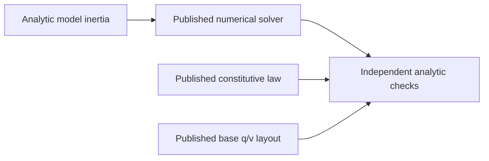

# FoundationVerification

## AF20 selected mechanism composition contract
Root owns public compositions for [NonlinearEvolution](../../Sources/SwiftMechanics/Physics/Mechanisms/NonlinearEvolution/DESIGN.md), [SleepContinuation](../../Sources/SwiftMechanics/Physics/Mechanisms/SleepContinuation/DESIGN.md) and [ReactionPaths](../../Sources/SwiftMechanics/Physics/Mechanisms/ReactionPaths/DESIGN.md). Root registered their source and tests after the original frozen handoff; a confirmed platform counterexample reopens only the affected owner scope before the next frozen build. New verification helpers may use only public SwiftMechanics contracts and actual compiled mechanical models. This composition does not replace child physical tests or close all IM16 requirements.

| Path | Required behavior | Failure evidence |
|---|---|---|
| Nonlinear evolution | Original position and velocity constraints, independent q/v chart and accepted acceleration; checkpoint/restart repeats accepted state | Inconsistent initial state and rejected/cancelled prefix preserve accepted state |
| Sleep continuation | Actual stationary dynamics omission, checkpoint-bound dwell/state, commanded or physical impulse wake, restored replay | Stale physical/time/sequence contributor association fails without publication |
| Reaction recovery | Original body inertial wrench minus physically identified loads; explicit point/frame and equal opposite joint reports | Unrepresented generalized-force allocation is refused |

Setup, nested operations and assertion/checkpoint comparisons use separate non-inlined phases so the existing debug WASM stack reservation is retained. All sessions shut down. Native focused child tests precede one integrated build/test on the frozen graph. Exact Swift 6.4.0 and matching ordinary/Embedded WASM SDKs compile/link and execute the public composition using the original artifacts and profile; EmbeddedUnicode and Node WASI configuration remain unchanged. Logs must include path completion witnesses and exit status. Target-local evidence remains distinct from actual multithread WASI and unsupported domain claims.

The initial registered Native command passed 510 behavioral cases across 35 test targets (124 suites); its independently listed 510 names agree with the successful per-target footers. The full public Native composition exited zero. Original ordinary/Embedded artifacts compiled and linked but failed at runtime. Private immediate stack-boundary diagnostic artifacts stop at Nonlinear->MassWeightedMechanismSolver.accept (Embedded) and SleepMechanismEquation.prepare->restCertificate (ordinary). `.build/af20-debug-owned/frames.txt` records measured static frames: Embedded nonlinear advance 20,816 B, attempt 22,512 B, consistent 11,072 B, solve 19,280 B before frozen mass solve/accept; sleep restCertificate 40,864 B Embedded / 38,160 B ordinary. These diagnostics are not qualification artifacts. The owned execution phases must shorten actual temporary lifetime; numerical equations, accepted-state validation and the original stack profile remain fixed. Only affected Native tests and original public artifact builds/runs require renewal; unchanged producer evidence remains valid.

The first lifetime correction passed thirteen nonlinear and nine sleep Native cases and the full original Native public composition. The original ordinary artifact fails on the awake Sleep -> Integration -> AffineMechanismEquation.motion -> MassWeightedMechanismSolver.accept -> original inertial-force path. The original Embedded artifact fails earlier during cold Sleep.prepareProof -> restCertificate -> restEquilibrium -> the same original mass acceptance. `.build/af20-debug-owned/embedded-phase-guard-full.log` identifies that distinct path; its restEquilibrium frame is 10,192 B, with 2,400 B restCertificate and 2,352 B prepareProof callers. The ordinary immediate boundary diagnostic `.build/af20-debug-owned/wasm-phase-guard-full.log` identifies the actual call chain; raw frame evidence `.build/af20-debug-owned/wasm-phase-frames.txt` shows the existing affine motion retains 19,776 B before nested solves. The necessary affine motion phase/lifetime repair is owned with sleep execution; earlier unrelated producers and original stack configuration remain unchanged. This snapshot does not qualify WASM/Embedded completion.

### AF20 selected original-profile qualification

The final frozen source compiled and linked using exact Swift 6.4.0 RELEASE, Native arm64 macOS 27 and the matching ordinary/Embedded WASM SDKs; Embedded retained EmbeddedUnicode. Unmodified produced public executables each exited zero and reached nonlinear, sleep, tree-reaction and full Foundation completion witnesses. Node.js 24.19.0 WASI Preview 1 ran both WASM artifacts with their original 128 KiB stack reservation. `.build/af20-{native,wasm,embedded}-wake-build.log` and `.build/af20-{native,wasm,embedded}-wake-runtime.log` own final profile evidence. No private guard artifact or enlarged stack qualifies a path.

The registered Native graph passed 510 cases in 35 test targets/124 suites after the shared original acceptance repair (`.build/af20-native-acceptance-final.log`). The final subsequent wake-only lifetime repair passed all nine affected sleep cases (`/tmp/mechanics-sleep-wake-phases-native.log`); unchanged supplier evidence remains valid. Earlier thirteen nonlinear and nine reaction physical/failure cases remain qualified. Root performed one source review plus counterexample-specific repairs and stopped when the actual original-profile gap closed. These are selected synchronous paths, not arbitrary loop/force/topology/mesh domains, multithread WASI, browser, other Apple deployment versions or full 210-requirement/IM48 completion.

## Purpose and Scope
The AF13 extensions register selected public operations for Transmissions, Equilibrium and ContactPatches only after their source freeze. Their selected analytic and typed-failure checks executed with exit 0 on the exact Native/ordinary-WASM/Embedded-WASM profiles recorded below; only those paths extend qualification. Transmission checks bind actual constraint assembly and scalar efforts; Equilibrium checks actual force, statics, continuation and spatial mass linearization; ContactPatches checks supplied affine pressure and exact Tet4-plane force/moment/power. Full requirement ownership remains with the corresponding module designs.

Hybrid replay probe separates restart, each actual evolution call and independent result/checkpoint comparison. Immutable result owners retain completed public values without keeping future checkpoint/comparison temporaries on the nested evolution stack. Replay uses the actual second session and identical required operations, not a diagnostic stack relocation or substitute numerical result.

Parent: [system/package](../../DESIGN.md). Children: none. Root owns this synchronous executable for the IM02/03/04/05/06/07/10/11/15/18 producer handoff. It exercises real public model, numerical, material, kinematic, load, compiler and collision contracts in one process on exact target profiles. It is not a multibody, contact or element simulator.

## Responsibilities and Boundaries
The executable checks independent analytic mass/inertia, linear solve, tree/Schur reduction, quaternion base layout and constitutive state/stress expectations through the published services. Native test targets own broader local evidence. Root owns target registration and selected-profile compile/link/runtime composition; no library-private storage is accessed.

## Related Designs
| Design | Relationship | Contract used | Summary | Cautions |
|---|---|---|---|---|
| [Root](../../DESIGN.md) | parent | Verified producer handoff | Profile composition evidence | Whole-target IM48 remains separate |
| [Core](../../Sources/SwiftMechanics/Mathematics/Core/DESIGN.md) | depends on | SI values, frames and rotations | Mathematical foundation | No dynamics inferred |
| [Model](../../Sources/SwiftMechanics/Modeling/Model/DESIGN.md) | depends on | MassPropertyCalculating, base layout | Analytic mass and q/v admission | Model graph compiler remains downstream |
| [Integration](../../Sources/SwiftMechanics/Execution/Integration/DESIGN.md) | depends on | ExplicitIntegrating, SmoothODEEquations, IntegrationContinuationProvider | Real RK4/Heun-Euler transactions and restart | Euclidean manufactured ODE only |
| [Exchange](../../Sources/SwiftMechanics/Exchange/DESIGN.md) | depends on | NativeModelCoding, NativeModelLoading | SMNX records and required compiler callback | Opaque assets have no physical geometry qualification |
| [Numerics](../../Sources/SwiftMechanics/Mathematics/Numerics/DESIGN.md) | depends on | LinearSolving, TreeLinearSolving, SchurSolving | Original-residual accepted solves | Generic tree reduction is not articulated-body dynamics |
| [ContactLaws](../../Sources/SwiftMechanics/Physics/ContactLaws/DESIGN.md) | depends on | ContactMaterialPairing, ContactLawEvaluating, ContactImpactPredicting | Normal/friction/cohesion/resistance law and scalar restitution | Constitutive prediction only; no coupled response or impact trajectory |
| [Flexible](../../Sources/SwiftMechanics/Physics/Flexible/DESIGN.md) | depends on | TetrahedralMeshValidating, TetrahedralAssembling | Affine force/energy, mass/damping, refinement and failure | Closed homogeneous constant-F tetrahedra only |
| [Dynamics](../../Sources/SwiftMechanics/Physics/Dynamics/DESIGN.md) | depends on | RigidEquationComputing, RigidDynamicsSolving | Offset-COM pendulum, passive-load work, independent residual and failure | Admitted spatial dense equations only; no trajectory/contact proof |
| [Materials](../../Sources/SwiftMechanics/Physics/Materials/DESIGN.md) | depends on | LinearElasticResponding, HyperelasticResponding, PlasticResponding | Qualified stress and history | No element formulation or universal material claim |

## Architecture


## Contracts and Invariants
IM24 selected composition owns a real compiled vertical prismatic sphere above an analytic static plane. Required HybridEvolving calls must reintegrate smooth motion in isolated Runtime owners, locate the closing root, apply a mass-based impulse, reset actual Integration history and publish explicit event continuation. Independent fall time, rebound momentum/energy and post-event motion are checked, followed by checkpoint replay and cancellation preserving the current accepted prefix. This qualifies only the declared constant-acceleration, frictionless sphere/plane domain after actual execution. It does not qualify resting support, general simultaneous coupled impulses or constrained wake behavior. Non-inlined model, context, trajectory and assertion phases retain the original memory/stack profile.

IM14 composition uses an actual compiled revolute binding, required servo and motor witnesses, conjugate affine port power, and a required ActuatorRuntimeContributors owner. The selected probe checks circuit/energy values and real rejected-trial/checkpoint/restart continuation. Calibrated chamber/muscle behavior remains Native-local evidence; accepted motor-driven mechanics and prescribed reactions are downstream. Non-inlined setup, trial and continuation checks preserve the existing original stack profile.

The IM12 composition calls published constraint, assembly and scalar-port witnesses. Independently checked circle intersections, weighted velocity projection, redundant-row ambiguity and passive power must execute on each exact profile. Contradictory original rows must fail. This selected stateless quadratic/scalar domain does not qualify general geometric loops, dynamic reactions, quaternion projection or accepted mechanism evolution. Setup and solve phases use separate non-inlined functions to bound overlapping fixture stack frames. Execution evidence is recorded after runtime verification.

Every check calls actual production code. Nonzero exit is required for unexpected failure or failed analytic expectation. Expected invalid model/capability requests must throw. The admitted Float64 and Float32 paths execute independently with explicit tolerances/budgets, not a backend substitution.

The AF04 Loads extension is executed on the profiles recorded below. It exercises Loads through required service methods: polynomial spring/damper force and energy, affine gravity force and potential, straight affine-waypoint cable derivatives and pulling work, a pure custom provider with independent derivative/energy admission, and point-force mapping on the existing articulated hinge. Compiler checks compile a two-body spatial descriptor through MechanicalModelCompiling, inspect actual motion/layout/structural pattern, and require stale-state and inconsistent-source-pose failure. The requested CompilerTarget label follows the actual compile target in a stateless entry-point adapter. Collision checks call real framed sphere/box/plane witnesses, conservative discovery, geometric manifold continuation, translating moving-plane CCD and typed unsupported-pair failure. Compiler also invokes a pure concrete extension validator through its required validate method and checks independently bounded returned work; this qualifies descriptor admission, not force execution. The executed selected-profile scope is recorded below. This extends selected operation coverage only; full dynamics, contact response and undeclared law domains remain separate.

The PG03 extension executes a budgeted cubic equation through NonlinearSolving, independently checks its root and rejects a false internal residual. It solves an analytic orthant problem and associated friction cone through ComplementaritySolving, including validated warm restart and stale identity rejection. Kinematic service checks exercise a fixed-root offset hinge, analytic point motion/Jacobian/virtual power, spherical q-v dimensions and stale-state failure propagation through public protocols; the Native test owner checks the exact JointError case. These operations extend the probe scope; the actual selected-profile results are recorded below.

The IM15 extension assembles an offset-COM hinge with actual supplied generalized velocity and deliberately nonzero snapshot acceleration. It checks mass/bias/gravity separately, adds a published passive damper response, solves forward/inverse/mass-only/mixed equations through protocol requirements, and verifies independent physical residual plus kinetic/potential/dissipation rates. It rejects mismatched velocity and nonuniform gravity explicitly. Each operation retains separate cumulative NumericalWork and LoadWork. Exact-profile results are recorded only after execution.

The IM19 extension validates a frame-identified tetrahedron, assembles actual polynomial-hyperelastic energy gradient, tangent and reference mass/damping, and independently checks an affine uniaxial patch. It verifies force covariance under rotation, centroid refinement energy/mass preservation and exact frame/inversion failure. Constitutive invocation and numerical arithmetic ledgers remain distinct. Actual profile evidence is recorded after execution.

The IM20 extension combines explicit material pairs and executes linear/Hertz/Hunt-Crossley, history-bearing static/sliding/release friction, rolling/spinning resistance and finite-range cohesion through required service witnesses. Independent force/energy/power/ellipse expectations and separate threshold restitution predictions are checked. Stale geometry and incompatible normal-loss selection must fail. These constitutive checks do not qualify a coupled contact solve or a drop trajectory.

## State, Ownership, and Lifecycle
Only immutable input/response values and synchronous local variables exist. No shared mutable storage, async stream, pointer, persistent state or target-specific synchronization branch is introduced.

## Failure, Concurrency, and Constraints
Root translates an unexpected verification operation failure to FoundationVerificationError and exits with failure. This executable does not alter library failure contracts. Small caller-selected fixture budgets bound solves. Target support is reported only after actual execution; compilation alone is insufficient.

## Verification and Change Impact
Native, WASM and Embedded WASM are separately built with Swift 6.4.0 and matching SDKs, then actually run with a timeout. Node WASI Preview 1 is the WASM runtime, not browser integration. Each child design records the exact evidence scope. A changed consumed API or formula requires rechecking this executable and its relevant native test owner.

### Executed profile evidence (2026-10-03)
Native execution and both separately compiled/linked WASM SDK artifacts exited 0. Exact baseline/runtime identifiers are recorded in the module producer handoffs. This verifies the listed public protocol operations and independent analytical expectations, not whole feature families.

### Exact Embedded provider/link constraints
Swift 6.4.0 release Embedded witness specialization asserts for a nongeneric equation provider whose associated scalar is concretely Double. An isolated one-requirement protocol with BinaryFloatingPoint & Sendable scalar reproduces the same assertion without this library or error/solver machinery. A generic provider specialized to Double compiles; RuntimeCubicEquation uses that same mathematical/protocol path on every profile. Evidence therefore qualifies the exercised generic provider, not arbitrary conformers. The selected Embedded package invocation adds --traits EmbeddedUnicode so Swift String hashing/comparison links the SDK-provided tables. Native and ordinary WASM omit that trait. These constraints do not change physical laws, precision, identity equality, state or synchronization.

### PG03 executed profile evidence (2026-10-03)
The final generic provider and link profile compiled/linked and actually executed with exit 0 on Native, swift-6.4.0-RELEASE_wasm and swift-6.4.0-RELEASE_wasm-embedded (--traits EmbeddedUnicode). Node.js 24.19.0 WASI Preview 1 ran each WASM artifact independently. Every listed numerical/kinematic analytic and failure check executed. The package Native run passed 77 tests; after the explicit Complementarity import correction its affected eight tests passed again. Compiler warnings were an unused clang -rdynamic argument and a test's unnecessary try; neither establishes a physics/backend claim. The Embedded-only failed nongeneric experiment is excluded from qualified provider coverage rather than hidden by a different numerical implementation.

### AF04 Loads executed profile evidence (2026-10-03)
The selected Loads extension and canonically equivalent Unicode frame-ID equality/dictionary hashing compiled/linked and actually ran with exit 0 on Native, ordinary WASM and Embedded WASM. Commands used Swift 6.4.0 release and exact matching SDK IDs; Embedded retained --traits EmbeddedUnicode. Node.js 24.19.0 WASI Preview 1 executed each WASM artifact. Loads native focused tests passed 12 cases/four suites. Compiler and Collision additions are pending producer freeze and independent composition evidence; they are excluded from this execution claim.

### AF04/05 Compiler and Collision executed composition (2026-10-03)
The registered Native package passed 120 behavioral tests (Compiler 17, Collision 14, Loads 12 and the 77 existing producer cases). Native, ordinary WASM and Embedded WASM separately compiled/linked and actually executed the expanded public-protocol probe with exit 0. The real generic extension provider's required validate callback ran and its independent 12-operation/one-scalar evidence was checked. Compiler admission/motion/pattern and exact expected stale/pose failures, analytic witnesses/discovery/manifold ID continuation, moving-plane TOI enclosing 4/11 s and unsupported-pair rejection all executed. Evidence uses the exact Swift 6.4.0 release and matching SDK IDs; Embedded retained --traits EmbeddedUnicode. A Collision Discovery explicit import correction was followed by its affected three Native tests and the successful Embedded rebuild/run. Native and ordinary WASM mathematical results remain valid because that correction changes only module visibility. Async cancellation is proved in the Native test owner, not inferred for the synchronous WASI probe. Whole-target IM48 remains incomplete.

### IM15 executed composition (2026-10-03)
The Dynamics extension separately compiled/linked and executed with exit0 on Native and both exact Swift 6.4.0 release WASM SDKs; Embedded retained --traits EmbeddedUnicode. Node.js 24.19.0 WASI Preview 1 independently ran each WASM artifact. Every listed pendulum/load/scaled solve/energy and exact failure check executed through public required methods. Dynamics Native focused proof passed ten tests; the prior 120-test cohort evidence is unchanged and is not mislabeled as a new 130-test whole-package run. WorldRigidBody's explicit Model import correction affects visibility only. Whole-target IM48 and subsequent Runtime/ContactLaws composition remain incomplete.

### IM19/IM20 selected-profile composition evidence
The expanded registered package passed 154 Native behavioral tests: the previous 120, Dynamics ten, Flexible ten and ContactLaws fourteen. Native and both separately compiled/linked Swift 6.4.0 release WASM SDK artifacts actually executed all listed Flexible/ContactLaws public-service analytic and failure checks with exit 0. Embedded retained --traits EmbeddedUnicode; Node.js 24.19.0 WASI Preview 1 ran both WASM artifacts. No browser, minimum macOS 13, parallel WASI, Runtime, coupled contact or whole-target IM48 qualification follows from these synchronous selected paths.

### Runtime transaction composition scope
The IM08 extension executes a real compiled fixed-root hinge through RuntimeSessionOperating, with required eight-byte counter validation and explicit SplitMix64 continuation. It checks accepted/rejected contributor/random/physical state, independent owners, exact checkpoint round-trip/restart replay, corrupt-prefix preservation and actual transaction counters. An observation lease must reject competing mutation and hold shutdown in draining; the release hook reenters snapshot/shutdown outside locks, then closes once. Mutable probe counters/retained-owner storage use the same Mutex declarations on every target. Runtime methods depending on Mutex/strict UTF8 declare macOS15/iOS18/tvOS18/watchOS11 availability; unsupported Native OS fails this executable instead of skipping the probe. Actual target evidence is recorded after execution; synchronous WASI does not qualify parallel WASI, measured allocator/phase profiling, strong determinism or accepted mechanical evolution.

### IM08 selected-profile composition evidence
The listed Runtime extension separately compiled/linked and actually exited 0 on Native and both exact Swift 6.4.0 release WASM SDK artifacts. Node.js 24.19.0 WASI Preview1 executed each WASM artifact; Embedded retained --traits EmbeddedUnicode. Native focused Runtime evidence is sixteen tests, separate from the prior 154-test cohort rather than a new 170-test whole-package run. The final lifecycle probe captures its Sendable reference owner with identical Mutex fields on all targets; direct escaping capture of a noncopyable Mutex value is rejected by this fixed Embedded compiler. Native/ordinary/Embedded actually exercised the same reentrant release behavior after that probe ownership repair. Full integration IM48 remains incomplete.

### Coupled contact response composition scope
The IM21 extension binds actual collision sphere witnesses and body-local placements to a real prismatic rigid mass operator, current frame/model/geometry revisions and an explicitly paired undamped frictionless linear law. Public required response methods execute one frozen-geometry implicit endpoint step. Independent effective mass, normal force, velocity, finite-interval equivalent impulse, power and original law/cone/momentum/wrench residual expectations are checked. Two dependent contact rows have unique compliant forces while mass rank remains unavailable; a stale collision revision fails. This is a local declared approximation, not a pose integrator, hard impact, frictional grasp, exact Coulomb or tooth-refinement qualification. Actual target evidence is recorded after execution.

### Explicit integration and native exchange composition scope
Integration executes a manufactured constant angular acceleration on an actual compiled revolute chart through required equation witnesses and RuntimeSession transactions. RK4 and adaptive Heun-Euler must reach the independent analytic q=1.25, v=3 at t=0.5 from q=0, v=2. Adaptive rejected trials must preserve random history; checkpoint restart must yield identical accepted state/bytes. Incomplete derivatives must fail and preserve the prefix. Both probe sessions shut down synchronously. Native local tests own observed order and resource/cancellation proof; this synchronous selected path does not imply implicit/manifold integration or parallel WASI.

Exchange executes public SMNX encode/decode/load with current compiler descriptors, an explicit dimensioned stiffness extension and a retained opaque inline asset with Unicode provenance. The injected required compiler validator must actually return its checked work evidence; loaded kinematics must retain angular velocity. Malformed headers and a zero wire budget must fail explicitly. This qualifies the selected current-record wire/load path, not external file I/O, CAD geometry or foreign formats. These additions are pending compile/link/runtime proof and do not extend previous execution claims.

Fixed Swift 6.4.0 Embedded debug code allocates large static frames for these value-rich fixtures. Setup, initial-step, continuation and expected-failure checks therefore execute through separate non-inlined synchronous functions, with a single operation-owned immutable context. Setup temporaries leave the stack before integration begins; sessions still use the same required providers and Mutex owners. This source decomposition preserves the original runtime memory/stack profile, numerical methods and assertions. A private diagnostic relocation of stack memory is causal investigation only and is never shipped or counted as the supported profile.

### AF09 executed composition evidence (2026-10-04)
Native and separately compiled/linked ordinary and Embedded WASM artifacts actually exited 0 with every new Integration, ContactResponse and Exchange check listed above. Exact Swift6.4.0 release/matching SDKs, EmbeddedUnicode and Node24.19.0 WASI Preview1 remain unchanged. Contact's monolithic fixed frame (95,920 bytes Embedded; 99,600 ordinary) caused stack corruption; its phased solve measures 7,248 bytes with a largest phase 24,464 bytes on the failing-debug-profile investigation. A subsequent Embedded Integration chain held 101,616 bytes in four caller frames before lower compiler/kinematics calls. Instruction-identical private stack relocation isolated each failure; production trial and probe setup/check phases now release temporaries before nested admission. The final original-stack profiles actually pass. These are causal source repairs, not allocator/latency benchmarks or alternate memory settings.

Native registered-cohort execution covered 205 tests: 204 passed and one invalid fixed-joint authority fixture failed. Correcting that fixture was followed by all sixteen Exchange tests passing. The subsequent Integration phase change was followed by its nine tests passing. Contact's ten tests and unchanged supplier tests retain their cohort evidence; this is composite evidence with focused rechecks, not a claimed new all-205 execution. Root's coherent source/contract review and findings-limited rechecks cover the final handoff. Whole-target IM48 remains incomplete.

### IM12 executed composition (2026-10-04)
The selected Constraints checks above compiled, linked and actually executed with exit 0 on Native and both exact Swift 6.4.0 release WASM SDK profiles. Embedded retained EmbeddedUnicode, and Node24.19.0 WASI Preview1 ran each WASM artifact. Existing composition checks also executed. Native constraint evidence is fourteen initial successes plus the single corrected floating-point comparison recheck, establishing fifteen cases without claiming a new whole-package run. Full constraint families, browser execution and IM48 remain incomplete.

### IM14 executed composition (2026-10-04)
All selected Actuation checks above separately compiled, linked and actually exited0 on Native and both exact Swift6.4.0 release WASM SDK artifacts. Embedded retained EmbeddedUnicode; Node24.19.0 WASI Preview1 ran each WASM artifact. The final Embedded foreign-module imports affect visibility only; previous Native/ordinary behavior and eighteen Native local tests remain valid. Real required contributor/servo trial rejection and restart preserve the accepted physical/history/random prefix. This qualifies the selected scalar motor/servo/affine composition, not minimum macOS13, parallel WASI, chamber/muscle runtime profiles or integrated driven mechanisms. Whole-target IM48 remains incomplete.

### AF13 admitted consumer and nested lifetime evidence
The registered Native cohort passed 299 behavioral tests, including Transmissions 13, Equilibrium 24, ContactPatches 9 and Hybrid 15. The final ImpactPorts lifetime correction was followed by its fifteen Hybrid tests passing again; unchanged producer/cohort evidence remains valid. Native and both separately compiled/linked original WASM artifacts executed every selected public check and exited 0. Commands used Swift 6.4.0 release and matching ordinary/Embedded SDK identifiers; Embedded retained EmbeddedUnicode. Node24.19.0 WASI Preview1 executed the WASM artifacts. No relocated stack artifact qualifies this result. A private immediate stack-boundary diagnostic on the final Embedded body also exited 0 with the original 128 KiB reservation; that diagnostic is excluded from public qualification.

Measured nested debug failures required shorter temporary lifetimes in Runtime checkpoint admission, Integration trial phases, Hybrid event queries/rows and replay probe phases. Public laws, validation order, original residuals, accepted-prefix behavior, supplier work and isolation remain unchanged. Final proof includes analytic restitution/momentum/energy, actual reintegrated event times, required contributor serialization/restart, replay equality and cancelled-prefix preservation. Full 210-requirement delivery, IM16 integration, arbitrary event/impact domains, browser/parallel WASI and unexercised platform paths remain incomplete.

The AF14 material-site prerequisite probe is root-owned and executed successfully on the original Native/ordinary-WASM/Embedded profiles. It must use same physical body references and two distinct real site identities through actual required pairing/history/response operations; analytic friction energy/power, site-revision stale rejection and storage/metadata failure are separate from deforming geometry qualification.

AF14 prerequisite evidence: final original public artifacts each exited 0. Native focused runs passed nineteen ContactLaws and eleven ContactResponse cases; an additional independently reconstructed identity replay test qualifies the immutable site-owner value semantics locally. Native arm64 macOS27, exact Swift6.4.0 release SDK identifiers, EmbeddedUnicode and Node24.19.0 WASI Preview1 remain unchanged. The initial flat optional-site extension exceeded the original ordinary-WASM stack during rigid witness preparation; the shared immutable pair owner removes those replicated site values without changing constitutive arithmetic or equality. A private immediate stack-boundary check on the corrected ordinary artifact exited 0 with the original reservation; that modified artifact is diagnostic only. This is no allocator/latency claim and no general stack bound.

AF14 initial structural/deforming composition: all 346 Native cases across 25 registered test modules passed. DeformingContactVerification invokes genuine same-body Tet4 interior witness and required actual contact law/force/history operations, checks force (1,0,10) N, power -1 W, moment/force residual, value rejection/acceptance and current cell-policy failure. StructuralVerification invokes required actual Hermite assembly and modes/harmonic/buckling/truss operations against independent cantilever/Euler/complex-oscillator/cubic-limit oracles and marked nonlinear-beam rejection. ConstraintVerification additionally invokes the standalone required rank protocol on actual evaluator rows. Original Native, ordinary WASM and Embedded public artifacts exit 0 using the unchanged exact profiles above; these new paths execute before the existing runtime/hybrid sequence. An Embedded compile exposed a missing direct MechanicsFlexible import in the structural helper; the import was corrected without changing algorithm/storage/isolation. Native and ordinary-WASM behavioral evidence is reused because that import-only correction does not change their tested equations. No private altered artifact is qualification evidence. Full fluid, mechanism, derivative, coupled nodal evolution, general spectrum and nonlinear continuum domains remain incomplete.

Runtime replacement probe executes the required RuntimeModelReplacing witness on a compiled hinge-to-sixDOF target, explicit schema/handler switch, preserved RNG/global sequence, stale-source rejection, actual target trial and checkpoint/restart. Integration probe separately exercises nested unknown-work propagation after real charged derivative execution. Same source/profile; no enlarged stack or target fallback. Native race/lifetime proof remains in Runtime tests.

Frozen Derivatives and channel Fluids are added through required public protocols: analytic pendulum mass/gravity/implicit products and complete drive Jacobian, hydrostatic/Couette/BE original balance, actual fluid Runtime accept/reject/checkpoint replay and explicit invalid/stale/failed-work domains. This selected probe does not qualify planar projection, general CFD or all derivative charts.

AF16 final selected public additions executed with exit 0 on Native arm64 macOS27, swift-6.4.0-RELEASE_wasm and matching embedded SDK (--traits EmbeddedUnicode), Node24.19.0 WASI Preview1. Original profile/stack reservation and unmodified produced artifacts were used. Logs `.build/af16-physical-{native,wasm,embedded}-run.log` record final executions. Twenty-seven registered Native modules passed 391 tests in `.build/af16-integrated-native.log`. This is selected capability evidence; it does not close all 210 requirements or IM48.

AF17 adds required public constrained-gear evolution, Native stationary engagement and public actual removed-leaf topology mapping, granular sphere collision/value replay and periodic MAC original pressure/evolution probes from fixed source handoffs. Probe inputs are independently specified physical fixtures; expected torques, accelerations, impulses, mass and pressure gradients are analytic. Root owns the executable composition. New source remains unqualified until each original exact profile actually runs.

AF17 original Embedded nested gear evolution exposed an actual 131072-byte stack boundary violation. The original probe retained a 20080-byte frame containing completed reaction/topology values during integration. Root phases independent gear replay and leaf-break probes so those past/future temporaries do not share the nested integration lifetime. Actual producer calls, physics, state and original stack reservation remain unchanged; private guard artifacts diagnose the boundary and are not qualification. Further producer-lifetime corrections require this concrete path to remain failing.

## Selected AF17 Qualification

Root registered the fixed source graph after lower review and exercised actual implementations. All 436 Native behavioral tests in 30 registered modules passed in `.build/af17-integrated-native.log`. Selected public compositions compiled/linked and exited 0 on original Native arm64 macOS27, swift-6.4.0-RELEASE_wasm and its matching Embedded SDK with EmbeddedUnicode, Node24.19.0 WASI Preview1; `.build/af17-{native,wasm,embedded}-run.log` owns execution output. Original stack reservation and unmodified produced artifacts were used. This is selected-path evidence, not all Native test paths on WASM, target-wide performance, actual WASI parallelism or full requirement closure.

## AF18 Convex Composition Contract

Root owns new OptimizationProbeContext and OptimizationVerification. They were excluded during source preparation and registered only after the Optimization source/test handoff froze. They consume [ProblemContracts](../../Sources/SwiftMechanics/Analysis/Optimization/ProblemContracts/DESIGN.md) and [ConvexPrograms](../../Sources/SwiftMechanics/Analysis/Optimization/ConvexPrograms/DESIGN.md) through required OptimizationSolving, with Core/Model/Numerics for original inputs and caller budgets. Non-inlined LP, QP and infeasibility/refusal phases retain operation-local workspace/ledger and do not overlap future certificate temporaries with nested solves.

Actual normalized LP min(-x-2y), x+y<=1, 0<=x,y<=2 has analytic point (0,1), objective -2 and original nonnegative multipliers. Actual strictly convex QP H=[[2,1],[1,2]], c=(-3,0), x+y=1 on the same box has point (1,0), objective -2, equality multiplier 1 and y-lower multiplier 2. Independent original primal, stationarity and complementary products must pass; certificates alone are not the oracle. Original infeasible x<=-1 with 0<=x<=2 must return an independently reconstructed Farkas normal cancellation and strictly negative weighted right-hand side. Caller zero candidate allowance must produce typed nonconvergence before solving and preserve immutable input, never infeasible status. Physical scaling maps y to 4 m and objective to -6 J on the LP. Same source/storage/protocol calls apply on all three original profiles; all selected checks compiled/linked and exited 0 in `.build/af18-optimization-{native,wasm,embedded}-run.log`. General unbounded/nonlinear/identification scope stays with IM32.

## AF19 Observation Composition Contract

Root owns stateless ObservationProbeContext/ObservationVerification and registers only frozen [Observations](../../Sources/SwiftMechanics/Analysis/Observations/DESIGN.md) source/tests. Its actual source preparation uses the existing independently identified compiled fixed-root hinge, q=0, omega=2 rad/s and alpha=3 rad/s², explicit supplied-state acceleration provenance. A fixed sensor offset 2 m on body X must produce world geometric velocity (0,4,0) m/s and acceleration (-8,6,0) m/s². A pi/2 mounting rotation with zero instantaneous gravity must produce specific force (6,8,0) m/s² and gyro (0,0,2) rad/s. Encoder units/time/layout remain original source-bound. A caller-identified world force (0,20,0) N and torque (0,0,3) N m about world origin shifted to mount X=1 and rotated pi/2 must give sensor force (20,0,0) and torque Z=-17, retaining physical path identity. Stale exact-time gravity must throw before publishing an observation. Required services, short non-inlined operation phases, immutable source and exclusive NumericalWork apply identically on Native/ordinary/Embedded. These paths are unqualified until actually executed. Native tests separately own real dynamically solved static support, force-versus-impulse/COM compensation and wider chart/failure evidence; no general bearing reaction is fabricated.

### AR01 consolidated public verification
The executable lives outside production Sources and imports the single SwiftMechanics module. All previously admitted physical oracles remain independent execution checks. Scalar expected values call platform libm directly, rather than the internal ScalarMath helper under test. Machine foundation verification composes actual descriptors and compiler output; declaration syntax alone does not qualify mechanical behavior. Observation probe sources remain excluded until IM25 admission. Matching Native/WASM/Embedded runtime must reach its completion witness; exit zero without execution is insufficient.

### AR01 public profile execution
Swift 6.4.0 RELEASE compiled and linked the consolidated public executable for Native (macOS 27 runtime, production deployment 13), swift-6.4.0-RELEASE_wasm and swift-6.4.0-RELEASE_wasm-embedded. Both WASI artifacts executed under Node.js 24.19.0 Preview 1 with argv0 and original stack profiles. All three reached Machine and full Foundation completion witnesses and exited zero. New selected paths lower conditional/erased declarations into real hinge motion, resolve scoped endpoints and reject duplicate/iteration exhaustion. Existing physical/RNG/continuation/restart/rollback paths remain executed. This is selected synchronous WASI evidence, not multithread race or Linux/iOS qualification. [Root integration](../../DESIGN.md#ar01-integrated-qualification-2026-10-04) owns complete task evidence.

## AF21 Planar Runtime Qualification Contract

[PlanarContinuation](../../Sources/SwiftMechanics/Physics/Fluids/PlanarContinuation/DESIGN.md) owns exact field/context/ledger admission. This executable consumes its public codec, required whole-checkpoint handler and trial operation with a real compiled static-root carrier and actual periodic MAC solver. Immutable probe setup ends before non-inlined trial/replay phases. Rejected trials must preserve the whole checkpoint and RNG; accepted vortices must produce nonzero pressure, dissipate energy and satisfy independently computed discrete divergence. Exact contributor restoration and fresh-owner replay, structurally valid forged field time, and actual exhausted-solver unknown work must exercise the real publication boundary. Runtime contributor association remains a required witness, not optional local validation. Native tests own the supplier-reset regression; original Native/WASM/Embedded artifacts own selected public execution. Qualification is pending until both evidence sets pass. No change to original stack reservation, SDK, physics, shared-state isolation or broader domain qualification is admitted.

### AF21 Selected Original-Profile Qualification

The fixed registered source passed all 526 Native tests in 36 targets/129 suites (`.build/af21-integrated-native.log`); the affected owner independently passed sixteen tests in five suites (`.build/af21-planar-native-green.log`). The supplier-reset parameterized test contains four real-MAC cases: zero/precharged incoming ledger crossed with return/throw after reset. The preceding red run actually failed those cases; final guard restores known work, marks unavailable supplier cost and refuses publication. Boundary-operation exhaustion proves zero supplier invocations and unchanged accepted checkpoint/RNG.

Exact Swift 6.4.0 RELEASE compiled/linked the public Foundation executable for Native arm64 macOS27 and both matching WASM SDKs. Embedded retained EmbeddedUnicode; Node.js24.19.0 WASI Preview1 ran both unmodified produced WASM artifacts with the original 128KiB stack profile. Every artifact exited zero and reached Planar Runtime plus full Foundation witnesses. `.build/af21-{native,wasm,embedded}-build.log` and `.build/af21-{native,wasm,embedded}-runtime.log` own profile evidence. The actual vortex pressure/dissipation/divergence, accept/reject/RNG, same/fresh-owner restart, forged-time refusal and exhausted actual pressure solver all execute through public required contracts. No producer mathematics, stack reservation or isolation was changed. This qualifies selected synchronous static-carrier periodic-flow continuation, not moving-grid/model migration, general CFD/FSI, real WASI parallelism, browser, Linux/other Apple deployment or full IM44/IM48.

## AF22 Closed-Loop and Topology Composition Contract

Root owns an independently constructed public four-bar model and original trigonometric geometry/velocity/acceleration/energy oracles. Lower geometry/retraction is exercised before upper time evolution. The existing actual public compiler, Joints and inertia services construct the real model; no fake compiled token or quadratic closure substitutes for the nonpolynomial relation. Root composes frozen topology/history/law-continuation providers with actual Runtime replacement and checkpoint codecs. Native component tests establish their local contract; original Native/WASM/Embedded public artifacts establish only the selected compositions actually executed. Source setup and physical/replay checks use separated immutable phases to preserve original stack/lifetime profiles. The qualification sections below own exact evidence and its limits.

The selected topology composition uses the four-bar model as an articulated tree without its loop relation attached. A moving crank subtree is released first, then its internal coupler joint is released at the same physical time. The remaining rocker servo preserves its real codec state and binding semantics through changed coordinate ranges. Original body pose/twist, independent initial rod kinetic energy and target mass/bias force equations are checked before exact Runtime publication. The two-event sequence preserves RNG, refuses stale publication, reproduces checkpoint bytes from the source revision and restores saved bytes into an explicitly bound cold final owner. This does not establish cutting an active geometric loop or general law migration.

The upper dynamic public composition attaches the actual endpoint coincidence relation to the four-bar and applies a constant crank torque from rest. The common projected evolution service is invoked through its required existential operation. Independent trigonometric position, velocity and acceleration closure checks and analytic rod kinetic energy versus torque times crank displacement validate the accepted physical endpoint. Exact initial-checkpoint restart and reexecution must reproduce the complete accepted state and contributor bytes. Quaternion mixed-chart evolution remains a dedicated Native witness unless separately executed in a public target profile.

The physical constraint Gram solver is explicitly configured as reference partial-pivot LU, retaining Cholesky for the physical mass and independent tangent position assembly. The lower inverse-mass Gram is formed by separate solves and its reference Cholesky capability requires exact symmetry; the owner already documents this capability boundary. The initial public caller choice of Cholesky reached an original constrained-solve rejection. This probe chooses the supported LU capability explicitly and propagates every failure; it does not change or retry the lower producer algorithm.

## AF22 Selected General Geometry Qualification

Root registered the frozen GeometricRelations and ManifoldProjection children in the single SwiftMechanics production target. Eleven dedicated Native tests passed, including actual nonidentity frame geometry, explicit target/distance derivatives, floating-root/spherical/sixDOF tangent semantics, regular two-row axis alignment, original physical cross acceptance, manifold assembly and supplier/source/work failures. The registered Native graph then passed 537 tests in 37 targets and 131 suites with exit zero. Logs: `.build/af22-geometric-native.log` and `.build/af22-geometry-integrated-native.log`.

The final source/probe snapshot compiled, linked and executed unmodified on Swift 6.4.0 release Native arm64 macOS27, matching ordinary WASM and Embedded WASM SDKs. EmbeddedUnicode, original 128 KiB WASM stack and Node24.19.0 WASI Preview1 remain the fixed profiles. Each artifact reached both the Geometric and complete Foundation witnesses and exited zero. Logs: `.build/af22-geometry-{native,wasm,embedded}-{build,runtime}.log`. The public path constructs a real compiled four-bar and independently checks trigonometric g/rate/acceleration, all retained rows, feasible tangent-metric correction and bounded failure. Mixed quaternion/axis-alignment behavioral evidence is Native-only at this boundary; the selected public path does not extend that evidence to WASM.

The original three-row cross-product alignment chart was never qualified or released: its off-manifold rank changes from three to two at alignment. The final two-row transverse chart keeps the physical hemisphere branch and separately retains the full axis-cross residual. Existing row-relative rank semantics remain unchanged; the Native witness records roundoff-level nonidentity toggle rows and their numerical rank rather than claiming a global singular-value floor. General closed-loop dynamic evolution, prescribed/disconnected/planar domains, topology continuation and full IM16/IM48 remain pending.

## AF22 Selected Topology Public Execution

The selected `TopologyProbeContext` / `TopologyVerification` composition passed actual compile, link and runtime on fixed Swift 6.4.0 Native, ordinary `swift-6.4.0-RELEASE_wasm` and `swift-6.4.0-RELEASE_wasm-embedded` with matching SDKs and EmbeddedUnicode. Original WASI artifacts retained the 128 KiB stack and ran under Node 24.19.0 WASI Preview 1 without artifact modification. Each reached the two-cut/original-force/servo/reexecution/cold-restart witness and the final Foundation witness, then exited zero. Logs: `.build/af22-topology-{native,wasm,embedded}-{build,runtime}.log`.

The probe evaluates the actual moving source, checks independent initial rod kinetic energy, compares every incoming body pose/twist after both cuts, and verifies all target `M*a+b-load-drive` rows. A migrated scalar servo is stepped with its original internal state, encoded and decoded through the real codec. Historical event IDs, same-time ordering, global accepted sequence and RNG are exact. Fresh source-revision reexecution produces identical checkpoint bytes. An explicitly bound restore-only final owner refuses bootstrap advancement and repeatedly restores the exact saved checkpoint. The public builder/reconciler/publisher/codec operations run through protocol requirements. Embedded verification uses ordinary field closures because key paths are unavailable in that profile.

Nine dedicated cases in three Native suites passed in `.build/af22-mechanisms-native.log`. They separately establish moving deep parents/nonidentity anchors, downstream joint and floating raw-prefix preservation, independent body P/L/K, actual target force equations, bounded history and genuine continued actuator/integration state, stale/omitted/removed-law/reset/cancel refusal and actual Runtime capacity/profile rejection with unchanged prefix/RNG. Active-loop cuts, general law migration, prescribed Runtime continuation, unsupported bearing metrics, concurrency on WASI and full IM16/IM48 completion remain outside this evidence. The final combined public artifacts repeat this selected topology path as recorded by the integrated qualification section below.

## AF22 Integrated Mechanism Qualification

Final registered Native execution passed 557 cases across 38 test targets and 136 suites, with zero failures (`.build/af22-integrated-native.log`). The focused run passed all 24 nonlinear mechanism cases and nine topology cases (`.build/af22-mechanisms-native.log`). The new eleven geometric evolution cases independently establish ten-second torqued four-bar closure/velocity/acceleration/reaction power and rod-energy/work balance, fourth-order refinement, mixed 18q/15v moving-axis quaternion motion and full physical axis derivatives, analytic moving targets, separate position/impulse energy correction, strict initial charts, bounded stage correction, metadata binding and exact endpoint/source/ledger/cancellation/physical-history-RNG rollback. Mixed chart behavior is Native-only in this qualification.

The final unmodified Native, ordinary WASM and Embedded WASM public artifacts compiled, linked and ran to completion with exit zero under fixed Swift 6.4.0 and matching SDKs. Each reached the actual torque-driven four-bar original q/v/a, independent rod kinetic energy versus input work, exact checkpoint-byte replay, two subtree cuts/servo migration/cold restart and final Foundation witnesses. Logs: `.build/af22-final-{native,wasm,embedded}-{build,runtime}.log`. The original 128 KiB WASI stack, EmbeddedUnicode and Node 24.19.0 WASI Preview 1 were retained. No private producer copy, artifact patch, larger stack, tolerance relaxation or changed numerical producer supplied qualification.

These selected compositions extend the lower geometry handoff and preserve the existing quadratic facade's actual original public path. The first public physical Cholesky constraint choice rejected the original solve; final caller policy explicitly selects supported partial-pivot LU for that Gram while retaining physical-mass and position-assembly Cholesky. All failures remain failures; no automatic backend substitution exists. General imposed motion, planar physical inertia, active-loop cuts, broader law migration/load sleep/bearing reaction allocation, other target platforms and the complete 210-requirement/IM48 objective remain open.

## AF23 Complete-Anchor Public Composition Contract

Root constructs an actual compiled hinge with a prescribed translating/rotating parent anchor, including an exact negative quaternion representative and signed-zero components. Public Runtime sessions must preserve every physical scalar bit and the complete v2 byte representation across fresh-owner restore and subsequent advancement. Independent analytic frame pose, angular rate/acceleration and translation derivatives check actual compiled evaluation. Rejected randomized trials and stale-time samples must preserve the whole accepted checkpoint. Setup and execution are separate non-inlined phases. This lower retention probe does not establish motion-law authority or dynamic power balance; those remain the geometric upper composition. Original Native/WASM/Embedded artifacts, exact release SDKs and 128 KiB stack remain the qualification boundary. Selected original-profile execution is recorded in [AF23 integrated qualification](#af23-integrated-qualification).

## AF23 Physical-Load Sleep Public Composition Contract

The independent public fixture is a fixed-root pair of vertical prismatic bodies, each of mass 2 kg, constrained by q0-q1=0. At q=[-1,-1] m, gravity -10 m/s² and each passive spring k=20 N/m balance exactly. Actual loaded dynamics must certify rest, omit only a certified zero vector field, and expose reduced equation work. Switching accepted gravity to -8 m/s² must produce a=[2,2] m/s² at the unchanged source, wake atomically and evolve position-dependent spring motion. Cold restore into a fresh loaded owner must independently validate actual loads, retain its distinct checkpoint-admission receipt and reproduce continuation. Changed physical source/catalog/solver policy must refuse association. Native local evidence and original-profile public behavior remain distinct; [AF23 integrated qualification](#af23-integrated-qualification) records actual execution of these paths.

## AF23 Moving-Base Dynamic Public Composition Contract

The actual public model has a static root, a prescribed fixed bridge and base, and two revolute-Z dynamic rotors with unit mass and unit central inertia. The rotor body-frame unit-X directions use the regular aligned-axis chart, providing a genuine rank-one coupling with one redundant row. The original physical unit-X tip coincidence and its time derivatives are independent acceptance oracles. Three-row point coincidence changes rank off the diagonal and is not used to qualify off-manifold assembly. A torque tau=1 acts on the first rotor. With equal initial q=0.3 rad and v=0.1 rad/s, prescribed base angular acceleration alpha=0.2 gives independent a1=a2=0.3 rad/s² and generalized reactions [-0.5,+0.5] N m. Nonidentity base pose and accelerating translation ensure nonzero moving-body drift. Full physical K=1.5|V|²+0.5 omega²+(omega+v)², virtual power=tau v and prescribed power=3 V dot c+(alpha+tau) omega independently qualify original geometry/rate/acceleration, coupling/reaction and energy balance. Exact cold checkpoint replay follows actual stage sampling and accepted Integration history. Equal stored-acceleration corruption, which retains constraint acceleration compatibility, must still fail original force association; changing only the prescribed angular rate must fail original law association. Both refuse restart without changing saved bytes or RNG. The frozen selected source executed under the original profiles; [AF23 integrated qualification](#af23-integrated-qualification) records the actual evidence and its limits.

### AF23 Native composition qualification

The actual public Native artifact compiled, linked and reached all three AF23 witnesses plus the original full Foundation completion with exit zero in `.build/af23-final-native-{build,runtime}.log`. Exact Swift 6.4.0 release, macOS 27 arm64, original compiled model/Runtime/Integration authorities and caller budgets were retained. The moving-base path executes full original q/v/a, rank-one reaction, physical kinetic energy, virtual/prescribed power, cold force/law corruption refusal and byte-exact fresh-owner replay. Loaded rest executes nonzero gravity/passive equilibrium, omitted work, actual selected-load wake and independent RK4 motion. Changed mass, catalog and coherent solve policy preserve identical identity/revision/layout but fail the existing Integration signature authority with exact `incompatibleContinuation`; the accepted checkpoint bytes/snapshot/RNG remain unchanged. Full handler admission into an unwarmed fresh loaded owner exposes the actual distinct cold load receipt. Complete-anchor v2 restore retains raw quaternion/sign-zero bits and all frame derivatives. One artifact review and one finding-only recheck resolved the missing changed-source/catalog/policy refusal proof. Concrete compile corrections and the exact lower signature-error oracle were confirmed by this actual Native run. This Native step was followed by the whole registered graph and final original-profile qualification recorded below; it does not establish full IM16/RB007 or 210-requirement completion.

### AF23 original-profile lifetime counterexample

Whole registered Native integration passed 592 tests in 38 targets/148 suites. Both exact release WASM profiles compiled and linked, but original Embedded execution failed in loaded constraint evaluation and ordinary execution retained a corrupted nonterminating prefix. Private immediate 128 KiB boundary diagnostics on artifact copies independently trapped at actual QuadraticConstraintEvaluator validation (Embedded) and TreeKinematicsEvaluator evaluation (ordinary). These modified copies are diagnostics only. Measured original Embedded caller frames total 134896 bytes at that boundary, including the new stationaryMotion 10992, loaded prepare 8576, restProof 3344 and public enterLoadedSleep 7648 bytes. Root separates first-step receipt/work extraction, discarded settling advancement and final omission assertions into noninline phases so a rich first Integration result never overlaps later nested dynamics. Upper loaded owners separately repair their phase temporaries. Original equations, accounting, source association, checkpoints and the fixed stack remain unchanged; only affected Native and original public runtime behavior after source freeze can requalify this correction.

The next newly reached original-profile boundary is the actual constrained inverse-mass path, with the owned affine motionSolve retaining 11168 bytes during the physical supplier. The root public verifyLoadedSleepMechanisms retains 6448 bytes, including future fresh-owner model/admission temporaries. Root completes fresh-owner construction and cold receipt validation in separate noninline phases returning only the real session/owner references, so those future rich values are absent while initial loaded integration executes. Successful ownership transfers return to the caller shutdown scope; a failed freshly created session is shut down before propagating its actual failure. This preserves cold-before-warm validation, exact replay and all refusal assertions.

After the original ordinary-WASM artifact completed with exit zero, the newly reached Embedded post-load-change advance exposed the public wakeLoadedSleep 8128-byte frame retaining already verified wake/source/history/work values across the next integrator call. Root separates selected-load wake assertions from actual subsequent integration, returning only the real acceptedTime scalar between phases. Expected selection, q/v/acceleration, history, RNG and load receipt are fully checked before transfer; the independent RK4 oracle uses that retained accepted time after the actual next step. Production source remains frozen for this correction.

### AF23 integrated qualification

The frozen registered Native graph passed 592 tests across 38 target runs and 148 suites with zero failures (`.build/af23-integrated-native.log`). This whole-graph run preceded the narrowly causal loaded-lifetime repairs described above. After the final production repair, all affected 21 Sleep tests in eight suites and 16 Mechanisms tests in seven suites passed (`.build/af23-loaded-lifetime-native.log`). The repairs changed only owned orchestration lifetimes; unaffected whole-graph evidence remains valid. The whole graph was not rerun after these repairs.

The final original Native, ordinary WASM and Embedded WASM public artifacts independently compiled, linked and completed with exit zero. Logs are `.build/af23-final-{native,wasm,embedded}-{build,runtime}.log`. Every runtime reached complete-anchor v2 raw-bit/derivative and rejected-prefix witnesses, moving-base original physical q/v/a/reaction/kinetic-energy/virtual-power/prescribed-power and cold replay witnesses, and actual nonzero gravity/spring rest, work omission, selected-load wake and fresh-owner replay witnesses. The original Machine, AF22 geometry/topology, zero-load sleep, reaction, planar and Hybrid paths also reached the full Foundation completion. Equal-ID changed physical source, catalog and coherent solve policy retain the exact lower `incompatibleContinuation` refusal and accepted checkpoint/snapshot/RNG preservation. Cold loaded admission occurs before fresh-session construction or warm memo use and reports its separate real load receipt.

All commands retained a 240-second timeout and Swift 6.4.0 release from `/Users/1amageek/Library/Developer/Toolchains/swift-6.4.0-RELEASE.xctoolchain/usr/bin/swift`, using `-j 4`. Native execution was macOS 27 arm64; production deployment remains macOS 13 and test deployment macOS 14, with Mutex execution availability macOS 15. Ordinary SDK identity was `swift-6.4.0-RELEASE_wasm`; Embedded SDK identity was `swift-6.4.0-RELEASE_wasm-embedded` with `EmbeddedUnicode`. Both WASI artifacts used the unchanged 128 KiB stack and `/usr/local/bin/node` 24.19.0 WASI Preview 1 through `Scripts/run_wasi.mjs`. Original build paths were `.build/ar01-{native,wasm,embedded}`. No enlarged/relocated stack, patched public artifact, producer substitution, changed tolerance or automatic backend fallback established this qualification.

A separate final private diagnostic copy guarded all 17,161 stack-pointer writes against the original Embedded boundary (initial 303,440; lower 172,368). It completed all witnesses with exit zero (`.build/af23-stack-diagnostic/final-embedded-guard.log`). The retained original raw copy and guarded copy are diagnostic artifacts only; the independent unmodified public Embedded execution above is the qualification evidence.

These results qualify the selected bounded analytic prescribed-base and stationary affine physical-load compositions. They do not qualify full floating-root coordinates, planar physical inertia, arbitrary time-dependent loads, all RB-007 sleep/contact/topology domains, mixed-chart public WASM behavior, actual WASI multithreading, Linux/iOS/browser execution, or the complete 210-requirement/IM48 objective. Changes to the repaired phase contracts require affected Native and original-profile requalification; remaining independent domains retain their own owners.

## AF24 Lower Physical Public Composition Contract

Root owns the public lower handoff for [RigidEquations](../../Sources/SwiftMechanics/Physics/Dynamics/RigidEquations/DESIGN.md#af24-additive-planar-physical-source-contract), [DenseDynamics](../../Sources/SwiftMechanics/Physics/Dynamics/DenseDynamics/DESIGN.md#af24-additive-physical-solve-contract) and [GeometricRelations](../../Sources/SwiftMechanics/Physics/Constraints/GeometricRelations/DESIGN.md#af24-planar-geometry-and-physical-row-authority). Immutable compiled BodyRecord2D fixtures retain original validated MassProperties2D and actual public tree/source contracts. Model construction, equation assembly, physical solving and final evidence queries are distinct noninline phases; no future rich publication value stays live across a nested supplier. No shared mutable fixture state or target-dependent isolation is introduced.

```text
compiled original 2D model -> public physical equation/solve -> independent M/C/a/K/P/L/work
compiled original sliders -> public geometric sample/physicalRows -> original projection/action-reaction
                       -> full inherited Foundation public execution on original profiles
```

The free-body oracle has mass 2 kg, body COM (0.5,0.25) m, polar inertia 1 kg m2, yaw 0.3 rad, origin (1,0.7) m, origin velocity (0.4,-0.1) m/s and angular rate 0.6 rad/s. Uniform gravity is (0,-10) m/s2. Independent rotated COM r gives M=[[m,0,-m ry],[0,m,m rx],[-m ry,m rx,Iz+m r2]], bias=-m omega2 r, original acceleration=(omega2 rx,-10+omega2 ry,0), COM force=(0,-20), origin moment=-20 rx, kinetic energy/momentum and Kdot=-20 VcomY. Arbitrary nonzero stored acceleration must not replace actual bias. Complete source identity, unavailable spatial conversion, invalid velocity/plane loads and cancelled work must fail explicitly.

The fixed-root planar X sliders use masses 2 and 3 kg, q=(0,2) m and equal velocity. A stationary distance of 2 m with scale 4 m produces original physical gradients (-1/8,+1/8) per metre. Multiplication by 48 J gives (-6,+6) N, with zero total force and moment. Scale 2 with 12 J gives the same physical pair. Independent original generalized projection and original rank are checked. Wrong-time sample reuse must fail; unchanged planar metadata and the sealed original acceptance are retained. This lower probe does not yet authorize constrained acceleration or upper individual reaction allocation.

Actual original Native/WASM/Embedded build/link/runtime with 240-second bounds and unchanged 128 KiB WASI stack is required before IM.IM16.22 and upper producer dispatch. Native lower tests are separately qualified in the child test designs; this contract alone is not profile evidence.

### AF24 original Embedded lower counterexample

The focused 42 Native tests and actual Native/ordinary WASM full public execution passed. The original Embedded artifact compiled and linked but failed with memory corruption. An immediate original 128 KiB boundary guard on a private diagnostic copy trapped first at PhysicalRigidDynamicsInput.properties(at:), through WorldRigidBody.evaluate, shared originalInertialForce, legacy equation bridge and DensePhysicalSolveContext during a nested mass solve. Initial stack pointer is 304624 and original lower boundary is 173552. Diagnostic output is `.build/af24-stack-diagnostic/lower-embedded-guard.log`; the modified copy is not qualification evidence. The affected lower physical-source/solve lifetimes must be repaired before .22 or upper production. No increased stack, alternate backend or changed physical tolerance is admissible evidence.

### AF24 lower integrated qualification

The source-extraction lifetime correction retained the complete actual input in immutable dimension-specific owners. The measured Embedded properties(at:) frame fell from 2224 to 1488 bytes; WorldRigidBody.evaluate remained 2560 bytes. Equations, original scalar values, supplier authority, ledgers, cancellation and original-profile stack size were unchanged. All affected 42 Native behavioral tests passed again after the correction (21 Dynamics in four suites and 21 Geometry in five suites; `.build/af24-repair-native-tests.log`, exact Swift 6.4.0 release, registered graph, `-j 4`, 240-second timeout).

Final unmodified Native, ordinary WASM and Embedded WASM public artifacts independently completed every new planar lower witness and every inherited Foundation witness with exit zero. Runtime logs are `.build/af24-repair-{native,wasm,embedded}-runtime.log`. WASM build/link logs are `.build/af24-repair-{wasm,embedded}-build.log`; the registered Native test build also rebuilt the public executable. The complete original 2D M/bias/acceleration/energy/momentum/work, sealed normalized physical-row projection/action-reaction/rank, source/time/plane/conversion/cancellation refusals and all existing Machine/AF22/AF23/sleep/topology/Hybrid paths actually executed.

Qualification uses the same Swift 6.4.0 release, macOS 27 arm64 Native path, matching `swift-6.4.0-RELEASE_wasm` and `swift-6.4.0-RELEASE_wasm-embedded` SDKs, `EmbeddedUnicode`, Node 24.19.0 WASI Preview 1, `.build/ar01-{native,wasm,embedded}`, 240-second command bounds and unchanged 128 KiB WASI stack. No optimized/enlarged/relocated-stack artifact or fallback establishes these results. A separate diagnostic copy guarded all 17,519 original stack-pointer writes against the same 128 KiB boundary (initial 304688; lower 173616), reached every witness and exited zero (`.build/af24-stack-diagnostic/repaired-embedded-guard.log`). It proves the repaired exercised boundary, but does not replace the independent unmodified runtime qualification.

This completes the lower planar physical and original row-covector handoff only. Planar constrained evolution and source-bound unique spatial closed-loop physical reactions remain upper IM.IM16.23/.24. Planar individual support/bearing allocation, unsupported geometric/field domains, actual WASI multithreading, other target platforms and the complete IM16/210-requirement goal remain open.

## AF24 Upper Public Composition Contract

Root owns the shared entrypoint, fixture design, builds and qualification. Public planar evolution and spatial loop reactions consume the frozen qualified lower and upper contracts through non-generic protocol requirements. Native upper evidence passed 71 declarations in 22 suites (39 nonlinear, 19 mechanism, 13 loop) in `.build/af24-upper-native-tests.log`; original WASM/Embedded upper qualification remains pending.

```text
Actual planar descriptor -> original physical equation/constraint solve -> projected evolution -> atomic history/replay
Actual spatial slider descriptor -> identified load + original geometric rows -> constrained acceleration
    -> ClosedLoopReactionRecovering -> endpoint wrenches + original tree supports
```

The planar fixture extends the existing independent fourbar model with actual MassProperties2D only. It preserves all spatial construction/oracles and adds original Iz-bound chart/cold replay. Independent trigonometric q/v/a, rod COM energy, torque displacement work and initial effective inertia reject physically incorrect output. Fresh-model exact checkpoint replay and changed-Iz/forged-tangent rejection exercise the contextual handler. No representative redundant multiplier establishes unique planar body allocation.

The separate spatial caller owns an actual two-slider source (masses 2/3, separation 2, identified first-body force 10, zero generalized drive). Its independent oracle is acceleration 2, multiplier 48 J at distance scale 4, force pair -6/+6 N; changing row normalization leaves forces invariant. Offset body loads, output rotation and support moments exercise six-axis recovery. Dependent original rows fail with typed ambiguity; explicit drive, changed source and temporal/domain refusals cannot publish success.

Fixture construction, assembly, solving, recovery and evidence queries remain separate noninline phases within unchanged original 128 KiB WASI profile. Immutable source owners and operation-local caller-exclusive buffers preserve common Sendable/isolation contracts. Root alone runs the registered cumulative Native cohort and three unmodified original public artifacts after both public callers freeze. No enlarged-stack artifact, fallback or changed tolerance qualifies the handoff.

Cumulative registered Native behavioral execution passed all 614 declarations in 156 suites across 37 test runs with exit zero (`.build/af24-cumulative-native-tests.log`, same exact Swift 6.4.0 release/macOS 27 arm64, 240-second bound). `swift test --skip-build --build-path .build/ar01-native -j 4` reused the frozen production binaries built by the immediately preceding focused run; no production source changed between those two proofs. This qualifies the accumulated production Native test graph, not the new public upper caller or WASM/Embedded runtime.

The first Native public caller reached physical force/power, torque evolution, tangent-forgery refusal and fresh exact replay, then exposed a caller-oracle ordering error: an evolved changed-Iz checkpoint undergoes original stored-force validation before Integration chart association. The public oracle now requires the exact original-force `.invalidState` refusal and unchanged accepted state; the focused Native zero-step changed-Iz fixture separately established `.incompatibleContinuation` at chart association. The production ordering is preserved.

### AF24 upper integrated qualification

All 614 registered Native declarations in 156 suites across 37 runs passed using the frozen production binaries. New public upper source then compiled and executed successfully on the exact Swift 6.4.0 release/macOS 27 arm64 path (`.build/af24-upper-native-build.log`, `.build/af24-upper-native-runtime.log`). Ordinary WASM and Embedded WASM independently compiled, linked and completed every public witness with exit zero (`.build/af24-upper-{wasm,embedded}-build.log`, `.build/af24-upper-{wasm,embedded}-runtime.log`). Profiles use matching `swift-6.4.0-RELEASE_wasm` / `swift-6.4.0-RELEASE_wasm-embedded` SDKs, `EmbeddedUnicode`, Node 24.19.0 WASI Preview 1, `.build/ar01-{native,wasm,embedded}`, `-j 4`, 240-second command bounds and the unchanged original 128 KiB WASI stack.

Actual planar upper public evidence includes original mass/COM/Iz construction, initial effective inertia, independent q/v/a and Euler-Lagrange force, K/virtual power/torque displacement work, refinement, exact saved-history/RNG replay on existing and fresh owners, original-force rejection of forged tangent acceleration and changed Iz with unchanged accepted state. Actual spatial loop evidence includes identified Newton balance, normalized multipliers versus invariant force, original endpoint action/reaction, offset six-axis guide/support moments, rotated common references and all six typed refusals. Every inherited Machine/AF22/AF23/moving-anchor/sleep/topology/Hybrid witness also completed; no fallback or changed physical tolerance is used.

A private diagnostic copy instrumented all 17,917 stack-pointer writes against the same original 128 KiB boundary (initial 307584; lower 176512), completed every upper and inherited witness and exited zero (`.build/af24-stack-diagnostic/upper-embedded-guard.log`). This bounds the exercised stack paths and supplements, rather than replaces, unmodified artifact execution. There was no production change after the Native 614-case proof; only public fixture/oracle source changed and was actually executed on each profile.

This qualifies the selected AF24 planar constrained evolution and spatial continuous closed-loop recovery cohort only. Planar individual support/bearing allocation, prescribed physical loops/supports, impulse wrench recovery, broader geometric domains, actual WASI multithreading and the full IM16/210 requirement objective remain open. The validated source sprints are b1b562b and fb65df3; root's integrated commit owns this final public evidence.


## AF25 Lower Public Composition Contract

Root owns prospective public proof of frozen [PrescribedMotions](../../Sources/SwiftMechanics/Modeling/Joints/PrescribedMotions/DESIGN.md), [AssemblyProjection](../../Sources/SwiftMechanics/Physics/Constraints/AssemblyProjection/DESIGN.md), [GeometricRelations](../../Sources/SwiftMechanics/Physics/Constraints/GeometricRelations/DESIGN.md) and [ReactionPaths](../../Sources/SwiftMechanics/Physics/Mechanisms/ReactionPaths/DESIGN.md) contracts. This section is a verification plan, not runtime qualification. Complete source tests and all three original profiles are required; new fixture source never inherits AF24 evidence automatically.

```text
original planar COM/Iz + actual velocity/acceleration/gravity
 -> original Newton/Euler + reduced tree/support report -> independent force/moment
original planar coincidence + all retained geometric rows
 -> physical allocation certificate -> rank/nullity preserved, physical uniqueness distinct
original analytic floating-root law + full original coordinate layout
 -> sealed q/v/a/qdot + explicit active-coordinate rank -> independent planar/spatial rates
```

The planar pendulum fixture has a static root of mass1, child mass2, COM=(1,0), Iz=4, angle0, angular speed1, angular acceleration -10/3 and gravity=(0,-10). Actual COM acceleration is (-1,-10/3), so the child cut is (-2,40/3) N with zero z moment; root support is (-2,70/3) N. A raw world force (10,0,0) at z1 paired with raw torque (0,-10,0) cancels its transverse moment at body origin. It changes only cut/support Fx by -10 and must remain an admitted physical load. No transverse bearing axes are inferred.

Ordinary planar fourbar coincidence retains all three rows including exact structural-zero Z. Original rank2/nullity1/multiplier-nonuniqueness must coexist with active XY physical-wrench uniqueness. Active duplicates and stale geometry/source fail; arbitrary finite zero-row multiplier has no physical action. Planar/spatial quadratic root laws use nonidentity reference rotation, nonzero translation derivatives and exact interval/time/chart identity. Independent rates must distinguish body angular coordinates from world angular motion and spatial nq7/nv6 from planar3/3. Active-coordinate rank retains the original full layout and truly empty original rows/active indices without fabricated constraints.

Model/sampling/assembly/recovery/assertion are separate noninline phases; immutable backing stays owned and caller numerical/load ledgers remain exclusive. No target-dependent synchronization or changed stack profile exists. New Native/WASM/Embedded source executes only after owner freeze; exact original artifact behavior and refused-prefix accounting establish qualification. Upper root force/evolution/history and planar closed-loop fourbar physical recovery remain separate IM16.28 proofs.

### AF25 lower integrated qualification

Source sprint `27fffee` implements the sealed planar/spatial prescribed-base sampler, full-layout active-coordinate rank, original physical allocation certificate and reduced planar tree/support recovery. The focused Native run executed 98 declarations in 20 suites across four targets: Joints26, Constraints24, Reaction20 and Geometry28. All production behavior passed; one allocation test initially asserted computation on a stale-source fast refusal. Its test-only correction proves exact typed stale refusal with unchanged zero/precharged work. All seven allocation declarations passed the finding-only recheck. Exact logs: `.build/af25-lower-native-tests.log` and `.build/af25-allocation-native-recheck.log`. No broader cumulative Native rerun is claimed here.

The final unmodified public artifact separately built, linked and executed every AF25 lower and inherited Foundation witness with exit zero on Native, ordinary WASM and Embedded WASM. Logs: `.build/af25-lower-{native,wasm,embedded}-build.log` and `.build/af25-lower-{native,wasm,embedded}-runtime.log`. Fixed profiles remain Swift6.4.0 release/macOS27 arm64, matching `swift-6.4.0-RELEASE_wasm` / `swift-6.4.0-RELEASE_wasm-embedded`, EmbeddedUnicode, Node24.19.0 WASI Preview1, `-j4`, 240-second command bounds and the unchanged original 128 KiB WASI stack. Production remained unchanged throughout final public proof and Native test-helper repairs.

Independent public behavior verifies noncommuting spatial/body-angular q/v/a/qdot, unwrapped planar angle, exact source/time/chart/law refusal, full original empty-active/zero-row rank, actual planar COM/Iz Newton balance, distinct root gravity, raw off-plane load/couple cancellation and ordinary coincidence rank2/nullity1 with physical uniqueness distinct from multiplier nonuniqueness. Wrong acceleration, duplicate active physical rows and stale source cannot publish accepted output. Upper full-root solve/power/evolution/history and planar closed-loop physical composition remain IM16.28.

A private diagnostic copy instrumented all 18,202 stack-pointer writes against the same original 128 KiB boundary (initial308944; lower177872), completed every witness and exited zero (`.build/af25-stack-diagnostic/lower-embedded-guard.log`). This supplements the unmodified artifacts rather than replacing their qualification. The exercised synchronous WASI paths do not establish actual multithreading, minimum-OS runtime or full IM16/210 completion.

## AF25 Upper Public Composition Contract

Root owns independent public callers after the frozen lower qualification and upper child interface handoff. The full prescribed-root caller uses actual prescribedKinematic floating-root compiler authority in both planar3/3 and spatial7/6 layouts, original nonzero COM and nonidentity orientation/inertia, root-only empty geometry and actual dynamic descendants. The planar loop caller consumes actual original PhysicalConstrainedMotion and every original coincidence row including structural-zero Z; it checks physical uniqueness independently of multiplier uniqueness. Child authority and algorithm contracts remain in their canonical designs.

```text
actual prescribed floating-root compiler authority + original analytic law
 -> sealed full-root geometry / D-only projection
 -> full original M/J with genuine root identity motion rows
 -> original force acceptance + separately identified root effort/power
 -> actual accepted stage/endpoint + atomic history + fresh cold replay

actual planar coincidence + accepted physical motion + frozen allocation certificate
 -> identified original endpoint action/reaction
 -> reduced original tree/support balance -> independent Newton/Euler oracle
```

For the root-only source, independently compute Vcom=V+omega cross r and Acom=c+alpha cross r+omega cross(omega cross r), F=m Acom, tauOrigin=Iworld alpha+omega cross(Iworld omega)+r cross F, and K=0.5m|Vcom|²+0.5omega dot Iworld omega. With no loads, original root actuator power must equal Kdot and integrated work must equal DeltaK. Actual body-angular coordinate effort is obtained by the original world/body rotation; neither generalized power nor physical actuator effort may be moved to anchor drift. Descendant fixtures independently check relative acceleration/root effort and power partition, not just motion-row residual.

Planar ordinary coincidence at a nonsingular configuration retains rank2/nullity1 and all original XYZ row IDs. Independent endpoint force, support/cut moment, normalization invariance, changed source/time/inertia, active duplicate, unrepresented drive and original-residual refusal establish physical behavior. Selected owner tests also establish caller-prefix/cancellation/capacity and immutable physical/history/RNG failure.

Root runs affected Native after both owner source/test freezes, then cumulative registered Native and original Native/WASM/Embedded public build/link/runtime using the unchanged profiles and original128KiB reservation. Fixture construction, geometry, projection, solving, power, accepted evolution, history and assertion phases remain separate noninline lifetimes. Supplemental private diagnostics do not replace original artifact evidence. No whole IM16/210, actual WASI multithreading, periodic/piecewise-law or unsupported bearing-domain qualification follows from this prospective contract.

## AF25 Upper Native Qualification

The frozen upper implementation has actual Native behavior evidence under Swift 6.4.0 release on arm64 macOS 27. Source qualification uses the original matrices, tolerances, rows and force/energy acceptance. The added RuntimeTrial acceleration reader exposes only the operation-owned fixed scalar buffer and has actual read/bounds/reject-reset proof.

| Evidence | Result | Scope |
|---|---|---|
| `.build/af25-upper-native-tests-4.log` | Four unaffected selected runs passed; root and loop fixture Gram capability findings isolated | Runtime transactions, nonlinear evolution, geometry and dynamics |
| `.build/af25-upper-native-finding-recheck.log` | 46 declarations / 15 suites passed, exit 0 | Mechanisms and closed-loop reactions after fixture-only LU/bias corrections |
| Combined selected Native evidence | 154 declarations / 42 suites passed | Five affected mechanics targets plus RuntimeTransactions |
| `.build/af25-upper-native-cumulative.log` | 693 declarations / 171 suites / 39 runs passed, exit 0 | All currently registered Native tests |

Concrete repairs: required RuntimeTrial acceleration read; two test-only missing-try/gravity connections; root bias oracle preserves declared left-associated operations; independently accumulated constraint Gram matrices select LU explicitly because their bitwise symmetry is not guaranteed. Mirrored physical mass matrices retain Cholesky. No original physical equations or acceptance tolerances were changed to satisfy the fixtures.

### AF25 upper integrated qualification

Final frozen production and public callers passed all 693 registered Native declarations in 171 suites across 39 runs (`.build/af25-upper-native-cumulative-3.log`, exit 0). The final root-rank lifetime correction separately passed 116 declarations in 37 suites across SleepMechanism, NonlinearMechanism, Mechanisms and ClosedLoopReaction targets (`.build/af25-upper-native-root-rank-recheck.log`). The earlier Manifold/position lifetime correction passed 80 nonlinear/geometric declarations (`.build/af25-upper-native-lifetime-recheck-2.log`). One preceding Native build exceeded its 240-second bound before tests began; the frozen incremental retry built in 1.80 seconds and executed those 80 declarations. That timeout is not successful behavioral evidence.

Unmodified final public artifacts built, linked and completed all AF25 and inherited Foundation witnesses with exit 0. Native logs are `.build/af25-upper-native-build-2.log` and `.build/af25-upper-native-runtime-2.log`; ordinary WASM logs are `.build/af25-upper-wasm-build-12.log` and `.build/af25-upper-wasm-runtime-12.log`; Embedded logs are `.build/af25-upper-embedded-build-3.log` and `.build/af25-upper-embedded-runtime-3.log`. Exact profiles remain Swift 6.4.0 release, macOS 27 arm64, matching `swift-6.4.0-RELEASE_wasm` / `swift-6.4.0-RELEASE_wasm-embedded` SDKs, EmbeddedUnicode, Node 24.19.0 WASI Preview 1, `-j 4`, `.build/ar01-{native,wasm,embedded}`, 240-second bounds and unchanged original 128 KiB WASI stack.

Actual public execution covers planar/spatial root-only and descendant prescribed motion, noncommuting orientation/body-coordinate effort, original COM/inertia force and energy, separately identified root/drive/geometric/anchor power, integrated actuator work, all original rows/rank/nullity, dynamic-coordinate projection, exact existing/fresh-owner history replay and atomic forged-acceleration refusal. Planar coincidence execution covers original endpoint action/reaction, per-body and tree/support Newton/Euler balance, normalization invariance, offset gravity and rotated references, stale source/time/inertia, dependent active physical allocation and unrepresented-drive refusals. Structural-zero Z remains an original row; physical uniqueness is not multiplier uniqueness.

Concrete source repairs preserved equations, tolerances, authority, operation order and supplier-prefix accounting. Opaque Manifold evaluation, original acceptance, iteration evidence and final publication now have separate rich-value lifetimes; geometric position assembly releases invocation evidence before validation/publication. The common constrained solve moves prescribed-root-only rank acceptance to a separate noninline phase at its original branch position, so legacy sleep does not reserve that root-only frame. Public endpoint owners retain immutable evidence and release restart return values before integration. Measured ordinary-WASM caller frame fell from 8400 to 4624 bytes, Manifold run from 14368 to 10800, and geometric assembly from 12912 to 2672; these individual frame measurements are not a claim of total stack consumption. Caller-only corrections supply inertia in actual compiled body order and admit the original identified load plus all endpoint actions before testing physical ambiguity. Independently accumulated constraint Gram matrices explicitly use LU; original mirrored mass matrices retain Cholesky.

Separate private copies of the final original artifacts guarded every canonical stack-pointer write against the same 128 KiB boundary and completed every witness with exit 0. Ordinary WASM: initial1887488, lower1756416, 34212 guarded writes, `.build/af25-stack-diagnostic/upper-wasm-guard-12.log`. Embedded: initial318288, lower187216, 18802 writes, `.build/af25-stack-diagnostic/upper-embedded-guard-3.log`. These exercised-boundary diagnostics supplement the independent unmodified executions. No larger stack, alternate backend, changed acceptance tolerance or silent fallback establishes qualification.

Source commit `76983de` and the integrated qualification commit close the selected AF25 upper handoff. Periodic/piecewise trajectories, broader physical allocation and prescribed-loop/support domains, actual WASI multithreading, other platforms and the complete IM16/210 objective remain open. Child designs retain detailed contract authority; parent indexes link this qualification rather than duplicating it.
